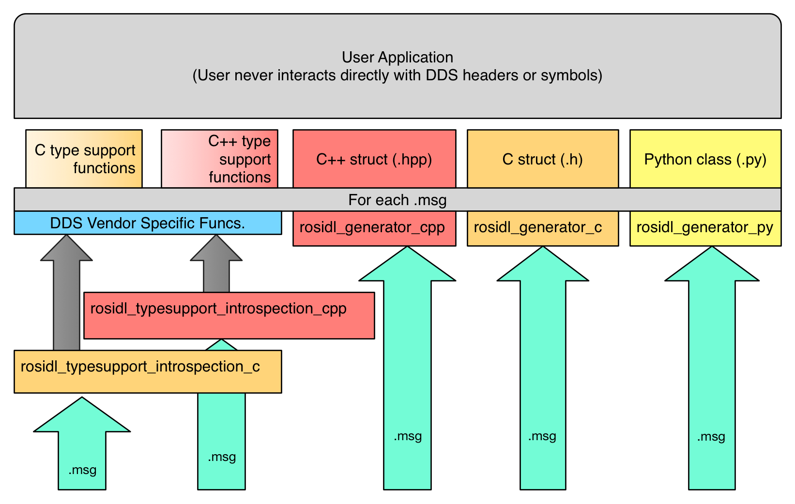

.. redirect-from::

   Concepts/About-Internal-Interfaces

ROS 2 内部接口
==============

.. contents:: 目录
   :local:

.. include:: ../../../global_substitutions.txt

ROS 内部接口是面向创建 |client libraries| 或添加新的底层中间件的开发人员的公共 C |APIs|，但不供典型 ROS 用户使用。
ROS |client libraries| 提供了大多数 ROS 用户所熟悉的面向用户的 |APIs|，并且可以使用多种编程语言。

内部 API 架构概述
-----------------

有两个主要的内部接口：

- ROS 中间件接口（``rmw`` |API|）
- ROS 客户端库接口（``rcl`` |API|）

``rmw`` |API| 是 ROS 2 软件栈与底层中间件实现之间的接口。
ROS 2 使用的底层中间件是 DDS 或 RTPS 实现，它负责发现、发布和订阅机制、服务的请求-应答机制以及消息类型的序列化。

``rcl`` |API| 是一个级别稍高的 |API|，用于实现 |client libraries|，它不直接接触中间件实现，而是通过 ROS 中间件接口（``rmw`` |API|）抽象来接触。

.. figure:: ../images/ros_client_library_api_stack.png
   :alt: ROS 2 软件栈

如图所示，这些 |APIs| 是分层堆叠的，因此典型 ROS 用户将使用 |client library| |API| （例如 ``rclcpp``）来实现其代码（可执行文件或库）。
|client libraries| 的实现（例如 ``rclcpp``）使用 ``rcl`` 接口，该接口提供对 ROS 图及图事件的访问。
``rcl`` 实现反过来使用 ``rmw`` |API| 来访问 ROS 图。
``rcl`` 实现的目的是为更复杂的 ROS 概念和实用工具提供一个通用实现，这些概念和工具可能被各种 |client libraries| 使用，同时保持对所用底层中间件的无关性。
``rmw`` 接口的目的是获取支持 ROS 客户端库所需的最小中间件功能。
最后，``rmw`` |API| 的实现由特定于中间件实现的 |package| 提供，例如 ``rmw_fastrtps_cpp``，其库是针对供应商特定的 DDS 接口和类型编译的。

在上图中还有一个标记为 ``ros_to_dds`` 的框，该框的目的是表示一类可能的包，这些包允许用户使用 ROS 的等价物来访问 DDS 供应商特定的对象和设置。
此抽象接口的目标之一是使 ROS 用户空间代码完全与所用中间件隔离，从而在更换 DDS 供应商甚至中间件技术时对用户代码的影响最小。
但是，我们认识到，有时深入实现并手动调整设置是有用的，尽管这可能带来后果。
通过要求使用这些包之一才能访问底层 DDS 供应商的对象，我们可以避免在常规接口中暴露供应商特定的符号和头文件。
这还使得通过检查包的依赖项来查看是否有这些 ``ros_to_dds`` 包之一被使用，从而很容易看出哪些代码可能违反供应商可移植性。

.. _Type Specific Interfaces:

类型特定接口
------------

一路走来，|APIs| 的某些部分必然特定于所交换的消息类型，例如发布消息或订阅话题，因此需要为每种消息类型生成代码。
下图展示了从用户定义的 ``rosidl`` 文件（例如 ``.msg`` 文件）到用户和系统用于执行类型特定功能的类型特定代码的路径：

.. figure:: ../images/ros_idl_api_stack_static.png
   :alt: ros2 idl 静态类型支持栈

   图：从 ``rosidl`` 文件到用户面代码的“静态”类型支持生成流程图。

图右侧展示了 ``.msg`` 文件如何直接传递给特定语言的代码生成器，例如 ``rosidl_generator_cpp`` 或 ``rosidl_generator_py``。
这些生成器负责创建用户将包含（或导入）并用作 ``.msg`` 文件中定义的消息的内存表示的代码。
例如，考虑消息 ``std_msgs/String``，用户可以在 C++ 中使用语句 ``#include <std_msgs/msg/string.hpp>`` 使用此文件，也可以在 Python 中使用语句 ``from std_msgs.msg import String``。
这些语句之所以有效，是因为这些特定语言（但中间件无关）的生成器包生成了文件。

另外，``.msg`` 文件用于为每种类型生成类型支持代码。
在此上下文中，类型支持意味着：特定于给定类型、并由系统用于为给定类型执行特定任务的元数据或函数。
给定消息的类型支持可能包括诸如消息中每个字段的名称和类型列表之类的内容。
它还可能包含对可为该类型执行特定任务（例如发布消息）的代码的引用。

.. _internal-interfaces_static-type-support:

静态类型支持
^^^^^^^^^^^^

当类型支持引用代码来为特定消息类型执行特定功能时，该代码有时需要执行特定于中间件的工作。
例如，考虑类型特定的发布函数，当使用“供应商 A”时，该函数需要调用“供应商 A”的部分 |API|，但当使用“供应商 B”时，它需要调用“供应商 B”的 |API|。
为了允许中间件供应商特定的代码，用户定义的 ``.msg`` 文件可能会生成供应商特定的代码。
这些供应商特定的代码仍然通过类型支持抽象对用户隐藏，这类似于“私有实现”（Pimpl）模式的工作方式。

使用 DDS 的静态类型支持
^^^^^^^^^^^^^^^^^^^^^^^

对于基于 DDS 的中间件供应商，特别是那些基于 OMG IDL 文件（``.idl`` 文件）生成代码的供应商，用户定义的 ``rosidl`` 文件（``.msg`` 文件）会被转换为等效的 OMG IDL 文件（``.idl`` 文件）。
从这些 OMG IDL 文件创建供应商特定的代码，然后在给定类型的类型支持所引用的类型特定函数中使用。
上图在左侧展示了这一点，其中 ``.msg`` 文件由 ``rosidl_dds`` 包消费以生成 ``.idl`` 文件，然后这些 ``.idl`` 文件被交给特定语言和特定于 DDS 供应商的类型支持生成包。

例如，考虑 Fast DDS 实现，它有一个名为 ``rosidl_typesupport_fastrtps_cpp`` 的包。
该包负责生成代码来处理诸如将 C++ 消息对象转换为要通过网络写入的序列化八位字节缓冲区之类的事情。
这些代码虽然特定于 Fast DDS，但由于类型支持代码中的抽象，仍然不会暴露给用户。

.. _internal-interfaces_dynamic-type-support:

动态类型支持
^^^^^^^^^^^^

实现类型支持的另一种方法是使用通用函数来处理诸如发布到话题之类的事情，而不是为每种消息类型生成一个函数版本。
为了实现这一点，该通用函数需要有关所发布消息类型的元信息，例如消息类型中字段名称和类型的列表（按其出现的顺序）。
然后，要发布消息，你调用通用发布函数，并传入要发布的消息以及一个包含有关消息类型的必要元数据的结构。
这被称为“动态”类型支持，与需要为每种类型生成函数版本的“静态”类型支持相对。

   图：从 ``rosidl`` 文件到用户面代码的“动态”类型支持生成流程图。

上图展示了从用户定义的 ``rosidl`` 文件到生成的用户面代码的流程。
它与静态类型支持的图非常相似，区别仅在于类型支持的生成方式，这由图左侧表示。
在动态类型支持中，``.msg`` 文件直接转换为用户面代码。

这些代码也是中间件无关的，因为它只包含有关消息的元信息。
实际执行工作（例如发布到话题）的函数对消息类型是通用的，并将对中间件特定的 |APIs| 进行任何必要的调用。
请注意，与静态类型支持中由 DDS 供应商特定包提供类型支持代码不同，此方法为每种语言使用中间件无关的包，例如 ``rosidl_typesupport_introspection_c`` 和 ``rosidl_typesupport_introspection_cpp``。
包名称中的 ``introspection`` 部分是指利用消息类型的生成元数据内省任何消息实例的能力。
这是允许诸如“发布到话题”之类函数通用实现的基本能力。

这种方法的优点是所有生成的代码都是中间件无关的，这意味着只要它们支持动态类型支持，就可以为不同的中间件实现复用。
它还产生更少的生成代码，从而减少编译时间和代码大小。

但是，动态类型支持要求底层中间件支持类似形式的动态类型支持。
在 DDS 的情况下，DDS-XTypes 标准允许使用元信息而不是生成的代码来发布消息。
底层中间件需要 DDS-XTypes 或类似的东西才能支持动态类型支持。
此外，这种类型支持方法通常比静态类型支持替代方案更慢。
静态类型支持中类型特定的生成代码可以编写得更高效，因为它不需要遍历消息类型的元数据来执行序列化之类的操作。

``rcl`` 仓库
------------

ROS 客户端库接口（``rcl`` |API|）可以被 |client libraries| （例如 ``rclc``、``rclcpp``、``rclpy`` 等）使用，以避免重复逻辑和功能。
通过复用 ``rcl`` |API|，客户端库可以更小且彼此更一致。
客户端库的某些部分被有意地排除在 ``rcl`` |API| 之外，因为应该使用语言惯用的方法来实现系统的这些部分。
一个很好的例子是执行模型，``rcl`` 完全不涉及它。
相反，客户端库应该提供语言惯用的解决方案，例如 C 中的 ``pthreads``、C++11 中的 ``std::thread`` 以及 Python 中的 ``threading.Thread``。
通常，``rcl`` 接口提供的函数既不是特定于语言模式的，也不是特定于特定消息类型的。

``rcl`` |API| 位于 |GitHub|_ 上的 `ros2/rcl <https://github.com/ros2/rcl>`_ 仓库中，并以 C 头文件的形式包含该接口。
``rcl`` C 实现由同一仓库中的 ``rcl`` |package| 提供。
该实现通过使用 ``rmw`` 和 ``rosidl`` |APIs| 来避免直接接触中间件。

有关 ``rcl`` |API| 的完整定义，请参见 `rcl 文档 <http://docs.ros.org/en/{DISTRO}/p/rcl/>`_。

``rmw`` 仓库
------------

ROS 中间件接口（``rmw`` |API|）是构建 ROS 所需的最小原始中间件能力集。
不同中间件实现的提供者必须实现此接口，才能在其之上支持整个 ROS 栈。
目前大多数中间件实现都是针对不同 DDS 供应商的。

``rmw`` |API| 位于 `ros2/rmw <https://github.com/ros2/rmw>`_ 仓库中。
``rmw`` |package| 包含定义接口的 C 头文件，其实现由针对不同 DDS 供应商的各种 rmw 实现 |packages| 提供。

有关 ``rmw`` |API| 的定义，请参见 `rmw 文档 <http://docs.ros.org/en/{DISTRO}/p/rmw/>`_。

有关 ROS 2 如何与不同中间件实现集成的更实用的深入概述，请参见 :doc:`中间件实现教程 <../../Tutorials/Advanced/Creating-An-RMW-Implementation>`。

``rosidl`` 仓库
---------------

``rosidl`` |API| 由一些与消息相关的静态函数和类型以及关于不同语言中消息应生成什么代码的定义组成。
|API| 中指定的生成消息代码将是特定于语言的，但可能会也可能不会复用其他语言的生成代码。
|API| 中指定的生成消息代码包含诸如消息数据结构、构造、析构函数等内容。
|API| 还将实现一种获取消息类型的类型支持结构的方法，该结构在发布或订阅该消息类型的话题时使用。

有几个仓库在 ``rosidl`` |API| 和实现中发挥作用。

``rosidl`` 仓库位于 |GitHub|_ 上的 `ros2/rosidl <https://github.com/ros2/rosidl>`_，它定义了消息 IDL 语法，即 ``.msg`` 文件、``.srv`` 文件等的语法，并包含用于解析文件、提供从消息生成代码的 CMake 基础设施、生成实现无关代码（头文件和源文件）以及建立默认生成器集的 |packages|。
该仓库包含以下 |packages|：

-  ``rosidl_cmake``：提供 CMake 函数和模块，用于从 ``rosidl`` 文件（例如 ``.msg`` 文件、``.srv`` 文件等）生成代码。
-  ``rosidl_default_generators``：定义默认生成器列表，确保它们作为依赖项安装，但也可以使用其他注入的生成器。
-  ``rosidl_generator_c``：提供为 ``rosidl`` 文件生成 C 头文件（``.h``）的工具。
-  ``rosidl_generator_cpp``：提供为 ``rosidl`` 文件生成 C++ 头文件（``.hpp``）的工具。
-  ``rosidl_generator_py``：提供为 ``rosidl`` 文件生成 Python 模块的工具。
-  ``rosidl_parser``：提供用于解析 ``rosidl`` 文件的 Python |API|。

其他语言的生成器，例如 ``rosidl_generator_java``，被托管在外部（在不同的仓库中），但会使用与上述生成器相同的机制来“注册”自己为 ``rosidl`` 生成器。

除了上述用于解析和生成 ``rosidl`` 文件头文件的 |packages| 之外，``rosidl`` 仓库还包含与文件中定义的消息类型的“类型支持”相关的 |packages|。
类型支持是指解释和操作由特定类型的 ROS 消息实例所表示信息的能力（例如发布消息）。
类型支持可以由编译时生成的代码提供，也可以基于 ``rosidl`` 文件（例如 ``.msg`` 或 ``.srv`` 文件）的内容和接收到的数据，通过内省数据以编程方式完成。
在后一种情况下，类型支持通过消息的运行时解释来完成，ROS 2 生成的消息代码可以独立于 rmw 实现。
通过数据内省提供此类类型支持的包是：

-  ``rosidl_typesupport_introspection_c``：提供生成 C 代码以支持 ``rosidl`` 消息数据类型的工具。
-  ``rosidl_typesupport_introspection_cpp``：提供生成 C++ 代码以支持 ``rosidl`` 消息数据类型的工具。

在类型支持要在编译时生成而不是以编程方式生成的情况下，需要使用特定于 rmw 实现的包。
这是因为通常特定的 rmw 实现会要求数据以特定于 DDS 供应商的方式存储和操作，以便 DDS 实现能够使用它。
更多详情请参见上文 :ref:`类型特定接口 <Type Specific Interfaces>` 部分。

有关 ``rosidl`` |API| （静态和生成）中具体内容的更多信息，请参见此页面：

``rcutils`` 仓库
----------------

ROS 2 C 实用工具（``rcutils``）是一个 C |API|，由整个 ROS 2 代码库中使用的宏、函数和数据结构组成。
它们主要用于错误处理、命令行参数解析和日志记录，这些都不是客户端或中间件层特有的，可以两者共享。

``rcutils`` |API| 和实现位于 |GitHub|_ 上的 `ros2/rcutils <https://github.com/ros2/rcutils>`_ 仓库中，该仓库以 C 头文件的形式包含该接口。

有关 ``rcutils`` |API| 的完整定义，请参见 `rcutils 文档 <https://docs.ros.org/en/{DISTRO}/p/rcutils/>`_。
