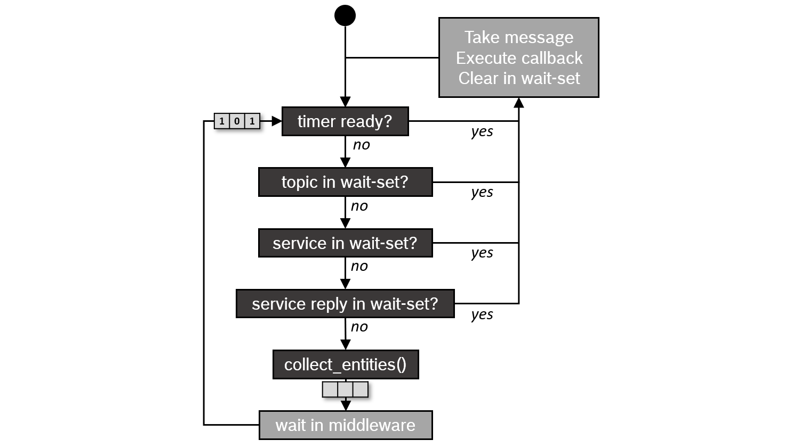

.. redirect-from::

   Concepts/About-Executors

执行器
======

.. contents:: 目录
   :local:

概述
----

ROS 2 中的执行管理由执行器（Executors）处理。
执行器使用底层操作系统的一个或多个线程来调用订阅、定时器、服务服务器、动作服务器等对传入消息和事件的回调。
显式的执行器类（在 rclcpp 的 `executor.hpp <https://github.com/ros2/rclcpp/blob/{REPOS_FILE_BRANCH}/rclcpp/include/rclcpp/executor.hpp>`_ 中、在 rclpy 的 `executors.py <https://github.com/ros2/rclpy/blob/{REPOS_FILE_BRANCH}/rclpy/rclpy/executors.py>`_ 中，或在 rclc 的 `executor.h <https://github.com/ros2/rclc/blob/master/rclc/include/rclc/executor.h>`_ 中）提供了比 ROS 1 中的 spin 机制更多的执行管理控制，尽管基本 API 非常相似。

在下文中，我们重点关注 C++ 客户端库 *rclcpp*。

基本用法
--------

在最简单的情况下，主线程通过如下调用 ``rclcpp::spin(..)`` 来处理节点的传入消息和事件：

.. code-block:: cpp

   int main(int argc, char* argv[])
   {
      // Some initialization.
      rclcpp::init(argc, argv);
      ...

      // Instantiate a node.
      rclcpp::Node::SharedPtr node = ...

      // Run the executor.
      rclcpp::spin(node);

      // Shutdown and exit.
      ...
      return 0;
   }

对 ``spin(node)`` 的调用基本上会展开为单线程执行器（Single-Threaded Executor）的实例化和调用，它是最简单的执行器：

.. code-block:: cpp

   rclcpp::executors::SingleThreadedExecutor executor;
   executor.add_node(node);
   executor.spin();

通过调用执行器实例的 ``spin()``，当前线程开始向 rcl 和中间件层查询传入的消息和其他事件，并调用相应的回调函数，直到节点关闭。
为了不与中间件的 QoS 设置相抵触，传入的消息不会存储在客户端库层的队列中，而是保留在中间件中，直到被回调函数取出进行处理。
（这是与 ROS 1 的关键区别。）
一个 *等待集* （wait set）用于告知执行器中间件层上有可用的消息，每个队列一个二进制标志。
*等待集* 也用于检测定时器何时到期。

.. image:: ../images/executors_basic_principle.png

单线程执行器也被容器进程用于 :doc:`组件 <./About-Composition>`，即在所有没有显式 main 函数而创建和执行节点的情况下。

.. _TypesOfExecutors:

执行器的类型
------------

目前，rclcpp 提供三种执行器类型，它们派生自一个共享的父类：

.. graphviz::

   digraph Flatland {

      Executor -> SingleThreadedExecutor [dir = back, arrowtail = empty];
      Executor -> MultiThreadedExecutor [dir = back, arrowtail = empty];
      Executor -> StaticSingleThreadedExecutor [dir = back, arrowtail = empty];
      Executor  [shape=polygon,sides=4];
      SingleThreadedExecutor  [shape=polygon,sides=4];
      MultiThreadedExecutor  [shape=polygon,sides=4];
      StaticSingleThreadedExecutor  [shape=polygon,sides=4];

      }

*多线程执行器* （Multi-Threaded Executor）创建可配置数量的线程，以允许并行处理多个消息或事件。
*静态单线程执行器* （Static Single-Threaded Executor）优化了扫描节点结构的运行时成本，即在订阅、定时器、服务服务器、动作服务器等方面。
它只在添加节点时执行一次这种扫描，而其他两种执行器会定期扫描此类变化。
因此，静态单线程执行器只应用于在初始化期间创建了所有订阅、定时器等的节点。

所有三种执行器都可以通过为每个节点调用 ``add_node(..)`` 来用于多个节点。

.. code-block:: cpp

   rclcpp::Node::SharedPtr node1 = ...
   rclcpp::Node::SharedPtr node2 = ...
   rclcpp::Node::SharedPtr node3 = ...

   rclcpp::executors::StaticSingleThreadedExecutor executor;
   executor.add_node(node1);
   executor.add_node(node2);
   executor.add_node(node3);
   executor.spin();

在上面的示例中，静态单线程执行器的一个线程用于一起服务三个节点。
对于多线程执行器，实际的并行度取决于回调组。

回调组
------

ROS 2 允许将节点的回调组织成组。
在 rclcpp 中，可以通过 Node 类的 ``create_callback_group`` 函数创建这样的 *回调组*。
在 rclpy 中，通过调用特定回调组类型的构造函数来完成同样的操作。
回调组必须在节点的整个执行过程中存储（例如作为类成员），否则执行器将无法触发回调。
然后，可以在创建订阅、定时器等时指定此回调组——例如通过订阅选项：

.. tabs::

   .. group-tab:: C++

      .. code-block:: cpp

        my_callback_group = create_callback_group(rclcpp::CallbackGroupType::MutuallyExclusive);

        rclcpp::SubscriptionOptions options;
        options.callback_group = my_callback_group;

        my_subscription = create_subscription<Int32>("/topic", rclcpp::SensorDataQoS(),
                                                     callback, options);
   .. group-tab:: Python

      .. code-block:: python

        my_callback_group = MutuallyExclusiveCallbackGroup()
        my_subscription = self.create_subscription(Int32, "/topic", self.callback, qos_profile=1,
                                                   callback_group=my_callback_group)

所有在没有指明回调组的情况下创建的订阅、定时器等都会被分配到 *默认回调组*。
默认回调组可以在 rclcpp 中通过 ``NodeBaseInterface::get_default_callback_group()`` 查询，
在 rclpy 中通过 ``Node.default_callback_group`` 查询。

有两种类型的回调组，必须在实例化时指定类型：

* *互斥：* 此组的回调不得并行执行。
* *可重入：* 此组的回调可以并行执行。

不同回调组的回调始终可以并行执行。
多线程执行器将其线程用作池，根据这些条件尽可能多地并行处理回调。
有关如何高效使用回调组的提示，请参阅 :doc:`使用回调组 <../../How-To-Guides/Using-callback-groups>`。

rclcpp 中的执行器基类还有 ``add_callback_group(..)`` 函数，它允许将回调组分配给不同的执行器。
通过使用操作系统调度器配置底层线程，可以优先处理特定的回调。
例如，控制循环的订阅和定时器可以优先于节点的所有其他订阅和标准服务。
`examples_rclcpp_cbg_executor 包 <https://github.com/ros2/examples/tree/{REPOS_FILE_BRANCH}/rclcpp/executors/cbg_executor>`_ 提供了此机制的演示。

调度语义
--------

如果回调的处理时间短于消息和事件发生的周期，执行器基本上以 FIFO 顺序处理它们。
但是，如果某些回调的处理时间较长，消息和事件将在栈的较低层排队。
等待集机制只向执行器报告关于这些队列的很少信息。
具体来说，它只报告某个话题是否有任何消息。
执行器使用这些信息以轮询（round-robin）方式处理消息（包括服务和动作）——但不是以 FIFO 顺序。
下面的流程图可视化展示了这种调度语义。

这种语义首次在 `Casini 等人在 ECRTS 2019 上发表的论文 <https://drops.dagstuhl.de/opus/volltexte/2019/10743/pdf/LIPIcs-ECRTS-2019-6.pdf>`_ 中描述。
（注意：该论文还解释了定时器事件优先于所有其他消息。
`这种优先级在 Eloquent 中已被移除。 <https://github.com/ros2/rclcpp/pull/841>`_）

展望
----

虽然 rclcpp 的三种执行器对大多数应用都工作良好，但存在一些问题使它们不适合实时应用，因为实时应用需要明确定义的执行时间、确定性和对执行顺序的自定义控制。
以下是其中一些问题的总结：

1. 复杂且混合的调度语义。
   理想情况下，你希望有明确定义的调度语义来进行形式化的时序分析。
2. 回调可能会遭受优先级反转。
   较高优先级的回调可能会被较低优先级的回调阻塞。
3. 没有对回调执行顺序的显式控制。
4. 没有针对特定话题的触发内置控制。

此外，执行器在 CPU 和内存使用方面的开销相当可观。
静态单线程执行器大大降低了这种开销，但对某些应用来说可能还不够。

以下开发部分解决了这些问题：

* `rclcpp WaitSet <https://github.com/ros2/rclcpp/blob/{REPOS_FILE_BRANCH}/rclcpp/include/rclcpp/wait_set.hpp>`_：rclcpp 的 ``WaitSet`` 类允许直接等待订阅、定时器、服务服务器、动作服务器等，而无需使用执行器。
  它可以用于实现确定性的、用户定义的处理序列，可能一起处理来自不同订阅的多个消息。
  `examples_rclcpp_wait_set 包 <https://github.com/ros2/examples/tree/{REPOS_FILE_BRANCH}/rclcpp/wait_set>`_ 提供了几个使用此用户级等待集机制的示例。
* `rclc Executor <https://github.com/ros2/rclc/blob/master/rclc/include/rclc/executor.h>`_：这个来自 C 客户端库 *rclc* 的执行器（为 micro-ROS 开发）让用户可以精细地控制回调的执行顺序，并允许自定义触发条件来激活回调。
  此外，它还实现了逻辑执行时间（LET）语义的思想。

更多信息
--------

* Michael Pöhnl 等：`"ROS 2 Executor: How to make it efficient, real-time and deterministic?" <https://www.apex.ai/roscon-21>`_。
  2021 年 ROS World 研讨会。
  线上活动。
  2021 年 10 月 19 日。
* Ralph Lange：`"Advanced Execution Management with ROS 2" <https://www.youtube.com/watch?v=Sz-nllmtcc8&t=109s>`_。
  ROS 工业会议。
  线上活动。
  2020 年 12 月 16 日。
* Daniel Casini、Tobias Blass、Ingo Lütkebohle 和 Björn Brandenburg：`"Response-Time Analysis of ROS 2 Processing Chains under Reservation-Based Scheduling" <https://drops.dagstuhl.de/opus/volltexte/2019/10743/pdf/LIPIcs-ECRTS-2019-6.pdf>`_，第 31 届 ECRTS 2019 论文集，德国斯图加特，2019 年 7 月。
