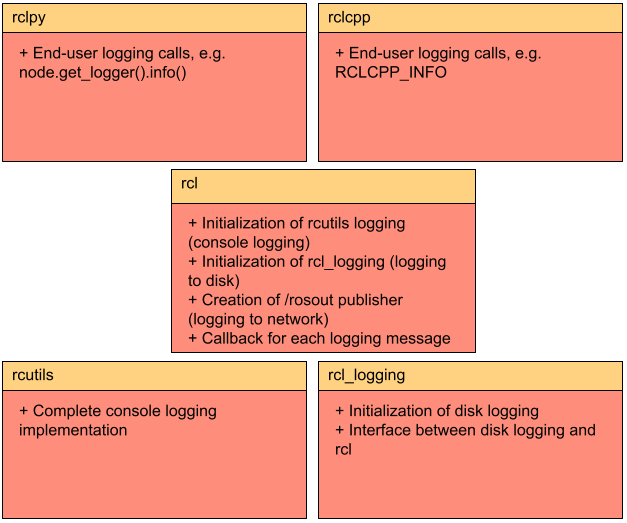

.. redirect-from::

    Logging
    Concepts/About-Logging

日志与记录器配置
================

.. contents:: 目录
   :local:

概述
----

ROS 2 中的日志子系统旨在将日志消息投递到各种目标，包括：

* 到控制台（如果连接了一个控制台）
* 到磁盘上的日志文件（如果本地存储可用）
* 到 ROS 2 网络上的 ``/rosout`` 话题

默认情况下，ROS 2 节点中的日志消息将输出到控制台（stderr）、磁盘上的日志文件以及 ROS 2 网络上的 ``/rosout`` 话题。
所有这些目标都可以在逐个节点的基础上单独启用或禁用。

本文档的其余部分将介绍日志子系统背后的一些设计思想。

严重级别
--------

日志消息有一个关联的严重级别：``DEBUG``、``INFO``、``WARN``、``ERROR`` 或 ``FATAL``，按升序排列。

记录器只会处理严重级别等于或高于为该记录器指定的级别的日志消息。

每个节点都有一个与之关联的记录器，它会自动包含节点的名称和命名空间。
如果节点的名称在外部被重映射为与源代码中定义的名称不同，它会反映在记录器名称中。
也可以创建使用特定名称的非节点记录器。

记录器名称表示一种层次结构。
如果名为 "abc.def" 的记录器的级别未设置，它将遵循其父级 "abc" 的级别；如果该级别也未设置，则将使用默认记录器级别。
当记录器 "abc" 的级别被更改时，其所有后代（例如 "abc.def"、"abc.ghi.jkl"）的级别都会受到影响，除非它们已显式设置级别。

API
---

以下是 ROS 2 日志基础设施的最终用户应使用的 API，按客户端库分组。

.. tabs::

  .. group-tab:: C++

    * ``RCLCPP_{DEBUG,INFO,WARN,ERROR,FATAL}`` - 每次执行到这一行时输出给定的 printf 风格消息
    * ``RCLCPP_{DEBUG,INFO,WARN,ERROR,FATAL}_ONCE`` - 仅在第一次执行到这一行时输出给定的 printf 风格消息
    * ``RCLCPP_{DEBUG,INFO,WARN,ERROR,FATAL}_EXPRESSION`` - 仅在给定表达式为真时输出给定的 printf 风格消息
    * ``RCLCPP_{DEBUG,INFO,WARN,ERROR,FATAL}_FUNCTION`` - 仅在给定函数返回真时输出给定的 printf 风格消息
    * ``RCLCPP_{DEBUG,INFO,WARN,ERROR,FATAL}_SKIPFIRST`` - 除第一次外每次执行到这一行时输出给定的 printf 风格消息
    * ``RCLCPP_{DEBUG,INFO,WARN,ERROR,FATAL}_THROTTLE`` - 以不超过给定整数毫秒速率的频率输出给定的 printf 风格消息
    * ``RCLCPP_{DEBUG,INFO,WARN,ERROR,FATAL}_SKIPFIRST_THROTTLE`` - 以不超过给定整数毫秒速率的频率输出给定的 printf 风格消息，但跳过第一次
    * ``RCLCPP_{DEBUG,INFO,WARN,ERROR,FATAL}_STREAM`` - 每次执行到这一行时输出给定的 C++ 流式消息
    * ``RCLCPP_{DEBUG,INFO,WARN,ERROR,FATAL}_STREAM_ONCE`` - 仅在第一次执行到这一行时输出给定的 C++ 流式消息
    * ``RCLCPP_{DEBUG,INFO,WARN,ERROR,FATAL}_STREAM_EXPRESSION`` - 仅在给定表达式为真时输出给定的 C++ 流式消息
    * ``RCLCPP_{DEBUG,INFO,WARN,ERROR,FATAL}_STREAM_FUNCTION`` - 仅在给定函数返回真时输出给定的 C++ 流式消息
    * ``RCLCPP_{DEBUG,INFO,WARN,ERROR,FATAL}_STREAM_SKIPFIRST`` - 除第一次外每次执行到这一行时输出给定的 C++ 流式消息
    * ``RCLCPP_{DEBUG,INFO,WARN,ERROR,FATAL}_STREAM_THROTTLE`` - 以不超过给定整数毫秒速率的频率输出给定的 C++ 流式消息
    * ``RCLCPP_{DEBUG,INFO,WARN,ERROR,FATAL}_STREAM_SKIPFIRST_THROTTLE`` - 以不超过给定整数毫秒速率的频率输出给定的 C++ 流式消息，但跳过第一次

    上述每个 API 都接受一个 ``rclcpp::Logger`` 对象作为第一个参数。
    可以通过调用 ``node->get_logger()`` （推荐）从节点 API 获取，或通过构造独立的 ``rclcpp::Logger`` 对象获取。

    * ``rcutils_logging_set_logger_level`` - 将特定记录器名称的日志级别设置为给定的严重级别
    * ``rcutils_logging_get_logger_effective_level`` - 给定一个记录器名称，返回其记录器级别（可能未设置）

  .. group-tab:: Python

    * ``logger.{debug,info,warning,error,fatal}`` - 将给定的 Python 字符串输出到日志基础设施。
      这些调用接受以下关键字参数来控制行为：

      * ``throttle_duration_sec`` - 如果不为 None，则以浮点秒为单位指定节流间隔的时长
      * ``skip_first`` - 如果为 True，则除第一次外每次执行到这一行时输出消息
      * ``once`` - 如果为 True，则仅在第一次执行到这一行时输出消息

    * ``rclpy.logging.set_logger_level`` - 将特定记录器名称的日志级别设置为给定的严重级别
    * ``rclpy.logging.get_logger_effective_level`` - 给定一个记录器名称，返回其记录器级别（可能未设置）

配置
----

由于 ``rclcpp`` 和 ``rclpy`` 使用相同的底层日志基础设施，因此配置选项是相同的。

.. _logging-configuration-environment-variables:

环境变量
^^^^^^^^

以下环境变量控制 ROS 2 记录器的某些方面。
对于每一项环境设置，请注意这是一个进程级设置，因此它适用于该进程中的所有节点。

* ``ROS_LOG_DIR`` - 控制用于将日志消息写入磁盘（如果已启用）的日志目录。
  如果非空，则使用该变量中指定的确切目录。
  如果为空，则使用 ``ROS_HOME`` 环境变量的内容构造一个形如 ``$ROS_HOME/.log`` 的路径。
  在所有情况下，``~`` 字符都会被展开为用户的主目录。
* ``ROS_HOME`` - 控制用于各种 ROS 文件（包括日志和配置文件）的主目录。
  在日志上下文中，该变量用于构造日志文件目录的路径。
  如果非空，则使用该变量的内容作为 ROS_HOME 路径。
  在所有情况下，``~`` 字符都会被展开为用户的主目录。
* ``RCUTILS_LOGGING_USE_STDOUT`` - 控制输出消息发送到哪个流。
  如果未设置或为 0，则使用 stderr。
  如果为 1，则使用 stdout。
* ``RCUTILS_LOGGING_BUFFERED_STREAM`` - 控制日志流（按 ``RCUTILS_LOGGING_USE_STDOUT`` 配置）应是行缓冲还是无缓冲。
  如果未设置，则使用流的默认值（stdout 通常是行缓冲，stderr 通常是无缓冲）。
  如果为 0，则强制流为无缓冲。
  如果为 1，则强制流为行缓冲。
* ``RCUTILS_COLORIZED_OUTPUT`` - 控制输出消息时是否使用颜色。
  如果未设置，则根据平台以及控制台是否为 TTY 自动确定。
  如果为 0，则强制禁用输出颜色。
  如果为 1，则强制启用输出颜色。
* ``RCUTILS_CONSOLE_OUTPUT_FORMAT`` - 控制每条日志消息输出的字段。
  可用字段有：

  * ``{severity}`` - 严重级别。
  * ``{name}`` - 记录器的名称（可能为空）。
  * ``{message}`` - 日志消息（可能为空）。
  * ``{function_name}`` - 调用此日志的函数名（可能为空）。
  * ``{file_name}`` - 调用此日志的文件名（可能为空）。
  * ``{time}`` - 自纪元以来的秒数时间。
  * ``{time_as_nanoseconds}`` - 自纪元以来的纳秒数时间。
  * ``{date_time_with_ms}`` - ISO 格式的时间，例如 ``2024-06-11 09:29:19.304``
  * ``{line_number}`` - 调用此日志的行号（可能为空）。

  如果没有给出格式，则使用默认值 ``[{severity}] [{time}] [{name}]: {message}``。

``RCUTILS_CONSOLE_OUTPUT_FORMAT`` 还支持以下转义字符语法。

.. list-table::
    :header-rows: 1

    * - 转义字符语法
      - 表示的字符
    * - ``\a``
      - 警报
    * - ``\b``
      - 退格
    * - ``\n``
      - 换行
    * - ``\r``
      - 回车
    * - ``\t``
      - 水平制表符

节点创建
^^^^^^^^

初始化 ROS 2 节点时，可以通过节点选项控制行为的某些方面。
由于这些是逐节点选项，因此即使节点被组合到单个进程中，也可以为不同节点设置不同的值。

* ``log_levels`` - 该特定节点中某个组件使用的日志级别。
  可以通过以下方式设置：``ros2 run demo_nodes_cpp talker --ros-args --log-level talker:=DEBUG``
* ``external_log_config_file`` - 用于配置后端记录器的外部文件。
  如果为 NULL，将使用默认配置。
  请注意，该文件的格式因后端而异（对于默认后端记录器 spdlog 目前尚未实现）。
  可以通过以下方式设置：``ros2 run demo_nodes_cpp talker --ros-args --log-config-file log-config.txt``
* ``log_stdout_disabled`` - 是否禁用将日志消息写入控制台。
  可以通过以下方式完成：``ros2 run demo_nodes_cpp talker --ros-args --disable-stdout-logs``
* ``log_rosout_disabled`` - 是否禁用将日志消息输出到 ``/rosout``。
  这可以显著节省网络带宽，但外部观察者将无法监控日志。
  可以通过以下方式完成：``ros2 run demo_nodes_cpp talker --ros-args --disable-rosout-logs``
* ``log_ext_lib_disabled`` - 是否完全禁用外部记录器的使用。
  在某些情况下这可能更快，但意味着日志不会写入磁盘。
  可以通过以下方式完成：``ros2 run demo_nodes_cpp talker --ros-args --disable-external-lib-logs``

日志子系统设计
--------------

下图展示了日志子系统的五个主要部分以及它们如何交互。

rcutils
^^^^^^^

``rcutils`` 有一个日志实现，它可以根据某种格式（见上文 ``配置``）格式化日志消息，并将这些日志消息输出到控制台。
``rcutils`` 实现了一个完整的日志解决方案，但允许更高层组件以依赖注入模型插入到日志基础设施中。
当我们讨论下面的 ``rcl`` 层时，这一点会变得更加明显。

请注意，这是一个 *进程级* 日志实现，因此在此级别配置的任何内容都会影响整个进程，而不仅仅是个别节点。

rcl_logging_spdlog
^^^^^^^^^^^^^^^^^^

``rcl_logging_spdlog`` 实现了 ``rcl_logging_interface`` API，因此为 ``rcl`` 层提供外部日志服务。
特别是，``rcl_logging_spdlog`` 实现接受格式化后的日志消息，并使用 ``spdlog`` 库将它们写入磁盘上的日志文件，通常位于 ``~/.ros/log`` 中（不过这是可配置的；见上文 ``配置``）。

rcl
^^^

``rcl`` 中的日志子系统使用 ``rcutils`` 和 ``rcl_logging_spdlog`` 来提供 ROS 2 日志服务的大部分功能。
当日志消息到来时，``rcl`` 决定将它们发送到哪里。
日志消息可以投递到 3 个主要位置；单个节点可以启用它们的任意组合：

* 通过 ``rcutils`` 层输出到控制台
* 通过 ``rcl_logging_spdlog`` 层写入磁盘
* 通过 RMW 层输出到 ROS 2 网络上的 ``/rosout`` 话题

rclcpp
^^^^^^

这是构建在 ``rcl`` API 之上的主要 ROS 2 C++ API。
在日志上下文中，``rclcpp`` 提供了 ``RCLCPP_`` 日志宏；完整列表见上文 ``APIs``。
当某个 ``RCLCPP_`` 宏运行时，它会将节点的当前严重级别与宏的严重级别进行比较。
如果宏的严重级别大于或等于节点的严重级别，则消息将被格式化并输出到所有当前已配置的位置。
请注意，``rclcpp`` 对日志调用使用全局互斥锁，因此同一进程内的所有日志调用最终都是单线程的。

rclpy
^^^^^

这是构建在 ``rcl`` API 之上的主要 ROS 2 Python API。
在日志上下文中，``rclpy`` 提供了 ``logger.debug`` 风格的函数；完整列表见上文 ``APIs``。
当某个 ``logger.debug`` 函数运行时，它会将节点的当前严重级别与宏的严重级别进行比较。
如果宏的严重级别大于或等于节点的严重级别，则消息将被格式化并输出到所有当前已配置的位置。

日志用法
--------

.. tabs::

  .. group-tab:: C++

    * 参见 `rclcpp logging demo <https://github.com/ros2/demos/tree/{REPOS_FILE_BRANCH}/logging_demo>`_ 获取一些简单示例。
    * 参见 :doc:`logging demo <../../Tutorials/Demos/Logging-and-logger-configuration>` 获取示例用法。

  .. group-tab:: Python

    * 参见 `rclpy examples <https://github.com/ros2/examples/blob/{REPOS_FILE_BRANCH}/rclpy/services/minimal_client/examples_rclpy_minimal_client/client.py>`__ 获取节点记录器的示例用法。
    * 参见 `rclpy tests <https://github.com/ros2/rclpy/blob/{REPOS_FILE_BRANCH}/rclpy/test/test_logging.py>`__ 获取关键字参数（例如 ``skip_first``、``once``）的示例用法。
