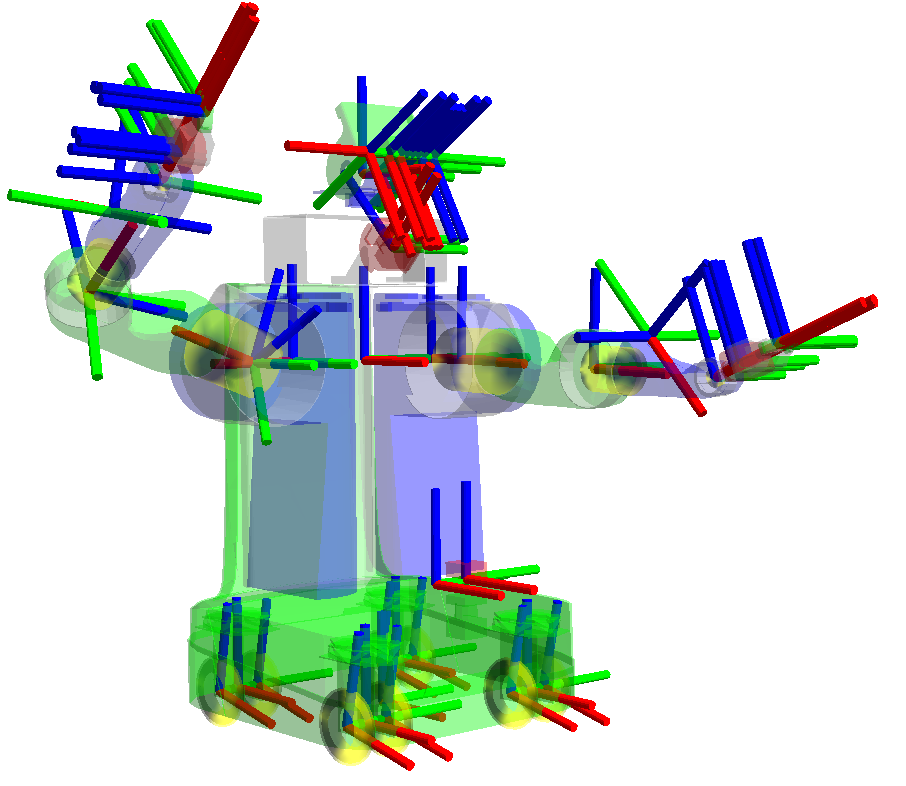

.. redirect-from::

   Concepts/About-Tf2

Tf2
===

.. contents:: 目录
   :local:

概述
----

tf2 是变换库，它让用户能够跟踪多个坐标系随时间的变化。
tf2 以树结构维护坐标系之间的关系，并按时间进行缓冲，使用户能够在任意所需的时间点在任意两个坐标系之间变换点、向量等。

tf2 的特性
----------

机器人系统通常有许多随时间变化的 3D 坐标系，例如世界坐标系、基座坐标系、夹爪坐标系、头部坐标系等。
tf2 随时间跟踪所有这些坐标系，并允许你提出以下问题：

* 5 秒前头部坐标系相对于世界坐标系在哪里？
* 夹爪中的物体相对于我的基座坐标系的位置是什么？
* 地图坐标系中基座坐标系的当前位置是什么？

tf2 可以在分布式系统中运行。
这意味着机器人坐标系的全部信息对系统中任何计算机上的所有 ROS 2 组件都可用。
tf2 可以让分布式系统中的每个组件构建自己的变换信息数据库，也可以有一个中央节点收集和存储所有变换信息。

.. mermaid::

   flowchart LR
      E((Earth))
      E --> A[[Car A]]
      E --> B[[Car B]]
      E --> C{{Satellite C}}
      E --> D((Moon D))

发布变换
^^^^^^^^

在发布变换时，我们通常将变换视为从一个坐标系到另一个坐标系的变换。
语义上的区别在于：你是在变换某个坐标系中表示的数据，还是在变换坐标系本身。
这两个值互为倒数。
``geometry_msgs/msg/Transform`` 消息中发布的变换表示坐标系表示法（frame formulation）。
在调试发布的变换时请记住这一点：根据你遍历变换树的方向，它们是你将查询到的值的倒数。

.. math::

   _{B}T^{data}_{A} = (_{B}T^{frame}_{A})^{-1}

TF 库会根据你遍历变换树的方向为你处理这些元素的求逆。
在本文档的其余部分，我们将只使用 :math:`T^{data}`，但省略 ``data`` 的写法。

位置
^^^^

如果汽车 :math:`A` 中的驾驶员观察到了某物，而地面上的一个人想知道它相对于自身位置在哪里，你可以将观察结果从源坐标系变换到目标坐标系。

.. math::

   _{E}T_{A} * P_{A}^{Obs} = P_{E}^{Obs}

现在，如果汽车 B 中的人也想知道它在哪里，你可以计算净变换。

.. math::

   _{B}T_{E} * _{E}T_{A} * P_{A}^{Obs} = _{B}T_{A} * P_{A}^{Obs} = P_{B}^{Obs}

这正是 ``lookupTransform`` 所提供的功能，其中 ``A`` 是 *源* ``frame_id``，``B`` 是 *目标* ``frame_id``。

建议尽可能使用 ``transform<T>(target_frame, ...)`` 方法，因为它们会从数据类型中读取 *源* ``frame_id``，并在结果数据类型中写出 *目标* ``frame_id``，且数学计算会在内部完成。

如果 :math:`P` 是一个 ``Stamped`` 数据类型，那么 :math:`_A` 就是它的 ``frame_id``。

例如，如果根坐标系 ``A`` 在坐标系 ``B`` 下方一米处，那么从 ``A`` 到 ``B`` 的变换是正值。

但是，当将数据从坐标系 ``B`` 转换到坐标系 ``A`` 时，你必须使用该值的倒数。
这可以理解为：当你切换到较低的参考坐标系时，你会给高度加上该值。
然而，如果你将数据从坐标系 ``A`` 转换到坐标系 ``B``，高度会减小，因为新的参考坐标系更高。

.. math::

   _{B}T_{A} = (_{B}{Tf}_{A})^{-1}

速度
^^^^

为了表示 ``Velocity`` （速度），我们有三部分信息。
:math:`V^{moving\_frame - reference\_frame}_{observing\_frame}`
这个速度表示运动坐标系和参考坐标系之间的速度。
并且它是在观察坐标系中表示的。

例如，汽车 A 中的驾驶员可以报告他们正以 1m/s 的速度（相对于地球）向前行驶（在 A 中观察），所以那就是 :math:`V_{A}^{A - E} = (1,0,0)`
而从地球的视角观察同样的速度（假设汽车向东行驶，地球为 NED），那就是 :math:`V_{E}^{A - E} = (0, 1, 0)`

然而，变换可以表明这些实际上是相同的：

.. math::

   _{E}T_{A} * V_{A}^{A - E} = V_{E}^{A - E}

如果速度在同一个坐标系中表示，则可以相加或相减，在这种情况下是 ``Obs``。

.. math::

   V_{Obs}^{A - C} = V_{Obs}^{A - B} + V_{Obs}^{D - C}

速度可以通过求逆来“反转”。

.. math::

   V_{Obs}^{A - C} = -(V_{Obs}^{C - A})

如果你想比较两个速度，你必须先将它们变换到同一个观察坐标系中。

教程
----

我们创建了一套 :doc:`教程 <../../Tutorials/Intermediate/Tf2/Tf2-Main>`，逐步引导你使用 tf2。
你可以从 :doc:`tf2 简介 <../../Tutorials/Intermediate/Tf2/Introduction-To-Tf2>` 教程开始。
有关所有 tf2 及 tf2 相关教程的完整列表，请查看 :doc:`教程 <../../Tutorials/Intermediate/Tf2/Tf2-Main>` 页面。

任何用户使用 tf2 主要完成两项基本任务：监听变换和广播变换。

如果你想使用 tf2 在坐标系之间进行变换，你的节点将需要监听变换。
你要做的是接收并缓冲系统中广播的所有坐标系，并查询坐标系之间的特定变换。
查看“编写监听器”教程 :doc:`（Python） <../../Tutorials/Intermediate/Tf2/Writing-A-Tf2-Listener-Py>` :doc:`（C++） <../../Tutorials/Intermediate/Tf2/Writing-A-Tf2-Listener-Cpp>` 以了解更多信息。

要扩展机器人的能力，你需要开始广播变换。
广播变换意味着将坐标系的相对位姿发送到系统的其余部分。
一个系统可以有多个广播器，每个广播器提供机器人不同部分的信息。
查看“编写广播器”教程 :doc:`（Python） <../../Tutorials/Intermediate/Tf2/Writing-A-Tf2-Broadcaster-Py>` :doc:`（C++） <../../Tutorials/Intermediate/Tf2/Writing-A-Tf2-Broadcaster-Cpp>` 以了解更多信息。

除此之外，tf2 可以广播不随时间变化的静态变换。
这主要节省了存储和查询时间，同时也减少了发布开销。
你应该注意，静态变换只发布一次，并假定不会改变，因此不会存储历史记录。
如果你想在 tf2 树中定义静态变换，请查看“编写静态广播器” :doc:`（Python） <../../Tutorials/Intermediate/Tf2/Writing-A-Tf2-Static-Broadcaster-Py>` :doc:`（C++） <../../Tutorials/Intermediate/Tf2/Writing-A-Tf2-Static-Broadcaster-Cpp>` 教程。

你还可以在“添加坐标系” :doc:`（Python） <../../Tutorials/Intermediate/Tf2/Adding-A-Frame-Py>` :doc:`（C++） <../../Tutorials/Intermediate/Tf2/Adding-A-Frame-Cpp>` 教程中学习如何向 tf2 树添加固定坐标系和动态坐标系。

完成基础教程后，你可以继续学习 tf2 与时间。
tf2 与时间教程 :doc:`（C++） <../../Tutorials/Intermediate/Tf2/Learning-About-Tf2-And-Time-Cpp>` 讲解 tf2 与时间的基本原理。
关于 tf2 与时间的高级教程 :doc:`（C++） <../../Tutorials/Intermediate/Tf2/Time-Travel-With-Tf2-Cpp>` 讲解使用 tf2 进行时间旅行的原理。

论文
----

有一篇在 TePRA 2013 上发表的关于 tf2 的论文：`tf: The transform library <https://ieeexplore.ieee.org/abstract/document/6556373>`_。
