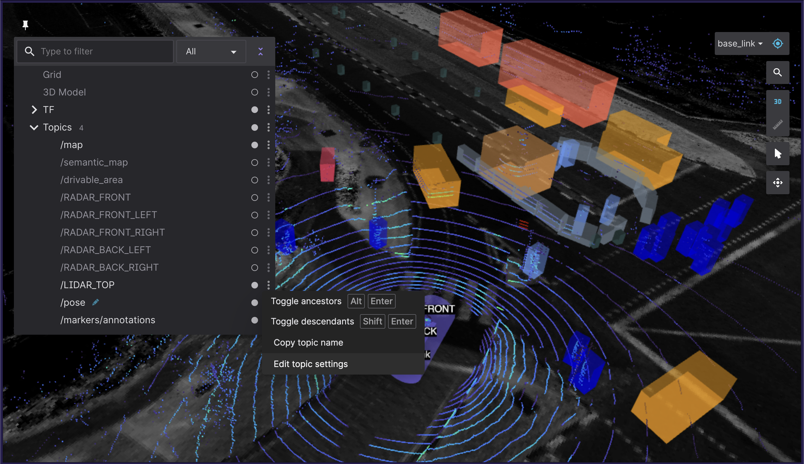
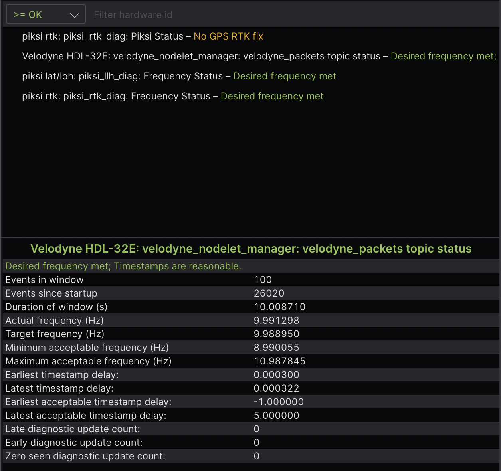
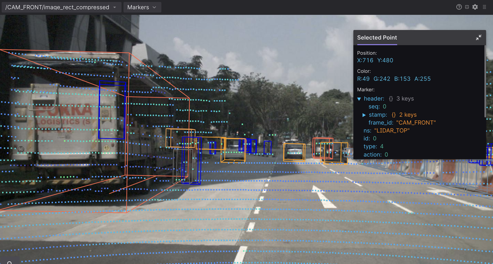
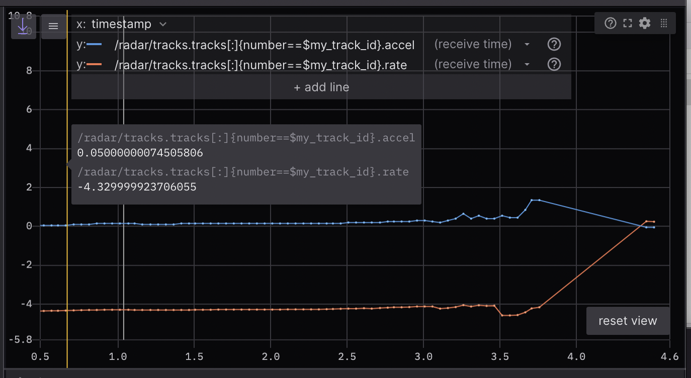
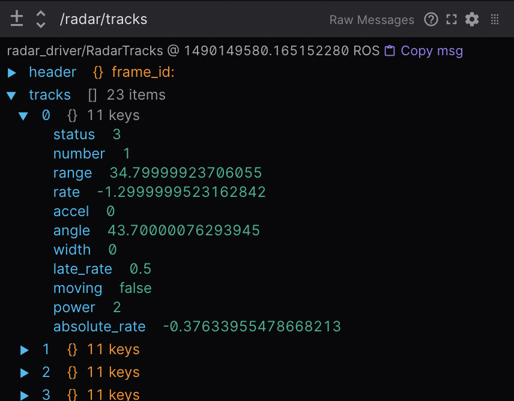
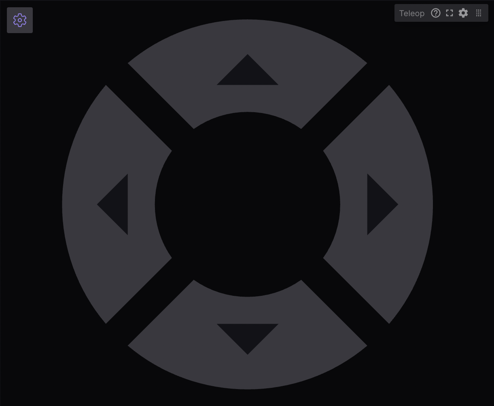
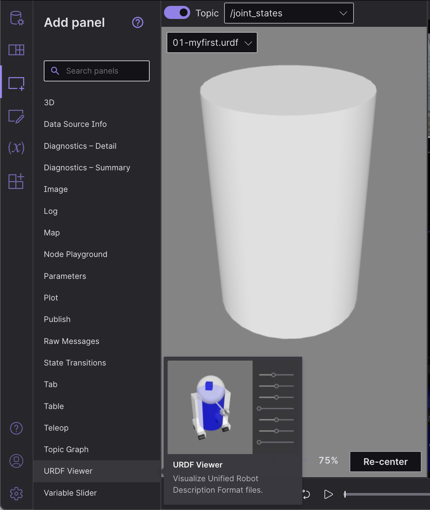
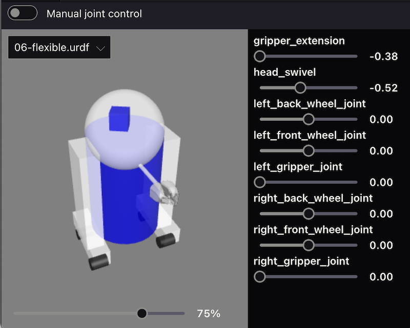
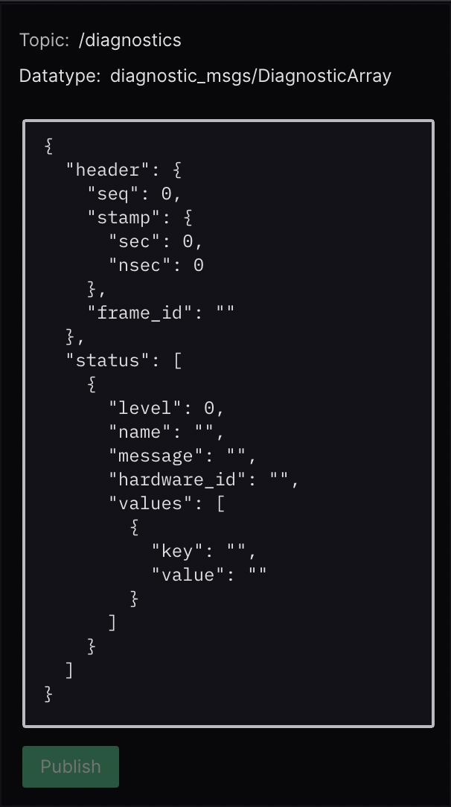

使用 Foxglove Studio 可视化 ROS 2 数据
======================================

`Foxglove Studio <https://foxglove.dev/studio>`__ 是一款开源的可视化和调试工具，用于处理你的机器人数据。

它可以通过多种方式使用，以便尽可能方便地进行开发——
它可以作为独立的桌面应用运行，也可以通过浏览器访问，
甚至可以在你自己的域名上自托管。

在 `GitHub <https://www.github.com/foxglove/studio>`__ 上查看源代码。

安装
----

要使用 Web 应用，只需打开 Google Chrome 并导航到
`studio.foxglove.dev <https://studio.foxglove.dev>`__。

要使用适用于 Linux、macOS 或 Windows 的桌面应用，
请直接从 `Foxglove Studio 网站 <https://foxglove.dev/download>`__ 下载。

连接到数据源
------------

打开 Foxglove Studio 后，你会看到一个对话框，
其中列出了 `所有可能的数据源 <https://foxglove.dev/docs/studio/connection/data-sources>`__。

要连接到你的 ROS 2 技术栈，请点击 "Open connection"，
选择 "Rosbridge (ROS 1 & 2)" 选项卡，并配置你的 "WebSocket URL"。

你也可以将任何本地 ROS 2 ``.db3`` 文件直接拖放到应用程序中，以加载它们进行回放。

.. note::

  为了 `在 ROS 2 文件中加载自定义消息定义 <https://github.com/ros2/rosbag2/issues/782>`__，
  请尝试将它们转换为 `MCAP 文件格式 <https://mcap.dev>`__。

查看 `Foxglove Studio 文档 <https://foxglove.dev/docs/studio/connection/native>`__ 以获取更详细的说明。

使用面板构建布局
----------------

`面板 <https://foxglove.dev/docs/studio/panels/introduction>`__ 是模块化的可视化界面，
可以将其配置并排列到 Studio 的 `布局 <https://foxglove.dev/docs/studio/layouts>`__ 中。
你还可以保存你的布局以备将来使用，无论是供个人参考还是与更大的机器人团队共享。

在侧边栏的 "Add panel" 选项卡中可以找到可用面板的完整列表。

我们在下面突出展示了一些特别有用的面板：

1 3D：在 3D 场景中显示可视化标记
^^^^^^^^^^^^^^^^^^^^^^^^^^^^^^^^

发布标记消息，以向你的 3D 面板场景中添加基本形状
（箭头、球体等）以及更复杂的可视化
（占用栅格、点云等）。

通过左侧的话题选择器选择你想要显示的话题，
并在 "Edit topic settings" 菜单中配置每个话题的可视化设置。

请参考 `文档 <https://foxglove.dev/docs/studio/panels/3d>`__，获取
`支持的消息类型 <https://foxglove.dev/docs/studio/panels/3d#supported-messages>`__ 的完整列表，
以及一些有用的 `用户交互 <https://foxglove.dev/docs/studio/panels/3d#user-interactions>`__。

2 Diagnostics：过滤和排序诊断消息
^^^^^^^^^^^^^^^^^^^^^^^^^^^^^^^^^

在运行中的信息流里，从数据类型为 ``diagnostic_msgs/msg/DiagnosticArray`` 的话题中
显示所见到节点的状态（即过期、错误、警告或正常），
并为给定的 ``diagnostic_name/hardware_id`` 显示诊断数据。

请参考 `文档 <https://foxglove.dev/docs/studio/panels/diagnostics>`__ 获取更多详情。

3 Image：查看摄像头画面图像
^^^^^^^^^^^^^^^^^^^^^^^^^^^

选择一个 ``sensor_msgs/msg/Image`` 或 ``sensor_msgs/msg/CompressedImage`` 话题进行显示。

请参考 `文档 <https://foxglove.dev/docs/studio/panels/image>`__ 获取更多详情。

4 Log：查看日志消息
^^^^^^^^^^^^^^^^^^^

要实时查看 ``rcl_interfaces/msg/Log`` 消息，请使用桌面应用
`连接 <https://foxglove.dev/docs/studio/connection/native>`__ 到你正在运行的 ROS 技术栈。
要查看预先录制数据文件中的 ``rcl_interfaces/msg/Log`` 消息，
你可以将文件拖放到 `Web <https://studio.foxglove.dev>`__ 或桌面应用中。

接下来，向你的布局添加一个 `Log <https://foxglove.dev/docs/studio/panels/log>`__ 面板。
如果你已正确连接到你的 ROS 技术栈，你现在应该能看到日志消息列表，
并能够按节点名称或严重级别对它们进行过滤。

请参考 `文档 <https://foxglove.dev/docs/studio/panels/log>`__ 获取更多详情。

5 Plot：随时间绘制任意值
^^^^^^^^^^^^^^^^^^^^^^^^

在回放时间内，从话题的消息路径中绘制任意值。

指定你想要沿 y 轴绘制的话题值。
对于 x 轴，可以选择绘制 y 轴值的时间戳、元素索引，
或者另一个自定义的话题消息路径。

请参考 `文档 <https://foxglove.dev/docs/studio/panels/plot>`__ 获取更多详情。

6 Raw Messages：查看传入的话题消息
^^^^^^^^^^^^^^^^^^^^^^^^^^^^^^^^^^

以易于阅读、可折叠的 JSON 树格式显示传入的话题数据。

请参考 `文档 <https://foxglove.dev/docs/studio/panels/raw-messages>`__ 获取更多详情。

7 Teleop：遥操作你的机器人
^^^^^^^^^^^^^^^^^^^^^^^^^^

通过在给定话题上向你的实时 ROS 技术栈发布 ``geometry_msgs/msg/Twist`` 消息，
来遥操作你的实体机器人。

请参考 `文档 <https://foxglove.dev/docs/studio/panels/teleop>`__ 获取更多详情。

8 URDF Viewer：查看和操作你的 URDF 模型
^^^^^^^^^^^^^^^^^^^^^^^^^^^^^^^^^^^^^^^

要在 Foxglove Studio 中可视化并控制你的机器人模型，
请打开 Web 或桌面应用，并向布局中添加一个
`URDF Viewer <https://foxglove.dev/docs/studio/panels/urdf-viewer>`__ 面板。
然后，将你的 URDF 文件拖放到该面板中，以可视化你的机器人模型。

选择任何发布 ``JointState`` 消息的话题，
以根据发布的关节状态更新可视化（默认为 ``/joint_states``）。

切换到 "Manual joint control"，以使用提供的控件设置关节位置。

请参考 `文档 <https://foxglove.dev/docs/studio/panels/urdf-viewer>`__ 获取更多详情。

其他基本操作
------------

1 查看你的 ROS 图
^^^^^^^^^^^^^^^^^

`使用桌面应用 <https://foxglove.dev/download>`__，
`连接 <https://foxglove.dev/docs/studio/connection/native>`__ 到你正在运行的 ROS 技术栈。
接下来，向你的布局添加一个 `Topic Graph <https://foxglove.dev/docs/studio/panels/topic-graph>`__ 面板。
如果你已正确连接到你的 ROS 技术栈，你现在应该能在该面板中看到
你的 ROS 节点、话题和服务的计算图。
使用面板右侧的控件来选择要显示哪些话题，或切换服务的显示。

2 查看和编辑你的 ROS 参数
^^^^^^^^^^^^^^^^^^^^^^^^^

`使用桌面应用 <https://foxglove.dev/download>`__，
`连接 <https://foxglove.dev/docs/studio/connection/native>`__ 到你正在运行的 ROS 技术栈。
接下来，向你的布局添加一个 `Parameters <https://foxglove.dev/docs/studio/panels/parameters>`__ 面板。
如果你已正确连接到你的 ROS 技术栈，你现在应该能看到当前 ``rosparams`` 的实时视图。
你可以编辑这些参数值，以将 ``rosparam`` 更新发布回你的 ROS 技术栈。

3 将消息发布回你的实时 ROS 技术栈
^^^^^^^^^^^^^^^^^^^^^^^^^^^^^^^^^

`使用桌面应用 <https://foxglove.dev/download>`__，
`连接 <https://foxglove.dev/docs/studio/connection/native>`__ 到你正在运行的 ROS 技术栈。
接下来，向你的布局添加一个 `Publish <https://foxglove.dev/docs/studio/panels/publish>`__ 面板。

指定你要发布的话题以推断其数据类型，
并用 JSON 消息模板填充文本字段。

在常见 ROS 数据类型的下拉列表中选择一个数据类型，
也会用 JSON 消息模板填充文本字段。

在点击 "Publish" 之前编辑模板以自定义你的消息。

