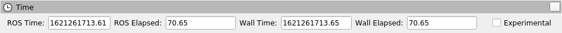
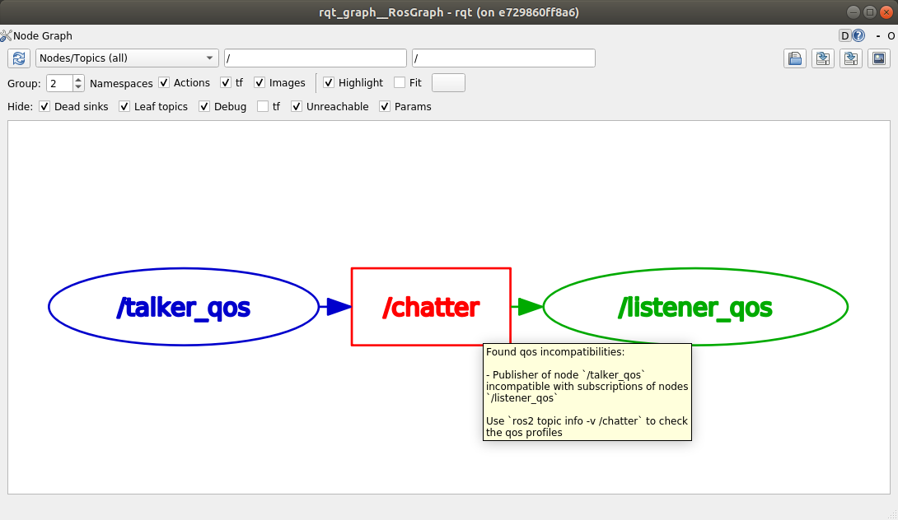

.. _galactic-release:

Galactic Geochelone (``galactic``)
==================================

.. toctree::
   :hidden:

   Galactic-Geochelone-Complete-Changelog

.. contents:: 目录
   :depth: 2
   :local:

*Galactic Geochelone* 是 ROS 2 的第七个发行版。
下文重点介绍 Galactic Geochelone 自上一个版本以来的重要变更和功能。
如需查看自 Foxy 以来的全部变更列表，请参阅 `长格式变更日志 <Galactic-Geochelone-Complete-Changelog>`。

支持的平台
----------

Galactic Geochelone 根据 `平台支持等级 <../The-ROS2-Project/Platform-Support-Tiers>` 支持以下平台：

一级平台：

* Ubuntu 20.04 (Focal): ``amd64`` and ``arm64``
* Windows 10 (Visual Studio 2019): ``amd64``

二级平台：

* RHEL 8: ``amd64``

三级平台：

* Ubuntu 20.04 (Focal): ``arm32``
* Debian Bullseye (11): ``amd64``, ``arm64`` and ``arm32``
* OpenEmbedded Thud (2.6) / webOS OSE: ``arm32`` and ``arm64``
* Mac macOS 10.14 (Mojave): ``amd64``

目标平台：

+--------------+------------------+--------------+------------------+-----------+-----------------+-----------------+
| 架构         | Ubuntu Focal     | Windows 10   | RHEL 8           | macOS     | Debian Bullseye | OpenEmbedded /  |
|              | (20.04)          | (VS2019)     |                  |           | (11)            | webOS OSE       |
+==============+==================+==============+==================+===========+=================+=================+
| amd64        | Tier 1 [d][a][s] | Tier 1 [a][s]| Tier 2 [d][a][s] | Tier 3 [s]| Tier 3 [s]      |                 |
+--------------+------------------+--------------+------------------+-----------+-----------------+-----------------+
| arm64        | Tier 1 [d][a][s] |              |                  |           | Tier 3 [s]      | Tier 3 [s]      |
+--------------+------------------+--------------+------------------+-----------+-----------------+-----------------+
| arm32        | Tier 3 [s]       |              |                  |           | Tier 3 [s]      | Tier 3 [s]      |
+--------------+------------------+--------------+------------------+-----------+-----------------+-----------------+


以下指示符显示了每个平台可用的交付机制。

\" \[d\] \" 对于提交到 rosdistro 的软件包，将为此平台提供特定于发行版的（Debian、RPM 等）软件包。

\" \[a\] \" 二进制版本以每个平台单个归档文件的形式提供，包含 Galactic ROS 2 repos 文件[^10] 中的所有软件包。

\" \[s\] \" 从源代码编译。

中间件实现支持：

+--------------------------+-------------------------+---------------+----------------------------+------------------------------+
| 中间件库                 | 中间件提供方            | 支持等级      | 平台                       | 架构                         |
+==========================+=========================+===============+============================+==============================+
| rmw_cyclonedds_cpp*      | Eclipse Cyclone DDS     | Tier 1        | All Platforms              | All Architectures            |
+--------------------------+-------------------------+---------------+----------------------------+------------------------------+
| rmw_fastrtps_cpp         | eProsima Fast-DDS       | Tier 1        | All Platforms              | All Architectures            |
+--------------------------+-------------------------+---------------+----------------------------+------------------------------+
| rmw_connextdds           | RTI Connext             | Tier 1        | Ubuntu, Windows, and macOS | All Architectures except     |
|                          |                         |               |                            | arm64                        |
+--------------------------+-------------------------+---------------+----------------------------+------------------------------+
| rmw_fastrtps_dynamic_cpp | eProsima Fast-DDS       | Tier 2        | All Platforms              | All Architectures            |
+--------------------------+-------------------------+---------------+----------------------------+------------------------------+
| rmw_gurumdds_cpp         | GurumNetworks GurumDDS  | Tier 3        | Ubuntu and Windows         | All Architectures except     |
|                          |                         |               |                            | arm32                        |
+--------------------------+-------------------------+---------------+----------------------------+------------------------------+

\" \* \" 表示默认的 RMW 实现。

中间件实现支持取决于平台支持等级。例如，二级平台上的一个一级中间件实现只能获得二级支持。

最低语言要求：

- C++17
- Python 3.6

依赖要求：

+------------+----------------------------+--------------------------------------------------------------------------------+
|            | 必需支持                   | 推荐支持                                                                       |
+------------+-------------+--------------+----------+----------+-----------------+----------------------------------------+
| 软件包     | Ubuntu Focal| Windows 10** | RHEL 8   | macOS**  | Debian Bullseye | OpenEmbedded**                         |
+============+=============+==============+==========+==========+=================+========================================+
| CMake      | 3.16.3      | 3.19.1       | 3.18.2   | 3.14.4   | 3.18.4          | 3.16.1 / 3.12.2****                    |
+------------+-------------+--------------+----------+----------+-----------------+----------------------------------------+
| EmPY       | 3.3.2                                                                                                       |
+------------+-------------+--------------+----------+----------+-----------------+----------------------------------------+
| Gazebo     | 11.0.0*     | N/A          | N/A      | 11.0.0   | 11.0.0*         | N/A                                    |
+------------+-------------+--------------+----------+----------+-----------------+----------------------------------------+
| Ignition   | Edifice*    | N/A          | N/A      | Edifice* | Edifice*        | N/A                                    |
+------------+-------------+--------------+----------+----------+-----------------+----------------------------------------+
| Ogre       | 1.10*                                                              | N/A                                    |
+------------+-------------+--------------+----------+----------+-----------------+----------------------------------------+
| OpenCV     | 4.2.0       | 3.4.6*       | 3.4.6    | 4.2.0    | 4.5.1           | 4.1.0 / 3.2.0****                      |
+------------+-------------+--------------+----------+----------+-----------------+----------------------------------------+
| OpenSSL    | 1.1.1d      | 1.1.1i       | 1.1.1g   | 1.1.1f   | 1.1.1i          | 1.1.1d / 1.1.1b****                    |
+------------+-------------+--------------+----------+----------+-----------------+----------------------------------------+
| Python     | 3.8.0       | 3.8.3        | 3.6.8    | 3.8.2    | 3.9.1           | 3.8.2 / 3.7.5****                      |
+------------+-------------+--------------+----------+----------+-----------------+----------------------------------------+
| Qt         | 5.12.5      | 5.12.10      | 5.12.5   | 5.12.3   | 5.15.2          | 5.14.1 / 5.12.5****                    |
+------------+-------------+--------------+----------+----------+-----------------+----------------------------------------+
|                                         | **Linux only**                                                                 |
+------------+-------------+--------------+----------+----------+-----------------+----------------------------------------+
| PCL        | 1.10.0      | N/A          | 1.11.1   | N/A      | 1.11.1          | 1.10.0                                 |
+------------+-------------+--------------+----------+----------+-----------------+----------------------------------------+
| **RMW DDS Middleware Providers**                                                                                         |
+------------+-------------+--------------+----------+----------+-----------------+----------------------------------------+
| Cyclone DDS| 0.8.x (Réplique)                                                                                            |
+------------+-------------+--------------+----------+----------+-----------------+----------------------------------------+
| Fast-DDS   | 2.3.x                                                                                                       |
+------------+-------------+--------------+----------+----------+-----------------+----------------------------------------+
| Connext DDS| 5.3.1                      | N/A      | 5.3.1    | N/A                                                      |
+------------+----------------------------+----------+----------+----------------------------------------------------------+
| Gurum DDS  | 2.7.x                      | N/A                                                                            |
+------------+----------------------------+--------------------------------------------------------------------------------+

\" \* \" 表示这不是上游版本（可在官方操作系统仓库中获取），而是由 OSRF 或社区分发的软件包（在自定义仓库中构建和分发的软件包）。

\" \*\* \" 滚动发行版在其生命周期内会看到这些依赖的多次版本变更。OpenEmbedded 所显示的版本是 3.1 Dunfell 版本系列所提供的版本；其他受支持的版本系列所提供的版本列在这里：
<https://github.com/ros/meta-ros/wiki/Package-Version-Differences> 。
请注意，ROS 发行版所支持的 OpenEmbedded 版本系列会在其支持时间范围内发生变化，依据如下所示的 OpenEmbedded 支持策略：
<https://github.com/ros/meta-ros/wiki/Policies#openembedded-release-series-support>
。不过，它始终会至少由一个稳定的 OpenEmbedded 版本系列提供支持。

\" \*\*\*\* \" webOS OSE 提供了这个不同的版本。

本文档仅记录 ROS 发行版首次发布时的版本，并且不会随着依赖的更新而更新。
因此，这些版本只是一个最低基准。

依赖使用的包管理器：

- Ubuntu, Debian: apt
- Windows: Chocolatey, pip
- macOS: Homebrew, pip
- RHEL: dnf
- OpenEmbedded: opkg

构建系统支持：

- ament_cmake
- cmake
- setuptools

安装
----

`安装 Galactic Geochelone <../../galactic/Installation.html>`__

此 ROS 2 版本中的新功能
-----------------------

能够为每个记录器指定日志级别
^^^^^^^^^^^^^^^^^^^^^^^^^^^^

现在可以在命令行上为不同的记录器指定不同的日志级别：

.. code-block:: console

   $ ros2 run demo_nodes_cpp talker --ros-args --log-level WARN --log-level talker:=DEBUG

上面的命令设置全局日志级别为 WARN，但将 talker 节点消息的日志级别设置为 DEBUG。
``--log-level`` 命令行选项可以任意多次传入，以便为每个记录器设置不同的日志级别。

能够通过环境变量配置日志目录
^^^^^^^^^^^^^^^^^^^^^^^^^^^^

现在可以通过两个环境变量配置日志目录：``ROS_LOG_DIR`` 和 ``ROS_HOME``。
逻辑如下：

* 如果设置了 ``ROS_LOG_DIR`` 且非空，则使用 ``$ROS_LOG_DIR``。
* 否则，使用 ``$ROS_HOME/log``；如果 ``ROS_HOME`` 未设置或为空，则使用 ``~/.ros``。

因此默认值保持不变：``~/.ros/log``。

相关 PR：`ros2/rcl_logging#53 <https://github.com/ros2/rcl_logging/pull/53>`_ 和 `ros2/launch#460 <https://github.com/ros2/launch/pull/460>`_。

例如：

.. code-block:: bash

  ROS_LOG_DIR=/tmp/foo ros2 run demo_nodes_cpp talker

会将所有日志放到 ``/tmp/foo`` 中。

.. code-block:: bash

  ROS_HOME=/path/to/home ros2 run demo_nodes_cpp talker

会将所有日志放到 ``/path/to/home/log`` 中。

能够在 CMake 之外调用 ``rosidl`` 流水线
^^^^^^^^^^^^^^^^^^^^^^^^^^^^^^^^^^^^^^^

现在可以直接在 CMake 之外调用 ``rosidl`` 接口生成流水线。
源代码生成器和接口定义转换器可以通过统一的命令行接口访问。

For example, given a ``Demo`` message in some ``demo`` package like:

.. code-block:: console

  $ mkdir -p demo/msg
  $ cd demo
  $ cat << EOF > msg/Demo.msg
  std_msgs/Header header
  geometry_msgs/Twist twist
  geometry_msgs/Accel accel
  EOF

很容易生成 C、C++ 和 Python 支持源代码：

.. code-block:: console

  $ rosidl generate -o gen -t c -t cpp -t py -I$(ros2 pkg prefix --share std_msgs)/.. \
    -I$(ros2 pkg prefix --share geometry_msgs)/.. demo msg/Demo.msg

生成的源代码将放在 ``gen`` 目录中。

也可以将消息定义转换为不同的格式，供第三方代码生成工具使用：

.. code-block:: console

  $ rosidl translate -o gen --to idl -I$(ros2 pkg prefix --share std_msgs)/.. \
    -I$(ros2 pkg prefix --share geometry_msgs)/.. demo msg/Demo.msg

转换后的消息定义将放在 ``gen`` 目录中。

请注意，这些工具会生成源代码，但不会构建它们——构建的责任仍在调用方。
这是向在 CMake 之外的其他构建系统中启用 ``rosidl`` 接口生成迈出的第一步。
有关进一步参考和后续步骤，请参阅 `设计文档 <https://github.com/ros2/design/pull/310>`_。

在启动时外部配置 QoS
^^^^^^^^^^^^^^^^^^^^

现在可以在启动时为节点外部配置 QoS 设置。
QoS 设置在运行时**不能**配置；它们只能在启动时配置。
节点作者必须选择启用才能在启动时更改 QoS 设置。
如果在节点上启用了此功能，那么当节点首次启动时，可以通过 ROS 参数设置 QoS 设置。

`可以在这里找到 C++ 和 Python 的演示。 <https://github.com/ros2/demos/tree/a66f0e894841a5d751bce6ded4983acb780448cf/quality_of_service_demo#qos-overrides>`_

更多详细信息请参阅 `QoS 设计文档 <http://design.ros2.org/articles/qos_configurability.html>`_。

请注意，使用已注册回调处理参数更改的用户代码应避免拒绝未知参数的更新。
在 Galactic 之前这被认为是糟糕的做法，但启用外部可配置 QoS 后，这将导致硬失败。

相关 PR：`ros2/rclcpp#1408 <https://github.com/ros2/rclcpp/pull/1408>`_ 和 `ros2/rclpy#635 <https://github.com/ros2/rclpy/pull/635>`_

提供 Python point_cloud2 工具
^^^^^^^^^^^^^^^^^^^^^^^^^^^^^

多个用于在 Python 中与 `PointCloud2 消息 <https://github.com/ros2/common_interfaces/blob/galactic/sensor_msgs/msg/PointCloud2.msg>`__ 交互的工具被 `移植到 ROS 2 <https://github.com/ros2/common_interfaces/pull/128>`__。
这些工具允许从 PointCloud2 消息中获取点列表（``read_points`` 和 ``read_points_list``），以及从点列表创建 PointCloud2 消息（``create_cloud`` 和 ``create_cloud_xyz32``）。

一个创建 PointCloud 2 消息然后读回它的示例：

.. code-block:: python

  import sensor_msgs_py.point_cloud2
  from std_msgs.msg import Header

  pointlist = [[0.0, 0.1, 0.2]]

  pointcloud = sensor_msgs_py.point_cloud2.create_cloud_xyz32(Header(frame_id='frame'), pointlist)

  for point in sensor_msgs_py.point_cloud2.read_points(pointcloud):
      print(point)

RViz2 时间面板
^^^^^^^^^^^^^^

Rviz2 时间面板可以显示当前的墙钟时间和 ROS 时间，以及已流逝的墙钟时间和 ROS 时间，该面板已 `移植到 RViz2 <https://github.com/ros2/rviz/pull/599>`__。
要启用时间面板，请单击 Panels -> Add New Panel，然后选择 "Time"。
将出现一个如下所示的面板：



``ros2 topic echo`` 可以打印序列化数据
^^^^^^^^^^^^^^^^^^^^^^^^^^^^^^^^^^^^^^

在调试中间件问题时，查看 RMW 正在发送的原始序列化数据会很有用。
``ros2 topic echo`` 新增了 `--raw 命令行标志 <https://github.com/ros2/ros2cli/pull/470>`__ 来显示这些数据。
要查看实际效果，请运行以下命令。

Terminal 1:

.. code-block:: console

  $ ros2 topic pub /chatter std_msgs/msg/String "data: 'hello'"

Terminal 2:

.. code-block:: console

  $ ros2 topic echo --raw /chatter
  b'\x00\x01\x00\x00\x06\x00\x00\x00hello\x00\x00\x00'
  ---

获取消息的 YAML 表示
^^^^^^^^^^^^^^^^^^^^

现在可以在 C++ 中使用 `to_yaml <https://github.com/ros2/rosidl/issues/523>`__ 函数获取所有消息的 YAML 表示。
一个打印 YAML 表示的代码示例：

.. code-block:: c++

  #include <cstdio>

  #include <std_msgs/msg/string.hpp>

  int main()
  {
    std_msgs::msg::String msg;
    msg.data = "hello world";
    printf("%s", rosidl_generator_traits::to_yaml(msg).c_str());
    return 0;
  }

能够通过 ros2 命令在运行时加载参数文件
^^^^^^^^^^^^^^^^^^^^^^^^^^^^^^^^^^^^^^

ROS 2 早已能够在启动时指定参数值（通过命令行参数或 YAML 文件），并将当前参数转储到文件（通过 ``ros2 param dump``）。
Galactic 增加了使用 ``ros2 param load`` 动词从 YAML 文件 `在运行时加载参数值 <https://github.com/ros2/ros2cli/pull/590>`__ 的能力。
例如：

Terminal 1:

.. code-block:: console

  $ ros2 run demo_nodes_cpp parameter_blackboard

Terminal 2:

.. code-block:: console

  $ ros2 param set /parameter_blackboard foo bar  # sets 'foo' parameter to value 'bar'
  $ ros2 param dump /parameter_blackboard  # dumps current value of parameters to ./parameter_blackboard.yaml
  $ ros2 param set /parameter_blackboard foo different  # sets 'foo' parameter to value 'different'
  $ ros2 param load /parameter_blackboard ./parameter_blackboard.yaml  # reloads previous state of parameters, 'foo' is back to 'bar'

检查 QoS 不兼容性的工具
^^^^^^^^^^^^^^^^^^^^^^^

基于新的 QoS 兼容性检查 API，``ros2doctor`` 和 ``rqt_graph`` 现在可以检测并报告发布者和订阅者之间的 QoS 不兼容性。

给定一个发布者和一个具有 `不兼容 QoS 设置 <../../Concepts/Intermediate/About-Quality-of-Service-Settings>` 的订阅者：

Terminal 1:

.. code-block:: console

  $ ros2 run demo_nodes_py talker_qos -n 1000  # i.e. best_effort publisher

Terminal 2:

.. code-block:: console

  $ ros2 run demo_nodes_py listener_qos --reliable -n 1000  # i.e. reliable subscription

``ros2doctor`` 报告：

.. code-block:: console

  $ ros2 doctor --report
  ~ ...
     QOS COMPATIBILITY LIST
  topic [type]            : /chatter [std_msgs/msg/String]
  publisher node          : talker_qos
  subscriber node         : listener_qos
  compatibility status    : ERROR: Best effort publisher and reliable subscription;
  ~ ...

而 ``rqt_graph`` 显示：



相关 PR：`ros2/ros2cli#621 <https://github.com/ros2/ros2cli/pull/621>`_、`ros-visualization/rqt_graph#61 <https://github.com/ros-visualization/rqt_graph/pull/61>`_

在参数文件中使用启动替换
^^^^^^^^^^^^^^^^^^^^^^^^

就像 ROS 1 ``roslaunch`` 中的 ``rosparam`` 标签一样，``launch_ros`` 现在可以在参数文件中计算替换。

For example, given some ``parameter_file_with_substitutions.yaml`` like the following:

.. code-block:: yaml

  /**:
    ros__parameters:
      launch_date: $(command date)

将 ``allow_substs`` 设置为 ``True``，即可在 ``Node`` 启动时计算替换：

.. code-block:: python

  import launch
  import launch_ros.parameter_descriptions
  import launch_ros.actions

  def generate_launch_description():
      return launch.LaunchDescription([
          launch_ros.actions.Node(
              package='demo_nodes_cpp',
              executable='parameter_blackboard',
              parameters=[
                  launch_ros.parameter_descriptions.ParameterFile(
                      param_file='parameter_file_with_substitutions.yaml',
                      allow_substs=True)
              ]
          )
      ])

XML 启动文件也支持此功能。

.. code-block:: xml

  <launch>
    <node pkg="demo_nodes_cpp" exec="parameter_blackboard">
      <param from="parameter_file_with_substitutions.yaml" allow_substs="true"/>
    </node>
  </launch>

相关 PR：`ros2/launch_ros#168 <https://github.com/ros2/launch_ros/pull/168>`_

支持唯一的网络流
^^^^^^^^^^^^^^^^

应用程序现在可以要求基于 UDP/TCP 和 IP 的 RMW 实现为发布者和订阅者提供唯一的*网络流*（即唯一的 `区分服务代码点 <https://tools.ietf.org/html/rfc2474>`_ 和/或唯一的 `IPv6 流标签 <https://tools.ietf.org/html/rfc6437>`_ 和/或 IP 数据包头中的唯一端口），从而在支持此类功能的网络架构（如 5G 网络）中为这些 IP 流启用 QoS 规范。

要查看实际效果，你可以运行这些 C++ 示例（可在 `ros2/examples <https://github.com/ros2/examples>`__ 仓库中找到）：

Terminal 1:

.. code-block:: console

  $ ros2 run examples_rclcpp_minimal_publisher publisher_member_function_with_unique_network_flow_endpoints


Terminal 2:

.. code-block:: console

  $ ros2 run examples_rclcpp_minimal_subscriber subscriber_member_function_with_unique_network_flow_endpoints


更多参考请参阅 `唯一网络流设计文档 <https://github.com/ros2/design/pull/304>`_。

Rosbag2 新功能
^^^^^^^^^^^^^^

按时间拆分录制
""""""""""""""

在 Foxy 中，你只能按包文件大小在录制时拆分，现在你也可以按经过的时间拆分。
以下命令会将包文件拆分为 100 秒的片段。

.. code-block:: console

  $ ros2 bag record --all --max-bag-duration 100

ros2 bag list
"""""""""""""

这个新命令列出 rosbag2 使用的各种类型的已安装插件。

.. code-block:: console

  $ ros2 bag list storage
  rosbag2_v2
  sqlite3

  $ ros2 bag list converter
  rosbag_v2_converter


压缩实现是一个插件
""""""""""""""""""

在 Foxy 中，rosbag2 压缩被硬编码为 Zstd 库实现。
现在已经重新架构，压缩实现是一个插件，可以在不修改 rosbag2 核心代码库的情况下进行替换。
随 ``ros-galactic-rosbag2`` 提供的默认插件仍然是 Zstd 插件——但现在可以发布和使用更多插件，并且通过有选择地安装软件包，可以从安装中排除 Zstd。


逐消息压缩
""""""""""

在 Foxy 中，你可以在拆分时自动压缩每个 rosbag 文件（逐文件压缩），但现在你也可以指定逐消息压缩。

.. code-block:: console

  $ ros2 bag record --all --compression-format zstd --compression-mode message


Rosbag2 的 Python API
"""""""""""""""""""""

Galactic 中发布了一个新软件包 ``rosbag2_py``，它提供了 Python API。
该软件包是围绕 C++ API 的 ``pybind11`` 绑定。
截至 Galactic 初始发布，它尚未公开 ``rosbag2_cpp`` API 可用的所有功能，但它是 ``ros2 bag`` CLI 工具的唯一连接，因此有相当多的功能可用。


性能测试软件包与性能改进
""""""""""""""""""""""""

自 Foxy 发布以来，对 rosbag2 进行了一个全面的性能分析项目。
完整的初始报告可在 https://github.com/ros2/rosbag2/blob/galactic/rosbag2_performance/rosbag2_performance_benchmarking/docs/rosbag2_performance_improvements.pdf 获取。
软件包 ``rosbag2_performance_benchmarking`` 提供了运行性能分析的工具，尤其是在录制方面，这有助于我们维护和改进 rosbag2 的性能。

在此报告之后，我们做了关键工作，将性能改进到更适用于实际机器人工作流的状态。
重点指出一个关键指标——在高带宽压力测试（200Mbps）中，Foxy 版本最多丢弃 70% 的消息，而 Galactic 版本大约保留了 100%。
更多详细信息请参阅所附报告。

用于主题选择的 ``--regex`` 和 ``--exclude`` 选项
""""""""""""""""""""""""""""""""""""""""""""""""

新的录制选项 ``--regex`` 和 ``--exclude`` 允许微调包中记录的主题，而无需显式列出所有主题。
这些选项可以一起使用，也可以单独使用，还可以与 ``--all`` 结合使用。

以下命令将只记录名称中包含 "scan" 的主题。

.. code-block:: console

  $ ros2 bag record --regex "*scan*"

以下命令将记录除 ``/my_namespace/`` 中之外的所有主题。

.. code-block:: console

  $ ros2 bag record --all --exclude "/my_namespace/*"


``ros2 bag reindex``
""""""""""""""""""""

ROS 2 包由目录表示，而不是单个文件。
该目录包含一个 ``metadata.yaml`` 文件和一个或多个包文件。
当 ``metadata.yaml`` 文件丢失或缺失时，``ros2 bag reindex $bag_dir`` 将尝试通过读取目录中的所有包文件来重建它。

播放时间控制
""""""""""""

为 rosbag2 播放添加了新控制——暂停与恢复、更改速率和播放下一段。
截至 Galactic 发布，这些控制仅作为 rosbag2 播放器节点上的服务暴露。
目前正在开发中，以便在 ``ros2 bag play`` 中也将其暴露给键盘控制，但在那之前，可以轻松实现一个带按钮或键盘控制的用户应用程序来调用这些服务。

在一个终端中：

.. code-block:: console

  $ ros2 bag play my_bag

在另一个终端中：

.. code-block:: console

  $ ros2 service list -t
  /rosbag2_player/get_rate [rosbag2_interfaces/srv/GetRate]
  /rosbag2_player/is_paused [rosbag2_interfaces/srv/IsPaused]
  /rosbag2_player/pause [rosbag2_interfaces/srv/Pause]
  /rosbag2_player/play_next [rosbag2_interfaces/srv/PlayNext]
  /rosbag2_player/resume [rosbag2_interfaces/srv/Resume]
  /rosbag2_player/set_rate [rosbag2_interfaces/srv/SetRate]
  /rosbag2_player/toggle_paused [rosbag2_interfaces/srv/TogglePaused]

  $ ros2 service call /rosbag2_player/is_paused rosbag2_interfaces/IsPaused

To pause playback:

.. code-block:: console

  $ ros2 service call /rosbag2_player/pause rosbag2_interfaces/Pause

恢复播放：

.. code-block:: console

  $ ros2 service call /rosbag2_player/resume rosbag2_interfaces/Resume

将播放的暂停状态切换为相反状态。
如果正在播放，则暂停。
如果已暂停，则恢复。

.. code-block:: console

  $ ros2 service call /rosbag2_player/toggle_paused rosbag2_interfaces/TogglePaused

获取当前播放速率：

.. code-block:: console

  $ ros2 service call /rosbag2_player/get_rate

设置当前播放速率（必须 > 0）：

.. code-block:: console

  $ ros2 service call /rosbag2_player/set_rate rosbag2_interfaces/SetRate "rate: 0.1"

播放单个下一条消息（仅在暂停时有效）：

.. code-block:: console

  $ ros2 service call /rosbag2_player/play_next rosbag2_interfaces/PlayNext


播放发布 /clock
"""""""""""""""

Rosbag2 还可以通过在播放期间向 ``/clock`` 主题发布消息来控制"仿真时间"。
以下命令将按固定间隔发布时钟消息。

以默认速率 40Hz 发布：

.. code-block:: console

  $ ros2 bag play my_bag --clock


以特定速率（例如 100Hz）发布：

.. code-block:: console

  $ ros2 bag play my_bag --clock 100

自 Foxy 版本以来的变更
----------------------

默认 RMW 更改为 Eclipse Cyclone DDS
^^^^^^^^^^^^^^^^^^^^^^^^^^^^^^^^^^^

在 Galactic 开发过程中，ROS 2 技术指导委员会 `投票决定 <https://discourse.ros.org/t/ros-2-galactic-default-middleware-announced/18064>`__ 将默认 ROS 中间件（RMW）更改为 `Eclipse Foundation <https://www.eclipse.org>`__ 的 `Eclipse Cyclone DDS <https://github.com/eclipse-cyclonedds/cyclonedds>`__ 项目。
无需任何配置更改，用户默认就会获得 Eclipse Cyclone DDS。
Fast DDS 和 Connext 仍然是 Tier-1 支持的 RMW 厂商，用户可以通过使用 ``RMW_IMPLEMENTATION`` 环境变量自行选择使用其中一种 RMW。
更多信息请参阅 `使用多个 RMW 实现指南 <../../How-To-Guides/Working-with-multiple-RMW-implementations>`。

Connext RMW 更改为 rmw_connextdds
^^^^^^^^^^^^^^^^^^^^^^^^^^^^^^^^^

用于 Connext 的名为 `rmw_connextdds <https://github.com/ros2/rmw_connextdds>`_ 的新 RMW 已在 Galactic 中合并。
该 RMW 具有更好的性能，并修复了较旧的 RMW ``rmw_connext_cpp`` 的许多问题。

测试和整体质量的大幅改进
^^^^^^^^^^^^^^^^^^^^^^^^

Galactic 包含许多修复竞态条件、堵塞内存泄漏以及修复用户报告问题的更改。
除了这些更改之外，在 Galactic 开发期间还做出了协同努力，通过实施 `REP 2004 <https://reps.openrobotics.org/rep-2004/>`__ 来改进系统的整体质量。
``rclcpp`` 软件包及其所有依赖（包括大多数 ROS 2 非 Python 核心软件包）都已提升到 `质量等级 1 <https://reps.openrobotics.org/rep-2004/#quality-level-1>`__，具体通过以下方式：

* 制定版本策略（QL1 要求 1）
* 制定文档化的变更控制流程（QL1 要求 2）
* 记录所有功能和公共 API（QL1 要求 3）
* 添加许多额外测试（QL1 要求 4）：

  * 所有功能的系统测试
  * 所有公共 API 的单元测试
  * 夜间性能测试
  * 代码覆盖率 95%

* 使软件包的所有运行时依赖至少与软件包本身同级（QL1 要求 5）
* 支持所有 REP-2000 平台（QL1 要求 6）
* 制定漏洞披露策略（QL1 要求 7）

rmw
^^^

用于检查 QoS 配置文件兼容性的新 API
"""""""""""""""""""""""""""""""""""

``rmw_qos_profile_check_compatible`` 是一个用于检查两个 QoS 配置文件兼容性的新函数。

RMW 厂商应实现此 API，以便 ``rqt_graph`` 等工具中的 QoS 调试和自省功能正常工作。

相关 PR：`ros2/rmw#299 <https://github.com/ros2/rmw/pull/299>`_

ament_cmake
^^^^^^^^^^^

``ament_install_python_package()`` 现在安装 Python egg
""""""""""""""""""""""""""""""""""""""""""""""""""""""

通过安装扁平化的 Python egg，使用 ``ament_install_python_package()`` 安装的 Python 软件包可以通过 ``pkg_resources`` 和 ```importlib.metadata`` 等模块被发现。此外，还可以在 ``setup.cfg`` 文件中提供额外的元数据（包括入口点）。

相关 PR：`ament/ament_cmake#326 <https://github.com/ament/ament_cmake/pull/326>`_

``ament_target_dependencies()`` 处理 SYSTEM 依赖
""""""""""""""""""""""""""""""""""""""""""""""""

某些软件包依赖现在可以标记为 SYSTEM 依赖，有助于应对外部代码中的警告。通常，SYSTEM 依赖也会被排除在依赖计算之外——请谨慎使用。

相关 PR：`ament/ament_cmake#297 <https://github.com/ament/ament_cmake/pull/297>`_

nav2
^^^^

变更包括但不限于大量稳定性改进、新插件、接口更改、代价地图过滤器。
完整列表请参阅 `迁移指南 <https://navigation.ros.org/migration/Foxy.html>`_

tf2_ros Python 从 tf2_ros 中分离
^^^^^^^^^^^^^^^^^^^^^^^^^^^^^^^^

以前位于 tf2_ros 中的 Python 代码已移入名为 tf2_ros_py 的独立软件包。
任何依赖 tf2_ros 的现有 Python 代码仍将继续工作，但这些软件包的 package.xml 应修改为 ``exec_depend`` 于 tf2_ros_py。

tf2_ros Python TransformListener 使用全局命名空间
^^^^^^^^^^^^^^^^^^^^^^^^^^^^^^^^^^^^^^^^^^^^^^^^^

Python ``TransformListener`` 现在在全局命名空间中订阅 ``/tf`` 和 ``/tf_static``。
以前，它是在节点的命名空间中订阅的。
这意味着节点的命名空间将不再对 ``/tf`` 和 ``/tf_static`` 订阅产生影响。

例如：

.. code-block:: console

  $ ros2 run tf2_ros tf2_echo --ros-args -r __ns:=/test -- odom base_link

将订阅 ``/tf`` 和 ``/tf_static``，如 ``ros2 topic list`` 所示。

Related PR: `ros2/geometry2#390 <https://github.com/ros2/geometry2/pull/390>`_

rclcpp
^^^^^^

spin_until_future_complete 模板参数的变化
"""""""""""""""""""""""""""""""""""""""""

``Execut或者：:spin_until_future_complete`` 的第一个模板参数是 future 结果类型 ``ResultT``，该方法只接受 ``std::shared_future<ResultT>``。
为了接受其他类型的 future（例如：``std::future``），该参数已更改为 future 类型本身。

在依赖模板实参推导的 ``spin_until_future_complete`` 调用处，无需更改。
如果不是这样，这里是一个示例 diff：

.. code-block:: dpatch

   std::shared_future<MyResultT> future;
   ...
   -executor.spin_until_future_complete<MyResultT>(future);
   +executor.spin_until_future_complete<std::shared_future<MyResultT>>(future);


更多详细信息，请参阅 `ros2/rclcpp#1160 <https://github.com/ros2/rclcpp/pull/1160>`_。
关于用户代码中所需更改的示例，请参阅 `ros-visualization/interactive_markers#72 <https://github.com/ros-visualization/interactive_markers/pull/72>`_。

默认 ``/clock`` 订阅 QoS 配置文件的变化
"""""""""""""""""""""""""""""""""""""""

默认值已从可靠性通信且历史深度 10 更改为尽力而为通信且历史深度 1。
请参阅 `ros2/rclcpp#1312 <https://github.com/ros2/rclcpp/pull/1312>`_。

可等待 API
""""""""""

Waitable API 已修改，以避免 ``MultiThreadedExecutor`` 的问题。
这仅影响实现自定义 waitable 的用户。
更多详细信息请参阅 `ros2/rclcpp#1241 <https://github.com/ros2/rclcpp/pull/1241>`_。

``rclcpp`` 日志宏的变化
"""""""""""""""""""""""
以前，日志宏容易受到 `格式化字符串攻击 <https://owasp.org/www-community/attacks/Format_string_attack>`_ 的攻击，即格式化字符串被求值，可能执行代码、读取堆栈或导致运行中的程序出现段错误。
为了解决这个安全问题，日志宏现在只接受字符串字面量作为其格式化字符串参数。

如果你以前有这样的代码：

.. code-block::

  const char *my_const_char_string format = "Foo";
  RCLCPP_DEBUG(get_logger(), my_const_char_string);

现在应该将其替换为：

.. code-block::

  const char *my_const_char_string format = "Foo";
  RCLCPP_DEBUG(get_logger(), "%s", my_const_char_string);

或者：

.. code-block::

  RCLCPP_DEBUG(get_logger(), "Foo");


此更改使日志宏失去了一些便利性，因为 ``std::string`` 不再被接受作为格式化参数。


如果你以前有类似这样的无格式化参数代码：

.. code-block::

  std::string my_std_string = "Foo";
  RCLCPP_DEBUG(get_logger(), my_std_string);

现在应该将其替换为：

.. code-block::

    std::string my_std_string = "Foo";
    RCLCPP_DEBUG(get_logger(), "%s", my_std_string.c_str());

.. note::
    如果你将 ``std::string`` 作为带格式化参数的格式化字符串使用，将该字符串转换为 ``char *`` 并用作格式化字符串将产生格式安全警告。这是因为编译器在编译时无法检查 ``std::string`` 来验证参数。为避免安全警告，我们建议像前面的示例那样手动构建字符串，并以无格式化参数的方式传入。

``std::stringstream`` 类型仍然被接受为流式日志宏的参数。
更多详细信息请参阅 `ros2/rclcpp#1442 <https://github.com/ros2/rclcpp/pull/1442>`_。

参数类型现在默认为静态
""""""""""""""""""""""

以前，当设置参数时，可以更改参数的类型。
例如，如果一个参数被声明为整数，之后调用设置该参数可能会将其类型更改为字符串。
这种行为可能导致错误，而且通常不是用户想要的。
自 Galactic 起，参数类型默认是静态的，尝试更改类型将失败。
如果希望保持之前的动态行为，可以选择启用该机制（请参阅下面的代码）。

.. code-block:: cpp

    // declare integer parameter with default value, trying to set it to a different type will fail.
    node->declare_parameter("my_int", 5);
    // declare string parameter with no default and mandatory user provided override.
    // i.e. the user must pass a parameter file setting it or a command line rule -p <param_name>:=<value>
    node->declare_parameter("string_mandatory_override", rclcpp::PARAMETER_STRING);
    // Conditionally declare a floating point parameter with a mandatory override.
    // Useful when the parameter is only needed depending on other conditions and no default is reasonable.
    if (mode == "modeA") {
        node->declare_parameter("conditionally_declare_double_parameter", rclcpp::PARAMETER_DOUBLE);
    }
    // You can also get the old dynamic typing behavior if you want:
    rcl_interfaces::msg::ParameterDescriptor descriptor;
    descriptor.dynamic_typing = true;
    node->declare_parameter("dynamically_typed_param", rclcpp::ParameterValue{}, descriptor);

更多详细信息请参阅 https://github.com/ros2/rclcpp/blob/galactic/rclcpp/doc/notes_on_statically_typed_parameters.md。

用于检查 QoS 配置文件兼容性的新 API
"""""""""""""""""""""""""""""""""""

``qos_check_compatible`` 是一个用于检查两个 QoS 配置文件兼容性的新函数。

相关 PR：`ros2/rclcpp#1554 <https://github.com/ros2/rclcpp/pull/1554>`_

rclpy
^^^^^

移除已弃用的 Node.set_parameters_callback
"""""""""""""""""""""""""""""""""""""""""

方法 ``Node.set_parameters_callback`` 已在 `ROS Foxy 中弃用 <https://github.com/ros2/rclpy/pull/504>`_，并已在 `ROS Galactic 中移除 <https://github.com/ros2/rclpy/pull/633>`_。
请改用 ``Node.add_on_set_parameters_callback()``。
下面是一些使用它的示例代码。

.. code-block:: python

    import rclpy
    import rclpy.node
    from rcl_interfaces.msg import ParameterType
    from rcl_interfaces.msg import SetParametersResult


    rclpy.init()
    node = rclpy.node.Node('callback_example')
    node.declare_parameter('my_param', 'initial value')


    def on_parameter_event(parameter_list):
        for parameter in parameter_list:
            node.get_logger().info(f'Got {parameter.name}={parameter.value}')
        return SetParametersResult(successful=True)


    node.add_on_set_parameters_callback(on_parameter_event)
    rclpy.spin(node)

运行此命令以查看参数回调的实际效果。

.. code-block::

    ros2 param set /callback_example my_param "Hello World"

参数类型现在默认为静态
""""""""""""""""""""""

在 Foxy 及更早版本中，设置参数的调用可以更改其类型。
自 Galactic 起，参数类型默认是静态的，无法更改。
如果希望保持之前的行为，请在参数描述符中将 ``dynamic_typing`` 设置为 true。
这里有一个示例。

.. code-block:: python

  import rclpy
  import rclpy.node
  from rcl_interfaces.msg import ParameterDescriptor

  rclpy.init()
  node = rclpy.node.Node('static_param_example')
  node.declare_parameter('static_param', 'initial value')
  node.declare_parameter('dynamic_param', 'initial value', descriptor=ParameterDescriptor(dynamic_typing=True))
  rclpy.spin(node)

运行这些命令，看看静态类型和动态类型参数有何不同。

.. code-block:: console

    $ ros2 param set /static_param_example dynamic_param 42
    Set parameter successful
    $ ros2 param set /static_param_example static_param 42
    Setting parameter failed: Wrong parameter type, expected 'Type.STRING' got 'Type.INTEGER'

更多详细信息请参阅 https://github.com/ros2/rclcpp/blob/galactic/rclcpp/doc/notes_on_statically_typed_parameters.md。

用于检查 QoS 配置文件兼容性的新 API
"""""""""""""""""""""""""""""""""""

``rclpy.qos.qos_check_compatible`` 是 `一个新函数 <https://github.com/ros2/rclpy/pull/708>`_，用于检查两个 QoS 配置文件的兼容性。
如果配置文件兼容，那么使用它们的发布者和订阅者将能够相互通信。

.. code-block:: python

    import rclpy.qos

    publisher_profile = rclpy.qos.qos_profile_sensor_data
    subscription_profile = rclpy.qos.qos_profile_parameter_events

    print(rclpy.qos.qos_check_compatible(publisher_profile, subscription_profile))

.. code-block:: console

    $ python3 qos_check_compatible_example.py
    (QoSCompatibility.ERROR, 'ERROR: Best effort publisher and reliable subscription;')

rclcpp_action
^^^^^^^^^^^^^

动作客户端目标响应回调签名已更改
""""""""""""""""""""""""""""""""

目标响应回调现在应接受指向目标句柄的共享指针，而不是 future。

以 `示例 <https://github.com/ros2/examples/pull/291>`_ 为例，旧签名：

.. code-block:: c++

   void goal_response_callback(std::shared_future<GoalHandleFibonacci::SharedPtr> future)

新签名：

.. code-block:: c++

   void goal_response_callback(GoalHandleFibonacci::SharedPtr goal_handle)

Related PR: `ros2/rclcpp#1311 <https://github.com/ros2/rclcpp/pull/1311>`_

rosidl_typesupport_introspection_c
^^^^^^^^^^^^^^^^^^^^^^^^^^^^^^^^^^

从数组中获取元素的函数 API 中断
"""""""""""""""""""""""""""""""

该函数的签名已更改，因为它在语义上不同于所有其他用于从数组或序列中获取元素的函数。
这仅影响使用自省类型支持的 rmw 实现作者。

更多详细信息，请参阅 `ros2/rosidl#531 <https://github.com/ros2/rosidl/pull/531>`_。

rcl_lifecycle and rclcpp_lifecycle
^^^^^^^^^^^^^^^^^^^^^^^^^^^^^^^^^^

RCL 生命周期状态机获得新的初始化 API
""""""""""""""""""""""""""""""""""""

rcl_lifecycle 中的生命周期状态机已修改为期望一个新引入的选项结构体，该结构体整合了状态机的一般配置。
该选项结构体允许指示状态机是否应使用默认值初始化、其附加服务是否处于活动状态以及使用哪个分配器。

.. code-block:: c

  rcl_ret_t
  rcl_lifecycle_state_machine_init(
    rcl_lifecycle_state_machine_t * state_machine,
    rcl_node_t * node_handle,
    const rosidl_message_type_support_t * ts_pub_notify,
    const rosidl_service_type_support_t * ts_srv_change_state,
    const rosidl_service_type_support_t * ts_srv_get_state,
    const rosidl_service_type_support_t * ts_srv_get_available_states,
    const rosidl_service_type_support_t * ts_srv_get_available_transitions,
    const rosidl_service_type_support_t * ts_srv_get_transition_graph,
    const rcl_lifecycle_state_machine_options_t * state_machine_options);

RCL 生命周期状态机存储分配器实例
""""""""""""""""""""""""""""""""

上述选项结构体包含用于初始化状态机的分配器实例。
该选项结构体及其所包含的分配器被存储在生命周期状态机内。
直接结果是，``rcl_lifecycle_fini`` 函数不再期望在其 fini 函数中接收分配器，而是使用选项结构体中设置的分配器来释放其内部数据结构。

.. code-block:: c

  rcl_ret_t
  rcl_lifecycle_state_machine_fini(
    rcl_lifecycle_state_machine_t * state_machine,
    rcl_node_t * node_handle);

RCLCPP 的生命周期节点暴露不实例化服务的选项
"""""""""""""""""""""""""""""""""""""""""""

为了在不暴露其内部服务（如 ``change_state``、``get_state`` 等）的情况下使用 rclcpp 的生命周期节点，生命周期节点的构造函数有一个新引入的参数，用于指示这些服务是否应可用。
此布尔标志默认为 true，如果不希望使用，也无需对现有 API 进行任何更改。

.. code-block:: c++

  explicit LifecycleNode(
    const std::string & node_name,
    const rclcpp::NodeOptions & options = rclcpp::NodeOptions(),
    bool enable_communication_interface = true);

相关 PR：`ros2/rcl#882 <https://github.com/ros2/rcl/pull/882>`_ 和 `ros2/rclcpp#1507 <https://github.com/ros2/rclcpp/pull/1507>`_

rcl_lifecycle and rclcpp_lifecycle
^^^^^^^^^^^^^^^^^^^^^^^^^^^^^^^^^^

录制 - 按时间拆分
"""""""""""""""""


已知问题
--------

ros2cli
^^^^^^^

守护进程在 Windows 上减慢 CLI 速度
""""""""""""""""""""""""""""""""""

作为变通方法，可以在不使用守护进程的情况下使用 CLI 命令，例如：

.. code-block:: console

  $ ros2 topic list --no-daemon


该问题由 `ros2/ros2cli#637 <https://github.com/ros2/ros2cli/issues/637>`_ 跟踪。

rqt
^^^

部分 rqt_bag 图标缺失
"""""""""""""""""""""

``rqt_bag`` 中缺少 "Zoom In"（放大）、"Zoom Out"（缩小）、"Zoom Home"（缩放至主页）和 "Toggle Thumbnails"（切换缩略图）的图标。
该问题在 `ros-visualization/rqt_bag#102 <https://github.com/ros-visualization/rqt_bag/issues/102>`_ 中跟踪

大多数 rqt 工具在 Windows 上无法独立运行
""""""""""""""""""""""""""""""""""""""""

在 Windows 上"独立"启动 rqt 工具（如 ``ros2 run rqt_graph rqt_graph``）通常无法工作。
变通方法是启动 rqt 容器进程（``rqt``），然后插入要使用的插件。

rviz2
^^^^^

RViz2 面板关闭按钮为空白
""""""""""""""""""""""""

每个 RViz2 面板的右上角应包含一个 "X"，以便关闭面板。
这些按钮存在，但其中的 "X" 在所有平台上都缺失。
该问题在 `ros2/rviz2#692 <https://github.com/ros2/rviz/issues/692>`__ 中跟踪。

发布前的时间线
--------------

    Mon. March 22, 2021 - Alpha
        ROS Core [1]_ 软件包的初步测试和稳定化。

    Mon. April 5, 2021 - Freeze
        对 Rolling Ridley 中的 ROS Core [1]_ 软件包进行 API 和功能冻结。
        请注意，这包括 ``rmw``，它是 ``ros_core`` 的递归依赖。
        此后只能进行错误修复版本发布。
        新软件包可以独立发布。

    Mon. April 19, 2021 - Branch
        从 Rolling Ridley 分支。
        ``rosdistro`` 重新对 ROS Core [1]_ 软件包的 Rolling PR 开放。
        Galactic 的开发从 ``ros-rolling-*`` 软件包转向 ``ros-galactic-*`` 软件包。

    Mon. April 26, 2021 - Beta
        提供 ROS Desktop [2]_ 软件包的更新版本。
        呼吁进行常规测试。

    Mon. May 17, 2021 - RC
      构建发布候选软件包。
        提供 ROS Desktop [2]_ 软件包的更新版本。

    Thu. May 20, 2021 - Distro Freeze
        冻结 rosdistro。
        ``rosdistro`` 仓库上的 Galactic PR 将不会被合并（在发布公告后重新开放）。

    Sun. May 23, 2021 - General Availability
      发布公告。
        ``rosdistro`` 重新对 Galactic PR 开放。

.. [1] The ``ros_core`` variant is described in `REP 2001 (ros-core) <https://reps.openrobotics.org/rep-2001/#ros-core>`_.
.. [2] The ``desktop`` variant is described in `REP 2001 (desktop-variants) <https://reps.openrobotics.org/rep-2001/#desktop-variants>`_.
