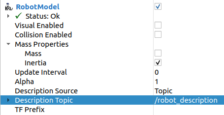
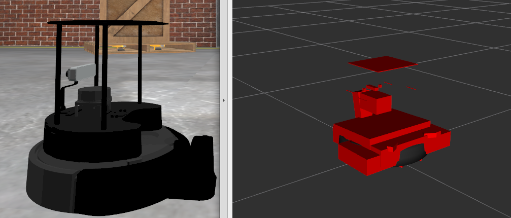

.. _humble-release:

Humble Hawksbill (``humble``)
=============================

.. toctree::
   :hidden:

   Humble-Hawksbill-Complete-Changelog

.. contents:: 目录
   :depth: 2
   :local:

*Humble Hawksbill* 是 ROS 2 的第八个发行版。
下文重点介绍 Humble Hawksbill 自上一个版本以来的重要变更和功能。
如需查看自 Galactic 以来的全部变更列表，请参阅 `长格式变更日志 <Humble-Hawksbill-Complete-Changelog>`。

支持的平台
----------

Humble Hawksbill 根据 `平台支持等级 <../The-ROS2-Project/Platform-Support-Tiers>` 支持以下平台：

一级平台：

* Ubuntu 22.04 (Jammy): ``amd64`` and ``arm64``
* Windows 10 (Visual Studio 2019): ``amd64``

二级平台：

* RHEL 8: ``amd64``

三级平台：

* Ubuntu 20.04 (Focal): ``amd64``
* macOS: ``amd64``
* Debian Bullseye: ``amd64``

目标平台：

+--------------+----------------------+---------------------+------------------+----------------------+------------+----------------------+------------------------------+
| Architecture | Ubuntu Jammy (22.04) | Windows 10 (VS2019) | RHEL 8           | Ubuntu Focal (20.04) | macOS      | Debian Bullseye (11) | OpenEmbedded / Yocto Project |
+==============+======================+=====================+==================+======================+============+======================+==============================+
| amd64        | Tier 1 [d][a][s]     | Tier 1 [a][s]       | Tier 2 [d][a][s] | Tier 3 [s]           | Tier 3 [s] | Tier 3 [s]           | Tier 3 [s]                   |
+--------------+----------------------+---------------------+------------------+----------------------+------------+----------------------+------------------------------+
| arm64        | Tier 1 [d][a][s]     |                     |                  | Tier 3 [s]           |            | Tier 3 [s]           | Tier 3 [s]                   |
+--------------+----------------------+---------------------+------------------+----------------------+------------+----------------------+------------------------------+
| arm32        | Tier 3 [s]           |                     |                  | Tier 3 [s]           |            | Tier 3 [s]           | Tier 3 [s]                   |
+--------------+----------------------+---------------------+------------------+----------------------+------------+----------------------+------------------------------+

以下指示符显示了每个平台可用的交付机制。

\" \[d\] \" 对于提交到 rosdistro 的软件包，将为此平台提供特定于发行版的（Debian、RPM 等）软件包。

\" \[a\] \" 二进制版本以每个平台单个归档文件的形式提供，包含 Humble ROS 2 repos 文件[^11] 中的所有软件包。

\" \[s\] \" 从源代码编译。

中间件实现支持：

+--------------------------+-------------------------+---------------+----------------------------+-------------------------------+
| Middleware Library       | Middleware Provider     | Support Level | Platforms                  | Architectures                 |
+==========================+=========================+===============+============================+===============================+
| rmw_fastrtps_cpp*        | eProsima Fast-DDS       | Tier 1        | All Platforms              | All Architectures             |
+--------------------------+-------------------------+---------------+----------------------------+-------------------------------+
| rmw_cyclonedds_cpp       | Eclipse Cyclone DDS     | Tier 1        | All Platforms              | All Architectures             |
+--------------------------+-------------------------+---------------+----------------------------+-------------------------------+
| rmw_connextdds           | RTI Connext             | Tier 1        | Ubuntu, Windows, and macOS | All Architectures except arm64|
+--------------------------+-------------------------+---------------+----------------------------+-------------------------------+
| rmw_fastrtps_dynamic_cpp | eProsima Fast-DDS       | Tier 2        | All Platforms              | All Architectures             |
+--------------------------+-------------------------+---------------+----------------------------+-------------------------------+
| rmw_gurumdds_cpp         | GurumNetworks GurumDDS  | Tier 3        | Ubuntu and Windows         | All Architectures except arm32|
+--------------------------+-------------------------+---------------+----------------------------+-------------------------------+

\" \* \" 表示默认的 RMW 实现。

中间件实现支持取决于平台支持等级。例如，二级平台上的一个一级中间件实现只能获得二级支持。

最低语言要求：

- C++17
- Python 3.6

依赖要求：

+------------------+-------------------+-----------------------------------------------------------------------------------------------------------+
|                  | Required Support  | Recommended Support                                                                                       |
+------------------+----------+--------+--------+--------------+----------+------------------+-----------------------------------------------------+
| Package          | Ubuntu   | Windows| RHEL 8 | Ubuntu Focal | macOS**  | Debian Bullseye  | OpenEmbedded**                                      |
|                  | Jammy    | 10**   |        |              |          |                  |                                                     |
+==================+==========+========+========+==============+==========+==================+=====================================================+
| CMake            | 3.22.1   | 3.22.0 | 3.20.2 | 3.16.3       | 3.14.4   | 3.18.4           | 3.22.3 / 3.16.5***                                  |
+------------------+----------+--------+--------+--------------+----------+------------------+-----------------------------------------------------+
| EmPY             | 3.3.4    | 3.3.2                                                                                                              |
+------------------+----------+--------+--------+--------------+----------+------------------+-----------------------------------------------------+
| Gazebo Classic   | 11.x.x*  | N/A    | N/A    | 11.0.0*      | 11.x.x   | 11.x.x*          | N/A                                                 |
+------------------+----------+--------+--------+--------------+----------+------------------+-----------------------------------------------------+
| Gazebo (Ignition)| Fortress*| N/A    | N/A    | Fortress*    | Fortress*| Fortress*        | N/A                                                 |
+------------------+----------+--------+--------+--------------+----------+------------------+-----------------------------------------------------+
| NumPy            | 1.21.5   | 1.18.4 | 1.14.3 | 1.17.4       | 1.18.4   | 1.19.5           | N/A                                                 |
+------------------+----------+--------+--------+--------------+----------+------------------+-----------------------------------------------------+
| Ogre             | 1.12.1*                                                                 | N/A                                                 |
+------------------+----------+--------+--------+--------------+----------+------------------+-----------------------------------------------------+
| OpenCV           | 4.5.4    | 3.4.6* | 3.4.6  | 4.2.0        | 4.2.0    | 4.5.1            | 4.1.0 / 3.2.0***                                    |
+------------------+----------+--------+--------+--------------+----------+------------------+-----------------------------------------------------+
| OpenSSL          | 1.1.1l   | 1.1.1l | 1.1.1k | 1.1.1d       | 1.1.1f   | 1.1.1i           | 1.1.1d / 1.1.1b***                                  |
+------------------+----------+--------+--------+--------------+----------+------------------+-----------------------------------------------------+
| Python           | 3.10.4   | 3.8.3  | 3.6.8  | 3.8.0        | 3.8.2    | 3.9.1            | 3.8.2 / 3.7.5***                                    |
+------------------+----------+--------+--------+--------------+----------+------------------+-----------------------------------------------------+
| Qt               | 5.15.3   | 5.12.12| 5.15.2 | 5.12.5       | 5.12.3   | 5.15.2           | 5.14.1 / 5.12.5***                                  |
+------------------+----------+--------+--------+--------------+----------+------------------+-----------------------------------------------------+
|                             | **Linux only**                                                                                                     |
+------------------+----------+--------+--------+--------------+----------+------------------+-----------------------------------------------------+
| PCL              | 1.12.1   | N/A    | 1.11.1 | 1.10.0       | N/A      | 1.11.1           | 1.10.0                                              |
+------------------+----------+--------+--------+--------------+----------+------------------+-----------------------------------------------------+
| **RMW DDS Middleware Providers**                                                                                                                 |
+------------------+----------+--------+--------+--------------+----------+------------------+-----------------------------------------------------+
| Cyclone DDS      | 0.9.x (Papillons)                                                                                                             |
+------------------+----------+--------+--------+--------------+----------+------------------+-----------------------------------------------------+
| Fast-DDS         | 2.6.x                                                                                                                         |
+------------------+----------+--------+--------+--------------+----------+------------------+-----------------------------------------------------+
| Connext DDS      | 6.0.1             | N/A    | 6.0.1                   | N/A                                                                    |
+------------------+----------+--------+--------+--------------+----------+------------------+-----------------------------------------------------+
| Gurum DDS        | 2.7.x             | N/A    | 2.7.x        | N/A                                                                               |
+------------------+----------+--------+--------+--------------+----------+------------------+-----------------------------------------------------+

\" \* \" 表示这不是上游版本（可在官方操作系统仓库中获取），而是由 OSRF 或社区分发的软件包（在自定义仓库中构建和分发的软件包）。

\" \*\* \" 表示该依赖可能会经历多个版本变更，因为该依赖使用的包管理器会持续更新依赖而没有稳定的 API。

\" \*\*\* \" webOS OSE 提供了这个不同的版本。

本文档仅记录 ROS 发行版首次发布时的版本，并且不会随着依赖的更新而更新。
因此，这些版本只是一个最低基准。

依赖使用的包管理器：

- Ubuntu, Debian: apt
- Windows: Chocolatey, pip
- macOS: Homebrew, pip
- RHEL: dnf
- OpenEmbedded: opkg

构建系统支持：

- ament_cmake
- cmake
- setuptools

安装
----

`Install Humble Hawksbill <../../humble/Installation.html>`__

补丁版本 1 中的变更（2022-11-23）
---------------------------------

ros2topic
^^^^^^^^^

``now`` 作为 ``builtin_interfaces.msg.Time`` 的关键字，``auto`` 作为 ``std_msgs.msg.Header`` 的关键字
"""""""""""""""""""""""""""""""""""""""""""""""""""""""""""""""""""""""""""""""""""""""""""""""""""""
``ros2 topic pub`` 现在允许通过 ``now`` 关键字将 ``builtin_interfaces.msg.Time`` 消息设置为当前时间。
类似地，当传入 ``auto`` 关键字时，将自动生成 ``std_msg.msg.Header`` 消息。
此行为与 ROS 1 的 ``rostopic`` 一致（http://wiki.ros.org/ROS/YAMLCommandLine#Headers.2Ftimestamps）

Related PR: `ros2/ros2cli#751 <https://github.com/ros2/ros2cli/pull/751>`_

此 ROS 2 版本中的新功能
-----------------------

ament_cmake_gen_version_h
^^^^^^^^^^^^^^^^^^^^^^^^^

生成带版本信息的 C/C++ 头文件
"""""""""""""""""""""""""""""
在 `ament/ament_cmake#377 <https://github.com/ament/ament_cmake/pull/377>`__ 中，为 ``ament_cmake_gen_version_h`` 新增了一个 CMake 函数，用于生成包含软件包版本信息的头文件。
下面是最简单的用例：

.. code-block:: CMake

    project(my_project)
    add_library(my_lib ...)
    ament_generate_version_header(my_lib)

它将从 ``package.xml`` 生成包含版本信息的头文件，并使其可供链接到 ``my_lib`` 库的目标使用。

如何包含该头文件：

.. code-block:: C

    #include <my_project/version.h>

头文件安装到的位置：

.. code-block:: cmake

    set(VERSION_HEADER ${CMAKE_INSTALL_PREFIX}/include/my_project/my_project/version.h)

launch
^^^^^^

在组动作中限定环境变量作用域
""""""""""""""""""""""""""""

与启动配置类似，现在默认情况下，环境变量的状态被限定在组动作的作用域内。

例如，在下面的启动文件中，执行的进程将回显值 ``1``\ （在 Humble 之前会回显 ``2``）：

.. tabs::

   .. group-tab:: XML

    .. code-block:: xml

      <launch>
        <set_env name="FOO" value="1" />
        <group>
          <set_env name="FOO" value="2" />
        </group>
        <executable cmd="echo $FOO" output="screen" shell="true" />
      </launch>

   .. group-tab:: Python

      .. code-block:: python

        import launch
        import launch.actions

        def generate_launch_description():
            return launch.LaunchDescription([
                launch.actions.SetEnvironmentVariable(name='FOO', value='1'),
                launch.actions.GroupAction([
                    launch.actions.SetEnvironmentVariable(name='FOO', value='2'),
                ]),
                launch.actions.ExecuteProcess(cmd=['echo', '$FOO'], output='screen', shell=True),
            ])

如果你想为启动配置和环境变量禁用作用域限定，可以将 ``scoped`` 参数（或属性）设置为 false。

Related PR: `ros2/launch#601 <https://github.com/ros2/launch/pull/601>`_

launch_pytest
"""""""""""""

我们新增了一个软件包 ``launch_pytest``，作为 ``launch_testing`` 的替代方案。
``launch_pytest`` 是一个简单的 pytest 插件，提供 pytest 固件来管理启动服务的生命周期。

有关详细信息和示例，请查看 `软件包 README <https://github.com/ros2/launch/tree/humble/launch_pytest>`_。

Related PR: `ros2/launch#528 <https://github.com/ros2/launch/pull/528>`_

允许使用可调用对象匹配目标动作
""""""""""""""""""""""""""""""

接受目标动作对象进行匹配的事件处理器现在也可以接受可调用对象来进行匹配。

Related PR: `ros2/launch#540 <https://github.com/ros2/launch/pull/540>`_

求值 Python 表达式时可访问 math 模块
""""""""""""""""""""""""""""""""""""

在 ``PythonExpression`` 替换（``eval``）中，我们现在可以使用 Python math 模块中的符号。
例如，

.. code-block:: xml

   <launch>
     <log message="$(eval 'ceil(pi)')" />
   </launch>

Related PR: `ros2/launch#557 <https://github.com/ros2/launch/pull/557>`_

布尔替换
""""""""

新的替换 ``NotSubstitution``、``AndSubstitution`` 和 ``OrSubstitution`` 提供了一种便捷的方式来执行逻辑运算，例如

.. code-block:: xml

   <launch>
     <let name="p" value="true" />
     <let name="q" value="false" />
     <group if="$(or $(var p) $(var q))">
       <log message="The first condition is true" />
     </group>
     <group unless="$(and $(var p) $(var q))">
       <log message="The second condition is false" />
     </group>
     <group if="$(not $(var q))">
       <log message="The third condition is true" />
     </group>
   </launch>

Related PR: `ros2/launch#598 <https://github.com/ros2/launch/pull/598>`_

新动作
""""""

* ``AppendEnvironmentVariable`` 向现有环境变量追加一个值。

  * 相关 PR：`ros2/launch#543 <https://github.com/ros2/launch/pull/543>`_

* ``ResetLaunchConfigurations`` 重置应用于启动配置的任何配置。

  * 相关 PR：`ros2/launch#515 <https://github.com/ros2/launch/pull/515>`_

launch_ros
^^^^^^^^^^

向节点动作传递 ROS 参数
"""""""""""""""""""""""

现在可以直接提供 `ROS 特定的节点参数 <../../How-To-Guides/Node-arguments>`，而无需使用带前导 ``--ros-args`` 标志的 ``args``：

.. tabs::

   .. group-tab:: XML

    .. code-block:: xml

      <launch>
        <node pkg="demo_nodes_cpp" exec="talker" ros_args="--log-level debug" />
      </launch>

   .. group-tab:: YAML

      .. code-block:: yaml

        launch:
        - node:
            pkg: demo_nodes_cpp
            exec: talker
            ros_args: '--log-level debug'

Python 启动文件中 ``Node`` 动作对应的参数是 ``ros_arguments``：

.. code-block:: python

  from launch import LaunchDescription
  import launch_ros.actions

  def generate_launch_description():
      return LaunchDescription([
          launch_ros.actions.Node(
              package='demo_nodes_cpp',
              executable='talker',
              ros_arguments=['--log-level', 'debug'],
          ),
      ])

Related PRs: `ros2/launch_ros#249 <https://github.com/ros2/launch_ros/pull/249>`_ and `ros2/launch_ros#253 <https://github.com/ros2/launch_ros/pull/253>`_.

前端对可组合节点的支持
""""""""""""""""""""""

现在我们可以从前端启动文件启动节点容器并向其中加载组件，例如：

.. tabs::

   .. group-tab:: XML

    .. code-block:: xml

       <launch>
         <node_container pkg="rclcpp_components" exec="component_container" name="my_container" namespace="">
           <composable_node pkg="composition" plugin="composition::Talker" name="talker" />
         </node_container>
         <load_composable_node target="my_container">
           <composable_node pkg="composition" plugin="composition::Listener" name="listener" />
         </load_composable_node>
       </launch>

   .. group-tab:: YAML

      .. code-block:: yaml

         launch:
           - node_container:
               pkg: rclcpp_components
               exec: component_container
               name: my_container
               namespace: ''
               composable_node:
                 - pkg: composition
                   plugin: composition::Talker
                   name: talker
           - load_composable_node:
               target: my_container
               composable_node:
                 - pkg: composition
                   plugin: composition::Listener
                   name: listener

Related PR: `ros2/launch_ros#235 <https://github.com/ros2/launch_ros/pull/235>`_

参数替换
""""""""

新的 ``ParameterSubstitution`` 允许你用之前通过 ``SetParameter`` 动作在启动中设置的参数值进行替换。
例如，

.. code-block:: xml

   <launch>
     <set_parameter name="foo" value="bar" />
     <log message="Parameter foo has value $(param foo)" />
   </launch>

Related PR: `ros2/launch_ros#297 <https://github.com/ros2/launch_ros/pull/297>`_

新动作
""""""

* ``RosTimer`` 类似于启动的 ``TimerAction``，但使用 ROS 时钟（因此例如可以使用仿真时间）。

  * 相关 PR：`ros2/launch_ros#244 <https://github.com/ros2/launch_ros/pull/244>`_ 和 `ros2/launch_ros#264 <https://github.com/ros2/launch_ros/pull/264>`_

* ``SetParametersFromFile`` 将 ROS 参数文件传递给启动文件中的所有节点（包括节点组件）。

  * 相关 PR：`ros2/launch_ros#260 <https://github.com/ros2/launch_ros/pull/260>`_ 和 `ros2/launch_ros#281 <https://github.com/ros2/launch_ros/pull/281>`_

SROS2 安全隔离区支持证书吊销列表
^^^^^^^^^^^^^^^^^^^^^^^^^^^^^^^^

证书吊销列表（CRL）是一种概念，即特定证书可以在到期前被吊销。
从 Humble 开始，现在可以将 CRL 放入 SROS2 安全隔离区并使其生效。
有关如何使用它的示例，请参阅 `SROS2 教程 <https://github.com/ros2/sros2/blob/humble/SROS2_Linux.md#certificate-revocation-lists>`__。

内容过滤话题
^^^^^^^^^^^^

内容过滤话题支持一种更高级的订阅，它表示订阅者不一定想看到在该话题下发布的每个实例的所有值。
当底层 RMW 实现支持此功能时，内容过滤话题可用于请求基于内容的订阅。

.. list-table:: RMW 内容过滤话题支持
   :widths: 25 25

   * - rmw_fastrtps
     - 支持
   * - rmw_connextdds
     - 支持
   * - rmw_cyclonedds
     - 不支持

如需了解更多信息，请参阅 `content_filtering <https://github.com/ros2/examples/blob/humble/rclcpp/topics/minimal_subscriber/content_filtering.cpp>`_ 示例。

相关设计 PR：`ros2/design#282 <https://github.com/ros2/design/pull/282>`_。

ros2cli
^^^^^^^

``ros2 launch`` 新增 ``--launch-prefix`` 参数
"""""""""""""""""""""""""""""""""""""""""""""

这允许向启动文件中的所有可执行文件传递前缀，这在许多调试场景中非常有用。
有关更多信息，请参阅相关的 `pull request <https://github.com/ros2/launch_ros/pull/254>`__ 以及 :ref:`教程 <launch-prefix-example>`。

此外，还新增了 ``--launch-prefix-filter`` 命令行选项，用于选择性地将 ``--launch-prefix`` 中的前缀添加到可执行文件。
有关更多信息，请参阅 `pull request <https://github.com/ros2/launch_ros/pull/261>`__。

``ros2 topic echo`` 新增 ``--flow-style`` 参数
""""""""""""""""""""""""""""""""""""""""""""""

这允许用户为话题上数据的 YAML 表示强制使用 ``flow style``。
如果没有此选项，``ros2 topic echo /tf_static`` 的输出可能如下所示：

.. code-block::

  transforms:
  - header:
      stamp:
        sec: 1651172841
        nanosec: 433705575
      frame_id: single_rrbot_link3
    child_frame_id: single_rrbot_camera_link
    transform:
      translation:
        x: 0.05
        y: 0.0
        z: 0.9
      rotation:
        x: 0.0
        y: 0.0
        z: 0.0
        w: 1.0

使用此选项，输出将如下所示：

.. code-block::

  transforms: [{header: {stamp: {sec: 1651172841, nanosec: 433705575}, frame_id: single_rrbot_link3}, child_frame_id: single_rrbot_camera_link, transform: {translation: {x: 0.05, y: 0.0, z: 0.9}, rotation: {x: 0.0, y: 0.0, z: 0.0, w: 1.0}}}]

See the `PyYAML documentation <https://pyyaml.docsforge.com/master/documentation/#dictionaries-without-nested-collections-are-not-dumped-correctly>`__ for more information.

``ros2 topic echo`` 可以根据消息内容过滤数据
""""""""""""""""""""""""""""""""""""""""""""

这允许用户只打印出话题上与某个 Python 表达式匹配的数据。
例如，使用以下参数将只打印以 'foo' 开头的字符串消息：

.. code-block::

   ros2 topic echo --filter 'm.data.startswith("foo")` /chatter

有关更多信息，请参阅 `pull request <https://github.com/ros2/ros2cli/pull/654>`__。

rviz2
^^^^^

将纹理应用于任意三角形列表
""""""""""""""""""""""""""

我们新增了 `使用 UV 坐标将通过 URI 定义的纹理应用于任意三角形列表的能力 <https://github.com/ros2/rviz/pull/719>`__。
现在我们可以从纹理贴图创建渐变，而不是默认的灰度。
这将实现标记的复杂着色。
要使用此功能，你应使用 ``visualization_msgs/Marker.msg`` 并填写 ``texture_resource``、``texture``、``uv_coordinates`` 和 ``mesh_file`` 字段。
你可以在 `这里 <https://github.com/ros2/common_interfaces/pull/153>`__ 找到更多信息。

质量属性（包括惯性）的可视化
""""""""""""""""""""""""""""

我们还新增了可视化惯性的能力。为此，你在机器人模型下的 'Mass Properties' 中选择启用 'Inertia'：

你可以在下面看到惯性的图像。

在 RViz 中可视化 YUV 图像
"""""""""""""""""""""""""

现在可以直接在 RViz 中可视化 YUV 图像，而无需先转换为 RGB。
有关详细信息，请参阅 `ros2/rviz#701 <https://github.com/ros2/rviz/pull/701>`__。

允许渲染距离超过 100 米的物体
"""""""""""""""""""""""""""""

默认情况下，RViz 只渲染距相机 100 米以内的物体。
rviz 相机插件中新增了一个名为 "Far Plane Distance" 的配置属性，允许配置该渲染距离。

See `ros2/rviz#849 <https://github.com/ros2/rviz/pull/849>`__ for more information.

自 Galactic 版本以来的变更
--------------------------

C++ 头文件安装到子目录中
^^^^^^^^^^^^^^^^^^^^^^^^

在 Humble 之前的 ROS 2 版本中，所有软件包的 C++ 头文件都安装到一个单一的 include 目录中。
例如，在 Galactic 中，目录结构如下所示（为简洁起见已精简）：

.. code::

    /opt/ros/galactic/include/
    ├── rcl
    │   ├── node.h
    ├── rclcpp
    │   ├── node.hpp

这种结构在使用叠加层时会导致严重问题。
也就是说，由于 include 目录的顺序，很容易获取到错误的一组头文件。
有关这些问题的详细说明，请参阅 https://colcon.readthedocs.io/en/released/user/overriding-packages.html。

为了帮助解决这个问题，在 Humble（以及今后所有的 ROS 2 版本）中，目录结构已发生改变：

.. code::

    /opt/ros/humble/include
    ├── rcl
    │   └── rcl
    │       ├── node.h
    ├── rclcpp
    │   └── rclcpp
    │       ├── node.hpp

请注意，使用这些头文件的下游软件包\ *不*\ 需要修改；使用 ``#include <rclcpp/node.hpp>`` 依然像以前一样工作。
但是，当使用正在查找 include 目录的 IDE 时，可能需要将各个 include 目录添加到搜索路径中。

有关更多信息（包括此更改背后的原因），请参阅 https://github.com/ros2/ros2/issues/1150。

common_interfaces
^^^^^^^^^^^^^^^^^

为 Marker 消息支持纹理和嵌入网格
""""""""""""""""""""""""""""""""

这两项新增功能将提升使用标准消息以新方式可视化数据的能力，同时也能在 rosbag 中跟踪这些数据。

**纹理** 为标记新增了三个字段：

.. code-block:: bash

   # Texture resource is a special URI that can either reference a texture file in
   # a format acceptable to (resource retriever)[https://index.ros.org/p/resource_retriever/]
   # or an embedded texture via a string matching the format:
   #   "embedded://texture_name"
   string texture_resource
   # An image to be loaded into the rendering engine as the texture for this marker.
   # This will be used iff texture_resource is set to embedded.
   sensor_msgs/CompressedImage texture
   # Location of each vertex within the texture; in the range: [0.0-1.0]
   UVCoordinate[] uv_coordinates

RViz 将通过嵌入格式完全支持纹理渲染。

对于那些熟悉 ``mesh_resource`` 的人来说，``resource_retriever`` 应该也不陌生。
这将允许程序员选择从何处加载数据，可以是本地文件，也可以是网络文件。
为了能够在 rosbag 中记录所有数据，我们加入了嵌入纹理图像的能力。

**网格** 也以类似的方式进行了修改，以增加嵌入原始网格文件以用于记录的能力。Meshfile 消息有两个字段：

.. code-block:: bash

   # The filename is used for both debug purposes and to provide a file extension
   # for whatever parser is used.
   string filename

   # This stores the raw text of the mesh file.
   uint8[] data

嵌入的 ``Meshfile`` 消息目前在实现中尚未支持。

相关 PR：`ros2/common_interfaces#153 <https://github.com/ros2/common_interfaces/pull/153>`_ `ros2/rviz#719 <https://github.com/ros2/rviz/pull/719>`_

为 SolidPrimitive 新增 ``PRISM`` 类型
"""""""""""""""""""""""""""""""""""""

``SolidPrimitive`` 消息新增了 ``PRISM`` 类型以及相应的元数据。
更多信息请参阅 `ros2/common_interfaces#167 <https://github.com/ros2/common_interfaces/pull/167>`_。

rmw
^^^

``struct`` 类型名称后缀从 ``_t`` 改为 ``_s``
""""""""""""""""""""""""""""""""""""""""""""

为避免在生成代码文档时 ``struct`` 类型名称与其 ``typedef`` 别名之间出现类型名称重复错误，所有 ``struct`` 类型名称的后缀已从 ``_t`` 改为 ``_s``。
带 ``_t`` 后缀的别名保持不变。
因此，此更改只对使用完整 ``struct`` 类型说明符（即 ``struct type_name_t``）的代码造成破坏性影响。

更多详细信息请参阅 `ros2/rmw#313 <https://github.com/ros2/rmw/pull/313>`__。

rmw_connextdds
^^^^^^^^^^^^^^

默认使用 Connext 6
""""""""""""""""""

默认情况下，Humble Hawksbill 使用 Connext 6.0.1 作为 ``rmw_connextdds`` 的 DDS 实现。
仍然可以将 Connext 5.3.1 与 ``rmw_connextdds`` 一起使用，但必须从源代码重新构建。

rcl
^^^

``struct`` 类型名称后缀从 ``_t`` 改为 ``_s``
""""""""""""""""""""""""""""""""""""""""""""

为避免在生成代码文档时 ``struct`` 类型名称与其 ``typedef`` 别名之间出现类型名称重复错误，所有 ``struct`` 类型名称的后缀已从 ``_t`` 改为 ``_s``。
带 ``_t`` 后缀的别名保持不变。
因此，此更改只对使用完整 ``struct`` 类型说明符（即 ``struct type_name_t``）的代码造成破坏性影响。

更多详细信息请参阅 `ros2/rcl#932 <https://github.com/ros2/rcl/pull/932>`__。

新增 ROS_DISABLE_LOANED_MESSAGES 环境变量
"""""""""""""""""""""""""""""""""""""""""

该环境变量可用于禁用借出消息（loaned messages）支持，无论 rmw 是否支持它们。
更多详细信息，请参阅指南 :doc:`配置零拷贝借出消息 <../How-To-Guides/Configure-ZeroCopy-loaned-messages>`。

rclcpp
^^^^^^

为发布者和订阅者支持类型适配
""""""""""""""""""""""""""""

定义类型适配器后，自定义数据结构可以直接被发布者和订阅者使用，这有助于避免程序员额外的工性和潜在的错误来源。
这在处理复杂数据类型时尤其有用，例如将 OpenCV 的 ``cv::Mat`` 转换为 ROS 的 ``sensor_msgs/msg/Image`` 类型。

下面是一个将 ``std_msgs::msg::String`` 转换为 ``std::string`` 的类型适配器示例：

.. code-block:: cpp

   template<>
   struct rclcpp::TypeAdapter<
      std::string,
      std_msgs::msg::String
   >
   {
     using is_specialized = std::true_type;
     using custom_type = std::string;
     using ros_message_type = std_msgs::msg::String;

     static
     void
     convert_to_ros_message(
       const custom_type & source,
       ros_message_type & destination)
     {
       destination.data = source;
     }

     static
     void
     convert_to_custom(
       const ros_message_type & source,
       custom_type & destination)
     {
       destination = source.data;
     }
   };

以及一个如何使用类型适配器的示例：

.. code-block:: cpp

   using MyAdaptedType = TypeAdapter<std::string, std_msgs::msg::String>;

   // Publish a std::string
   auto pub = node->create_publisher<MyAdaptedType>(...);
   std::string custom_msg = "My std::string"
   pub->publish(custom_msg);

   // Pass a std::string to a subscription's callback
   auto sub = node->create_subscription<MyAdaptedType>(
     "topic",
     10,
      {...});

想了解更多，请参阅 `发布者 <https://github.com/ros2/examples/blob/b83b18598b198b4a5ba44f9266c1bb39a393fa17/rclcpp/topics/minimal_publisher/member_function_with_type_adapter.cpp>`_ 和 `订阅者 <https://github.com/ros2/examples/blob/b83b18598b198b4a5ba44f9266c1bb39a393fa17/rclcpp/topics/minimal_subscriber/member_function_with_type_adapter.cpp>`_ 示例，以及一个更复杂的 `演示 <https://github.com/ros2/demos/pull/482>`_。
更多详细信息，请参阅 `REP 2007 <https://reps.openrobotics.org/rep-2007/>`_。

``Client::asnyc_send_request(request)`` 返回 ``std::future`` 而不是 ``std::shared_future``
""""""""""""""""""""""""""""""""""""""""""""""""""""""""""""""""""""""""""""""""""""""""""

此更改在 `rclcpp#1734 <https://github.com/ros2/rclcpp/pull/1734>`_ 中实现。
这会破坏 API，因为 ``std::future::get()`` 方法会从 future 中取出值。
这意味着，如果再次调用该方法，将会抛出异常。
对于 ``std::shared_future`` 则不会发生这种情况，因为其 ``get()`` 方法返回的是 ``const &``。
示例：

.. code-block:: cpp

    auto future = client->async_send_request(req);
    ...
    do_something_with_response(future.get());
    ...
    do_something_else_with_response(future.get());  // this will throw an exception now!!

应更新为：

.. code-block:: cpp

    auto future = client->async_send_request(req);
    ...
    auto response = future.get();
    do_something_with_response(response);
    ...
    do_something_else_with_response(response);

如果需要共享的 future，可以使用 ``std::future::share()`` 方法。

为 ``Publisher`` 新增 ``wait_for_all_acked`` 方法
"""""""""""""""""""""""""""""""""""""""""""""""""

这个新方法会阻塞，直到发布者队列中的所有消息都被匹配的订阅者确认，或直到指定的超时时间到期。
它只对可靠的发布者有用，因为在尽力而为（best effort）的 QoS 情况下没有确认机制。
示例：

.. code-block:: cpp

   auto pub = node->create_publisher<std_msgs::msg::String>(...);
   ...
   pub->publish(my_msg);
   ...
   pub->wait_for_all_acked(); // or pub->wait_for_all_acked(timeout)

更完整的示例请参阅 `这里 <https://github.com/ros2/examples/blob/humble/rclcpp/topics/minimal_publisher/member_function_with_wait_for_all_acked.cpp>`__。

从 ``NodeBase`` 和 ``Node`` 类中移除 ``get_callback_groups`` 方法
"""""""""""""""""""""""""""""""""""""""""""""""""""""""""""""""""

``for_each_callback_group()`` 方法通过提供一种线程安全的方式来访问 ``callback_groups_`` 向量，从而取代了 ``get_callback_groups()``。
``for_each_callback_group()`` 接受一个函数作为参数，遍历存储的回调组，并对有效的回调组调用传入的函数。

更多详细信息，请参阅此 `pull request <https://github.com/ros2/rclcpp/pull/1723>`_。

``Waitable`` 类的 ``add_to_wait_set`` 方法的返回类型从 ``bool`` 改为 ``void``
"""""""""""""""""""""""""""""""""""""""""""""""""""""""""""""""""""""""""""""
以前，从 ``Waitable`` 派生的类在向等待集合添加元素失败时重写 ``add_to_wait_set`` 会返回 false，因此调用方必须检查此返回值并抛出或处理错误。
现在，这种错误处理应直接在 ``add_to_wait_set`` 方法中进行，如有必要则抛出异常。
如果没有发生错误，则无需返回任何内容。
因此，这对于 ``Waitable`` 的下游使用来说是一个破坏性更改。

更多详细信息请参阅 `ros2/rclcpp#1612 <https://github.com/ros2/rclcpp/pull/1612>`__。

``NodeBaseInterface`` 类的 ``get_notify_guard_condition`` 方法的返回类型已更改
""""""""""""""""""""""""""""""""""""""""""""""""""""""""""""""""""""""""""""""
现在 ``rclcpp`` 使用 ``GuardCondition`` 类包装 ``rcl_guard_condition_t``，因此 ``get_notify_guard_condition`` 返回对节点的 ``rclcpp::GuardCondition`` 的引用。
因此，这对于 ``NodeBaseInterface`` 和 ``NodeBase`` 的下游使用来说是一个破坏性更改。

更多详细信息请参阅 `ros2/rclcpp#1612 <https://github.com/ros2/rclcpp/pull/1612>`__。

为 ``Clock`` 新增 ``sleep_until`` 和 ``sleep_for`` 方法
"""""""""""""""""""""""""""""""""""""""""""""""""""""""
在 `ros2/rclcpp#1814 <https://github.com/ros2/rclcpp/pull/1814>`__ 和 `ros2/rclcpp#1828 <https://github.com/ros2/rclcpp/pull/1828>`__ 中新增了两个方法，允许在特定时钟上休眠。
``Clock::sleep_until`` 将挂起当前线程，直到时钟到达特定时间。
``Clock::sleep_for`` 将挂起当前线程，直到时钟从方法被调用时起前进一定的时间量。
如果 ``Context`` 已关闭，这两个方法都会提前唤醒。

rclcpp_lifecycle
^^^^^^^^^^^^^^^^

发布者的激活和停用转换将自动触发
""""""""""""""""""""""""""""""""

以前，用户需要重写 ``LifecylceNode::on_activate()`` 和 ``LifecylceNode::on_deactivate()``，并在 ``LifecyclePublisher`` 上调用同名方法，才能使转换真正发生。
现在，``LifecylceNode`` 为这些方法提供了默认接口，已经可以完成此操作。
请参阅 ``lifecycle_talker`` 节点的实现 `这里 <https://github.com/ros2/demos/tree/humble/lifecycle>`__。

rclpy
^^^^^

托管节点
""""""""

rclpy 新增了对生命周期节点的支持。
完整的演示可以在 `这里 <https://github.com/ros2/demos/tree/humble/lifecycle_py>`__ 找到。

为 ``Publisher`` 新增 ``wait_for_all_acked`` 方法
"""""""""""""""""""""""""""""""""""""""""""""""""

与为 rclcpp 添加的功能类似。

为 ``Clock`` 新增 ``sleep_until`` 和 ``sleep_for`` 方法
"""""""""""""""""""""""""""""""""""""""""""""""""""""""
在 `ros2/rclpy#858 <https://github.com/ros2/rclpy/pull/858>`__ 和 `ros2/rclpy#864 <https://github.com/ros2/rclpy/pull/864>`__ 中新增了两个方法，允许在特定时钟上休眠。
``sleep_until`` 将挂起当前线程，直到时钟到达特定时间。
``sleep_for`` 将挂起当前线程，直到时钟从方法被调用时起前进一定的时间量。
如果 ``Context`` 已关闭，这两个方法都会提前唤醒。

ros1_bridge
^^^^^^^^^^^

由于 Ubuntu Jammy 及以后没有官方 ROS 1 发行版，``ros1_bridge`` 现在与 Ubuntu 打包的 ROS 1 版本兼容。
有关在 Jammy 软件包中使用 ``ros1_bridge`` 的更多详细信息，请参阅 :doc:`操作指南 <../How-To-Guides/Using-ros1_bridge-Jammy-upstream>`。

ros2cli
^^^^^^^

``ros2`` 命令默认禁用输出缓冲
"""""""""""""""""""""""""""""

在此版本之前，运行如下命令

.. code-block::

  ros2 echo /chatter | grep "Hello"

在输出缓冲区满之前不会打印任何数据。
用户可以通过设置 ``PYTHONUNBUFFERED=1`` 来解决这个问题，但这不太友好。

相反，所有 ``ros2`` 命令现在默认进行行缓冲，因此像上面这样的命令在打印出新行时即可正常工作。
要禁用此行为并使用 Python 默认缓冲规则，请使用 ``--use-python-default-buffering`` 选项。
更多信息请参阅 `原始 issue <https://github.com/ros2/ros2cli/issues/595>`__ 和 `pull request <https://github.com/ros2/ros2cli/pull/659>`__。

``ros2 topic pub`` 在使用 ``--times/--once/-1`` 时会等待一个匹配的订阅
""""""""""""""""""""""""""""""""""""""""""""""""""""""""""""""""""""""

当使用 ``--times/--once/-1`` 标志时，``ros2 topic pub`` 将等待找到一个匹配的订阅者后再开始发布。
这避免了 ros2cli 节点在发现匹配的订阅者之前就开始发布的问题，该问题会导致部分最早的消息丢失。
当使用可靠的 qos 配置文件时，这尤其出乎意料。

在开始发布前要等待的匹配订阅者数量可以通过 ``-w/--wait-matching-subscriptions`` 标志进行配置，例如：

.. code-block:: console

   $ ros2 topic pub -1 -w 3 /chatter std_msgs/msg/String "{data: 'foo'}"

即等待三个匹配的订阅者后再开始发布。

``-w`` 也可以独立于 ``--times/--once/-1`` 使用，但只有与它们结合使用时默认值才为一，否则 ``-w`` 的默认值为零。

更多详细信息请参阅 https://github.com/ros2/ros2cli/pull/642。

``ros2 param dump`` 的默认输出已更改
""""""""""""""""""""""""""""""""""""

  * dump 命令的 ``--print`` 选项已被 `弃用 <https://github.com/ros2/ros2cli/pull/638>`_。

    默认情况下它打印到标准输出：

    .. code-block:: console

      $ ros2 param dump /my_node_name

  * dump 命令的 ``--output-dir`` 选项已被 `弃用 <https://github.com/ros2/ros2cli/pull/638>`_。

    要将参数转储到文件，请运行：

    .. code-block:: console

      $ ros2 param dump /my_node_name > my_node_name.yaml

``ros2 param set`` 现在接受更多 YAML 语法
"""""""""""""""""""""""""""""""""""""""""

以前，尝试将 "off" 这样的字符串设置到字符串类型的参数上是不行的。
这是因为 ``ros2 param set`` 将命令行参数解释为 YAML，而 YAML 将 "off" 视为布尔类型。
从 https://github.com/ros2/ros2cli/pull/684 开始，``ros2 param set`` 现在接受 "!!str off" 的 YAML 转义序列，以确保该值被视为字符串。

``ros2 pkg create`` 可以自动生成 LICENSE 文件
"""""""""""""""""""""""""""""""""""""""""""""

如果将 ``--license`` 标志传给 ``ros2 pkg create``，且该许可证是已知许可证之一，``ros2 pkg create`` 现在将自动在软件包根目录生成 LICENSE 文件。
要查看已知许可证列表，请运行 ``ros2 pkg create --license ? <package_name>``。
更多信息请参阅相关的 `pull request <https://github.com/ros2/ros2cli/pull/650>`__。

robot_state_publisher
^^^^^^^^^^^^^^^^^^^^^

新增 ``frame_prefix`` 参数
""""""""""""""""""""""""""
在 `ros/robot_state_publisher#159 <https://github.com/ros/robot_state_publisher/pull/159>`__ 中新增了一个参数 ``frame_prefix``。
该参数是一个字符串，会被前置到 ``robot_state_publisher`` 发布的所有帧名称之前。
与 ROS 1 中原始 ``tf`` 库的 ``tf_prefix`` 类似，该参数可用于以不同的帧名称多次发布相同的机器人描述。

移除已弃用的 ``use_tf_static`` 参数
"""""""""""""""""""""""""""""""""""

已从 ``robot_state_publisher`` 中移除已弃用的 ``use_tf_static`` 参数。
这意味着静态变换将被无条件地发布到 ``/tf_static`` 话题，并且静态变换以 ``transient_local`` 服务质量发布。
这是默认行为，也是 ``tf2_ros::TransformListener`` 类之前所期望的行为，因此大多数代码无需修改。
任何依赖 ``robot_state_publisher`` 定期向 ``/tf`` 发布静态变换的代码，都需要更新为以 ``transient_local`` 订阅者的方式订阅 ``/tf_static``。

rosidl_cmake
^^^^^^^^^^^^

弃用 ``rosidl_target_interfaces()``
"""""""""""""""""""""""""""""""""""

CMake 函数 ``rosidl_target_interfaces()`` 已被弃用，现在调用时会发出 CMake 警告。
想要在生成消息/服务/动作的同一 ROS 软件包中使用它们的用户，应改为调用 ``rosidl_get_typesupport_target()``，然后调用 ``target_link_libraries()`` 使目标依赖于返回的 typesupport 目标。
更多详细信息请参阅 https://github.com/ros2/rosidl/pull/606，使用新函数的示例请参阅 https://github.com/ros2/demos/pull/529。

rviz2
^^^^^

* `提高了 3 字节像素格式的效率 <https://github.com/ros2/rviz/pull/743>`__
* `改变了惯性计算方式，使用 ignition 数学库而非 Ogre 的数学库 <https://github.com/ros2/rviz/pull/751>`__。

geometry2
^^^^^^^^^

弃用 TF2Error::NO_ERROR 等
""""""""""""""""""""""""""

``tf2`` 库使用一个名为 ``TF2Error`` 的枚举来返回错误。
不幸的是，其中的一个枚举值名为 ``NO_ERROR``，与 Windows 上的一个宏冲突。
为了解决这个问题，在 ``TF2Error`` 中创建了一组新的枚举值，每个都带有 ``TF2`` 前缀。
之前的枚举值仍然可用，但现在已被弃用，使用时会打印弃用警告。
所有使用 ``TF2Error`` 枚举的代码都应更新为使用新的带 ``TF2`` 前缀的错误。
更多详细信息请参阅 https://github.com/ros2/geometry2/pull/349。

为 static_transform_publisher 提供更直观的命令行参数
""""""""""""""""""""""""""""""""""""""""""""""""""""

``static_transform_publisher`` 程序以前接受如下参数：``ros2 run tf2_ros static_transform_publisher 0 0 0 0 0 0 1 foo bar``。
前三个数字是平移量 x、y 和 z，接下来 4 个是四元数 x、y、z 和 w，最后两个参数是父帧和子帧 ID。
虽然这可以工作，但它有几个问题：

* 用户必须指定*所有*参数，即使只设置一个数字也是如此
* 阅读命令行来弄清楚它发布的内容很困难

为了解决这两个问题，命令行处理已改为使用标志，除 ``--frame-id`` 和 ``--child-frame-id`` 之外的所有标志都是可选的。
因此，上面的命令行可以简化为：``ros2 run tf2_ros static_transform_publisher --frame-id foo --child-frame-id bar``
要只更改平移量 x，命令行将是：``ros2 run tf2_ros static_transform_publisher --x 1.5 --frame-id foo --child-frame-id bar``。

旧式参数在此版本中仍然允许，但已被弃用并会打印警告。
它们将在未来的版本中被移除。
更多详细信息请参阅 https://github.com/ros2/geometry2/pull/392。

变换监听器旋转线程不再执行节点回调
""""""""""""""""""""""""""""""""""

``tf2_ros::TransformListener`` 不再在提供的节点对象上旋转。
相反，它会创建一个回调组，在其内部创建的实体上执行回调。
这意味着如果你在创建变换监听器时设置了参数 ``spin_thread=true``，你
将不能再依赖你自己的回调被执行。
你必须在你的节点上调用 ``spin`` 函数（例如 ``rclcpp::spin``），或者将你的节点添加到你自己的执行器中。

相关 pull request：`geometry2#442 <https://github.com/ros2/geometry2/pull/442>`_

rosbag2
^^^^^^^

新的播放和录制控制
""""""""""""""""""

为了增强用户对 bag 播放的控制，我们新增了多个 pull request。
pull request `931 <https://github.com/ros2/rosbag2/pull/931>`_ 增加了指定开始播放时间戳的能力。
由于 pull request `789 <https://github.com/ros2/rosbag2/pull/789>`_，现在可以按指定的时间间隔延迟播放的开始。

相关地，``rosbag2`` 为用户提供了控制播放进行中的新方式。
pull request `847 <https://github.com/ros2/rosbag2/pull/847>`_ 增加了在终端播放期间用于暂停、恢复和播放下一条消息的键盘控制。
得益于 pull requests `905 <https://github.com/ros2/rosbag2/pull/905>`_ 和 `904 <https://github.com/ros2/rosbag2/pull/904>`_，还可以以暂停状态开始播放，这使得用户可以轻松地启动播放然后逐步浏览消息，例如在调试流水线时。
pull request `836 <https://github.com/ros2/rosbag2/pull/836>`_ 增加了在 bag 内搜索的接口，允许用户在播放期间在 bag 内移动。

最后，pull request `851 <https://github.com/ros2/rosbag2/pull/851>`_ 为录制增加了一种新的快照模式。
这种模式对于事件录制很有用，允许录制先开始填充缓冲区，但在调用服务之前不开始将数据写入磁盘。

突发模式播放
""""""""""""

虽然从 bag 中实时播放数据是 bag 文件最广为人知的用例，但在某些情况下你希望尽可能快地获得 bag 中的数据。
通过 pull request `977 <https://github.com/ros2/rosbag2/pull/977>`_，``rosbag2`` 获得了从 bag 中"突发"数据的能力。
在突发模式下，数据以尽可能快的速度播放。
这在机器学习等应用中非常有用。

零拷贝播放
""""""""""

默认情况下，如果可以使用借出消息（loaned message），播放消息将作为借出消息发布。
这有助于减少数据拷贝的次数，因此在发送大数据时收益更大。
pull request `981 <https://github.com/ros2/rosbag2/pull/981>`_ 为播放增加了 ``--disable-loan-message`` 选项。

等待确认
""""""""

这个新选项将等待所有已发布的消息被所有订阅者确认，或等待以毫秒为单位的超时时间过去后，才终止播放。
特别适用于在短时间内发送大消息的情况。
仅当发布者的 QOS 配置文件为 RELIABLE 时，此选项才有效。
pull request `951 <https://github.com/ros2/rosbag2/pull/951>`_ 为播放增加了 ``--wait-for-all-acked`` 选项。

bag 编辑
""""""""

``rosbag2`` 正在逐步实现 bag 的编辑功能，例如移除某个话题的所有消息，或将多个 bag 合并为单个 bag。
pull request `921 <https://github.com/ros2/rosbag2/pull/921>`_ 增加了 bag 重写和 ``ros2 bag convert`` 动词。

其他变更
""""""""

pull request `925 <https://github.com/ros2/rosbag2/pull/925>`_ 使 ``rosbag2`` 在录制时忽略"叶子话题"（没有发布者的话题）。
这些话题将不再自动添加到 bag 中。

已知问题
--------

* 在 `Ubuntu 22.04 Jammy 主机上安装 ROS 2 <../../humble/Installation/Ubuntu-Install-Debians.html>`__ 时，务必在安装 ROS 2 软件包之前更新你的系统。
  特别\ *重要*\ 的是要确保 ``systemd`` 和 ``udev`` 已更新到可用的最新版本，否则安装依赖 ``libudev1`` 的 ``ros-humble-desktop`` 可能会导致移除系统关键软件包。
  详细信息可以在 `ros2/ros2#1272 <https://github.com/ros2/ros2/issues/1272>`_ 和 `Launchpad #1974196 <https://bugs.launchpad.net/ubuntu/+source/systemd/+bug/1974196>`_ 中找到

* 当 ROS 2 apt 仓库可用时，Ubuntu 中的 ROS 1 软件包将无法安装。更多信息请参阅 :doc:`Ubuntu Jammy 上的 ros1_bridge <../How-To-Guides/Using-ros1_bridge-Jammy-upstream>` 文档。

* 一些主要的 Linux 发行版已经开始修补 Python，将软件包安装到 ``/usr/local``，这破坏了一部分 ``ament_package`` 和基于 ``colcon`` 的构建。
  特别是，在 Ubuntu Jammy 上使用从 pip 安装的 ``setuptools`` 会显现这种不良行为，因此不推荐这样做。
  目前有一个 `提议的解决方案 <https://github.com/colcon/colcon-core/pull/512>`_ 在大范围发布之前还需要进一步测试。

* 按大小或时长拆分的 ROS 2 bag 无法正确播放。
  只会播放最后记录的 bag。
  建议避免按大小或时长拆分 bag。
  详细信息可以在 `ros2/rosbag2#966 <https://github.com/ros2/rosbag2/issues/966>`__ 中找到。

发布计划
--------

    2022 年 3 月 21 日（周一）- Alpha + RMW 冻结
        对 ROS Base [1]_ 软件包进行初步测试和稳定化，并对 RMW 提供方软件包进行 API 和功能冻结。

    2022 年 4 月 4 日（周一）- 冻结
        对 Rolling Ridley 中的 ROS Base [1]_ 软件包进行 API 和功能冻结。
        此后只应发布错误修复版本。
        新软件包可以独立发布。

    2022 年 4 月 18 日（周一）- 分支
        从 Rolling Ridley 分出分支。
        ``rosdistro`` 为 ROS Base [1]_ 软件包的 Rolling PR 重新开放。
        Humble 的开发从 ``ros-rolling-*`` 软件包转移到 ``ros-humble-*`` 软件包。

    2022 年 4 月 25 日（周一）- Beta
        ROS Desktop [2]_ 软件包的更新版本可用。
        呼吁进行广泛测试。

    2022 年 5 月 16 日（周一）- 候选发布版
        构建候选发布版软件包。
        ROS Desktop [2]_ 软件包的更新版本可用。

    2022 年 5 月 19 日（周四）- 发行版冻结
        冻结 rosdistro。
        ``rosdistro`` 仓库上针对 Humble 的 PR 将不会被合并（在发布公告后重新开放）。

    2022 年 5 月 23 日（周一）- 正式发布
        发布公告。
        ``rosdistro`` 为 Humble PR 重新开放。

.. [1] The ``ros_base`` variant is described in `REP 2001 (ros-base) <https://reps.openrobotics.org/rep-2001/#ros-base>`_.
.. [2] The ``desktop`` variant is described in `REP 2001 (desktop-variants) <https://reps.openrobotics.org/rep-2001/#desktop-variants>`_.
