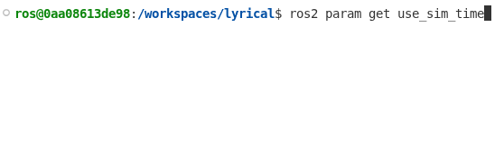

.. _latest-release:

.. _lyrical-release:

Lyrical Luth（代号 ``lyrical``；2026 年 5 月）
==============================================

.. toctree::
   :hidden:

   Lyrical-Luth-Complete-Changelog
   lyrical/release-timeline.rst
   lyrical/supported-platforms.rst

*Lyrical Luth* 是 ROS 2 的第十二个发行版。
它是长期支持（LTS）发行版，支持期至 2031 年 5 月。

* `安装 Lyrical Luth <../../lyrical/Installation.html>`_
* :doc:`lyrical/release-timeline`
* :doc:`lyrical/supported-platforms`

Lyrical 中的新特性
------------------

本节重点介绍 ROS Lyrical 中的一些新特性。
有关所有变更，请参阅 :doc:`完整的 ROS Lyrical 变更日志 <Lyrical-Luth-Complete-Changelog>`。

.. contents:: 目录
   :depth: 1
   :local:

回调组事件执行器（``rclcpp``）
^^^^^^^^^^^^^^^^^^^^^^^^^^^^^^

正在寻找更好的执行器性能？
来看看新的回调组事件执行器（Callback Group Events Executor）。
与其前身 ``EventsExecutor`` 一样，``EventsCBGExecutor`` 使用事件队列来处理就绪实体。
不过，``EventsCBGExecutor`` 增加了对多个 ROS 时间源和多个线程的支持。
相比单线程执行器和多线程执行器，``EventsCBGExecutor`` 的 CPU 占用低 10% 到 15%。

通过实例化 ``rclcpp::executors::EventsCBGExecutor`` 来试用它：

.. code-block:: c++

    #include <rclcpp/rclcpp.hpp>

    // ... class MyNode ...

    int main(int argc, char ** argv)
    {
      rclcpp::init(argc, argv);
      auto node = std::make_shared<MyNode>();
      rclcpp::executors::EventsCBGExecutor executor;
      executor.add_node(node);
      executor.spin();
      rclcpp::shutdown();
      return 0;
    }

在使用可组合节点？
使用新的 ``--executor-type`` 参数，以 ``EventsCBGExecutor`` 启动组件容器。

.. code-block:: console

    ros2 run rclcpp_components component_container --executor-type events-cbg

.. code-block:: xml

    <?xml version="1.0" encoding="UTF-8"?>
    <launch>
      <node_container pkg="rclcpp_components" exec="component_container" name="my_node_container" namespace="" args="--executor-type events-cbg">
        <!-- Your composable nodes here -->
      </node_container>
    </launch>

更多信息请参阅 `ros2/rclcpp#3097 <https://github.com/ros2/rclcpp/pull/3097>`_、`ros2/rclcpp#3134 <https://github.com/ros2/rclcpp/pull/3134>`_ 和 `ros2/rclcpp#3137 <https://github.com/ros2/rclcpp/pull/3137>`_。

参数范围描述符会检查整数数组和双精度数组的边界（``rclcpp``）
^^^^^^^^^^^^^^^^^^^^^^^^^^^^^^^^^^^^^^^^^^^^^^^^^^^^^^^^^^^^

你的节点中有整数数组或双精度数组吗？
你需要限制这些数组中的取值吗？
``rclcpp`` 节点现在会验证这些数组上的范围约束。
使用下面的代码，该节点只允许把 ``my_integer_array`` 设置为包含 2 到 10（含）之间偶数的列表。

.. code-block:: c++

    rcl_interfaces::msg::ParameterDescriptor descriptor;
    descriptor.integer_range.resize(1);
    auto & integer_range = descriptor.integer_range.at(0);
    integer_range.from_value = 2;
    integer_range.to_value = 10;
    integer_range.step = 2;
    node->declare_parameter("my_integer_array", std::vector<int64_t>{2, 4, 6, 8, 10}, descriptor);

更多信息请参阅 `ros2/rclcpp#2828 <https://github.com/ros2/rclcpp/pull/2828>`_。

``AsyncNode`` 让你可以使用 ``asyncio`` （``rclpy``）
^^^^^^^^^^^^^^^^^^^^^^^^^^^^^^^^^^^^^^^^^^^^^^^^^^^^

想要同时使用 ``asyncio`` 和 ``rclpy`` 吗？
来看看新的 ``AsyncNode`` 类。
该节点会运行一个 ``asyncio`` 事件循环。
可以在任意订阅、服务和定时器回调中对任意 ``asyncio`` 操作调用 ``await``。
试用 ``await client.call(request)`` 来等待服务调用，以及能感知仿真时间的 ``await clock.sleep(...)``。
与默认的 ``SingleThreadedExecutor`` 相比，该类显著降低了 CPU 占用。

.. code-block:: python

    import asyncio
    import rclpy
    from rclpy.experimental import AsyncNode

    class HelloWorldNode(AsyncNode):
        def __init__(self):
            super().__init__('hello_world_node')
            self._timer = self.create_timer(5.0, self._cb)

        async def _cb(self):
            self.get_logger().info('Hello')
            await self.get_clock().sleep(1.0)
            self.get_logger().info('World!')

    async def _main():
        with rclpy.init():
            await HelloWorldNode().run()

    if __name__ == '__main__':
        asyncio.run(_main())

使用 ``rosidl::Buffer`` 发布消息而无需复制数据
^^^^^^^^^^^^^^^^^^^^^^^^^^^^^^^^^^^^^^^^^^^^^^

你是否在 ROS 话题上发布数据，却在别处（例如 GPU）使用这些数据？
你是否厌倦了发布前把数据从 GPU 复制出来，只为在订阅方再复制回 GPU？
使用 ``rosidl::Buffer`` 即可在不搬运别处数据的情况下发布和订阅 ROS 消息。

在 C++ 中，所有 ``uint8[]`` 字段的类型现在都是 ``rosidl::Buffer<uint8_t>``，而不再是 ``std::vector<uint8_t>``。
用 ``uint8[]`` 字段定义你的 ROS 消息，并安装合适的 ``rosidl::BufferBackend`` 实现。
注意，目前只有使用 ``rmw_fastrtps_cpp`` 的发布者和订阅者可以使用此特性，不过 `Zenoh 中的支持即将到来 <https://github.com/ros2/rmw_zenoh/pull/930>`_。

在使用自定义的硬件加速器或机器学习库？
你也能从中受益。

在 YAML 参数文件中标注类型
^^^^^^^^^^^^^^^^^^^^^^^^^^

是否厌倦了 ``rcl`` 把有歧义的 YAML 参数值解释成错误的类型？
在 ROS Lyrical 中，使用 YAML 标签来指定正确的类型。

.. code-block:: yaml

  my_node:
    ros__parameters:
      string_param: !!str true
      bool_param: !!bool yes
      int_param: !!int 0
      float_param: !!float 10
      seq_param: !!seq [10, 0, -10]
      map_param: !!map {str: string, bool: true, int: 10, float: 1.1}

更多信息请参阅 `ros2/rcl#1275 <https://github.com/ros2/rcl/pull/1275>`_。

launch 文件中按消息设置日志严重级别
^^^^^^^^^^^^^^^^^^^^^^^^^^^^^^^^^^^

ROS Lyrical 现在支持在 launch 文件中为每条消息设置日志严重级别。
这让调试时在日志文件中查找重要消息或忽略不重要消息变得更加容易！

使用 ``log`` 动作上新增的 ``level`` 参数来指定日志级别。
或者，使用新增的 ``log_debug``、``log_info``、``log_warning`` 或 ``log_error`` 动作。

.. code-block:: xml

    <?xml version="1.0" encoding="UTF-8"?>
    <launch>
      <log level="INFO" message="Hello world! (log level=INFO)" />
      <log_debug message="Hello world debug!" />
      <log_info message="Hello world!" />
      <log_warning message="Hello world warning!" />
      <log_error message="Hello world error!" />
    </launch>

更多信息请参阅 `ros2/launch#866 <https://github.com/ros2/launch/pull/866>`_。

XML 和 YAML launch 文件中的新替换
^^^^^^^^^^^^^^^^^^^^^^^^^^^^^^^^^

在使用 XML 或 YAML launch 文件？
:doc:`替换 <../Tutorials/Intermediate/Launch/Using-Substitutions>` 能让你的 launch 文件在启动时对变量求值。
launch 前端（即让使用 XML 和 YAML launch 文件成为可能的组件）现在可以使用 ``string-join`` 和 ``path-join`` 替换。

.. code-block:: xml

    <?xml version="1.0" encoding="UTF-8"?>
    <launch>
      <log_info message="Check out $(string-join . https://docs ros org)"/>
      <log_info message="Don't forget to source /$(path-join opt ros lyrical $(string-join . setup bash))"/>
    </launch>

更多信息请参阅 `ros2/launch#857 <https://github.com/ros2/launch/pull/857>`_ 和 `ros2/launch#943 <https://github.com/ros2/launch/pull/943>`_。

在运行时选择 ROS 日志后端
^^^^^^^^^^^^^^^^^^^^^^^^^

你是否曾需要把 ROS 与另一个自带日志系统的框架一起使用？
ROS 支持替换其日志后端，但以前需要从源码重新构建 ``rcl``。
现在你可以在运行时更换日志实现！
设置 ``RCL_LOGGING_IMPLEMENTATION`` 环境变量即可在日志后端之间切换。
有效值包括：

* ``rcl_logging_spdlog``
* ``rcl_logging_noop``
* 或者你自己的自定义日志实现！

如果未指定，ROS 默认使用 ``rcl_logging_spdlog``。

更多详情请参阅 `ros2/rcl#1178 <https://github.com/ros2/rcl/issues/1178>`_、`ros2/rcl#1276 <https://github.com/ros2/rcl/pull/1276>`_ 和 `ros2/rcl_logging#135 <https://github.com/ros2/rcl_logging/pull/135>`_。

使用 ROS 服务远程控制 bag 录制
^^^^^^^^^^^^^^^^^^^^^^^^^^^^^^

想要远程控制 bag 录制？
使用 ``rosbag2`` 的新服务来：

* 开始录制 ``~/record``
* 停止录制 ``~/stop``
* 开始话题发现 ``~/start_discovery``
* 停止话题发现 ``~/stop_discovery``
* 查询发现状态 ``~/is_discovery_running``

.. code-block:: bash

    ros2 bag record --all -o /tmp/my_awesome_bag

    # In another terminal, stop the existing recording
    ros2 service call /rosbag2_recorder/stop rosbag2_interfaces/srv/Stop "{}"
    # Start recording again at a new location
    ros2 service call /rosbag2_recorder/record rosbag2_interfaces/srv/Record "{uri: 'file:///tmp/my_awesome_bag_2'}"

更多详情请参阅 `ros2/rosbag2#2218 <https://github.com/ros2/rosbag2/pull/2218>`_。

使用 Python 控制 bag 回放和录制
^^^^^^^^^^^^^^^^^^^^^^^^^^^^^^^

想要以编程方式控制 bag 回放和录制？
以前，Python 用户只能依赖阻塞式命令行风格的工具。
现在 Python 用户可以调用 API 来暂停、恢复、停止、跳转、播放下一条、控制自旋以及等待事件。

录制示例：

.. code-block:: python

    import rclpy
    import rosbag2_py

    with rclpy.init():
        # Configure storage and initialize the recorder
        storage_opts = rosbag2_py.StorageOptions(uri='/tmp/my_awesome_bag', storage_id='mcap')
        record_opts = rosbag2_py.RecordOptions()
        record_opts.all_topics = True

        recorder = rosbag2_py.Recorder(storage_opts, record_opts)

        # Start the ROS node spinner and kick off the recording thread
        recorder.start_spin()
        recorder.record()

        # Pause the recording and verify the current state
        recorder.pause()
        print(recorder.is_paused())

        # Terminate recording and shut down the spinner threads
        recorder.stop()
        recorder.stop_spin()

回放示例：

.. code-block:: python

    import rclpy
    import rosbag2_py

    with rclpy.init():
        # Configure storage and initialize the player
        storage_opts = rosbag2_py.StorageOptions(uri='/tmp/my_awesome_bag', storage_id='mcap')
        play_opts = rosbag2_py.PlayOptions()
        play_opts.start_paused = True

        player = rosbag2_py.Player(storage_opts, play_opts)

        # Start the ROS node spinner and kick off the playback thread
        player.start_spin()
        player.play()

        # Verify playback startup and retrieve bag timing metadata
        print(player.wait_for_playback_to_start(1.0))
        print(player.wait_for_playback_to_start_exclusively(1.0))
        print(player.get_starting_time())
        print(player.get_playback_duration())

        # Control the playback state and step through messages manually
        print(player.is_paused())
        print(player.play_next())
        player.resume()
        player.pause()
        player.seek(0)

        # Await playback completion and terminate the worker threads
        print(player.wait_for_playback_to_finish(1.0))
        print(player.wait_for_playback_to_finish_exclusively(1.0))
        player.stop()
        player.stop_spin()

更多详情请参阅 `ros2/rosbag2#2047 <https://github.com/ros2/rosbag2/pull/2047>`_、`ros2/rosbag2#2062 <https://github.com/ros2/rosbag2/pull/2062>`_、`ros2/rosbag2#2061 <https://github.com/ros2/rosbag2/pull/2061>`_ 和 `ros2/rosbag2#2095 <https://github.com/ros2/rosbag2/pull/2095>`_。

循环录制并限制 bag 数量
^^^^^^^^^^^^^^^^^^^^^^^

机器人的磁盘空间有限，还要录制数据？
试试新增的 ``--max-bag-files`` 选项。
它会在新的分片文件生成时自动删除最旧的分片文件，从而限制磁盘上保存的 bag 文件数量。

.. code-block:: bash

    # Max bag size: 100MB
    ros2 bag record --all --max-bag-size 100000000 --max-bag-files 5

更多详情请参阅 `ros2/rosbag2#2218 <https://github.com/ros2/rosbag2/pull/2218>`_。

更具描述性的 bag 分片名称
^^^^^^^^^^^^^^^^^^^^^^^^^

你是否难以分辨哪个 bag 是哪个？
``rosbag2`` 现在会为 bag 分片命名，使每个分片都能自我描述，并可按时间顺序追溯。

.. code-block:: text

   {counter}_{prefix}_{timestamp}.{extension}

* **counter**：分片索引（从 0 开始的整数，*不补前导零*）
* **prefix**：派生自 bag 目录名，并去除默认的时间戳后缀
* **timestamp**：文件创建时的本地时间，格式为 ``YYYY_MM_DD-HH_MM_SS``
* **extension**：bag 文件扩展名，例如 ``.mcap``、``.db3``

更多详情请参阅 `ros2/rosbag2#2265 <https://github.com/ros2/rosbag2/pull/2265>`_。

借助 ``rosbag2`` 的消息丢失可观测性及早发现数据丢失
^^^^^^^^^^^^^^^^^^^^^^^^^^^^^^^^^^^^^^^^^^^^^^^^^^^

假设你已在机器人上构建了一套健壮的数据录制系统，但现在出现了问题。
你如何 *得知* 出了问题？
当然是借助 ``rosbag2`` 新增的消息丢失可观测性！

``rosbag2`` 现在会从传输层和录制器内部收集消息丢失统计信息。
它会在 ``events/rosbag2_messages_lost`` 话题上发布按话题划分的增量丢失事件。
使用 ``--stats_max_publishing_rate`` 控制发布频率。

.. code-block:: bash

    # Publish message loss statistics at most 10 Hz
    ros2 bag record --all --stats_max_publishing_rate 10 -o /tmp/my_awesome_bag
    # If all is going well, you should see no output from this command
    ros2 topic echo /events/rosbag2_messages_lost

更多详情请参阅 `ros2/rosbag2#2039 <https://github.com/ros2/rosbag2/pull/2039>`_、`ros2/rosbag2#2144 <https://github.com/ros2/rosbag2/pull/2144>`_ 和 `ros2/rosbag2#2150 <https://github.com/ros2/rosbag2/pull/2150>`_。

``fish`` shell 支持
^^^^^^^^^^^^^^^^^^^

你喜欢 `fish shell <https://fishshell.com/>`_ 吗？
想把它和 ROS 一起使用吗？
现在可以了！
试试新增的 ``setup.fish`` 脚本。

.. code-block:: shell

    source /opt/ros/lyrical/setup.fish

更多信息请参阅 `ros2/ros2cli#1211 <https://github.com/ros2/ros2cli/pull/1211>`_ 和 `ament/ament_package#164 <https://github.com/ament/ament_package/pull/164>`_。
要在 ``colcon`` 中使用 ``fish`` shell，请查看 `@Sunrisepeak 的 <https://github.com/Sunrisepeak>`_ `colcon-fish 包 <https://github.com/ros-x/colcon-fish>`_。

使用 ``ros2 param get`` 从所有节点获取参数
^^^^^^^^^^^^^^^^^^^^^^^^^^^^^^^^^^^^^^^^^^

你在使用仿真时间吗？
你如何知道所有节点是否都在使用仿真时间？
使用 ``ros2 param get <param name>`` 从所有节点获取某个参数的值。

更多信息请参阅 `ros2/ros2cli#1174 <https://github.com/ros2/ros2cli/pull/1174>`_。

使用 ``ros2 param`` 在一个节点上获取和设置多个参数
^^^^^^^^^^^^^^^^^^^^^^^^^^^^^^^^^^^^^^^^^^^^^^^^^^

想要同时在同一个节点上获取和设置多个参数？
使用 ``ros2 param get <node name> <param1> <param2> ...`` 从单个节点获取多个值。

.. code-block:: console

    $ ros2 param get /robot_state_publisher frame_prefix ignore_timestamp publish_frequency
    frame_prefix:
      String value is:
    ignore_timestamp:
      Boolean value is: False
    publish_frequency:
      Double value is: 20.0

使用 ``ros2 param set <node name> <param1> <value1> <param2> <value2> ...`` 在单个节点上设置多个值。

.. code-block:: console

    $ ros2 param set /robot_state_publisher frame_prefix foo ignore_timestamp True publish_frequency 10.0
    frame_prefix: Set parameter successful
    ignore_timestamp: Set parameter successful
    publish_frequency: Set parameter successful

更多详情请参阅 `ros2/ros2cli#1203 <https://github.com/ros2/ros2cli/pull/1203>`_ 和 `ros2/ros2cli#1204 <https://github.com/ros2/ros2cli/pull/1204>`_。

``ros2 doctor --report`` 现在会报告动作、服务和环境变量
^^^^^^^^^^^^^^^^^^^^^^^^^^^^^^^^^^^^^^^^^^^^^^^^^^^^^^^

``ros2 doctor --report`` 现在会包含动作、服务以及 ROS 相关环境变量的信息。
在 GitHub issue 或 AI 提示中加入此报告，可以更快地调试问题。

.. code-block:: console

    $ ros2 doctor --report

      ACTION LIST
    action                 : none
    action server count    : 0
    action client count    : 0

      ROS ENVIRONMENT
    ROS environment variables        : ROS_AUTOMATIC_DISCOVERY_RANGE=SUBNET, ROS_DISTRO=lyrical
    rcutils environment variables    :
    rmw environment variables        :
    # ...

      SERVICE LIST
    service          : /dummy_joint_states/describe_parameters
    service count    : 1
    client count     : 0
    service          : /dummy_joint_states/get_parameter_types
    service count    : 1
    client count     : 0
    # ...

更多信息请参阅 `ros2/ros2cli#1059 <https://github.com/ros2/ros2cli/pull/1059>`_、`ros2/ros2cli#1076 <https://github.com/ros2/ros2cli/pull/1076>`_ 和 `ros2/ros2cli#1045 <https://github.com/ros2/ros2cli/pull/1045>`_。

详细的服务信息 ``ros2 service info --verbose``
^^^^^^^^^^^^^^^^^^^^^^^^^^^^^^^^^^^^^^^^^^^^^^

你在调试 ROS 客户端与 ROS 服务之间不匹配的 QoS 设置吗？
试试 ``ros2 service info`` 新增的 ``--verbose`` 选项。
与 ``ros2 topic info`` 类似，该标志会输出客户端和服务的详细信息，帮你排查问题。

.. code-block:: console

    $ ros2 service info --verbose /robot_state_publisher/list_parameters
    Type: rcl_interfaces/srv/ListParameters
    Clients count: 0
    Services count: 1
    Node name: robot_state_publisher
    Node namespace: /
    Service type: rcl_interfaces/srv/ListParameters
    Service type hash: RIHS01_3e6062bfbb27bfb8730d4cef2558221f51a11646d78e7bb30a1e83afac3aad9d
    Endpoint type: SERVER
    Endpoint count: 2
    GIDs:
    - Request Reader : 01.0f.c8.b6.fe.43.b3.44.00.00.00.00.00.00.0e.04
    - Response Writer : 01.0f.c8.b6.fe.43.b3.44.00.00.00.00.00.00.0f.03
    QoS profiles:
    - Request Reader :
          Reliability: RELIABLE
          History (Depth): KEEP_LAST (1000)
          Durability: VOLATILE
          Lifespan: Infinite
          Deadline: Infinite
          Liveliness: AUTOMATIC
          Liveliness lease duration: Infinite
    - Response Writer :
          Reliability: RELIABLE
          History (Depth): KEEP_LAST (1000)
          Durability: VOLATILE
          Lifespan: Infinite
          Deadline: Infinite
          Liveliness: AUTOMATIC
          Liveliness lease duration: Infinite

想以编程方式获取客户端和服务信息？
可以使用这些新的 C++ 和 Python API。

.. code-block:: python

    node.get_servers_info_by_service('some/service/name')
    node.get_clients_info_by_service('some/service/name')

.. code-block:: c++

    node->get_servers_info_by_service("some/service/name");
    node->get_clients_info_by_service("some/service/name");

更多信息请参阅 `ros2/ros2cli#916 <https://github.com/ros2/ros2cli/pull/916>`_、`ros2/rclpy#1307 <https://github.com/ros2/rclpy/pull/1307>`_ 和 `ros2/rclcpp#2569 <https://github.com/ros2/rclcpp/pull/2569>`_。

``ros2 topic bw`` 一次查看多个话题
^^^^^^^^^^^^^^^^^^^^^^^^^^^^^^^^^^

想知道哪些话题占用了大部分网络带宽？
现在可以同时对多个话题使用 ``ros2 topic bw``。
按名称传入多个话题：

.. code-block:: bash

    ros2 topic bw /tf /joint_states

或者传入 ``--all`` 实时查看带宽统计信息。

更多信息请参阅 `ros2/ros2cli#1124 <https://github.com/ros2/ros2cli/pull/1124>`_ 和 `ros2/ros2cli#1130 <https://github.com/ros2/ros2cli/pull/1130>`_。

URDF 改进
^^^^^^^^^

URDF 发布了一些新特性：

* 四元数
* 胶囊体几何
* 加速度、减速度和加加速度限制

在机器人描述中添加 ``version="1.2"`` 即可开始使用它们。

.. code-block:: xml

    <?xml version="1.0" ?>
    <robot name="simple_capsule_arm" version="1.2">

      <link name="link1">
        <visual>
          <origin xyz="0 0 0.25" quat_xyzw="0 0 0 1"/>
          <geometry>
            <capsule radius="0.1" length="0.5"/>
          </geometry>
        </visual>
        <collision>
          <origin xyz="0 0 0.25" quat_xyzw="0 0 0 1"/>
          <geometry>
            <capsule radius="0.1" length="0.5"/>
          </geometry>
        </collision>
      </link>

      <joint name="joint1" type="revolute">
        <!-- ... -->
        <!-- Using quaternion for a 90-degree pitch rotation (y-axis) -->
        <origin xyz="0 0 0.5" quat_xyzw="0 0.7071068 0 0.7071068"/>
        <!-- Demonstrating new and existing limits -->
        <limit lower="-1.57" upper="1.57" effort="100.0" velocity="2.0" acceleration="10.0" deceleration="5.0" jerk="50.0"/>
      </joint>

      <!-- ... -->
    </robot>

更多信息请参阅 `ros/urdfdom#235 <https://github.com/ros/urdfdom/pull/235>`_、`ros/urdfdom#238 <https://github.com/ros/urdfdom/pull/238>`_ 和 `ros/urdfdom#212 <https://github.com/ros/urdfdom/pull/212>`_。

请注意，Robot Model 插件 `尚不支持胶囊体几何 <https://github.com/ros2/rviz/issues/1734>`_。
欢迎为该特性提交 pull request！

``robot_state_publisher`` 可以从话题读取机器人描述
^^^^^^^^^^^^^^^^^^^^^^^^^^^^^^^^^^^^^^^^^^^^^^^^^^

在 ROS 系统中，``robot_state_publisher`` 节点大多数时候会做两件事：

* 在话题上发布 ``robot_description``，以及
* 根据关节位置发布 TF 变换。

如果你曾尝试为自带内部机器人模型的框架添加 ROS 接口，可能会希望这两件事分别由两个独立工具完成。
现在可以了！
将 ``use_robot_description_topic`` 参数设为 ``true``，即可让 ``robot_state_publisher`` 订阅 ``robot_description`` 话题，而不是发布它。
然后，让另一个机器人框架在该话题上发布它自己的机器人描述。

更多信息请参阅 `ros/robot_state_publisher#234 <https://github.com/ros/robot_state_publisher/pull/234>`_。

资源获取服务
^^^^^^^^^^^^

假设你正在现场调试一台机器人。
你在笔记本上打开 RViz，但没有安装正确版本的机器人描述。
在 ROS Kilted 中，RViz 增加了通过 ROS 服务 ``/rviz/get_resource`` 从网络加载网格的能力；不过该能力仅限于 RViz。
ROS Lyrical 带来了通用的 ``resource_retriever_service``，使任何节点都能从网络加载网格。

.. code-block:: c++

    resource_retriever::RetrieverVec plugins = resource_retriever::default_plugins();
    // Create a RosServiceResourceRetriever plugin
    plugins.push_back(std::make_shared<RosServiceResourceRetriever>(*node));
    // Give that plugin to your Retriever instance
    resource_retriever::Retriever retriever(plugins);

更多详情请参阅 `ros2/rviz#1698 <https://github.com/ros2/rviz/pull/1698>`_。

多次调用 ``ament_python_install_package``
^^^^^^^^^^^^^^^^^^^^^^^^^^^^^^^^^^^^^^^^^

现在，包可以使用同一个 Python 包名多次调用 ``ament_python_install_package()``。
这让你能够使用 ``rosidl_generate_interfaces()`` 和 ``ament_python_install_package()`` 将生成的消息和代码放入同一个 Python 包中。

虽然你可以把代码和消息定义放在同一个包中，但最佳实践是将消息定义放在它们自己的包里。
这样其他人就可以只依赖消息，因为他们可能并不需要那些代码或其依赖项。

更多信息请参阅 `ament/ament_cmake#587 <https://github.com/ament/ament_cmake/pull/587>`_。

新的 CMake 目标：``ament_cmake_ros_core::ament_ros_defaults``
^^^^^^^^^^^^^^^^^^^^^^^^^^^^^^^^^^^^^^^^^^^^^^^^^^^^^^^^^^^^^

厌倦了在不同分支上指定不同的 C 和 C++ 版本？
让新的 CMake 目标 ``ament_cmake_ros_core::ament_ros_defaults`` 帮你设置。
该目标使用 `target_compile_features <https://cmake.org/cmake/help/v3.20/command/target_compile_features.html>`_ 来指定 C 和 C++ 的版本要求。

.. code-block:: cmake

    find_package(ament_cmake_ros REQUIRED)
    target_link_libraries(my_library PUBLIC ament_cmake_ros_core::ament_ros_defaults)

更多信息请参阅 `ros2/ament_cmake_ros#62 <https://github.com/ros2/ament_cmake_ros/pull/62>`_。

新增的线程命名工具
^^^^^^^^^^^^^^^^^^

正在调试多线程问题？
使用 ``rcpputils`` 中新增的两个工具来获取和设置线程名。
这让你在 ``gdb`` 等调试器中更容易识别各个线程。

.. code-block:: c++

    #include <iostream>
    #include <rcpputils/thread_name.hpp>

    int main() {
        rcpputils::set_thread_name("map_thread");
        std::cout << rcpputils::get_thread_name() << "\n";
    }

更多详情请参阅 `ros2/rcpputils#213 <https://github.com/ros2/rcpputils/pull/213>`_。

新增的 ``rcutils`` API
^^^^^^^^^^^^^^^^^^^^^^

``rcutils`` 包包含一些新增工具。
如果你的平台缺少 ``strnlen``，现在可以改用 ``rcutils_strnlen``。

.. code-block:: c

    #include <stdio.h>

    #include <rcutils/strnlen.h>

    int main() {
        const char *str = "Hello world";
        size_t len = rcutils_strnlen(str, 100);
        printf("%zu\n", len);
        return 0;
    }

需要编码或解码 base64 数据？
试试新增的 ``rcutils_encode_base64`` 和 ``rcutils_decode_base64`` 函数。

.. code-block:: c

    #include <assert.h>
    #include <stdio.h>
    #include <string.h>

    #include <rcutils/allocator.h>
    #include <rcutils/base64.h>
    #include <rcutils/types/uint8_array.h>

    int main() {
        rcutils_allocator_t allocator = rcutils_get_default_allocator();

        rcutils_uint8_array_t input = rcutils_get_zero_initialized_uint8_array();
        assert(rcutils_uint8_array_init(&input, 11, &allocator) == RCUTILS_RET_OK);
        memcpy(input.buffer, "Hello World", 11);
        input.buffer_length = 11;

        char *encoded = NULL;
        assert(rcutils_encode_base64(&input, &encoded, &allocator) == RCUTILS_RET_OK);
        printf("%s\n", encoded);

        rcutils_uint8_array_t decoded = rcutils_get_zero_initialized_uint8_array();
        assert(rcutils_decode_base64(encoded, &decoded, &allocator) == RCUTILS_RET_OK);
        printf("%.*s\n", (int)decoded.buffer_length, (char *)decoded.buffer);

        allocator.deallocate(encoded, allocator.state);
        assert(rcutils_uint8_array_fini(&input) == RCUTILS_RET_OK);
        assert(rcutils_uint8_array_fini(&decoded) == RCUTILS_RET_OK);
        return 0;
    }

更多信息请参阅 `ros2/rcutils#430 <https://github.com/ros2/rcutils/pull/430>`_ 和 `ros2/rcutils#533 <https://github.com/ros2/rcutils/pull/533>`_。

新增的 ``rcl`` API
^^^^^^^^^^^^^^^^^^

如果你在维护 ROS 客户端库，可能会对这些新的 ``rcl`` API 感兴趣：

``rcl_lifecycle_get_transition_label_by_id``
""""""""""""""""""""""""""""""""""""""""""""
获取生命周期转换 ID 对应的可读字符串标签。
使用该标签来记录、调试或显示状态转换，而无需手动将 ID 映射为字符串。

``rcl_subscription_is_cft_supported``
"""""""""""""""""""""""""""""""""""""
检查订阅是否在其底层中间件上支持内容过滤话题（Content Filtered Topics，CFT）。
在应用或配置消息内容过滤器之前，安全地确认过滤支持情况。

``rcl_action_count_clients``
""""""""""""""""""""""""""""
查询 ROS 图，统计指定动作名称对应的活跃动作客户端数量。
动作服务端可以在消耗资源之前确认客户端是否存在，工具也可以借此检查图的状态。

``rcl_action_count_servers``
""""""""""""""""""""""""""""
查询 ROS 图，统计指定动作名称对应的活跃动作服务端数量。
动作客户端可以在发送目标请求之前确认服务端是否在线。

``rcl_timer_exchange_callback_data``
""""""""""""""""""""""""""""""""""""
更新执行时传给定时器回调的用户数据指针。
无需重新创建活动的定时器实例，即可动态更换回调上下文或状态。

``rcl_action_server_set_expired_event_callback``
""""""""""""""""""""""""""""""""""""""""""""""""
注册自定义事件回调，在动作服务端的目标过期定时器触发时调用。
启用基于事件的执行模式，以异步处理过期目标的清理流程或通知。

更多信息请参阅以下 pull request：

* `ros2/rcl#1229 <https://github.com/ros2/rcl/pull/1229>`_
* `ros2/rcl#1257 <https://github.com/ros2/rcl/pull/1257>`_
* `ros2/rcl#1293 <https://github.com/ros2/rcl/pull/1293>`_
* `ros2/rcl#1294 <https://github.com/ros2/rcl/pull/1294>`_
* `ros2/rcl#1295 <https://github.com/ros2/rcl/pull/1295>`_

使用 ``class_loader`` 向插件传递构造函数参数
^^^^^^^^^^^^^^^^^^^^^^^^^^^^^^^^^^^^^^^^^^^^

现在可以使用 ``class_loader`` 向插件传递参数。
这消除了在插件 API 中提供初始化方法的需要。
你只需在插件基类中特化 ``class_loader::InterfaceTraits<>`` 即可。

.. code-block:: c++

    class MyPluginWithConstructor
    {
    public:
      // constructor parameters for the base class do not need to match the derived classes
      explicit MyPluginWithConstructor(std::string) {}
      virtual ~MyPluginWithConstructor() = default;

      virtual int some_api() = 0;
    };

    template<>
    struct class_loader::InterfaceTraits<MyPluginWithConstructor>
    {
      // Define constructor arguments that you must pass to instantiate a plugin
      using constructor_parameters = class_loader::ConstructorParameters<std::string,
          std::unique_ptr<int>>;
    };

更多信息请参阅 `ros/class_loader#223 <https://github.com/ros/class_loader/pull/223>`_。

运行时关闭追踪的机制
^^^^^^^^^^^^^^^^^^^^

`从 ROS 2 中移除内置追踪插桩 <https://github.com/ros2/ros2_tracing/blob/lyrical/README.md#removing-the-instrumentation>`_ 或 `从插桩中排除追踪点 <https://github.com/ros2/ros2_tracing/blob/lyrical/README.md#excluding-tracepoints>`_ 此前一直是构建期选项。
Linux 二进制包中这些都默认启用。

要避免在运行时加载追踪器（从而禁用所有插桩），请将 ``TRACETOOLS_RUNTIME_DISABLE`` 环境变量设为 ``1``：

.. code-block:: console

    $ export TRACETOOLS_RUNTIME_DISABLE=1
    $ ros2 run tracetools status
    Tracing disabled

更多信息请参阅 `ros2/ros2_tracing#185 <https://github.com/ros2/ros2_tracing/pull/185>`_。

长期追踪改进
^^^^^^^^^^^^

快照模式追踪
""""""""""""

默认情况下，追踪会话会持续将追踪数据写入磁盘。
使用 LTTng `快照模式 <https://lttng.org/docs/v2.13/#doc-tracing-session-mode>`_ 的追踪会话将追踪数据保存在内存中，仅在 `拍摄快照 <https://lttng.org/docs/v2.13/#doc-taking-a-snapshot>`_ 时才写入磁盘。
当内存缓冲区被填满时，最旧的数据会被丢弃，从而维持一段滚动历史，其大小可通过配置子缓冲区大小来控制。
这种“飞行记录仪”模式适用于只在发生有趣事件时捕获追踪数据，避免持续写入磁盘，从而进一步降低运行时的性能影响。

``ros2_tracing`` 通过 `ros2 trace 命令 <https://github.com/ros2/ros2_tracing/tree/lyrical#trace-command-1>`_ 以及 `Trace launch 文件动作 <https://github.com/ros2/ros2_tracing/tree/lyrical#launch-file-trace-action-1>`_ 提供 `快照模式追踪 <https://github.com/ros2/ros2_tracing/tree/lyrical#tracing-in-snapshot-mode>`_。

更多信息请参阅 `ros2/ros2_tracing#195 <https://github.com/ros2/ros2_tracing/pull/195>`_ 和 `ros2/ros2_tracing#206 <https://github.com/ros2/ros2_tracing/pull/206>`_。

双会话追踪
""""""""""

`双会话模式 <https://github.com/ros2/ros2_tracing/tree/lyrical#dual-session-tracing>`_ 通过使用两个独立的追踪会话解决了初始化追踪数据丢失的问题：一个以快照模式追踪初始化事件，另一个为普通的追踪会话，用于追踪运行时事件。
这样就可以在任何时刻开始主动记录追踪数据，而不会丢失初始化数据。

使用带 ``dual_session=True`` 的 ``Trace`` 动作以快照模式启动初始化数据会话。
然后使用带 ``--dual-session`` 选项的追踪命令对初始化会话拍摄快照，并启动运行时会话。

更多信息请参阅 `ros2/ros2_tracing#191 <https://github.com/ros2/ros2_tracing/pull/191>`_ 和 `ros2/ros2_tracing#196 <https://github.com/ros2/ros2_tracing/pull/196>`_。
