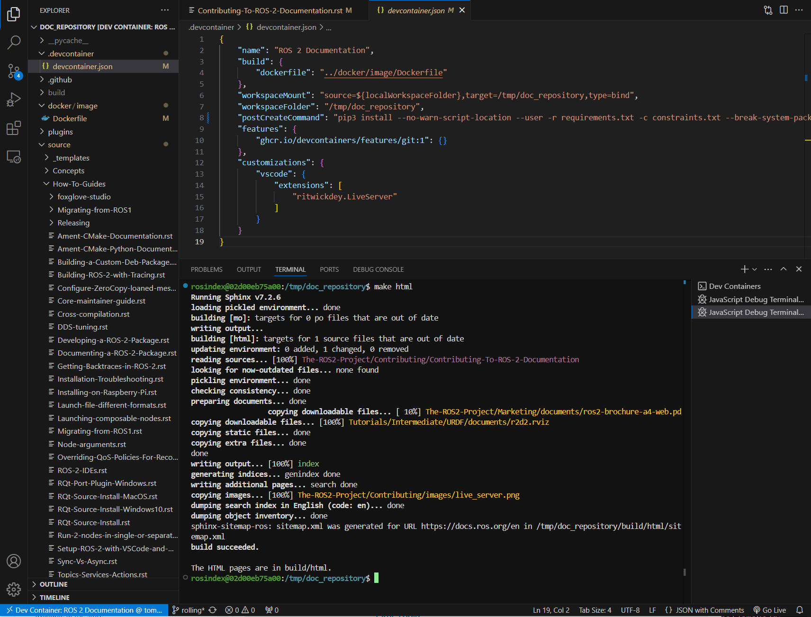

.. redirect-from::

    Contributing/Contributing-To-ROS-2-Documentation

为 ROS 2 文档做贡献
===================

.. contents:: 目录
   :depth: 2
   :local:

非常欢迎对本网站的贡献。
本页说明如何为 ROS 2 文档做贡献。
在贡献之前，请务必仔细阅读以下各节。

本站使用 `Sphinx <https://www.sphinx-doc.org/en/master/>`_ 构建，更具体地说，使用 `Sphinx multiversion <https://sphinx-contrib.github.io/multiversion/main/index.html>`_ 构建。

分支结构
--------

文档的源码位于 `ROS 2 文档 GitHub 仓库 <https://github.com/ros2/ros2_documentation>`__。
该仓库为每个 ROS 2 发行版设置一个分支，以处理发行版之间的差异。
如果某个更改对所有 ROS 2 发行版通用，则应将其提交到 ``rolling`` 分支（然后会按需回移）。
如果某个更改特定于某个 ROS 2 发行版，则应将其提交到相应的分支。

源码结构
--------

本站的源文件都位于 ``source`` 子目录下。
各种 sphinx 插件的模板位于 ``source/_templates`` 下。
根目录包含本地构建站点进行测试所需的配置和文件。

在本地构建站点
--------------

首先创建 `venv <https://docs.python.org/3/library/venv.html>`__ 来构建文档：

.. code-block:: console

   $ python3 -m venv ros2doc  # create venv
   $ source ros2doc/bin/activate  # activate venv

并安装位于 ``requirements.txt`` 文件中的依赖：

.. tabs::

  .. group-tab:: Linux

    .. code-block:: console

       $ pip install -r requirements.txt -c constraints.txt

  .. group-tab:: macOS

    .. code-block:: console

       $ pip install -r requirements.txt -c constraints.txt

  .. group-tab:: Windows

    .. code-block:: console

      $ python -m pip install -r requirements.txt -c constraints.txt

为了让 Sphinx 能够生成图表，``dot`` 命令必须可用。

.. tabs::

  .. group-tab:: Linux

    .. code-block:: console

       $ sudo apt update ; sudo apt install graphviz

  .. group-tab:: macOS

    .. code-block:: console

      $ brew install graphviz

  .. group-tab:: Windows

      从 `Graphviz 下载页面 <https://graphviz.gitlab.io/_pages/Download/Download_windows.html>`__ 下载安装程序并安装它。
      确保允许安装程序将其添加到 Windows 的 ``%PATH%`` 中，否则 Sphinx 将无法找到它。

为单个分支构建站点
^^^^^^^^^^^^^^^^^^

要仅为当前分支构建站点，在仓库顶层输入 ``make html``。
这是测试本地更改的推荐方式。

.. code-block:: console

   $ make html

构建过程可能需要一些时间。
要查看输出，请在浏览器中打开 ``build/html/index.html``。

实时重载本地开发
^^^^^^^^^^^^^^^^

在迭代文档时，与其在每次编辑后重新运行 ``make html`` 并刷新浏览器，不如使用 `sphinx-autobuild <https://github.com/sphinx-doc/sphinx-autobuild>`__ 来监视源文件、在保存时增量重建，并通过浏览器自动重载提供结果。

``sphinx-autobuild`` 已作为 ``requirements.txt`` 的一部分安装。
启动实时服务器：

.. code-block:: console

   $ make serve

然后在浏览器中打开 ``http://localhost:2022``。

``serve`` 目标默认绑定到 ``0.0.0.0:2022``，因此可以通过 devcontainer / 端口转发访问服务器。
如果需要，覆盖绑定地址或端口：

.. code-block:: console

   $ make serve LIVE_HOST=127.0.0.1 LIVE_PORT=8080


检查 / 测试站点
^^^^^^^^^^^^^^^

你可以使用以下命令在本地运行文档测试（使用 `doc8 <https://github.com/PyCQA/doc8>`_）：

.. code-block:: console

   $ make test

你可以使用以下命令在本地运行 Python 文档工具测试（使用 `pytest <https://docs.pytest.org/en/stable/>`_）：

.. code-block:: console

   $ make test-tools

你可以使用以下命令在本地运行 Python 文档工具测试（使用 `pytest <https://docs.pytest.org/en/stable/>`_）：

.. code-block:: console

   make test-tools

你可以使用以下命令在本地运行文档 linter（使用 `sphinx-lint <https://github.com/sphinx-contrib/sphinx-lint>`_）：

.. code-block:: console

   $ make lint

你可以使用以下命令在本地运行文档拼写检查器（使用 `codespell <https://github.com/codespell-project/codespell>`_）：

.. code-block:: console

   $ make spellcheck

.. note::

   如果它检测到需要忽略的特定单词，请将其添加到 `codespell_whitelist <https://github.com/ros2/ros2_documentation/blob/{REPOS_FILE_BRANCH}/codespell_whitelist.txt>`_ 中。

要了解有关拼写检查的更多信息，请参阅 :ref:`拼写检查 <spelling-check>`

通过 GitHub CI 查看站点
^^^^^^^^^^^^^^^^^^^^^^^

对于 ROS 2 文档的小更改，你可以使用我们在 GitHub Actions 中生成的工件，以渲染后的 HTML 查看你的更改。
"build" 操作会将整个 ROS 文档生成为可下载的 Zip 文件，其中包含 `docs.ros.org <https://docs.ros.org/>`_ 的全部 HTML。
此构建操作在测试操作和 lint 操作通过后触发。

要下载并查看你的更改，首先转到你的 pull request，在标题下方点击 "Checks" 标签页。
在检查页面的左侧，在 "tests" 部分下点击 "Test" 部分，然后点击 "build" 对话框。
这将在右侧打开一个菜单，你可以在其中点击 "Upload document artifacts"，然后滚动到底部，在 "Artifact download URL" 标题下查看 Zipped HTML 文件的下载链接。

.. image:: ./images/github_action.png
  :width: 100%
  :alt: Steps to find rendered HTML files on ROS Github action

为所有分支构建站点
^^^^^^^^^^^^^^^^^^

要为所有分支构建站点，在 ``rolling`` 分支输入 ``make multiversion``。
这有两个缺点：

#. multiversion 插件不支持增量构建，因此它总是重建所有内容。
   这可能会很慢。

#. 输入 ``make multiversion`` 时，它总是仅检出 ``conf.py`` 文件中列出的分支。
   这意味着本地更改不会被显示。

要在 multiversion 输出中显示本地更改，你必须先将更改提交到本地分支。
然后你必须编辑 `conf.py <https://github.com/ros2/ros2_documentation/blob/rolling/conf.py>`_ 文件，并将 ``smv_branch_whitelist`` 变量更改为指向你的分支。

检查损坏链接
^^^^^^^^^^^^

要检查站点上的损坏链接，运行：

.. code-block:: console

   $ make linkcheck

这将检查整个站点的损坏链接，并将结果输出到屏幕和 ``build/linkcheck``。

.. _spelling-check:

拼写检查
^^^^^^^^

``make spellcheck`` 命令扫描文档文件并标记任何拼写错误。
如果检测到错误，请查看建议并按要求更新 pull request。

有些词（如技术术语或专有名词）可能被误标记为拼写错误。
如果你遇到这种情况，可以将它们添加到忽略列表中，以防止将来被标记。
为此，将其添加到 `codespell_whitelist <https://github.com/ros2/ros2_documentation/blob/{REPOS_FILE_BRANCH}/codespell_whitelist.txt>`_ 文件中，如下所示：

.. code-block:: text

   empy
   jupyter
   lets
   ws

要包含 ``codespell`` 应应用的自定义更正，你可以将它们添加到 `codespell_dictionary <https://github.com/ros2/ros2_documentation/blob/{REPOS_FILE_BRANCH}/codespell_dictionary.txt>`_ 文件中，如下所示：

.. code-block:: text

   amnet->ament
   colcn->colcon
   rosabg->rosbag
   rosdistroy->rosdistro

要检查字典，你可以运行 ``make check-dictionaries`` 命令。
这将检查字典中的空行和前导/尾随空格。
如果它抱怨字典有问题，你可以运行 ``make sort-dictionaries`` 命令。
如果发现任何问题，此命令将自动修改字典。

从 ROS Wiki 迁移页面
--------------------

将页面从 `ROS Wiki <https://wiki.ros.org>`_ 迁移到 ROS 2 文档的第一步是确定该页面是否需要迁移。
通过搜索相关术语，检查内容或类似内容是否已在 https://docs.ros.org/en/rolling 上可用。
如果它已经迁移，恭喜你！
你就完成了。
如果尚未迁移，那么请考虑它是否值得保留。
你或他人觉得有用并经常查阅的页面，是很好的候选，前提是它们没有被其他文档取代。
不再受当前发行版支持的 ROS 项目和功能的页面不应迁移。

迁移 ROS Wiki 页面的下一步是确定迁移后页面的正确位置。
只有涵盖核心 ROS 概念的 ROS Wiki 页面才属于 ROS 文档，这些页面应迁移到 ROS 文档中合乎逻辑的位置。
软件包特定文档应迁移到软件包源码仓库中生成的软件包级文档。
一旦软件包级文档更新，它将 `作为软件包级文档的一部分 <https://docs.ros.org/en/{DISTRO}/p/>`__ 可见。
如果你不确定是否迁移页面以及迁移到哪里，请在 https://github.com/ros2/ros2_documentation 或 https://discourse.openrobotics.org/ 上通过 issue 联系我们。

一旦你确定某个 ROS Wiki 页面值得迁移，并在 ROS 文档中找到了合适的落点，迁移过程的下一步就是设置迁移页面所需的转换工具。
在大多数情况下，将单个 ROS Wiki 页面迁移到 ROS 文档所需的唯一工具是 `PanDoc <https://pandoc.org/>`_ 命令行工具和一个文本编辑器。
PanDoc 在大多数现代操作系统上都受支持，使用其网站上的安装说明即可。
值得注意的是，ROS Wiki 使用较旧的 wiki 技术（MoinMoin），因此使用的标记语言是 `MediaWiki <https://www.mediawiki.org/wiki/Help:Formatting>`__ 格式的一种冷僻方言。
我们发现，将页面从 ROS Wiki 迁移的最简单方法是使用 PanDoc 将其从 HTML 转换为 reStructured 文本。


迁移 Wiki 文件
^^^^^^^^^^^^^^

#. 克隆相应的仓库。
   如果你要将页面迁移到此处托管的官方文档，那么你应该克隆 https://github.com/ros2/ros2_documentation。

#. 为你的迁移页面创建一个新的 Github 分支。
   我们建议使用类似 ``pagename-migration`` 的名称。

#. 使用 wget 或类似工具将相应的 ROS Wiki 页面下载为 html 文件（例如 ``wget -O urdf.html https://wiki.ros.org/urdf``）。
   或者，你也可以使用网络浏览器保存页面的 HTML。

#. 接下来，你需要删除下载文件中多余的 HTML。
   使用浏览器的开发者模式，找到 Wiki 页面中第一个有用的 HTML 元素的名称。
   在大多数情况下，从文件的第三行（以 ``<head>`` 标签开头）到第一个 ``<h1>`` 标签开头的所有 HTML 都可以安全删除。
   在有目录的情况下，第一个有用的标签可能是 ``<h2>`` 标签。
   类似地，ROS wiki 包含一些页脚文本，以 ``<div id="pagebottom"></div>`` 开头，到 ``</body></html>`` 上方结束，也可以删除。

#. 通过在 HTML 和 restructured 文本之间运行 PanDoc 转换来转换你的 html 文件。
   以下命令将 HTML 文件转换为等效的 reStructured 文本文件：``pandoc -f html -t rst urdf.html > URDF.rst``。

#. 尝试使用 ``make html`` 命令构建你的新文档。
   可能会有你需要处理的错误和警告。

#. **仔细地** 通读整个页面，确保材料对 ROS 2 是最新的。
   检查每一个链接，确保它指向 docs.ros.org 上适当的位置。
   内部文档引用必须更新为指向等效的 ROS 2 材料。
   除非绝对必要，否则你更新后的文档不应指向 ROS Wiki。
   这个过程可能需要你大幅修改文档，并且你可能需要拉取多个 wiki 文件。
   你应验证文档中的每个代码示例在 ROS 2 下都能正常工作。

#. 查找并下载旧文档中可能存在的任何图像。
   最简单的方法是在浏览器中右键点击并下载所有图像。
   或者，你可以通过在 HTML 文件中搜索 ```` 标签来查找图像。

#. 对于下载的每个图像文件，更新图像文件链接以指向 ROS 文档的正确图像目录。
   如果任何图像需要更新，或者可以用 `Mermaid <https://mermaid.js.org/intro/>`__ 图表替换，请进行此更改。
   请注意，Mermaid.js 目前仅在核心 ROS 2 文档中受支持。

#. 一旦你的文档完成，使用适当的 Sphinx 命令在新的 rst 文档顶部添加目录。
   此块应替换旧 ROS Wiki 中任何现有的目录。

#. 提交你的 pull request。
   务必指向原始 ROS Wiki 文件以供参考。

#. 一旦你的 pull request 被接受，请在原始 ROS Wiki 文章的页面顶部添加一条说明，指向新的文档页面。

有关此过程实际应用的示例，请参阅 `ROS 2 文档 <https://github.com/ros-perception/image_pipeline/blob/rolling/image_pipeline/doc/tutorials.rst>`__ 和原始 `ROS Wiki <https://wiki.ros.org/image_pipeline>`__ 中的 ROS 2 图像处理流水线。
完成的文档页面可以在 `image_pipeline 的 ROS 2 软件包文档 <https://docs.ros.org/en/rolling/p/image_pipeline/>`__ 中找到。

使用 GitHub Codespaces 构建站点
-------------------------------
首先，你需要有一个 GitHub 账户（如果没有，可以免费创建一个）。
然后，你需要转到 `ROS 2 文档 GitHub 仓库 <https://github.com/ros2/ros2_documentation>`__。
之后，你可以在 Codespaces 中打开该仓库，只需点击仓库页面上的 "Code" 按钮，然后从下拉菜单中选择 "Open with Codespaces"。

.. image:: images/codespaces.png
   :width: 100%
   :alt: Codespaces creation

之后，你将被重定向到你的 Codespaces 页面，在那里你可以看到 Codespaces 创建的进度。
完成后，浏览器中将打开一个 Visual Studio Code 标签页。
你可以通过点击顶部面板的 "Terminal" 标签页或按 :kbd:`Ctrl-J` 来打开终端。

在此终端中，你可以运行任何你想要的命令，例如，你可以运行以下命令仅为当前分支构建站点：

.. code-block:: console

   $ make html

最后，要查看站点，你可以点击右下方面板的 "Go Live" 按钮，然后它会在浏览器的新标签页中打开站点（你需要浏览到 ``build/html`` 文件夹）。

.. image:: images/live_server.png
   :width: 100%
   :alt: Live Server

使用 Devcontainer 构建站点
--------------------------

`ROS 2 文档 GitHub 仓库 <https://github.com/ros2/ros2_documentation>`__ 还支持使用 Visual Studio Code 的 ``Devcontainer`` 开发环境。
这将使你无需更改操作系统即可更轻松地构建文档。

在以下步骤之前，请参阅 :doc:`../../How-To-Guides/Setup-ROS-2-with-VSCode-and-Docker-Container` 来安装 VS Code 和 Docker。

克隆仓库并启动 VS Code：

.. code-block:: console

   $ git clone https://github.com/ros2/ros2_documentation
   $ cd ./ros2_documentation
   $ code .

要使用 ``Devcontainer``，你需要在 VS Code 的扩展（CTRL+SHIFT+X）中搜索并安装 "Remote Development" 扩展。

然后，使用 ``View->Command Palette...`` 或 ``Ctrl+Shift+P`` 打开命令面板。
搜索命令 ``Dev Containers: Reopen in Container`` 并执行它。
这将自动为你构建开发 docker 容器。

要构建文档，在 VS Code 中使用 ``View->Terminal`` 或 ``Ctrl+Shift+``` 和 ``New Terminal`` 打开终端。
在终端中，你可以构建文档：

.. code-block:: console

   $ make html



编写页面
--------

ROS 2 文档网站使用 ``reStructuredText`` 格式，这是 Sphinx 使用的默认纯文本标记语言。
本节是对 ``reStructuredText`` 概念、语法和最佳实践的简要介绍。
在格式化你的 ``reStructuredText`` 文件时，**请务必每行只写一个句子，因为这样可以更轻松地审查和修改你的文件。**
另外，请注意文件中空白的使用！
ROS 2 文档 linter 不会接受带有尾随空白的 pull request。
如果你的编辑器支持，我们建议你启用自动空白高亮和/或清理。

你可以参考 `reStructuredText 用户文档 <https://docutils.sourceforge.io/rst.html>`_ 获取详细的技术规范。

目录
^^^^

用于生成目录的指令有两种类型：``.. toctree::`` 和 ``.. contents::``。
``.. toctree::`` 用于 ``Tutorials.rst`` 等顶层页面，以设置其子页面的顺序和可见性。
该指令会创建左侧导航面板以及指向所列子页面的页面内导航链接。
它帮助读者理解不同文档部分的结构并在页面之间导航。

.. code-block:: rst

   .. toctree::
      :maxdepth: 1

``.. contents::`` 指令用于为该特定页面生成目录。
它解析页面中所有现有的标题，并构建一个页面内嵌套的目录。
它帮助读者了解内容的概述并在页面内导航。

``.. contents::`` 指令支持定义嵌套节的最大深度。
使用 ``:depth: 2`` 将只在目录中显示节和小节。

.. code-block:: rst

   .. contents:: 目录
      :depth: 2
      :local:

标题
^^^^

文档中使用四种主要的标题类型。
注意，符号的数量必须与标题的长度匹配。

.. code-block:: rst

   Page Title Header
   =================

   Section Header
   --------------

   2 Subsection Header
   ^^^^^^^^^^^^^^^^^^^

   2.4 Subsubsection Header
   ~~~~~~~~~~~~~~~~~~~~~~~~

在教程和操作指南中，我们通常使用一位数字为小节编号，使用两位数字（点分隔）为子小节编号。

列表
^^^^

星号 ``*`` 用于列出带项目符号的无序项，井号 ``#.`` 用于列出编号项。
两者都支持嵌套定义，并会相应地渲染。

.. code-block:: rst

   * bullet point

     * bullet point nested
     * bullet point nested

   * bullet point

.. code-block:: rst

  #. first listed item
  #. second lited item

代码格式化
^^^^^^^^^^

行内代码可以使用 ``backticks`` 格式化，以显示 ``highlighted`` 代码。

.. code-block:: rst

   In-text code can be formatted using ``backticks`` for showing ``highlighted`` code.

页面内的代码块需要使用 ``.. code-block::`` `指令 <https://www.sphinx-doc.org/en/master/usage/restructuredtext/directives.html#directive-code-block>`_ 来包裹。
``.. code-block::`` 支持 ``C++``、``YAML``、``console``、``bash`` 等语法的代码高亮。
指令内的代码需要缩进。

.. code-block:: rst

   .. code-block:: C++

      int main(int argc, char** argv)
      {
         rclcpp::init(argc, argv);
         rclcpp::spin(std::make_shared<ParametersClass>());
         rclcpp::shutdown();
         return 0;
      }

代码块：``bash`` 与 ``console``
~~~~~~~~~~~~~~~~~~~~~~~~~~~~~~~

``bash`` 和 ``console`` 相似，但用途不同。
选择正确的一个很重要，以确保内容正确格式化，并且复制按钮复制正确的内容。
下面是每种代码块的说明；请跳到本节末尾查看用例列表和相应的示例。

``bash`` 用于脚本，例如脚本文件中的 bash 命令。
示例结果：

.. code-block:: bash

   export ROS_DOMAIN_ID=42
   ros2 run turtlesim turtlesim_node

``console`` 用于在终端中运行的命令，可选择包含其输出。
这清楚地表明给定的命令需要在终端中运行。
它还允许使用 ``$`` 或 ``#`` 等提示符号将命令行与输出行分开。
命令行格式化为 bash 命令，而输出行格式化为普通文本。
提示符号不可选中，点击右上角的复制按钮*只*复制命令，不复制输出和提示符号。
这意味着，如果 ``console`` 代码块在没有任何 ``$`` 的情况下使用，复制按钮不会复制任何行。
示例结果：

.. code-block:: console

   $ export ROS_DOMAIN_ID=42
   $ ros2 run turtlesim turtlesim_node --ros-args --remap "__node:=my_turtle"
   [INFO] [1742150439.022947971] [my_turtle]: Starting turtlesim with node name /my_turtle
   [INFO] [1742150439.026043867] [my_turtle]: Spawning turtle [turtle1] at x=[5.544445], y=[5.544445], theta=[0.000000]

将上述内容与 ``bash`` ``code-block`` 比较：

.. code-block:: bash

   $ export ROS_DOMAIN_ID=42
   $ ros2 run turtlesim turtlesim_node --ros-args --remap "__node:=my_turtle"
   [INFO] [1742150439.022947971] [my_turtle]: Starting turtlesim with node name /my_turtle
   [INFO] [1742150439.026043867] [my_turtle]: Spawning turtle [turtle1] at x=[5.544445], y=[5.544445], theta=[0.000000]

为简化代码块，如果代码块不包含任何输出行，对于要在终端中运行的命令，``bash`` 仍然可以在没有 ``$`` 的情况下使用。
为帮助在 ``bash`` 和 ``console`` 之间做出选择，请参阅以下用例列表和相应的示例：

#. 要复制到脚本文件中的命令

   * 使用不带 ``$`` 的 ``.. code-block:: bash``：

      .. code-block:: bash

         export ROS_DOMAIN_ID=42
         ros2 run turtlesim turtlesim_node

#. 要在终端中运行的命令：

   * 强烈建议在所有命令行上使用带 ``$`` 的 ``.. code-block:: console``，以保持一致性和清晰性。
     如果需要显示输出，请将其包含在同一代码块中：

      .. code-block:: console

         $ source /opt/ros/{DISTRO}/setup.bash
         $ ros2 run turtlesim turtlesim_node
         [INFO] [1743878028.269334696] [turtlesim]: Starting turtlesim with node name /turtlesim
         [INFO] [1743878028.275096618] [turtlesim]: Spawning turtle [turtle1] at x=[5.544445], y=[5.544445], theta=[0.000000]

      .. note::

         如果某些输出行以 ``#`` 开头，则必须将命令与其输出分开，因为 ``#`` 符号用于表示命令。
         因此，请将输出放在单独的 ``.. code-block:: text`` 中。

图像
^^^^

可以使用 ``.. image::`` 指令插入图像。

.. code-block:: rst

   .. image:: images/turtlesim_follow1.png

在这种情况下，图像文件（``turtlesim_follow1.png``）位于使用该图像的 ``.rst`` 文件相对的 ``images/`` 目录中。

然而，所有图像文件最终都位于文档根目录相对的 ``_images/`` 目录中。
因此，当使用 ``:target:`` 为图像文件添加超链接时，请使用向上到根目录、再向下到 ``_images/`` 目录的相对链接。

.. code-block:: rst

   .. image:: images/turtlesim_follow1.png
      :target: ../../_images/turtlesim_follow1.png

图表、图形和图解
^^^^^^^^^^^^^^^^

ROS 2 文档现在支持使用 `Mermaid 图表 <https://mermaid.js.org/intro/>`__ 编写的图表、图形和图解。
我们更倾向于使用 Mermaid 而不是静态图像文件来绘制图表、图形和图解，因为它允许我们在项目演进时以编程方式更新和编辑这些资源。
`Mermaid 图语言语法的完整文档可以在其网站上找到。 <https://mermaid.js.org/intro/syntax-reference.html>`__

引用和链接
^^^^^^^^^^

外部链接
~~~~~~~~

创建指向外部网页链接的语法如下所示。

.. code-block:: rst

   `ROS Docs <https://docs.ros.org>`_

上述链接将显示为 `ROS Docs <https://docs.ros.org>`_。
注意最后一个单引号后面的下划线。

内部链接
~~~~~~~~

``:doc:`` 指令用于创建指向其他页面的行内链接。

.. code-block:: rst

   :doc:`Quality of Service <../Tutorials/Quality-of-Service>`

注意这里使用的是文件的相对路径。

``ref`` 指令用于创建指向页面特定部分的链接。
这些可以是当前页面或不同页面内的标题、图像或代码部分。

需要在所需对象正前方定义显式目标。
在下面的示例中，目标定义为 ``_talker-listener``，位于标题 ``Try some examples`` 前一行。

.. code-block:: rst

   .. _talker-listener:

   Try some examples
   -----------------

现在可以创建从文档中任何页面指向该标题的链接。

.. code-block:: rst

   :ref:`talker-listener demo <talker-listener>`

此链接将把读者导航到带有 HTML 锚点链接 ``#talker-listener`` 的目标页面。

宏
~~

宏可用于简化面向多个发行版的文档编写。

通过在花括号中包含宏名称来使用宏。
例如，在 ``rolling`` 分支上为 Rolling 生成文档时：

.. list-table::
   :header-rows: 1

   * - Macro
     - Example
     - Becomes (for {DISTRO_TITLE})
   * - \{DISTRO\}
     - ros-\{DISTRO\}-pkg
     - ros-{DISTRO}-pkg
   * - \{DISTRO_TITLE\}
     - ROS 2 \{DISTRO_TITLE\}
     - ROS 2 {DISTRO_TITLE}
   * - \{DISTRO_TITLE_FULL\}
     - ROS 2 \{DISTRO_TITLE_FULL\}
     - ROS 2 {DISTRO_TITLE_FULL}
   * - \{REPOS_FILE_BRANCH\}
     - git checkout \{REPOS_FILE_BRANCH\}
     - git checkout {REPOS_FILE_BRANCH}
   * - \{interface_link(std_msgs/msg/String)\}
     - See: \{interface_link(std_msgs/msg/String)\}.
     - See: {interface_link(std_msgs/msg/String)}.
   * - \{interface(std_msgs/msg/String)\}
     - Publish a \{interface(std_msgs/msg/String)\}.
     - Publish a {interface(std_msgs/msg/String)}.
   * - \{package_link(rclcpp)\}
     - See: \{package_link(rclcpp)\}.
     - See: {package_link(rclcpp)}.
   * - \{package(rclcpp)\}
     - Use \{package(rclcpp)\}.
     - Use {package(rclcpp)}.

同一文件可以在多个分支（即多个发行版）上使用，生成的内容将特定于发行版。
