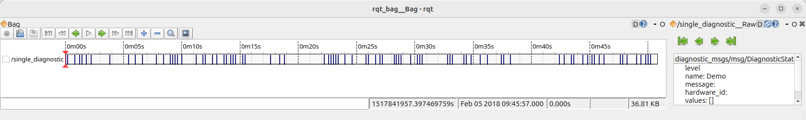
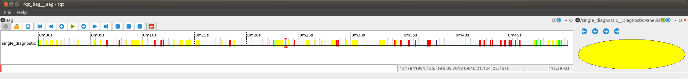
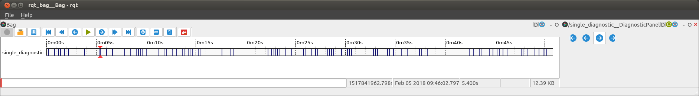
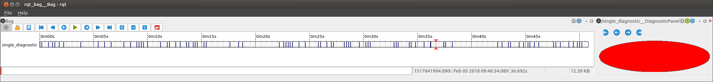

创建一个 rqt_bag 插件
=====================

假设你有一些 bag 文件，并且你想能够为某些数据创建自定义可视化。
``rqt_bag`` 让你能够滚动查看记录的消息，并可视化原始消息值。

.. code:: console

    $ ros2 run rqt_bag rqt_bag ~/path/to/BagFile
    $ rqt_bag ~/path/to/BagFile                     # alternative

它提供了一个标准统一的可视化界面：

然而，有时你可能想要更直观的呈现方式，或者需要对原始消息做一些后处理。
为此，你可以使用 Python 插件系统编写一个 ``rqt_bag`` 插件。
这让你能够获得像这样的消息自定义可视化：

一些测试数据
------------

在本教程中，我们将使用 {interface(diagnostic_msgs/msg/DiagnosticStatus)} 消息的 ``level`` 字段。
下面是一个用于生成随机级别诊断状态的简单脚本。
你可以用这个脚本录制你自己的 bag，或者解压后使用 `这个示例数据 <https://github.com/MetroRobots/rqt_bag_diagnostics_demo/raw/refs/heads/main/SomeDiagnostics.zip>`__。

.. code:: python

    from diagnostic_msgs.msg import DiagnosticStatus
    import random
    import rclpy
    from rclpy.node import Node

    MODES = ['OK', 'WARN', 'ERROR']

    class DiagnosticPub(Node):
        def __init__(self):
            super().__init__('diagnostic_pub')
            self.last_status = None
            self.publisher = self.create_publisher(DiagnosticStatus, '/diagnostics', 10)
            self.timer = self.create_timer(1, self.callback)

        def callback(self):
            if self.last_status is None:
                # Random initial status
                status = random.randint(0, len(MODES))
            elif random.randint(0, 5) != 0:
                # Do not publish a msg every cycle
                return
            else:
                # Random new (different) status
                delta = random.randint(1, 2)
                status = (self.last_status + delta) % len(MODES)

            self.get_logger().info(f'Publishing {MODES[status]} status')
            self.publisher.publish(DiagnosticStatus(level=bytes(status)))
            self.last_status = status

    def main(args=None):
        rclpy.init(args=args)
        node = DiagnosticPub()
        rclpy.spin(node)

    if __name__ == '__main__':
        main()

包设置
------

我们将创建一个名为 ``rqt_bag_diagnostics_demo`` 的包。
首先创建一个基本的 ``ament_python`` 包，例如通过调用：

.. code:: console

       $ ros2 pkg create --build-type ament_python --dependencies diagnostic_msgs python_qt_binding rqt_bag \
         --description "rqt_bag plugin for diagnostics_msgs" --license Apache-2.0 \
         --maintainer-name "My Name" --maintainer-email "my@name.robots" \
         rqt_bag_diagnostics_demo

编辑生成的 ``package.xml`` 的相关部分，使其看起来像这样：

.. code:: xml

       <exec_depend>diagnostic_msgs</exec_depend>
       <exec_depend>python_qt_binding</exec_depend>
       <exec_depend>rqt_bag</exec_depend>
       <export>
         <build_type>ament_python</build_type>
         <rqt_bag plugin="${prefix}/plugins.xml"/>
       </export>

我们在这里做的是让我们的包依赖 rqt_bag、python_qt_binding 和 diagnostic_msgs 包，然后导出一个定义我们 rqt_bag 插件的 XML 文件。
在 ``setup.py`` 中，向 ``data_files`` 添加下面这一行：

.. code:: python

           ('share/' + package_name, ['plugins.xml']),

接下来，我们将在名为 ``plugins.xml`` 的 XML 文件（正如 ``package.xml`` 中引用的那样）中定义插件。
这个文件描述了该包提供的所有插件（每个包可以有多个插件）。

.. code:: xml

   <library path=".">
     <class name="DiagnosticBagPlugin"
            type="rqt_bag_diagnostics_demo.the_plugin.DiagnosticBagPlugin"
            base_class_type="rqt_bag::Plugin">
       <description>Awesome Diagnostic</description>
     </class>
   </library>

``name`` 属性是我们创建的插件的名称。
它必须在所有插件中唯一，但除此之外你不会以任何其他方式使用它。
``type`` 属性是我们在 Python 中导入插件类的方式，即 ``package_name.module_name.class_name``

定义插件
--------

现在我们需要实际实现 ``the_plugin.py`` Python 模块（正如 ``plugins.xml`` 中引用的那样）。
首先，确保在 ``rqt_bag_diagnostics_demo`` 子文件夹中有一个空文件 ``__init__.py``，将它变成一个 Python 包。

.. note::

   请注意，根据当前 ROS 中的 Python 标准，包含 ROS 包的文件夹（``rqt_bag_diagnostics_demo``）内包含一个同名子文件夹。
   因此，完整路径将是 ``WORKSPACE/src/rqt_bag_diagnostics_demo/rqt_bag_diagnostics_demo/__init__.py``。

现在在 ``__init__.py`` 旁边创建 ``the_plugin.py``。
这个文件将包含插件的全部代码。

首先是核心的 Plugin 类。

.. code:: python

   from rqt_bag.plugins.plugin import Plugin
   from python_qt_binding.QtCore import Qt
   from diagnostic_msgs.msg import DiagnosticStatus

   def get_color(diagnostic):
       if diagnostic.level == DiagnosticStatus.OK:
           return Qt.green
       elif diagnostic.level == DiagnosticStatus.WARN:
           return Qt.yellow
       else:  # ERROR or STALE
           return Qt.red

   class DiagnosticBagPlugin(Plugin):
       def __init__(self):
           pass

       def get_view_class(self):
           # This method is required; we will implement it later
           return None

       def get_renderer_class(self):
           return None

       def get_message_types(self):
           return ['diagnostic_msgs/msg/DiagnosticStatus']

这里我们有一些基本导入、一个稍后会用到辅助函数，以及一个定义了 ``rqt_bag`` 插件三个组成部分的类。

  1. ``view_class`` - 又名 ``TopicMessageView`` - 一个可用于查看单条消息的独立面板。
  2. ``renderer_class`` - 又名 ``TimelineView`` - 一个用于在 bag 数据的时间线视图上绘制的工具。
  3. ``message_types`` - 一个字符串数组，定义这个插件可用于哪些消息类型。
     你可以返回 ``['*']`` 使其适用于所有消息。

由于我们对前两个方法返回 None，这个插件暂时不会做任何事情。
我们将分别处理这几个部分。

TopicMessageView
----------------

版本 1
~~~~~~

我们将创建一个扩展 ``TopicMessageView`` 类的类（仍然在 ``the_plugin.py`` 中）。
首先，添加导入：

.. code:: python

   from rqt_bag import TopicMessageView

然后定义这个新类：

.. code:: python

   class DiagnosticPanel(TopicMessageView):
       name = 'Awesome Diagnostic'

       def message_viewed(self, bag, entry, ros_message, msg_type_name, topic):
           super(DiagnosticPanel, self).message_viewed(bag=bag, entry=entry, ros_message=ros_message, msg_type_name=msg_type_name, topic=topic)
           print(f'{topic}: {ros_message}')

这里我们定义了两件事。
``name`` 类变量定义了 rqt_bag 在时间线中右键点击 ``DiagnosticStatus`` 主题时显示的内容。
``message_viewed`` 方法定义了当消息被选中时要做什么。
所以这里，我们暂时只是把消息打印到终端。

我们需要把我们创建的这个类接入插件基础设施，为此，我们在 ``get_view_class`` 方法中返回这个类对象本身。

.. code:: python

       def get_view_class(self):
           return DiagnosticPanel

.. note::

   不要输入 ``return DiagnosticPanel()``\ （带 ``()``）。
   只要 ``return DiagnosticPanel`` 才是正确的。

要看到它的效果，用你的 bag 文件运行 ``rqt_bag``，然后在 diagnostic 轨道上右键点击。
它会在 “View” 下给你两个选项：Raw 和我们的 “Awesome Diagnostic”。
点击它应该会打开一个面板，你可以滚动浏览消息并看着它们打印出来。

版本 2
~~~~~~

``TopicMessageView`` 本身是 ``QObject`` 的扩展。
你可以利用 Qt 的全部威力做很多事情。
遗憾的是，这不是一篇 Python Qt 教程，`不过网上有很多可用的教程 <https://doc.qt.io/qtforpython-6/examples/example_widgets_painting_basicdrawing.html>`_。
所以我们只是添加一个简单的 QWidget 并在其上绘制。
首先，添加以下导入：

.. code:: python

   from python_qt_binding.QtWidgets import QWidget
   from python_qt_binding.QtGui import QBrush, QPainter

然后将 ``DiagnosticPanel`` 类更新为以下内容：

.. code:: python

   class DiagnosticPanel(TopicMessageView):
       name = 'Awesome Diagnostic'

       def __init__(self, timeline, parent, topic):
           super(DiagnosticPanel, self).__init__(timeline, parent, topic)
           self.widget = QWidget()
           parent.layout().addWidget(self.widget)
           self.msg = None
           self.widget.paintEvent = self.paintEvent

       def message_viewed(self, bag, entry, ros_message, msg_type_name, topic):
           super(DiagnosticPanel, self).message_viewed(bag=bag, entry=entry,
                                                       ros_message=ros_message, msg_type_name=msg_type_name, topic=topic)
           self.msg = ros_message
           self.widget.update()

       def paintEvent(self, event):
           qp = QPainter()
           qp.begin(self.widget)

           rect = event.rect()

           if self.msg is None:
               qp.fillRect(0, 0, rect.width(), rect.height(), Qt.white)
           else:
               color = get_color(self.msg)
               qp.setBrush(QBrush(color))
               qp.drawEllipse(0, 0, rect.width(), rect.height())
           qp.end()

在构造函数中，我们创建一个 ``QWidget`` 并覆盖它的 ``paintEvent`` 方法。
现在当我们通过 ``message_viewed`` 收到一条消息时，我们保存它，并更新 widget，这会反过来调用我们的 ``paintEvent``。
不要手动调用 ``paintEvent``，这必须由 Qt 来完成。
在消息被选中之前，我们只绘制一个白色矩形。
否则，我们将使用我们好用的辅助方法，根据诊断的级别来关联颜色，绘制一个圆形。

TimelineRenderer
----------------

.. _version-1-1:

版本 1
~~~~~~

要在时间线上绘制，我们扩展 ``TimelineRenderer`` 类（仍然在 ``the_plugin.py`` 中）。
添加一个导入：

.. code:: python

   from rqt_bag import TimelineRenderer

然后添加新类。

.. code:: python

   class DiagnosticTimeline(TimelineRenderer):
       def __init__(self, timeline, height=80):
           TimelineRenderer.__init__(self, timeline, msg_combine_px=height)

       def draw_timeline_segment(self, painter: QPainter, topic, start: float, end: float, x: float, y: int, width: float, height: int):
           painter.setBrush(QBrush(Qt.blue))
           painter.drawRect(int(x), y, int(width), height)

你可以用 ``msg_combine_px`` 参数自定义消息在时间线中占据的高度。
需要覆盖的关键方法是 ``draw_timeline_segment()``，它给你时间线的各个片段来绘制。
现在我们只在每个片段上绘制蓝色矩形。

就像消息视图一样，你还需要编辑插件以返回你的类。

.. code:: python

       def get_renderer_class(self):
           return DiagnosticTimeline

要查看它，你必须在 rqt_bag 图形界面中启用 “Thumbnails”（一个容易误导的名字）。

.. image:: images/rqtbag_plugin_blue.png
   :alt: 在时间线上绘制了蓝色条的 rqt_bag 截图

.. _version-2-1:

版本 2
~~~~~~

好的，现在我们真的想根据消息本身来定制消息在时间线上的绘制方式。
为此，你需要从 bag 文件中读取并反序列化消息。
以下是新的导入：

.. code:: python

   from python_qt_binding.QtGui import QPen
   from rclpy.time import Time
   from rclpy.serialization import deserialize_message
   from rqt_bag.bag_helper import to_sec

然后更新 ``draw_timeline_segment()``：

.. code:: python

       def draw_timeline_segment(self, painter: QPainter, topic, start: float, end: float, x: float, y: int, width: float, height: int):
           bag_timeline = self.timeline.scene()
           start_t = Time(seconds=start)
           end_t = Time(seconds=end)

           for bag, entry in bag_timeline.get_entries_with_bags([topic], start_t, end_t):
               topic, raw_data, t = bag_timeline.read_message(bag, entry.timestamp, topic)
               msg = deserialize_message(raw_data, DiagnosticStatus)
               color = get_color(msg)
               painter.setBrush(QBrush(color))
               painter.setPen(QPen(color, 5))

               t_float = to_sec(Time(nanoseconds=t))
               p_x = int(self.timeline.map_stamp_to_x(t_float))
               painter.drawLine(p_x, y, p_x, y + height - 1)

使用方法的 ``topic``、``start`` 和 ``end`` 参数，我们可以获取与时间线这一片段对应的 bag 条目。
然后我们可以获取实际消息并用它来绘制。
这里我们根据诊断消息的级别绘制一条线。
我们可以使用 ``map_stamp_to_x()`` 方法自动算出消息的水平绘制位置，该方法将浮点秒转换为 widget 像素。

.. image:: images/rqtbag_plugin_timeline.png
   :alt: 时间线上绘制了不同颜色条的 rqt_bag 截图

如果在时间线上计算消息表示的计算开销更大，你应该像 `ImageTimelineViewer <https://github.com/ros-visualization/rqt_bag/blob/rolling/rqt_bag_plugins/src/rqt_bag_plugins/image_timeline_renderer.py>`__ 那样使用 `Timeline Cache <https://github.com/ros-visualization/rqt_bag/blob/rolling/rqt_bag/src/rqt_bag/timeline_cache.py>`__，但弄明白这一点就作为读者的练习了。
