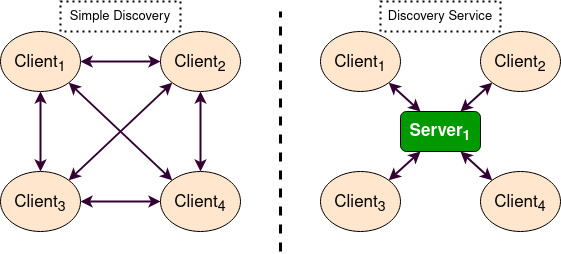
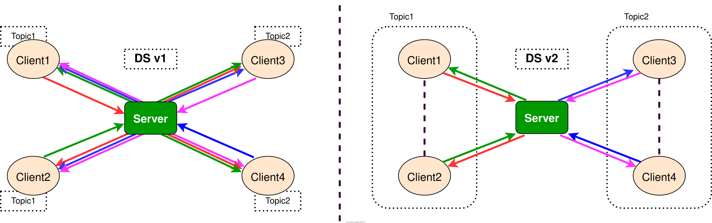
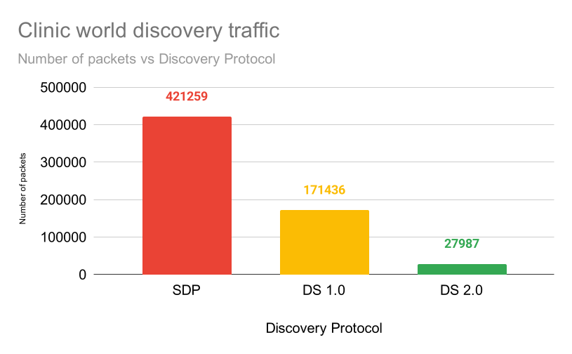
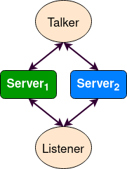
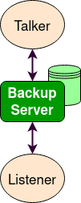
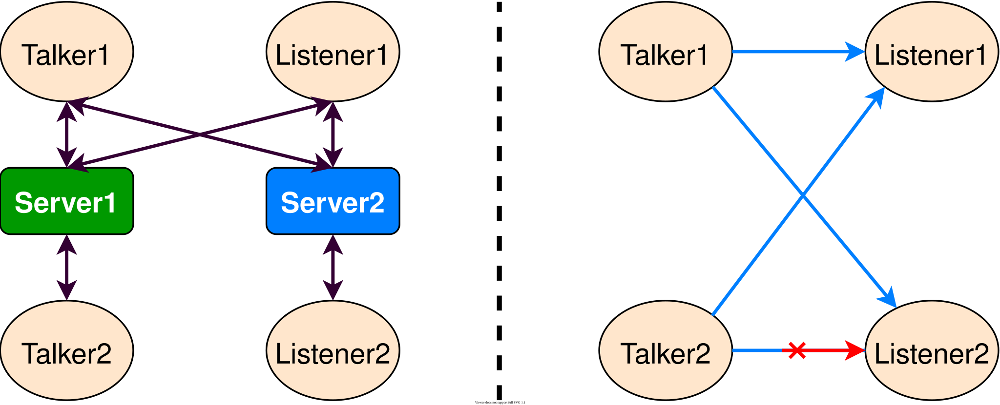
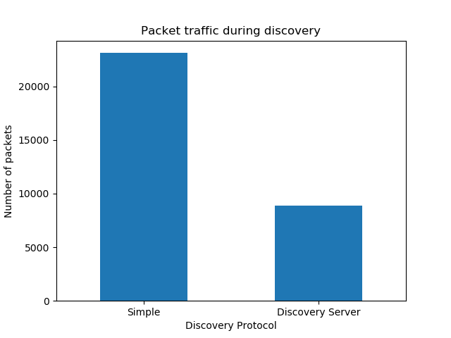

.. redirect-from::

    Discovery-Server
    Tutorials/Discovery-Server/Discovery-Server

使用 Fast DDS Discovery Server 作为发现协议 [社区贡献]
======================================================

**目标：** 本教程将展示如何使用 **Fast DDS Discovery Server** 发现协议启动 ROS 2 节点。

**教程级别：** 高级

**耗时：** 20 分钟

.. contents:: 目录
   :depth: 2
   :local:

背景
----

从 ROS 2 Eloquent Elusor 开始，**Fast DDS Discovery Server** 协议是一个提供集中式动态发现机制的特性，与 DDS 默认使用的分布式机制相对。
本教程解释如何使用 Fast DDS Discovery Server 特性作为发现通信来运行一些 ROS 2 示例。

如需获取有关可用发现配置的更多信息，请查阅 `以下文档 <https://fast-dds.docs.eprosima.com/en/v2.1.0/fastdds/discovery/discovery.html>`_ 或阅读 `Fast DDS Discovery Server 专项文档 <https://fast-dds.docs.eprosima.com/en/v2.1.0/fastdds/discovery/discovery_server.html#discovery-server>`__。

`Simple Discovery Protocol <https://fast-dds.docs.eprosima.com/en/v2.1.0/fastdds/discovery/simple.html>`__ 是 `DDS 标准 <https://www.omg.org/omg-dds-portal/>`__ 中定义的标准协议。
然而，它在某些场景下存在已知的缺点。

* 它不能高效地**扩展**，因为随着新节点的加入，交换的数据包数量会显著增加。
* 它需要**组播**能力，而这在某些场景（例如 WiFi）下可能无法可靠工作。

**Fast DDS Discovery Server** 提供了一种客户端-服务器架构，允许节点通过一个中间服务器相互连接。
每个节点都充当一个*发现客户端*，将其信息共享给一个或多个*发现服务器*，并从中接收发现信息。
这减少了与发现相关的网络流量，而且不需要组播能力。



这些发现服务器可以是独立的、复制的或相互连接的，以便在网络中建立冗余，避免单点故障。

Fast DDS Discovery Server v2
----------------------------

最新的 ROS 2 Foxy Fitzroy 版本（2020 年 12 月）包含了一个新版本，即 Fast DDS Discovery Server 版本 2。
该版本包含一个新的过滤特性，进一步减少了发送的发现消息数量。
该版本使用不同节点的主题来决定两个节点是否希望通信，或者是否可以让它们保持不匹配（即互不发现）。
下图展示了发现消息的减少：



这种架构大幅减少了服务器与客户端之间发送的消息数量。
在下图中，展示了 `RMF Clinic 演示 <https://github.com/open-rmf/rmf_demos#Clinic-World>`__ 在发现阶段的网络流量减少情况：




为了使用此功能，发现服务器可以使用 `参与者的 XML 配置 <https://fast-dds.docs.eprosima.com/en/v2.1.0/fastdds/discovery/discovery_server.html#discovery-server>`__ 进行配置。
也可以使用 ``fastdds`` `工具 <https://fast-dds.docs.eprosima.com/en/v2.1.0/fastddscli/cli/cli.html#discovery>`__ 和一个 `环境变量 <https://fast-dds.docs.eprosima.com/en/v2.1.0/fastdds/env_vars/env_vars.html>`__ 来配置发现服务器，这也是本教程使用的方法。
有关发现服务器配置的更详细说明，请访问 `Fast DDS Discovery Server 文档 <https://fast-dds.docs.eprosima.com/en/v2.1.0/fastdds/discovery/discovery_server.html#discovery-server>`__。


前置条件
--------

本教程假设你已有一个 ROS 2 Foxy（或更新版本）:doc:`安装 <../../../Installation>`。
如果你的安装使用的 ROS 2 版本低于 Foxy，则无法使用 ``fastdds`` 工具。
因此，为了使用 Discovery Server，你可以更新你的仓库以使用不同的 Fast DDS 版本，或者使用 `Fast DDS XML QoS 配置 <https://fast-dds.docs.eprosima.com/en/v2.1.0/fastdds/discovery/discovery_server.html#discovery-server>`__ 来配置发现服务器。


运行本教程
----------

``talker-listener`` ROS 2 演示会创建一个 ``talker`` 节点（每秒发布一条“hello world”消息）和一个 ``listener`` 节点（监听这些消息）。

通过 :doc:`source ROS 2 <../../Beginner-CLI-Tools/Configuring-ROS2-Environment>`，你将能够使用 CLI 工具 ``fastdds``。
该工具提供对 `发现工具 <https://fast-dds.docs.eprosima.com/en/v2.1.0/fastddscli/cli/cli.html#discovery>`__ 的访问，可用于启动一个发现服务器。
该服务器将管理连接到它的节点的发现过程。

.. important::

    不要忘记在每个新打开的终端中 :doc:`source ROS 2 <../../Beginner-CLI-Tools/Configuring-ROS2-Environment>`。


设置 Discovery Server
^^^^^^^^^^^^^^^^^^^^^

首先启动一个 ID 为 0、端口为 11811（默认端口）并在所有可用接口上监听的发现服务器。

打开一个新终端并运行：

.. code-block:: console

    $ fastdds discovery --server-id 0


启动 listener 节点
^^^^^^^^^^^^^^^^^^

执行 listener 演示，以监听 ``/chatter`` 主题。

在一个新终端中，将环境变量 ``ROS_DISCOVERY_SERVER`` 设置为发现服务器的位置。
（不要忘记在每个新终端中 source ROS 2）

.. tabs::

    .. group-tab:: Linux

        .. code-block:: console

            $ export ROS_DISCOVERY_SERVER=127.0.0.1:11811

    .. group-tab:: Windows

        .. code-block:: console

            $ set ROS_DISCOVERY_SERVER=127.0.0.1:11811

启动 listener 节点。
使用参数 ``--remap __node:=listener_discovery_server`` 为本教程更改节点名称。

.. code-block:: console

    $ ros2 run demo_nodes_cpp listener --ros-args --remap __node:=listener_discovery_server

这将创建一个 ROS 2 节点，该节点将自动为发现服务器创建一个客户端，并连接到之前创建的服务器以执行发现，而不是使用组播。


启动 talker 节点
^^^^^^^^^^^^^^^^

打开一个新终端，像之前一样设置 ``ROS_DISCOVERY_SERVER`` 环境变量，以便该节点启动一个发现客户端。

.. tabs::

    .. group-tab:: Linux

        .. code-block:: console

            $ export ROS_DISCOVERY_SERVER=127.0.0.1:11811

    .. group-tab:: Windows

        .. code-block:: console

            $ set ROS_DISCOVERY_SERVER=127.0.0.1:11811

.. code-block:: console

    $ ros2 run demo_nodes_cpp talker --ros-args --remap __node:=talker_discovery_server

现在你应该看到 talker 发布“hello world”消息，listener 接收这些消息。


演示 Discovery Server 的执行
^^^^^^^^^^^^^^^^^^^^^^^^^^^^

到目前为止，还没有证据表明此示例与标准的 talker-listener 示例运行方式不同。
为了清楚地证明这一点，运行另一个未连接到发现服务器的节点。
在一个新终端中运行一个新的 listener（默认监听 ``/chatter`` 主题），并检查它没有连接到已经运行的 talker。

.. code-block:: console

    $ ros2 run demo_nodes_cpp listener --ros-args --remap __node:=simple_listener

新的 listener 节点不应该收到“hello world”消息。

为了最终验证一切运行正常，可以使用简单发现协议（默认的 DDS 分布式发现机制）创建一个新的 talker 用于发现。

.. code-block:: console

    $ ros2 run demo_nodes_cpp talker --ros-args --remap __node:=simple_talker

现在你应该看到 ``simple_listener`` 节点从 ``simple_talker`` 接收“hello world”消息，但不会从 ``talker_discovery_server`` 接收其他消息。


可视化工具 ``rqt_graph``
^^^^^^^^^^^^^^^^^^^^^^^^

``rqt_graph`` 工具可用于验证此示例的节点和结构。
请记住，为了将 ``rqt_graph`` 与发现服务器协议一起使用（即查看 ``listener_discovery_server`` 和 ``talker_discovery_server`` 节点），必须在启动它之前设置 ``ROS_DISCOVERY_SERVER`` 环境变量。


高级用例
--------

以下部分展示了发现服务器的不同特性，这些特性使你能在网络中构建一个健壮的发现服务器。

服务器冗余
^^^^^^^^^^

通过使用 ``fastdds`` 工具，可以创建多个发现服务器。
发现客户端（ROS 节点）可以根据需要连接到任意数量的服务器。
这使我们能够拥有一个冗余网络，即使某些服务器或节点意外关闭也能正常工作。
下图展示了一个提供服务器冗余的简单架构。



在多个终端中运行以下代码，以建立与冗余服务器的通信。

.. code-block:: console

    $ fastdds discovery --server-id 0 --udp-address 127.0.0.1 --udp-port 11811

.. code-block:: console

    $ fastdds discovery --server-id 1 --udp-address 127.0.0.1 --udp-port 11888

.. important::

    **理解服务器 ID 映射**

    ``ROS_DISCOVERY_SERVER`` 环境变量使用一个**分号分隔的列表**，其中每个位置对应一个服务器 ID。
    服务器 ID 由该分号分隔列表中的**索引位置**（从 0 开始）决定，而不是由服务器出现的顺序决定。

    * 服务器 ``--server-id 0``：第一个位置（无需前导分号）
    * 服务器 ``--server-id 1``：第二个位置（一个前导分号）
    * 服务器 ``--server-id 2``：第三个位置（两个前导分号）

    **示例：**

    * 对于 ``--server-id 0``：``ROS_DISCOVERY_SERVER="127.0.0.1:11811"``
    * 对于 ``--server-id 1``：``ROS_DISCOVERY_SERVER=";127.0.0.1:11888"``
    * 对于 ``--server-id 2``：``ROS_DISCOVERY_SERVER=";;127.0.0.1:11999"``
    * 对于多个服务器（0 和 1）：``ROS_DISCOVERY_SERVER="127.0.0.1:11811;127.0.0.1:11888"``

    如果服务器 ID 与环境变量中的位置不匹配，客户端将无法连接到服务器。

.. tabs::

    .. group-tab:: Linux

        .. code-block:: console

            $ export ROS_DISCOVERY_SERVER="127.0.0.1:11811;127.0.0.1:11888"

    .. group-tab:: Windows

        .. code-block:: console

            $ set ROS_DISCOVERY_SERVER="127.0.0.1:11811;127.0.0.1:11888"

.. code-block:: console

    $ ros2 run demo_nodes_cpp talker --ros-args --remap __node:=talker

.. tabs::

    .. group-tab:: Linux

        .. code-block:: console

            $ export ROS_DISCOVERY_SERVER="127.0.0.1:11811;127.0.0.1:11888"

    .. group-tab:: Windows

        .. code-block:: console

            $ set ROS_DISCOVERY_SERVER="127.0.0.1:11811;127.0.0.1:11888"

.. code-block:: console

    $ ros2 run demo_nodes_cpp listener --ros-args --remap __node:=listener

现在，如果其中一个服务器发生故障，仍然具备发现能力，节点仍能互相发现。


备份服务器
^^^^^^^^^^

Fast DDS Discovery Server 允许创建具有备份功能的服务器。
这使服务器能够在关闭时恢复它上次保存的状态。



在不同的终端中运行以下代码，以建立与一个带备份服务器的通信。

.. code-block:: console

    $ fastdds discovery --server-id 0 --udp-address 127.0.0.1 --udp-port 11811 --backup

.. tabs::

    .. group-tab:: Linux

        .. code-block:: console

            $ export ROS_DISCOVERY_SERVER="127.0.0.1:11811"

    .. group-tab:: Windows

        .. code-block:: console

            $ set ROS_DISCOVERY_SERVER="127.0.0.1:11811"

.. code-block:: console

    $ ros2 run demo_nodes_cpp talker --ros-args --remap __node:=talker

.. tabs::

    .. group-tab:: Linux

        .. code-block:: console

            $ export ROS_DISCOVERY_SERVER="127.0.0.1:11811"

    .. group-tab:: Windows

        .. code-block:: console

            $ set ROS_DISCOVERY_SERVER="127.0.0.1:11811"

.. code-block:: console

    $ ros2 run demo_nodes_cpp listener --ros-args --remap __node:=listener

在发现服务器的工作目录（启动它的目录）中会创建多个备份文件。
两个 ``SQLite`` 文件和两个 ``json`` 文件包含启动一个新服务器以及在发生故障时恢复故障服务器状态所需的信息，从而避免再次进行发现过程，并且不丢失信息。


发现分区
^^^^^^^^

与发现服务器的通信可以被拆分，以在发现信息中创建虚拟分区。
这意味着，只有当两个端点之间存在共享的发现服务器或发现服务器网络时，它们才会知道彼此。
我们将执行一个包含两个独立服务器的示例。
下图展示了该架构。



在这种架构下，``Listener 1`` 将连接到 ``Talker 1`` 和 ``Talker 2``，因为它们共享 ``Server 1``。
``Listener 2`` 将连接到 ``Talker 1``，因为它们共享 ``Server 2``。
但 ``Listener 2`` 不会听到来自 ``Talker 2`` 的消息，因为它们不共享任何发现服务器或发现服务器网络，包括通过冗余发现服务器之间的间接连接。

运行第一个在 localhost 上使用默认端口 11811 监听的服务器。

.. code-block:: console

    $ fastdds discovery --server-id 0 --udp-address 127.0.0.1 --udp-port 11811

在另一个终端中运行第二个在 localhost 上使用另一个端口监听的服务器，本例中端口为 11888。

.. code-block:: console

    $ fastdds discovery --server-id 1 --udp-address 127.0.0.1 --udp-port 11888

现在，每个节点在不同的终端中运行。
使用 ``ROS_DISCOVERY_SERVER`` 环境变量决定它们连接到哪个服务器。
请注意，`ID 必须匹配 <https://fast-dds.docs.eprosima.com/en/v2.1.0/fastdds/env_vars/env_vars.html>`__。

.. tabs::

    .. group-tab:: Linux

        .. code-block:: console

            $ export ROS_DISCOVERY_SERVER="127.0.0.1:11811;127.0.0.1:11888"

    .. group-tab:: Windows

        .. code-block:: console

            $ set ROS_DISCOVERY_SERVER="127.0.0.1:11811;127.0.0.1:11888"

.. code-block:: console

    $ ros2 run demo_nodes_cpp talker --ros-args --remap __node:=talker_1

.. tabs::

    .. group-tab:: Linux

        .. code-block:: console

            $ export ROS_DISCOVERY_SERVER="127.0.0.1:11811;127.0.0.1:11888"

    .. group-tab:: Windows

        .. code-block:: console

            $ set ROS_DISCOVERY_SERVER="127.0.0.1:11811;127.0.0.1:11888"

.. code-block:: console

    $ ros2 run demo_nodes_cpp listener --ros-args --remap __node:=listener_1

.. tabs::

    .. group-tab:: Linux

        .. code-block:: console

            $ export ROS_DISCOVERY_SERVER="127.0.0.1:11811"

    .. group-tab:: Windows

        .. code-block:: console

            $ set ROS_DISCOVERY_SERVER="127.0.0.1:11811"

.. code-block:: console

    $ ros2 run demo_nodes_cpp talker --ros-args --remap __node:=talker_2

.. tabs::

    .. group-tab:: Linux

        .. code-block:: console

            $ export ROS_DISCOVERY_SERVER=";127.0.0.1:11888"

    .. group-tab:: Windows

        .. code-block:: console

            $ set ROS_DISCOVERY_SERVER=";127.0.0.1:11888"

.. code-block:: console

    $ ros2 run demo_nodes_cpp listener --ros-args --remap __node:=listener_2

我们应该看到 ``Listener 1`` 正在接收来自两个 talker 节点的消息，而 ``Listener 2`` 与 ``Talker 2`` 位于不同的分区，因此不会从它那里接收消息。

.. note::

    一旦两个端点（ROS 节点）已经互相发现，它们就不需要它们之间的发现服务器网络来监听彼此的消息。


大量参与者
^^^^^^^^^^

当在单个主机上运行超过 100 个 DDS 参与者时（例如，同时启动超过 100 个 ROS 2 `上下文 <http://design.ros2.org/articles/Node_to_Participant_mapping.html>`__），参与者可能无法互相发现并变得无响应。
这适用于 Discovery Server 协议和 Simple Discovery Protocol。

.. note::

    每个 DDS *参与者* 对应一个 ROS 2 *上下文*，而不是一个 ROS 2 *节点*。
    多个节点可以共享一个上下文，每个进程通常默认创建一个上下文。
    因此，参与者的数量取决于进程（上下文）的数量，而不是节点的数量。

根本原因是 Fast DDS 中的 ``mutation_tries`` 参数，它默认为 ``100``。
该参数控制 Fast DDS 为每个参与者寻找唯一单播监听端口的尝试次数。
当参与者数量超过 ``mutation_tries`` 时，端口分配被耗尽，新的参与者无法监听传入流量，实际上变得“耳聋”。

.. warning::

    在同一主机的同一域内拥有超过 119 个参与者，将导致它们的监听端口与下一个域 ID 的端口发生冲突。

为了支持更多参与者，请通过 ``FASTDDS_DEFAULT_PROFILES_FILE`` 环境变量应用以下 XML 配置来增大 ``mutation_tries``：

.. code-block:: xml

    <?xml version="1.0" encoding="UTF-8" ?>
    <dds xmlns="http://www.eprosima.com">
        <profiles>
            <participant profile_name="participant_profile" is_default_profile="true">
                <rtps>
                    <builtin>
                        <mutation_tries>1000</mutation_tries>
                    </builtin>
                </rtps>
            </participant>
        </profiles>
    </dds>

保存此文件（例如保存为 ``large_scale_configuration.xml``），并在启动节点之前设置环境变量：

.. tabs::

    .. group-tab:: Linux

        .. code-block:: console

            $ export FASTDDS_DEFAULT_PROFILES_FILE=large_scale_configuration.xml

    .. group-tab:: Windows

        .. code-block:: console

            $ set FASTDDS_DEFAULT_PROFILES_FILE=large_scale_configuration.xml

.. note::

    ``mutation_tries`` 的值至少应设置为你在单个主机上打算运行的参与者数量。
    将其增大到超出所需没有任何负面副作用。
    此配置必须应用于系统中的**所有**参与者，但发现服务器除外，因为发现服务器已在启动时配置了一个特定的单播端口。

更多详情，请参阅 `Fast DDS 关于参与者配置的文档 <https://fast-dds.docs.eprosima.com/en/latest/fastdds/xml_configuration/xml_configuration.html>`__。


ROS 2 内省
----------

`ROS 2 命令行接口 <https://github.com/ros2/ros2cli>`__ 支持多个内省工具，用于分析 ROS 2 网络的行为。
这些工具（即 ``ros2 bag record``、``ros2 topic list`` 等）对于理解一个正在运行的 ROS 2 网络非常有帮助。

这些工具大多使用 DDS 简单发现来与每个现有参与者交换主题信息（使用简单发现时，网络中的每个参与者都互相连接）。
然而，新的 Discovery Server v2 实现了一种网络流量减少方案，限制了不共享主题的参与者之间的发现数据。
这意味着节点只有在拥有某个主题的 writer 或 reader 时，才会收到该主题的发现数据。
由于大多数 ROS 2 CLI 需要在网络中有一个节点（其中一些依赖一个正在运行的 ROS 2 daemon，而另一些会创建自己的节点），使用 Discovery Server v2 时，这些节点将无法获得所有网络信息，因此它们的功能会受到限制。

Discovery Server v2 功能允许每个参与者作为**超级客户端（Super Client）**运行，这是一种连接到**服务器**的**客户端**，从中接收所有可用的发现信息（而不仅仅是它需要的信息）。
在这个意义上，ROS 2 内省工具可以被配置为**超级客户端**，从而能够发现网络中所有使用 Discovery Server 协议的实体。

.. note::

    在本节中，我们使用术语 *参与者（Participant）* 来表示 DDS 实体。
    每个 DDS *参与者* 对应一个 ROS 2 *上下文（Context）*，即 ROS 2 在 DDS 之上的抽象。
    `节点 <ROS2Nodes>` 是依赖 DDS 通信接口（``DataWriter`` 和 ``DataReader``）的 ROS 2 实体。
    每个 *参与者* 可以容纳多个 ROS 2 节点。
    有关这些概念的更多详情，请访问 `Node to Participant 映射设计文档 <http://design.ros2.org/articles/Node_to_Participant_mapping.html>`__。


Daemon 相关工具
^^^^^^^^^^^^^^^

ROS 2 Daemon 在多个 ROS 2 CLI 内省工具中被使用。
它创建自己的参与者，以在网络图中添加一个 ROS 2 节点，从而接收所有发送的数据。
为了让 ROS 2 CLI 在使用 Discovery Server 机制时正常工作，需要将 ROS 2 Daemon 配置为**超级客户端**。
因此，本节专门解释如何将 ROS 2 Daemon 作为**超级客户端**运行来使用 ROS 2 CLI。
这将使 Daemon 能够发现整个节点图，并接收所有主题和端点信息。
为此，使用一个 Fast DDS XML 配置文件来配置 ROS 2 Daemon 和 CLI 工具。

下面是一个 XML 配置 profile，在本教程中应将其保存为工作目录中的 ```super_client_configuration_file.xml``` 文件。
此文件将把每个使用它的新参与者配置为**超级客户端**。

.. code-block:: xml

   <?xml version="1.0" encoding="UTF-8" ?>
    <dds>
        <profiles xmlns="http://www.eprosima.com/XMLSchemas/fastRTPS_Profiles">
            <participant profile_name="super_client_profile" is_default_profile="true">
                <rtps>
                    <builtin>
                        <discovery_config>
                            <discoveryProtocol>SUPER_CLIENT</discoveryProtocol>
                            <discoveryServersList>
                                <RemoteServer prefix="44.53.00.5f.45.50.52.4f.53.49.4d.41">
                                    <metatrafficUnicastLocatorList>
                                        <locator>
                                            <udpv4>
                                                <address>127.0.0.1</address>
                                                <port>11811</port>
                                            </udpv4>
                                        </locator>
                                    </metatrafficUnicastLocatorList>
                                </RemoteServer>
                            </discoveryServersList>
                        </discovery_config>
                    </builtin>
                </rtps>
            </participant>
        </profiles>
    </dds>


.. note::

    在 *RemoteServer* 标签下，*prefix* 属性的值应根据 CLI 上传入的服务器 ID 进行更新（参见 `Fast DDS CLI <https://fast-dds.docs.eprosima.com/en/latest/fastddscli/cli/cli.html#discovery>`__）。
    所示 XML 片段中指定的值对应值为 0 的 ID。

首先，使用 `Fast DDS CLI <https://fast-dds.docs.eprosima.com/en/latest/fastddscli/cli/cli.html#discovery>`__ 实例化一个指定 ID 值为 0 的 Discovery Server。

.. code-block:: console

    $ fastdds discovery -i 0 -l 127.0.0.1 -p 11811

运行一个 talker 和一个 listener，它们将通过该服务器互相发现（请注意，``ROS_DISCOVERY_SERVER`` 配置与 ``super_client_configuration_file.xml`` 中的配置相同）。

.. tabs::

    .. group-tab:: Linux

        .. code-block:: console

            $ export ROS_DISCOVERY_SERVER="127.0.0.1:11811"

    .. group-tab:: Windows

        .. code-block:: console

            $ set ROS_DISCOVERY_SERVER="127.0.0.1:11811"

.. code-block:: console

    $ ros2 run demo_nodes_cpp listener --ros-args --remap __node:=listener

.. tabs::

    .. group-tab:: Linux

        .. code-block:: console

            $ export ROS_DISCOVERY_SERVER="127.0.0.1:11811"

    .. group-tab:: Windows

        .. code-block:: console

            $ set ROS_DISCOVERY_SERVER="127.0.0.1:11811"

.. code-block:: console

    $ ros2 run demo_nodes_cpp talker --ros-args --remap __node:=talker

然后，使用**超级客户端**配置实例化一个 ROS 2 Daemon（请记住在每个新终端中 source ROS 2 安装）。

.. tabs::

    .. group-tab:: Linux

        .. code-block:: console

            $ export FASTRTPS_DEFAULT_PROFILES_FILE=super_client_configuration_file.xml

    .. group-tab:: Windows

        .. code-block:: console

            $ set FASTRTPS_DEFAULT_PROFILES_FILE=super_client_configuration_file.xml

.. code-block:: console

    $ ros2 daemon stop
    $ ros2 daemon start
    $ ros2 topic list
    $ ros2 node info /talker
    $ ros2 topic info /chatter
    $ ros2 topic echo /chatter

我们还可以使用 ROS 2 工具 ``rqt_graph`` 查看节点图，如下所示（你可能需要点击刷新按钮）：

.. tabs::

    .. group-tab:: Linux

        .. code-block:: console

            $ export FASTRTPS_DEFAULT_PROFILES_FILE=super_client_configuration_file.xml

    .. group-tab:: Windows

        .. code-block:: console

            $ set FASTRTPS_DEFAULT_PROFILES_FILE=super_client_configuration_file.xml

.. code-block:: console

    $ ros2 run rqt_graph rqt_graph


无 Daemon 工具
^^^^^^^^^^^^^^

一些 ROS 2 CLI 工具不使用 ROS 2 Daemon。
为了让这些工具连接到一个 Discovery Server 并接收所有主题信息，它们需要被实例化为连接**服务器**的**超级客户端**。

按照之前的配置，构建一个包含 talker 和 listener 的简单系统。
首先，运行一个**服务器**：

.. code-block:: console

    $ fastdds discovery -i 0 -l 127.0.0.1 -p 11811

然后，在单独的终端中运行 talker 和 listener：

.. tabs::

    .. group-tab:: Linux

        .. code-block:: console

            $ export ROS_DISCOVERY_SERVER="127.0.0.1:11811"

    .. group-tab:: Windows

        .. code-block:: console

            $ set ROS_DISCOVERY_SERVER="127.0.0.1:11811"

.. code-block:: console

    $ ros2 run demo_nodes_cpp listener --ros-args --remap __node:=listener

.. tabs::

    .. group-tab:: Linux

        .. code-block:: console

            $ export ROS_DISCOVERY_SERVER="127.0.0.1:11811"

    .. group-tab:: Windows

        .. code-block:: console

            $ set ROS_DISCOVERY_SERVER="127.0.0.1:11811"

.. code-block:: console

    $ ros2 run demo_nodes_cpp talker --ros-args --remap __node:=talker

继续使用带有 ``--no-daemon`` 选项和此新配置的 ROS 2 CLI。
新节点将连接到现有服务器，并了解每个主题。
无需导出 ``ROS_DISCOVERY_SERVER``，因为 ROS 2 工具将通过 ``FASTRTPS_DEFAULT_PROFILES_FILE`` 进行配置。

.. tabs::

    .. group-tab:: Linux

        .. code-block:: console

            $ export FASTRTPS_DEFAULT_PROFILES_FILE=super_client_configuration_file.xml

    .. group-tab:: Windows

        .. code-block:: console

            $ set FASTRTPS_DEFAULT_PROFILES_FILE=super_client_configuration_file.xml

.. code-block:: console

    $ ros2 topic list --no-daemon
    $ ros2 node info /talker --no-daemon --spin-time 2

对比 Fast DDS Discovery Server 与 Simple Discovery Protocol
-----------------------------------------------------------

为了对比使用 *Simple Discovery* 协议（默认的 DDS 分布式发现机制）或 *Discovery Server* 来执行节点，提供了两个脚本：它们执行一个 talker 和许多 listener，并分析这段时间内的网络流量。
对于此实验，你的系统上需要安装 ``tshark``。
配置文件是必需的，以避免使用进程内（intraprocess）模式。

.. note::

    这些脚本仅在 Linux 上受支持，并且需要一个发现服务器关闭特性，该特性仅在比 ROS 2 Foxy 提供的版本更新的版本中可用。
    为了使用此功能，请使用 Fast DDS v2.1.0 或更高版本编译 ROS 2。

这些脚本的功能是供高级用途参考的，它们的学习留给用户。

* :download:`bash 网络流量生成器 <scripts/generate_discovery_packages.bash>`

* :download:`python3 图生成器 <scripts/discovery_packets.py>`

* :download:`XML 配置 <scripts/no_intraprocess_configuration.xml>`

以 ``setup.bash`` 文件的路径作为参数运行 bash 脚本，以 source ROS 2。
这将为简单发现生成流量追踪。
使用第二个参数 ``SERVER`` 执行相同的脚本。
它将为使用发现服务器生成追踪。

.. note::

    根据你的 ``tcpdump`` 配置，此脚本可能需要 ``sudo`` 权限才能读取跨网络设备的流量。

两次执行完成后，运行 Python 脚本以生成与下面类似的图。

.. code-block:: console

    $ export FASTRTPS_DEFAULT_PROFILES_FILE="no_intraprocess_configuration.xml"
    $ sudo bash generate_discovery_packages.bash ~/ros2/install/local_setup.bash
    $ sudo bash generate_discovery_packages.bash ~/ros2/install/local_setup.bash SERVER
    $ python3 discovery_packets.py



此图是实验某次特定运行的结果。
读者可以执行脚本并生成自己的结果进行比较。
可以很容易地看出，使用发现服务时网络流量减少了。

流量的减少源于避免了每个节点向网络上的每个其他节点宣告自己并等待响应。
这在大型架构中会产生大量流量。
这种方法带来的减少量随节点数量增加而增加，使这种架构比 Simple Discovery Protocol 方法更具可扩展性。

新的 Fast DDS Discovery Server v2 自 *Fast DDS* v2.0.2 起可用，取代了旧的发现服务器。
在这个新版本中，那些不共享主题的节点将自动不互相发现，从而节省了连接它们及其端点所需的全部发现数据。
上述实验没有展示这种情况，但即便如此，由于 ROS 2 节点隐藏的基础设施主题，仍然可以观察到流量的巨幅减少。
