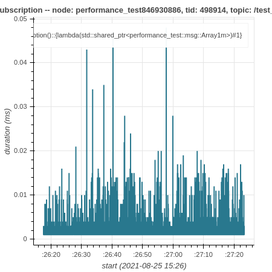

如何使用 ros2_tracing 追踪和分析应用程序
========================================

本教程展示如何使用 `ros2_tracing <https://github.com/ros2/ros2_tracing>`_ 追踪和分析 ROS 2 应用程序。
在本教程中，应用程序将是 `performance_test <https://gitlab.com/ApexAI/performance_test>`_。

概述
----

本教程涵盖：

1. 运行并追踪一次 ``performance_test`` 运行
2. 使用 `tracetools_analysis <https://github.com/ros-tracing/tracetools_analysis>`_ 分析追踪数据，使用 `Jupyter Notebook <https://jupyter.org/>`_ 绘制回调耗时图

前置条件
--------

本教程面向实时 Linux 系统。
请参阅 :doc:`实时系统设置教程 <../Miscellaneous/Building-Realtime-rt_preempt-kernel-for-ROS-2>`。
不过，如果你使用的是非实时 Linux 系统，本教程同样适用。

安装与构建
----------

按照 :doc:`安装说明 <../../Installation>` 在 Linux 上安装 ROS 2。

.. note::

  本教程通常应该适用于所有受支持的 Linux 发行版。
  但是，你可能需要调整一些命令。

安装 ``babeltrace`` 和 ``ros2trace``。

.. code-block:: console

  $ sudo apt-get update
  $ sudo apt-get install -y babeltrace ros-{DISTRO}-ros2trace ros-{DISTRO}-tracetools-analysis

Source ROS 2 安装并验证追踪已启用：

.. code-block:: console

  $ source /opt/ros/{DISTRO}/setup.bash
  $ ros2 run tracetools status
  Tracing enabled

然后创建一个工作空间，并克隆 ``performance_test`` 和 ``tracetools_analysis``。

.. code-block:: console

  $ cd ~/
  $ mkdir -p tracing_ws/src
  $ cd tracing_ws/src/
  $ git clone https://gitlab.com/ApexAI/performance_test.git
  $ git clone https://github.com/ros-tracing/tracetools_analysis.git -b {DISTRO}
  $ cd ..

使用 rosdep 安装依赖。

.. code-block:: console

  $ rosdep update
  $ rosdep install --from-paths src --ignore-src -y --skip-keys test_tracetools

然后构建并配置用于 ROS 2 的 ``performance_test``。
请参阅其 `文档 <https://gitlab.com/ApexAI/performance_test/-/tree/master/performance_test#performance_test>`_。

.. code-block:: console

  $ colcon build --packages-select performance_test --cmake-args -DPERFORMANCE_TEST_RCLCPP_ENABLED=ON

接下来，我们将运行一个 ``performance_test`` 实验并追踪它。

追踪
----

第 1 步：追踪
^^^^^^^^^^^^^

在一个终端中，source 工作空间并设置追踪。
运行该命令时，将打印一个 ROS 2 用户空间事件列表。
它还会打印将包含结果追踪数据的目录路径（在 ``~/.ros/tracing`` 下）。
在终端 1 中运行：

.. code-block:: console

  $ cd ~/tracing_ws
  $ source install/setup.bash
  $ ros2 trace --session-name perf-test --list

按回车键开始追踪。

第 2 步：运行应用程序
^^^^^^^^^^^^^^^^^^^^^

在第二个终端中，source 工作空间。
在终端 2 中运行：

.. code-block:: console

  $ cd ~/tracing_ws
  $ source install/setup.bash

然后运行 ``performance_test`` 实验（或你自己的应用程序）。
我们简单地创建一个实验：一个节点以尽可能快的速度向另一个节点发布约 1 MB 的消息，持续 60 秒，使用第二高的实时优先级，以免干扰关键的内核线程。
我们需要以 ``root`` 身份运行 ``performance_test``，才能使用实时优先级。
在终端 2 中运行：

.. code-block:: console

  $ sudo ./install/performance_test/lib/performance_test/perf_test -c rclcpp-single-threaded-executor -p 1 -s 1 -r 0 -m Array1m --reliability RELIABLE --max-runtime 60 --use-rt-prio 98

如果上面的最后一条命令对你不起作用（报错类似：“error while loading shared libraries”），请运行下面略有不同的命令。
这是因为，出于安全原因，我们需要手动传递 ``*PATH`` 环境变量，以便找到某些共享库（参见 `此解释 <https://unix.stackexchange.com/a/251374>`_）。
在终端 2 中运行：

.. code-block:: console

  $ sudo env PATH="$PATH" LD_LIBRARY_PATH="$LD_LIBRARY_PATH" ./install/performance_test/lib/performance_test/perf_test -c rclcpp-single-threaded-executor -p 1 -s 1 -r 0 -m Array1m --reliability RELIABLE --max-runtime 60 --use-rt-prio 98

.. note::

  如果你没有使用实时内核，只需运行：
  在终端 2 中运行：

  .. code-block:: console

    $ ./install/performance_test/lib/performance_test/perf_test -c rclcpp-single-threaded-executor -p 1 -s 1 -r 0 -m Array1m --reliability RELIABLE --max-runtime 60

第 3 步：验证追踪数据
^^^^^^^^^^^^^^^^^^^^^

实验完成后，在第一个终端中再次按回车键以停止追踪。
使用 ``babeltrace`` 快速查看结果追踪数据。

.. code-block:: console

  $ babeltrace ~/.ros/tracing/perf-test | less

上述命令的输出是原始 Common Trace Format (CTF) 数据的可读版本，它是一个追踪事件列表。
每个事件都有一个时间戳、一个事件类型、有关生成该事件的进程的一些信息，以及给定事件类型的字段值。

使用方向键滚动，或按 ``q`` 退出。

接下来，我们将分析追踪数据。

分析
----

`tracetools_analysis <https://github.com/ros-tracing/tracetools_analysis>`_ 提供了一个 Python API，用于轻松分析追踪数据。
我们可以在 `Jupyter notebook <https://jupyter.org/>`_ 中使用 `bokeh <https://docs.bokeh.org/en/latest/index.html>`_ 来绘制数据。
``tracetools_analysis`` 仓库包含 `一些示例 notebook <https://github.com/ros-tracing/tracetools_analysis/tree/{DISTRO}/tracetools_analysis/analysis>`_，包括 `一个分析订阅回调耗时的 notebook <https://github.com/ros-tracing/tracetools_analysis/blob/{DISTRO}/tracetools_analysis/analysis/callback_duration.ipynb>`_。

在本教程中，我们将绘制订阅者节点中订阅回调的耗时。

安装 Jupyter notebook 和 bokeh，然后打开示例 notebook。

.. code-block:: console

  $ pip3 install bokeh
  $ jupyter notebook ~/tracing_ws/src/tracetools_analysis/tracetools_analysis/analysis/callback_duration.ipynb

这将在浏览器中打开 notebook。

将第二个单元格中 ``path`` 变量的值替换为追踪目录的路径：

.. code-block:: python

  path = '~/.ros/tracing/perf-test'

通过点击每个单元格的 *Run* 按钮来运行 notebook。
第一次运行时，执行追踪处理的那个单元格可能需要几分钟，但后续运行会快得多。

你应该会得到一个与此类似的图：

我们可以看到，大多数回调耗时不到 0.01 ms，但有一些离群值超过 0.02 或 0.03 ms。

结论
----

本教程展示了如何安装追踪相关的工具。
然后展示了如何使用 `ros2_tracing <https://github.com/ros2/ros2_tracing>`_ 追踪一个 `performance_test <https://gitlab.com/ApexAI/performance_test>`_ 实验，并使用 `tracetools_analysis <https://github.com/ros-tracing/tracetools_analysis>`_ 绘制回调耗时图。

如需更多追踪分析，请查看 `其他示例 notebook <https://github.com/ros-tracing/tracetools_analysis/tree/{DISTRO}/tracetools_analysis/analysis>`_ 和 `tracetools_analysis API 文档 <https://docs.ros.org/en/{DISTRO}/p/tracetools_analysis/>`_。
`ros2_tracing 设计文档 <https://github.com/ros2/ros2_tracing/blob/{DISTRO}/doc/design_ros_2.md>`_ 也包含大量信息。
