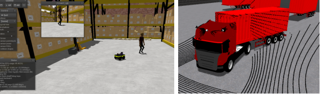
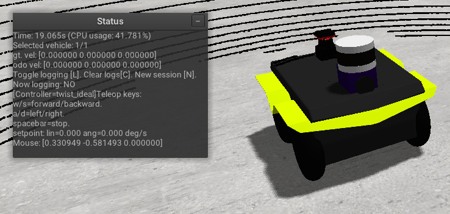
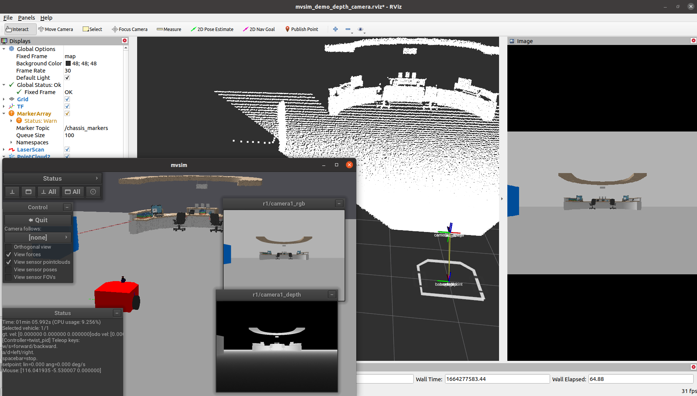

MVSim 入门
==========

**目标：** 分别以独立模式和 ROS 2 方式启动 MVSim 演示世界，并学习如何与仿真机器人交互。

**教程级别：** 高级

**用时：** 20 分钟

.. contents:: 目录
   :depth: 2
   :local:

背景
----

MVSim 自带一系列演示世界，展示了不同的功能，例如多机器人仿真、
传感器配置、地形类型、人类角色、铰接车辆和环境布局。
你可以使用 ``mvsim`` CLI 作为独立应用运行这些演示，
也可以作为 ROS 2 节点运行，通过标准 ROS 2 话题发布传感器数据并接受速度命令。

前置条件
--------

你应该已按照 :doc:`Installation-Ubuntu` 教程安装了 MVSim。

任务
----

1 使用独立 CLI 启动演示世界
^^^^^^^^^^^^^^^^^^^^^^^^^^^

MVSim 包含一个不需要 ROS 2 的独立启动器。
这对于快速测试世界文件或非 ROS 用例很有用。

要启动仓库演示：

.. code-block:: console

    $ mvsim launch ~/ros2_ws/src/mvsim/mvsim_tutorial/demo_warehouse.world.xml

如果你是从二进制包安装的，演示文件通常位于
``/opt/ros/{DISTRO}/share/mvsim/mvsim_tutorial/`` 下。

你可以尝试的其他一些演示世界：

- ``demo_turtlebot_world.world.xml`` -- 一个位于经典 ROS 风格、带障碍物的环境中的 TurtleBot3。
- ``demo_2robots.world.xml`` -- 两个在家具块之间导航的机器人。
- ``demo_elevation_map.world.xml`` -- 一辆在带高程数据的地形上行驶的 Jackal 机器人。
- ``demo_greenhouse.world.xml`` -- 一个复杂的温室环境，展示了用于程序化生成内容的 XML 循环。

2 控制机器人
^^^^^^^^^^^^

世界运行后，你可以使用以下方式控制机器人：

- **键盘：** 按 W/S 前进/后退，A/D 左转/右转，空格键停止。
  如果世界中有多个机器人，请先在 GUI 中点击某个机器人以选中它，再使用键盘控制。
- **游戏手柄：** 如果连接了手柄，它会被自动检测到。

GUI 还提供了相机视图、仿真速度和可视化选项的控制。
你可以切换正交/透视视图，并在 3D 窗口中直接启用传感器数据的可视化。

3 使用 ROS 2 启动
^^^^^^^^^^^^^^^^^

要将 MVSim 作为 ROS 2 节点启动，请使用提供的 launch 文件：

.. code-block:: console

    $ source /opt/ros/{DISTRO}/setup.bash
    $ ros2 launch mvsim demo_warehouse.launch.py

这会启动仿真器，并为每辆车辆和传感器创建 ROS 2 话题。

4 检查 ROS 2 话题
^^^^^^^^^^^^^^^^^

在演示运行时，打开一个新终端并列出可用的话题：

.. code-block:: console

    $ ros2 topic list

你应该会看到如下话题：

- ``/robot1/cmd_vel`` -- 发送 ``geometry_msgs/msg/Twist`` 命令来控制机器人。
- ``/robot1/odom`` -- 来自轮式编码器的里程计（``nav_msgs/msg/Odometry``）。
- ``/robot1/base_pose_ground_truth`` -- 完美的真值位姿。
- ``/robot1/<sensor_name>`` -- 传感器专用话题（例如，``/robot1/lidar1_points`` 用于 3D 激光雷达点云，``/robot1/laser1`` 用于 2D 扫描）。
- ``/tf`` 和 ``/tf_static`` -- 遵循 `REP-105 <https://www.ros.org/reps/rep-0105.html>`__ 的 TF2 变换（``map`` → ``odom`` → ``base_link``）。

你可以从命令行发送速度命令：

.. code-block:: console

    $ ros2 topic pub /robot1/cmd_vel geometry_msgs/msg/Twist "{linear: {x: 0.5}, angular: {z: 0.3}}"

或者使用 ``teleop_twist_keyboard`` 进行交互式控制：

.. code-block:: console

    $ ros2 run teleop_twist_keyboard teleop_twist_keyboard --ros-args -r cmd_vel:=/robot1/cmd_vel

5 在 RViz2 中可视化
^^^^^^^^^^^^^^^^^^^

你可以在 RViz2 中可视化 MVSim 的传感器数据。
一些 launch 文件包含 ``use_rviz`` 选项：

.. code-block:: console

    $ ros2 launch mvsim demo_warehouse.launch.py use_rviz:=True

或者，手动打开 RViz2，为感兴趣的话题添加显示（例如 ``LaserScan``、``PointCloud2``、``Image``、``Odometry``）。

6 无头模式
^^^^^^^^^^

对于没有显示器的 CI 流水线或远程服务器，MVSim 支持无头运行：

.. code-block:: console

    $ ros2 launch mvsim demo_warehouse.launch.py headless:=True

这会在不打开 GUI 窗口的情况下运行完整仿真。

总结
----

在本教程中，你分别以独立模式和 ROS 2 方式启动了 MVSim 演示世界。
你学习了如何使用键盘和 ROS 2 话题控制机器人、检查发布的话题，并在 RViz2 中可视化数据。
下一个教程将介绍如何使用自定义机器人和传感器定义你自己的世界。
