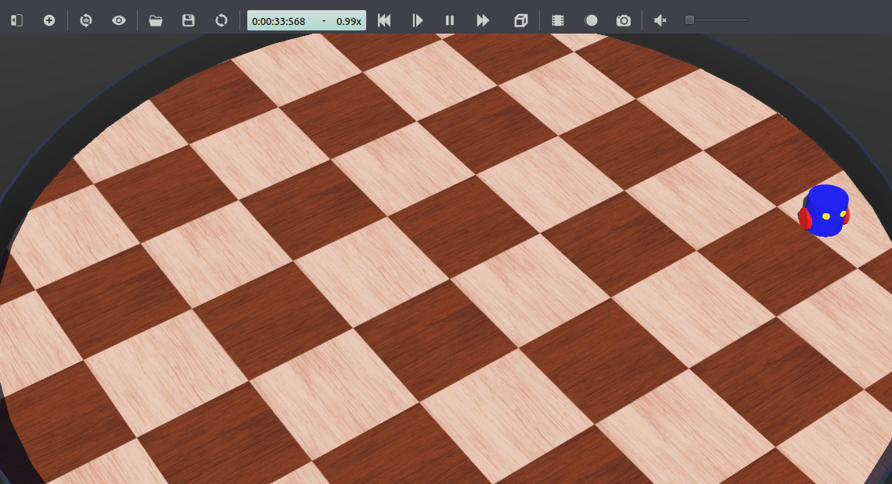

搭建机器人仿真（高级）
======================

**目标：** 使用避障节点扩展机器人仿真。

**教程级别：** 高级

**用时：** 20 分钟

.. contents:: 目录
   :depth: 2
   :local:

背景
----

在本教程中，你将扩展教程第一部分 :doc:`./Setting-Up-Simulation-Webots-Basic` 中创建的包。
目标是实现一个 ROS 2 节点，利用机器人的距离传感器避障。
本教程重点介绍如何使用 ``webots_ros2_driver`` 接口操作机器人设备。

前置条件
--------

这是教程第一部分的延续：:doc:`./Setting-Up-Simulation-Webots-Basic`。
必须先完成第一部分，以搭建自定义包和所需文件。

本教程兼容 ``webots_ros2`` 的 2023.1.0 版本和 Webots R2023b，以及之后的版本。

任务
----

1 更新 ``my_robot.urdf``
^^^^^^^^^^^^^^^^^^^^^^^^

如 :doc:`./Setting-Up-Simulation-Webots-Basic` 所述，``webots_ros2_driver`` 包含插件，可以直接将大多数 Webots 设备与 ROS 2 接口相连。
这些插件可以通过机器人 URDF 文件中的 ``<device>`` 标签加载。
``reference`` 属性应与 Webots 设备的 ``name`` 参数匹配。
所有现有接口及其对应参数的列表可以在 `设备参考页面 <https://github.com/cyberbotics/webots_ros2/wiki/References-Devices>`_ 上找到。
对于未在 URDF 文件中配置的可用设备，接口将被自动创建，ROS 参数将使用默认值（例如 ``update rate``、``topic name`` 和 ``frame name``）。

在 ``my_robot.urdf`` 中，将全部内容替换为：

.. tabs::

    .. group-tab:: Python

        .. literalinclude:: Code/my_robot_with_sensors_python.urdf
            :language: xml

    .. group-tab:: C++

        .. literalinclude:: Code/my_robot_with_sensors_cpp.urdf
            :language: xml

除了你的自定义插件外，``webots_ros2_driver`` 还会解析指向 **DistanceSensor** 节点的 ``<device>`` 标签，并使用 ``<ros>`` 标签中的标准参数来启用传感器并命名它们的话题。

2 创建避障 ROS 节点
^^^^^^^^^^^^^^^^^^^

.. tabs::

    .. group-tab:: Python

        机器人将使用一个标准 ROS 节点来检测墙壁并发送电机命令以避开它。
        在 ``my_package/my_package/`` 文件夹中，创建一个名为 ``obstacle_avoider.py`` 的文件，代码如下：

        .. literalinclude:: Code/obstacle_avoider.py
            :language: python

        此节点将为命令创建一个发布者，并在此处订阅传感器话题：

        .. literalinclude:: Code/obstacle_avoider.py
            :language: python
            :dedent: 8
            :lines: 14-17

        当从左传感器接收到测量值时，它将被复制到一个成员字段：

        .. literalinclude:: Code/obstacle_avoider.py
            :language: python
            :dedent: 4
            :lines: 19-20

        最后，当从右传感器接收到测量值时，将向 ``/cmd_vel`` 话题发送一条消息。
        当未检测到障碍物时，``command_message`` 将至少在 ``linear.x`` 中注册一个前进速度，使机器人移动。
        如果两个传感器中的任何一个检测到障碍物，``command_message`` 还将在 ``angular.z`` 中注册一个旋转速度，使机器人向右转。

        .. literalinclude:: Code/obstacle_avoider.py
            :language: python
            :dedent: 4
            :lines: 22-32

    .. group-tab:: C++

        机器人将使用一个标准 ROS 节点来检测墙壁并发送电机命令以避开它。
        在 ``my_package/include/my_package`` 文件夹中，创建一个名为 ``ObstacleAvoider.hpp`` 的头文件，代码如下：

        .. literalinclude:: Code/ObstacleAvoider.hpp
            :language: cpp

        在 ``my_package/src`` 文件夹中，创建一个名为 ``ObstacleAvoider.cpp`` 的源文件，代码如下：

        .. literalinclude:: Code/ObstacleAvoider.cpp
            :language: cpp

        此节点将为命令创建一个发布者，并在此处订阅传感器话题：

        .. literalinclude:: Code/ObstacleAvoider.cpp
            :language: cpp
            :lines: 6-20

        当从左传感器接收到测量值时，它将被复制到一个成员字段：

        .. literalinclude:: Code/ObstacleAvoider.cpp
            :language: cpp
            :lines: 23-26

        最后，当从右传感器接收到测量值时，将向 ``/cmd_vel`` 话题发送一条消息。
        当未检测到障碍物时，``command_message`` 将至少在 ``linear.x`` 中注册一个前进速度，使机器人移动。
        如果两个传感器中的任何一个检测到障碍物，``command_message`` 还将在 ``angular.z`` 中注册一个旋转速度，使机器人向右转。

        .. literalinclude:: Code/ObstacleAvoider.cpp
            :language: cpp
            :lines: 28-42

3 更新其他文件
^^^^^^^^^^^^^^

你必须修改以下两个文件来启动你的新节点。

.. tabs::

    .. group-tab:: Python

        编辑 ``setup.py``，将 ``'console_scripts'`` 替换为：

        .. literalinclude:: Code/setup_sensor.py
            :language: python
            :dedent: 8
            :lines: 24-27

        这将为 ``obstacle_avoider`` 节点添加一个入口点。

    .. group-tab:: C++

        编辑 ``CMakeLists.txt``，添加 ``obstacle_avoider`` 的编译和安装：

        .. literalinclude:: Code/CMakeLists_sensor.txt
            :language: cmake

转到 ``robot_launch.py`` 文件，并将其替换为：

.. literalinclude:: Code/robot_launch_sensor.py
    :language: python

这将创建一个 ``obstacle_avoider`` 节点，并将其包含在 ``LaunchDescription`` 中。

4 测试避障代码
^^^^^^^^^^^^^^

从 ROS 2 工作空间中的终端启动仿真：

.. tabs::

    .. group-tab:: Linux

        在 ROS 2 工作空间中的终端运行：

        .. code-block:: console

            $ colcon build
            $ source install/local_setup.bash
            $ ros2 launch my_package robot_launch.py

    .. group-tab:: Windows

        在 WSL ROS 2 工作空间中的终端运行：

        .. code-block:: console

            $ colcon build
            $ export WEBOTS_HOME=/mnt/c/Program\ Files/Webots
            $ source install/local_setup.bash
            $ ros2 launch my_package robot_launch.py

        请务必在 Webots 安装文件夹的路径前使用 ``/mnt`` 前缀，以从 WSL 访问 Windows 文件系统。

    .. group-tab:: macOS

        在主机（不是 VM）的终端中，如果尚未指定，请指定 Webots 安装文件夹（例如 ``/Applications/Webots.app``），并使用以下命令启动服务器：

        .. code-block:: console

            $ export WEBOTS_HOME=/Applications/Webots.app
            $ python3 local_simulation_server.py

        请注意，一旦 ROS 2 节点结束，服务器仍会继续运行。
        每次想要启动新仿真时，你无需重启它。
        在 Linux VM 的 ROS 2 工作空间中的终端，构建并启动你的自定义包：

        .. code-block:: console

            $ cd ~/ros2_ws
            $ colcon build
            $ source install/local_setup.bash
            $ ros2 launch my_package robot_launch.py

你的机器人应该向前移动，在撞墙之前应该顺时针转向。
你可以在 Webots 中按 ``Ctrl+F10``，或转到 ``View`` 菜单、``Optional Rendering`` 和 ``Show DistanceSensor Rays``，以显示机器人距离传感器的测距范围。

总结
----

在本教程中，你使用一个避障 ROS 2 节点扩展了基础仿真，该节点根据机器人的距离传感器值发布速度命令。

下一步
------

你可能想要改进插件或创建新节点以改变机器人的行为。
你还可以实现一个重置处理器，以便在从 Webots 界面重置仿真时自动重启你的 ROS 节点：

* :doc:`./Simulation-Reset-Handler`。
