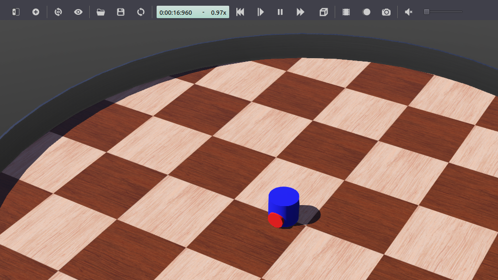
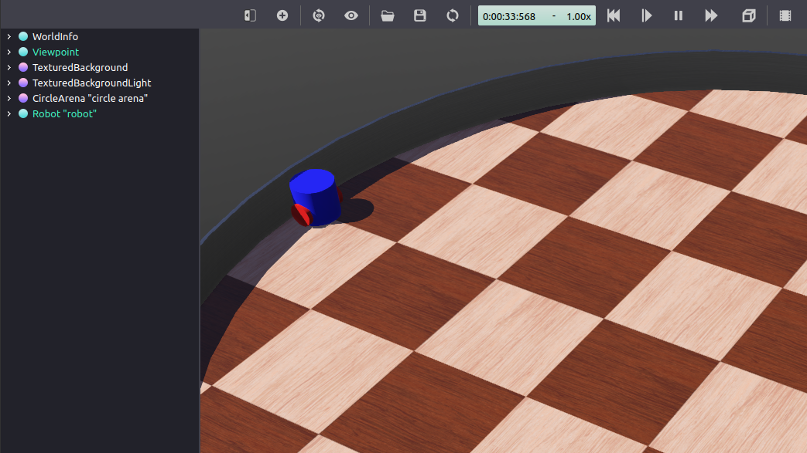

.. redirect-from::

    Tutorials/Simulators/Webots/Setting-up-a-Robot-Simulation-Webots
    Tutorials/Advanced/Simulators/Webots

搭建机器人仿真（基础）
======================

**目标：** 搭建一个机器人仿真，并从 ROS 2 控制它。

**教程级别：** 高级

**用时：** 30 分钟

.. contents:: 目录
   :depth: 2
   :local:

背景
----

在本教程中，你将使用 Webots 机器人模拟器搭建并运行一个非常简单的 ROS 2 仿真场景。

``webots_ros2`` 包提供了 ROS 2 与 Webots 之间的接口。
它包含多个子包，但在本教程中，你只会使用 ``webots_ros2_driver`` 子包来实现一个控制仿真机器人的 Python 或 C++ 插件。
其他一些子包包含不同机器人（如 TurtleBot3）的演示。
它们在 `Webots ROS 2 示例 <https://github.com/cyberbotics/webots_ros2/wiki/Examples>`_ 页面中有文档说明。

前置条件
--------

建议理解初学者 :doc:`../../../../Tutorials` 中涵盖的基本 ROS 原理。
特别是 :doc:`../../../Beginner-CLI-Tools/Introducing-Turtlesim/Introducing-Turtlesim`、:doc:`../../../Beginner-CLI-Tools/Understanding-ROS2-Topics/Understanding-ROS2-Topics`、:doc:`../../../Beginner-Client-Libraries/Creating-A-Workspace/Creating-A-Workspace`、:doc:`../../../Beginner-Client-Libraries/Creating-Your-First-ROS2-Package` 和 :doc:`../../../Intermediate/Launch/Creating-Launch-Files` 是有用的前置条件。

.. tabs::

    .. group-tab:: Linux

        本教程中的 Linux 和 ROS 命令可以在标准 Linux 终端中运行。
        以下页面 :doc:`./Installation-Ubuntu` 介绍了如何在 Linux 上安装 ``webots_ros2`` 包。

    .. group-tab:: Windows

        本教程中的 Linux 和 ROS 命令必须在 WSL（适用于 Linux 的 Windows 子系统）环境中运行。
        以下页面 :doc:`./Installation-Windows` 介绍了如何在 Windows 上安装 ``webots_ros2`` 包。

    .. group-tab:: macOS

        本教程中的 Linux 和 ROS 命令必须在预先配置好的 Linux 虚拟机（VM）中运行。
        以下页面 :doc:`./Installation-MacOS` 介绍了如何在 macOS 上安装 ``webots_ros2`` 包。

本教程兼容 ``webots_ros2`` 的 2023.1.0 版本和 Webots R2023b，以及之后的版本。

任务
----

1 创建包结构
^^^^^^^^^^^^

让我们把代码组织在一个自定义 ROS 2 包中。
从 ROS 2 工作空间的 ``src`` 文件夹创建一个名为 ``my_package`` 的新包。
将终端当前目录切换到 ``ros2_ws/src``，然后运行：

.. tabs::

    .. group-tab:: Python

        .. code-block:: console

            $ ros2 pkg create --build-type ament_python --license Apache-2.0 --node-name my_robot_driver my_package --dependencies rclpy geometry_msgs webots_ros2_driver

        ``--node-name my_robot_driver`` 选项将在 ``my_package`` 子文件夹中创建一个 ``my_robot_driver.py`` Python 插件模板，你稍后将对其进行修改。
        ``--dependencies rclpy geometry_msgs webots_ros2_driver`` 选项在 ``package.xml`` 文件中指定 ``my_robot_driver.py`` 插件所需的包。

        让我们在 ``my_package`` 文件夹内添加一个 ``launch`` 和一个 ``worlds`` 文件夹。

        .. code-block:: console

                $ cd my_package
                $ mkdir launch
                $ mkdir worlds

        你最终应该得到以下文件夹结构：

        .. code-block:: console

            src/
            └── my_package/
                ├── launch/
                ├── my_package/
                │   ├── __init__.py
                │   └── my_robot_driver.py
                ├── resource/
                │   └── my_package
                ├── test/
                │   ├── test_copyright.py
                │   ├── test_flake8.py
                │   └── test_pep257.py
                ├── worlds/
                ├── package.xml
                ├── setup.cfg
                └── setup.py

    .. group-tab:: C++

        .. code-block:: console

            $ ros2 pkg create --build-type ament_cmake --license Apache-2.0 --node-name MyRobotDriver my_package --dependencies rclcpp geometry_msgs webots_ros2_driver pluginlib

        ``--node-name MyRobotDriver`` 选项将在 ``my_package/src`` 子文件夹中创建一个 ``MyRobotDriver.cpp`` C++ 插件模板，你稍后将对其进行修改。
        ``--dependencies rclcpp geometry_msgs webots_ros2_driver pluginlib`` 选项在 ``package.xml`` 文件中指定 ``MyRobotDriver`` 插件所需的包。

        让我们在 ``my_package`` 文件夹内添加一个 ``launch``、一个 ``worlds`` 和一个 ``resource`` 文件夹。

        .. code-block:: console

            $ cd my_package
            $ mkdir launch
            $ mkdir worlds
            $ mkdir resource

        还必须创建两个额外的文件：``MyRobotDriver`` 的头文件和 ``my_robot_driver.xml`` pluginlib 描述文件。

        .. code-block:: console

            $ touch my_robot_driver.xml
            $ touch include/my_package/MyRobotDriver.hpp

        你最终应该得到以下文件夹结构：

        .. code-block:: console

            src/
            └── my_package/
                ├── include/
                │   └── my_package/
                │       └── MyRobotDriver.hpp
                ├── launch/
                ├── resource/
                ├── src/
                │   └── MyRobotDriver.cpp
                ├── worlds/
                ├── CMakeList.txt
                ├── my_robot_driver.xml
                └── package.xml

2 设置仿真世界
^^^^^^^^^^^^^^

你需要一个包含机器人的世界文件来启动仿真。
:download:`下载这个世界文件 <Code/my_world.wbt>`，并将其移动到 ``my_package/worlds/`` 中。

这实际上是一个相当简单的文本文件，你可以在文本编辑器中查看它。
这个 ``my_world.wbt`` 世界文件中已经包含一个简单的机器人。

.. note::

    如果你想学习如何在 Webots 中创建自己的机器人模型，可以查看这个 `教程 <https://cyberbotics.com/doc/guide/tutorial-6-4-wheels-robot>`_。

3 编辑 ``my_robot_driver`` 插件
^^^^^^^^^^^^^^^^^^^^^^^^^^^^^^^

``webots_ros2_driver`` 子包会自动为大多数传感器创建 ROS 2 接口。
有关现有设备接口以及如何配置它们的更多细节，在教程第二部分中给出：:doc:`./Setting-Up-Simulation-Webots-Advanced`。
在本任务中，你将通过创建自己的自定义插件来扩展此接口。
这个自定义插件是一个相当于机器人控制器的 ROS 节点。
你可以使用它访问 `Webots robot API  <https://cyberbotics.com/doc/reference/robot?tab-language=python>`_，并创建自己的话题和服务来控制你的机器人。

.. note::

    本教程的目的是展示一个依赖数量最少的简单示例。
    但是，你可以通过使用另一个名为 ``webots_ros2_control`` 的 ``webots_ros2`` 子包来避免使用此插件，不过这会引入新的依赖。
    这另一个子包创建了一个与 ``ros2_control`` 包的接口，便于控制差速轮式机器人。

.. tabs::

    .. group-tab:: Python

        在你喜欢的编辑器中打开 ``my_package/my_package/my_robot_driver.py``，并将其内容替换为以下内容：

        .. literalinclude:: Code/my_robot_driver.py
            :language: python

        如你所见，``MyRobotDriver`` 类实现了三个方法。

        第一个方法名为 ``init(self, ...)``，实际上就是 Python ``__init__(self, ...)`` 构造函数的 ROS 节点对应版本。
        ``init`` 方法总是接受两个参数：

        - ``webots_node`` 参数包含对 Webots 实例的引用。
        - ``properties`` 参数是一个字典，由 URDF 文件中给出的 XML 标签创建（:ref:`4 Create the my_robot.urdf file`），允许你向控制器传递参数。

        仿真中的机器人实例 ``self.__robot`` 可用于访问 `Webots robot API <https://cyberbotics.com/doc/reference/robot?tab-language=python>`_。
        然后，它获取两个电机实例，并用目标位置和目标速度初始化它们。
        最后，创建一个 ROS 节点，并为一个名为 ``/cmd_vel`` 的 ROS 话题注册一个回调方法，该话题将处理 ``Twist`` 消息。

        .. literalinclude:: Code/my_robot_driver.py
            :language: python
            :dedent: 4
            :lines: 8-24

        然后是 ``__cmd_vel_callback(self, twist)`` 回调私有方法的实现，它将在 ``/cmd_vel`` 话题上收到的每条 ``Twist`` 消息时被调用，并将其保存到 ``self.__target_twist`` 成员变量中。

        .. literalinclude:: Code/my_robot_driver.py
            :language: python
            :dedent: 4
            :lines: 26-27

        最后，``step(self)`` 方法在仿真的每个时间步被调用。
        需要调用 ``rclpy.spin_once()`` 来保持 ROS 节点平稳运行。
        在每个时间步，该方法将从 ``self.__target_twist`` 中获取所需的 ``forward_speed`` 和 ``angular_speed``。
        由于电机是用角速度控制的，该方法随后会将 ``forward_speed`` 和 ``angular_speed`` 转换为每个车轮各自的命令。
        这种转换取决于机器人的结构，更具体地说是车轮的半径和它们之间的距离。

        .. literalinclude:: Code/my_robot_driver.py
            :language: python
            :dedent: 4
            :lines: 29-39

    .. group-tab:: C++

        在你喜欢的编辑器中打开 ``my_package/include/my_package/MyRobotDriver.hpp``，并将其内容替换为以下内容：

        .. literalinclude:: Code/MyRobotDriver.hpp
            :language: cpp

        定义了类 ``MyRobotDriver``，它继承自 ``webots_ros2_driver::PluginInterface`` 类。
        该插件必须重写 ``step(...)`` 和 ``init(...)`` 函数。
        更多细节在 ``MyRobotDriver.cpp`` 文件中给出。
        插件内部会使用的几个辅助方法、回调和成员变量被声明为私有。

        然后，在你喜欢的编辑器中打开 ``my_package/src/MyRobotDriver.cpp``，并将其内容替换为以下内容：

        .. literalinclude:: Code/MyRobotDriver.cpp
            :language: cpp

        ``MyRobotDriver::init`` 方法在插件被 ``webots_ros2_driver`` 包加载后执行一次。
        它接受两个参数：

        * 一个指向 ``webots_ros2_driver`` 定义的 ``WebotsNode`` 的指针，它允许访问 ROS 2 节点函数。
        * ``parameters`` 参数是一个字符串无序映射，由 URDF 文件中给出的 XML 标签创建（:ref:`4 Create the my_robot.urdf file`），允许向控制器传递参数。
          在本示例中未使用它。

        它通过设置机器人电机、设置它们的位置和速度，并订阅 ``/cmd_vel`` 话题来初始化插件。

        .. literalinclude:: Code/MyRobotDriver.cpp
            :language: cpp
            :lines: 13-33

        订阅回调被声明为一个 lambda 函数，它将在 ``/cmd_vel`` 话题上收到的每条 Twist 消息时被调用，并将其保存到 ``cmd_vel_msg`` 成员变量中。

        .. literalinclude:: Code/MyRobotDriver.cpp
            :language: cpp
            :lines: 28-31

        ``step()`` 方法在仿真的每个时间步被调用。
        在每个时间步，该方法将从 ``cmd_vel_msg`` 中获取所需的 ``forward_speed`` 和 ``angular_speed``。
        由于电机是用角速度控制的，该方法随后会将 ``forward_speed`` 和 ``angular_speed`` 转换为每个车轮各自的命令。
        这种转换取决于机器人的结构，更具体地说是车轮的半径和它们之间的距离。

        .. literalinclude:: Code/MyRobotDriver.cpp
            :language: cpp
            :lines: 35-48

        文件的最后几行定义了 ``my_robot_driver`` 命名空间的结束，并包含一个宏，使用 ``PLUGINLIB_EXPORT_CLASS`` 宏将 ``MyRobotDriver`` 类导出为插件。
        这允许插件在运行时被 Webots ROS2 驱动加载。

        .. literalinclude:: Code/MyRobotDriver.cpp
            :language: cpp
            :lines: 51-53

        .. note::

            虽然插件是用 C++ 实现的，但必须使用 C API 与 Webots 控制器库交互。

.. _4 Create the my_robot.urdf file:

4 创建 ``my_robot.urdf`` 文件
^^^^^^^^^^^^^^^^^^^^^^^^^^^^^

你现在必须创建一个 URDF 文件来声明 ``MyRobotDriver`` 插件。
这将允许 ``webots_ros2_driver`` ROS 节点启动插件，并将其连接到目标机器人。

在 ``my_package/resource`` 文件夹中创建一个名为 ``my_robot.urdf`` 的文本文件，内容如下：

.. tabs::

    .. group-tab:: Python

        .. literalinclude:: Code/my_robot_python.urdf
            :language: xml

        ``type`` 属性指定由文件层次结构给出的类的路径。
        ``webots_ros2_driver`` 负责根据指定的包和模块加载类。

    .. group-tab:: C++

        .. literalinclude:: Code/my_robot_cpp.urdf
            :language: xml

        ``type`` 属性指定要加载的命名空间和类名。
        ``pluginlib`` 负责根据指定的信息加载类。

.. note::

    这个简单的 URDF 文件不包含关于机器人的任何 link 或 joint 信息，因为本教程不需要它们。
    但是，URDF 文件通常包含更多信息，如 :doc:`../../../Intermediate/URDF/URDF-Main` 教程所述。

.. note::

    这里插件不接收任何输入参数，但这可以通过一个包含参数名的标签来实现。

    .. tabs::

        .. group-tab:: Python

            .. code-block:: xml

                <plugin type="my_package.my_robot_driver.MyRobotDriver">
                    <parameterName>someValue</parameterName>
                </plugin>

        .. group-tab:: C++

            .. code-block:: xml

                <plugin type="my_robot_driver::MyRobotDriver">
                    <parameterName>someValue</parameterName>
                </plugin>

    这即用于向现有的 Webots 设备插件传递参数（见 :doc:`./Setting-Up-Simulation-Webots-Advanced`）。

5 创建 launch 文件
^^^^^^^^^^^^^^^^^^

让我们创建 launch 文件，以便用一条命令轻松启动仿真和 ROS 控制器。
在 ``my_package/launch`` 文件夹中创建一个名为 ``robot_launch.py`` 的新文本文件，代码如下：

.. literalinclude:: Code/robot_launch.py
    :language: python

``WebotsLauncher`` 对象是一个自定义操作，允许你启动一个 Webots 仿真实例。
你必须在构造函数中指定模拟器将打开哪个世界文件。

.. literalinclude:: Code/robot_launch.py
    :language: python
    :dedent: 4
    :lines: 13-15

然后，创建与仿真机器人交互的 ROS 节点。
这个名为 ``WebotsController`` 的节点位于 ``webots_ros2_driver`` 包中。

.. tabs::

    .. group-tab:: Linux

        该节点将能够通过基于 IPC 和共享内存的自定义协议与仿真机器人通信。

    .. group-tab:: Windows

        该节点（在 WSL 中）将能够通过 TCP 连接与仿真机器人（在原生 Windows 上的 Webots 中）通信。

    .. group-tab:: macOS

        该节点（在 docker 容器中）将能够通过 TCP 连接与仿真机器人（在原生 macOS 上的 Webots 中）通信。

在你的情况下，你只需要运行此节点的一个实例，因为仿真中只有一个机器人。
但如果仿真中有更多机器人，你就必须为每个机器人运行一个此节点的实例。
``robot_name`` 参数用于定义驱动应连接的机器人的名称。
``robot_description`` 参数保存指向 ``MyRobotDriver`` 插件的 URDF 文件的路径。
你可以将 ``WebotsController`` 节点视为连接你的控制器插件与目标机器人的接口。

.. literalinclude:: Code/robot_launch.py
    :language: python
    :dedent: 4
    :lines: 17-22

之后，两个节点被设置为在 ``LaunchDescription`` 构造函数中启动：

.. literalinclude:: Code/robot_launch.py
    :language: python
    :dedent: 4
    :lines: 24-26

最后，添加一个可选部分，以便在 Webots 终止时（例如从图形用户界面关闭时）关闭所有节点。

.. literalinclude:: Code/robot_launch.py
    :language: python
    :dedent: 8
    :lines: 27-32

.. note::

    有关 ``WebotsController`` 和 ``WebotsLauncher`` 参数的更多细节，可以在 `节点参考页面 <https://github.com/cyberbotics/webots_ros2/wiki/References-Nodes>`_ 上找到。

6 编辑其他文件
^^^^^^^^^^^^^^

.. tabs::

    .. group-tab:: Python

        在你可以启动 launch 文件之前，你必须修改 ``setup.py`` 文件，以包含你添加的额外文件。
        打开 ``my_package/setup.py``，并将其内容替换为：

        .. literalinclude:: Code/setup.py
            :language: python

        这会设置包，并在 ``data_files`` 变量中添加新添加的文件：``my_world.wbt``、``my_robot.urdf`` 和 ``robot_launch.py``。

    .. group-tab:: C++

        在你可以启动 launch 文件之前，你必须修改 ``CMakeLists.txt`` 和 ``my_robot_driver.xml`` 文件：

        * ``CMakeLists.txt`` 定义你的插件的编译规则。
        * ``my_robot_driver.xml`` 是 pluginlib 找到你的 Webots ROS 2 插件所必需的。

        打开 ``my_package/my_robot_driver.xml``，并将其内容替换为：

        .. literalinclude:: Code/my_robot_driver.xml
            :language: xml

        打开 ``my_package/CMakeLists.txt``，并将其内容替换为：

        .. literalinclude:: Code/CMakeLists.txt
            :language: cmake

        CMakeLists.txt 使用 ``pluginlib_export_plugin_description_file()`` 导出插件配置文件，定义 C++ 插件 ``src/MyRobotDriver.cpp`` 的共享库，并使用 ``ament_target_dependencies()`` 设置 include 和库依赖。

        然后，该文件将库以及 ``launch``、``resource`` 和 ``worlds`` 目录安装到 ``share/my_package`` 目录。
        最后，它分别使用 ``ament_export_include_directories()`` 和 ``ament_export_libraries()`` 导出 include 目录和库，并使用 ``ament_package()`` 声明该包。

7 测试代码
^^^^^^^^^^

.. tabs::

    .. group-tab:: Linux

        在 ROS 2 工作空间中的终端运行：

        .. code-block:: console

            $ colcon build
            $ source install/local_setup.bash
            $ ros2 launch my_package robot_launch.py

        这将启动仿真。
        如果 Webots 尚未安装，它将在首次运行时自动安装。

    .. group-tab:: Windows

        在 WSL ROS 2 工作空间中的终端运行：

        .. code-block:: console

            $ colcon build
            $ export WEBOTS_HOME=/mnt/c/Program\ Files/Webots
            $ source install/local_setup.bash
            $ ros2 launch my_package robot_launch.py

        请务必在 Webots 安装文件夹的路径前使用 ``/mnt`` 前缀，以从 WSL 访问 Windows 文件系统。

        这将启动仿真。
        如果 Webots 尚未安装，它将在首次运行时自动安装。

    .. group-tab:: macOS

        在 macOS 上，必须在主机上启动一个本地服务器，才能从 VM 启动 Webots。
        本地服务器可以在 `webots-server 仓库 <https://github.com/cyberbotics/webots-server/blob/main/local_simulation_server.py>`_ 上下载。

        在主机（不是 VM）的终端中，指定 Webots 安装文件夹（例如 ``/Applications/Webots.app``），并使用以下命令启动服务器：

        .. code-block:: console

            $ export WEBOTS_HOME=/Applications/Webots.app
            $ python3 local_simulation_server.py

        在 Linux VM 的 ROS 2 工作空间中的终端，构建并启动你的自定义包：

        .. code-block:: console

            $ colcon build
            $ source install/local_setup.bash
            $ ros2 launch my_package robot_launch.py

.. note::

    如果你想手动安装 Webots，可以在 `这里 <https://github.com/cyberbotics/webots/releases/latest>`_ 下载。

然后，打开第二个终端，用以下命令发送一条命令：

.. code-block:: console

            $ ros2 topic pub /cmd_vel geometry_msgs/Twist  "linear: { x: 0.1 }"

机器人现在正在向前移动。

此时，机器人能够盲目地执行你的电机命令。
但当你命令它向前移动时，它最终会撞上墙壁。

关闭 Webots 窗口，这也应该会关闭从 launcher 启动的 ROS 节点。
在第二个终端中用 ``Ctrl+C`` 也关闭话题命令。

总结
----

在本教程中，你用 Webots 搭建了一个真实的机器人仿真，并实现了一个自定义插件来控制机器人的电机。

下一步
------

为了改进仿真，可以使用机器人的传感器来检测障碍物并避开它们。
教程的第二部分展示了如何实现这种行为：

* :doc:`./Setting-Up-Simulation-Webots-Advanced`。
