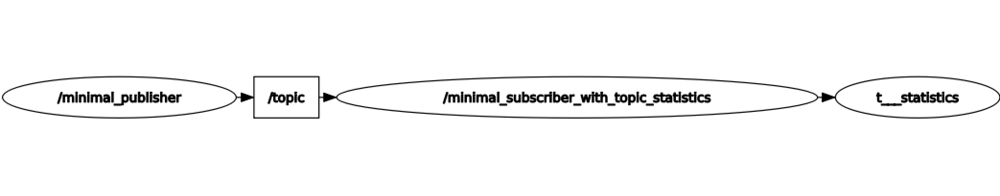

.. redirect-from::

    Topic-Statistics-Tutorial
    Tutorials/Topics/Topic-Statistics-Tutorial

启用话题统计（C++）
===================

**目标：** 启用 ROS 2 话题统计，并查看输出的统计数据。

**教程级别：** 高级

**时间：** 10 分钟

.. contents:: 目录
   :local:

背景
----

这是一个简短的教程，介绍如何在 ROS 2 中启用话题统计，并使用命令行工具（:doc:`ros2 topic <../../Beginner-CLI-Tools/Understanding-ROS2-Topics/Understanding-ROS2-Topics>`）查看发布的统计输出。

ROS 2 为任何订阅接收到的消息提供集成的统计测量，
称为话题统计（Topic Statistics）。
为你的订阅启用话题统计后，你可以刻画系统的性能特征，
或使用这些数据来帮助诊断当前存在的问题。

更多细节请参阅 :doc:`话题统计概念页面 <../../../Concepts/Intermediate/About-Topic-Statistics>`。

前置条件
--------

从二进制包或源码安装。

在之前的教程中，你已经学习了如何 :doc:`创建工作空间 <../../Beginner-Client-Libraries/Creating-A-Workspace/Creating-A-Workspace>`、
:doc:`创建包 <../../Beginner-Client-Libraries/Creating-Your-First-ROS2-Package>`，以及创建 :doc:`C++ <../../Beginner-Client-Libraries/Writing-A-Simple-Cpp-Publisher-And-Subscriber>` 发布器和订阅器。

本教程假设你仍然保留着 :doc:`C++ <../../Beginner-Client-Libraries/Writing-A-Simple-Cpp-Publisher-And-Subscriber>` 教程中的 ``cpp_pubsub`` 包。

任务
----

1 编写启用统计的订阅器节点
^^^^^^^^^^^^^^^^^^^^^^^^^^

进入在 :doc:`上一教程 <../../Beginner-Client-Libraries/Writing-A-Simple-Cpp-Publisher-And-Subscriber>` 中创建的 ``ros2_ws/src/cpp_pubsub/src`` 文件夹，并
输入以下命令下载示例 talker 代码：

.. tabs::

   .. group-tab:: Linux

      .. code-block:: console

            $ wget -O member_function_with_topic_statistics.cpp https://raw.githubusercontent.com/ros2/examples/{REPOS_FILE_BRANCH}/rclcpp/topics/minimal_subscriber/member_function_with_topic_statistics.cpp

   .. group-tab:: macOS

      .. code-block:: console

            $ wget -O member_function_with_topic_statistics.cpp https://raw.githubusercontent.com/ros2/examples/{REPOS_FILE_BRANCH}/rclcpp/topics/minimal_subscriber/member_function_with_topic_statistics.cpp

   .. group-tab:: Windows

      右键单击此链接并选择另存为 ``publisher_member_function.cpp``：

      https://raw.githubusercontent.com/ros2/examples/{REPOS_FILE_BRANCH}/rclcpp/topics/minimal_subscriber/member_function_with_topic_statistics.cpp

现在将出现一个名为 ``member_function_with_topic_statistics.cpp`` 的新文件。
使用你喜欢的文本编辑器打开该文件。

.. code-block:: C++

    #include <chrono>
    #include <memory>

    #include "rclcpp/rclcpp.hpp"
    #include "rclcpp/subscription_options.hpp"

    #include "std_msgs/msg/string.hpp"

    class MinimalSubscriberWithTopicStatistics : public rclcpp::Node
    {
    public:
      MinimalSubscriberWithTopicStatistics()
      : Node("minimal_subscriber_with_topic_statistics")
      {
        // manually enable topic statistics via options
        auto options = rclcpp::SubscriptionOptions();
        options.topic_stats_options.state = rclcpp::TopicStatisticsState::Enable;

        // configure the collection window and publish period (default 1s)
        options.topic_stats_options.publish_period = std::chrono::seconds(10);

        // configure the topic name (default '/statistics')
        // options.topic_stats_options.publish_topic = "/topic_statistics"

        auto callback = [this](const std_msgs::msg::String & msg) {
            this->topic_callback(msg);
          };

        subscription_ = this->create_subscription<std_msgs::msg::String>(
          "topic", 10, callback, options);
      }

    private:
      void topic_callback(const std_msgs::msg::String & msg) const
      {
        RCLCPP_INFO(this->get_logger(), "I heard: '%s'", msg.data.c_str());
      }
      rclcpp::Subscription<std_msgs::msg::String>::SharedPtr subscription_;
    };

    int main(int argc, char * argv[])
    {
      rclcpp::init(argc, argv);
      rclcpp::spin(std::make_shared<MinimalSubscriberWithTopicStatistics>());
      rclcpp::shutdown();
      return 0;
    }

1.1 检查代码
~~~~~~~~~~~~

与 :doc:`C++ <../../Beginner-Client-Libraries/Writing-A-Simple-Cpp-Publisher-And-Subscriber>` 教程一样，我们有一个订阅器节点，它通过 ``topic_callback`` 函数从
``topic`` 话题接收字符串消息。
不过，现在我们添加了选项，通过 ``rclcpp::SubscriptionOptions()`` 选项结构体来配置订阅以启用话题统计。

.. code-block:: C++

    // manually enable topic statistics via options
    auto options = rclcpp::SubscriptionOptions();
    options.topic_stats_options.state = rclcpp::TopicStatisticsState::Enable;

可选地，诸如统计收集/发布周期以及用于发布统计的话题等字段也可以配置。

.. code-block:: C++

    // configure the collection window and publish period (default 1s)
    options.topic_stats_options.publish_period = std::chrono::seconds(10);

    // configure the topic name (default '/statistics')
    // options.topic_stats_options.publish_topic = "/my_topic"

可配置的字段如下表所述：

==================================  =============================================================================================
订阅配置字段                              用途                                                                                           
==================================  =============================================================================================
topic_stats_options.state           启用或禁用话题统计（默认 ``rclcpp::TopicStatisticsState::Disable``）                                      
topic_stats_options.publish_period  收集统计数据并发布统计消息的周期（默认 ``1s``）                                                                  
topic_stats_options.publish_topic   发布统计数据时使用的话题（默认 ``/statistics``）                                                             
==================================  =============================================================================================

1.2 CMakeLists.txt
~~~~~~~~~~~~~~~~~~

现在打开 ``CMakeLists.txt`` 文件。

添加可执行文件并将其命名为 ``listener_with_topic_statistics``，这样你就可以使用 ``ros2 run`` 运行你的节点：

.. code-block:: cmake

    add_executable(listener_with_topic_statistics src/member_function_with_topic_statistics.cpp)
    ament_target_dependencies(listener_with_topic_statistics rclcpp std_msgs)

    install(TARGETS
      talker
      listener
      listener_with_topic_statistics
      DESTINATION lib/${PROJECT_NAME})

确保保存该文件，然后你的启用话题统计的 pub/sub 系统就可以使用了。

2 构建并运行
^^^^^^^^^^^^

要构建，请参阅 pub/sub 教程中的 :ref:`构建并运行 <cpppubsub-build-and-run>` 部分。

运行启用统计的订阅器节点：

.. code-block:: console

     $ ros2 run cpp_pubsub listener_with_topic_statistics

现在运行 talker 节点：

.. code-block:: console

     $ ros2 run cpp_pubsub talker
     [INFO] [minimal_publisher]: Publishing: "Hello World: 0"
     [INFO] [minimal_publisher]: Publishing: "Hello World: 1"
     [INFO] [minimal_publisher]: Publishing: "Hello World: 2"
     [INFO] [minimal_publisher]: Publishing: "Hello World: 3"
     [INFO] [minimal_publisher]: Publishing: "Hello World: 4"

listener 将开始在控制台打印消息，从发布器当时所在的任何消息计数开始，如下所示：

.. code-block:: console

  [INFO] [minimal_subscriber_with_topic_statistics]: I heard: "Hello World: 10"
  [INFO] [minimal_subscriber_with_topic_statistics]: I heard: "Hello World: 11"
  [INFO] [minimal_subscriber_with_topic_statistics]: I heard: "Hello World: 12"
  [INFO] [minimal_subscriber_with_topic_statistics]: I heard: "Hello World: 13"
  [INFO] [minimal_subscriber_with_topic_statistics]: I heard: "Hello World: 14"

现在订阅器节点正在接收消息，它将周期性地发布统计消息。
我们将在下一节观察这些消息。

3 观察发布的统计数据
^^^^^^^^^^^^^^^^^^^^

当节点运行时，打开一个新的终端窗口。
执行以下命令，它将列出所有当前活动的话题。

.. code-block:: console

    $ ros2 topic list
    /parameter_events
    /rosout
    /statistics
    /topic

如果你在本教程前面可选地更改了 ``topic_stats_options.publish_topic`` 字段，
那么你将看到该名称而不是 ``/statistics``。

你创建的订阅器节点正在为话题 ``topic`` 向输出话题 ``/statistics`` 发布统计信息。

我们可以使用 :doc:`RQt <../../../Concepts/Intermediate/About-RQt>` 将其可视化。

现在我们可以使用以下命令查看发布到此话题的统计数据。
终端应该每 10 秒开始发布统计消息，因为 ``topic_stats_options.publish_period`` 订阅配置在本教程前面被可选地更改了：

.. code-block:: console

    $ ros2 topic echo /statistics
    ---
    measurement_source_name: minimal_subscriber_with_topic_statistics
    metrics_source: message_age
    unit: ms
    window_start:
      sec: 1594856666
      nanosec: 931527366
    window_stop:
      sec: 1594856676
      nanosec: 930797670
    statistics:
    - data_type: 1
      data: 0.5522003000000001
    - data_type: 3
      data: 0.756992
    - data_type: 2
      data: 0.269039
    - data_type: 5
      data: 20.0
    - data_type: 4
      data: 0.16441001797065166
    ---
    measurement_source_name: minimal_subscriber_with_topic_statistics
    metrics_source: message_period
    unit: ms
    window_start:
      sec: 1594856666
      nanosec: 931527366
    window_stop:
      sec: 1594856676
      nanosec: 930797670
    statistics:
    - data_type: 1
      data: 499.2746365105009
    - data_type: 3
      data: 500.0
    - data_type: 2
      data: 499.0
    - data_type: 5
      data: 619.0
    - data_type: 4
      data: 0.4463309283488427
    ---

根据 `消息定义 <https://github.com/ros2/rcl_interfaces/tree/{REPOS_FILE_BRANCH}/statistics_msgs>`__，
``data_types`` 如下所示：

===============    ===================
data_type 值        统计                 
===============    ===================
1                  平均值                
2                  最小值                
3                  最大值                
4                  标准差                
5                  样本数                
===============    ===================

这里我们看到了由 ``minimal_publisher`` 发布到 ``/topic`` 的 ``std_msgs::msg::String`` 消息当前可计算的两种统计数据。

总结
----

你创建了一个启用话题统计的订阅器节点，它发布来自 :doc:`C++ <../../Beginner-Client-Libraries/Writing-A-Simple-Cpp-Service-And-Client>` 发布器节点的统计数据。
你能够编译并运行这个节点。
在运行时，你能够观察到统计数据。

相关内容
--------

要了解 ``message_age`` 周期是如何计算的，请参阅
`ROS 2 Topic Statistics 演示 <https://github.com/ros2/demos/tree/{REPOS_FILE_BRANCH}/topic_statistics_demo>`__。
