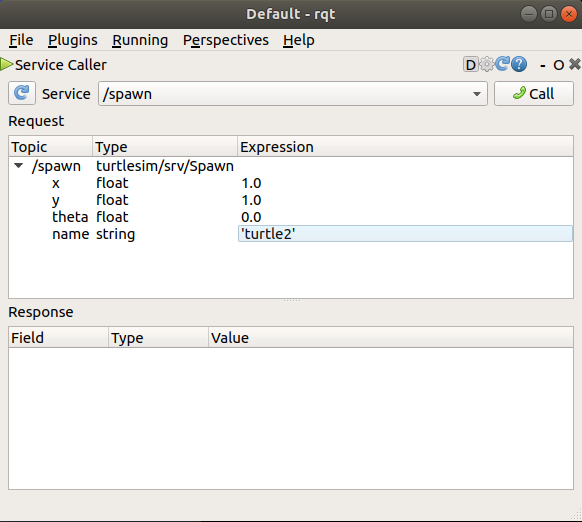
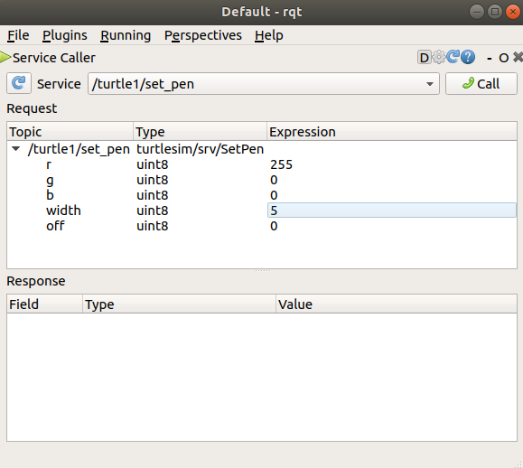
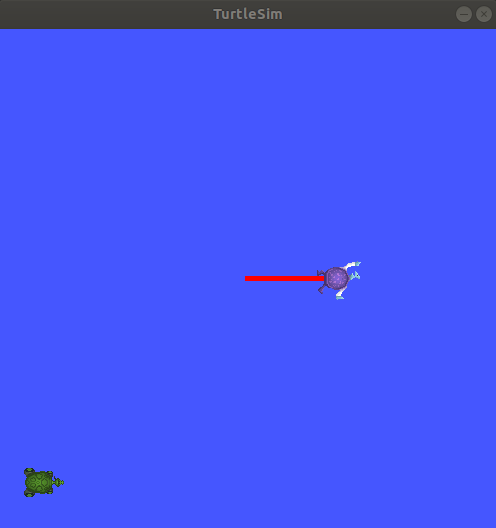
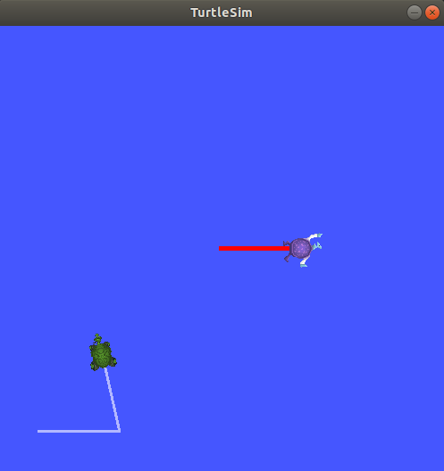

.. redirect-from::

    Tutorials/Turtlesim/Introducing-Turtlesim

.. _Turtlesim:

使用 ``turtlesim``、``ros2`` 和 ``rqt``
=======================================

**目标：** 安装并使用 turtlesim 包和 rqt 工具，为接下来的教程做准备。

**教程级别：** 入门

**用时：** 15 分钟

.. contents:: 目录
   :depth: 2
   :local:

背景
----

Turtlesim 是一个用于学习 ROS 2 的轻量级模拟器。
它展示了 ROS 2 在最基本层面上的工作方式，让你了解之后使用真实机器人或机器人模拟时将会做些什么。

ros2 工具是用户管理、内省和与 ROS 系统交互的方式。
它支持多个命令，分别针对系统的不同方面及其运行。
你可以使用它来启动节点、设置参数、监听话题等等。
ros2 工具是核心 ROS 2 安装的一部分。

rqt 是 ROS 2 的图形用户界面（GUI）工具。
在 rqt 中完成的所有操作都可以在命令行中完成，但 rqt 提供了一种更友好的方式来操作 ROS 2 元素。

本教程涉及 ROS 2 的核心概念，如节点、话题和服务。
所有这些概念都将在后续教程中详细阐述；现在，你只需设置好工具并感受一下它们。

前置条件
--------

上一篇教程 :doc:`../Configuring-ROS2-Environment` 将向你展示如何设置你的环境。

任务
----

1 安装 turtlesim
^^^^^^^^^^^^^^^^

和往常一样，首先在一个新终端中 source 你的 setup 文件，如 :doc:`上一篇教程 <../Configuring-ROS2-Environment>` 所述。

为你的 ROS 2 发行版安装 turtlesim 包：

.. tabs::

   .. group-tab:: Linux

      .. code-block:: console

        $ sudo apt update
        $ sudo apt install ros-{DISTRO}-turtlesim

   .. group-tab:: macOS

      只要你安装 ROS 2 所用的归档包含 ``ros_tutorials`` 仓库，你就应该已经安装了 turtlesim。

   .. group-tab:: Windows

      只要你安装 ROS 2 所用的归档包含 ``ros_tutorials`` 仓库，你就应该已经安装了 turtlesim。

要检查该包是否已安装，请运行以下命令，它应该会返回 turtlesim 的可执行程序列表：

.. code-block:: console

  $ ros2 pkg executables turtlesim
  turtlesim draw_square
  turtlesim mimic
  turtlesim turtle_teleop_key
  turtlesim turtlesim_node

2 启动 turtlesim
^^^^^^^^^^^^^^^^

要启动 turtlesim，请在你的终端中输入以下命令：

.. code-block:: console

  $ ros2 run turtlesim turtlesim_node
  [INFO] [turtlesim]: Starting turtlesim with node name /turtlesim
  [INFO] [turtlesim]: Spawning turtle [turtle1] at x=[5.544445], y=[5.544445], theta=[0.000000]

在命令下方，你会看到来自节点的消息。
在那里你可以看到默认乌龟的名称以及它生成的位置坐标。

模拟器窗口应该会出现，中间有一只随机外观的乌龟。

.. image:: images/turtlesim.png

3 使用 turtlesim
^^^^^^^^^^^^^^^^

打开一个新终端并再次 source ROS 2。

现在你将运行一个新节点来控制第一个节点中的乌龟：

.. code-block:: console

  $ ros2 run turtlesim turtle_teleop_key

此时你应该打开了三个窗口：一个运行 ``turtlesim_node`` 的终端、一个运行 ``turtle_teleop_key`` 的终端，以及 turtlesim 窗口。
请排列这些窗口，使你能看到 turtlesim 窗口，同时让运行 ``turtle_teleop_key`` 的终端处于活动状态，这样你就能控制 turtlesim 中的乌龟。

使用键盘上的方向键来控制乌龟。
它会在屏幕上移动，并用它附带的“画笔”画出它到目前为止走过的路径。

.. note::

  按下方向键只会让乌龟移动一小段距离然后停下。
  这是因为，现实中你不会希望机器人持续执行一条指令，例如当操作员与机器人失去连接时。

你可以使用相应命令的 ``list`` 子命令查看节点及其关联的话题、服务和动作：

.. code-block:: console

  $ ros2 node list
  $ ros2 topic list
  $ ros2 service list
  $ ros2 action list

你将在接下来的教程中了解更多关于这些概念的内容。
由于本教程的目标只是对 turtlesim 有一个总体了解，你将使用 rqt 调用 turtlesim 的一些服务，并与 ``turtlesim_node`` 进行交互。

4 安装 rqt
^^^^^^^^^^

打开一个新终端来安装 ``rqt`` 及其插件：

.. tabs::

  .. group-tab:: Ubuntu

    .. code-block:: console

      $ sudo apt update
      $ sudo apt install ros-{DISTRO}-rqt ros-{DISTRO}-rqt-common-plugins

  .. group-tab:: RHEL

    .. code-block:: console

      $ sudo dnf install 'ros-{DISTRO}-rqt*'

  .. group-tab:: macOS

    在 macOS 上安装 ROS 2 的标准归档包含 ``rqt`` 及其插件，所以你应该已经安装了 ``rqt``。

  .. group-tab:: Windows

    在 Windows 上安装 ROS 2 的标准归档包含 ``rqt`` 及其插件，所以你应该已经安装了 ``rqt``。

要运行 rqt：

.. code-block:: console

  $ rqt

5 使用 rqt
^^^^^^^^^^

首次运行 rqt 时，窗口将是空白的。
不用担心；只需从顶部的菜单栏中选择 **Plugins** > **Services** > **Service Caller**。

.. note::

  rqt 定位所有插件可能需要一些时间。
  如果你点击了 **Plugins** 但没有看到 **Services** 或任何其他选项，你应该关闭 rqt，并在终端中输入命令 ``rqt --force-discover``。

.. image:: images/rqt.png

使用 **Service** 下拉列表左侧的刷新按钮，确保你的 turtlesim 节点的所有服务都可用。

点击 **Service** 下拉列表查看 turtlesim 的服务，并选择 ``/spawn`` 服务。

5.1 尝试 spawn 服务
~~~~~~~~~~~~~~~~~~~

让我们使用 rqt 调用 ``/spawn`` 服务。
从名称你可以猜到，``/spawn`` 会在 turtlesim 窗口中创建另一只乌龟。

在 **Expression** 列的空单引号之间双击，给新乌龟起一个唯一的名称，比如 ``turtle2``。
你可以看到这个表达式对应于 **name** 的值，并且类型是 **string**。

接下来输入一些用于生成新乌龟的有效坐标，比如 ``x = 1.0`` 和 ``y = 1.0``。

.. note::

  如果你尝试生成一只与现有乌龟同名的新乌龟（比如默认的 ``turtle1``），你会在运行 ``turtlesim_node`` 的终端中看到一条错误消息：

  .. code-block:: console

    [ERROR] [turtlesim]: A turtle named [turtle1] already exists

要生成 ``turtle2``，你需要通过点击 rqt 窗口右上角的 **Call** 按钮来调用该服务。

如果服务调用成功，你应该会看到一只新乌龟（同样是随机外观）在你为 **x** 和 **y** 输入的坐标处生成。

如果你刷新 rqt 中的服务列表，你还会看到现在除了 ``/turtle1/...`` 之外，还有与新乌龟相关的服务 ``/turtle2/...``。

5.2 尝试 set_pen 服务
~~~~~~~~~~~~~~~~~~~~~

现在让我们使用 ``/set_pen`` 服务给 ``turtle1`` 一支独特的画笔：

**r**、**g** 和 **b** 的值介于 0 到 255 之间，用于设置 ``turtle1`` 绘图所用画笔的颜色，而 **width** 设置线条的粗细。

要让 ``turtle1`` 用明显的红色线条绘图，请将 **r** 的值改为 255，并将 **width** 的值改为 5。
更新值后别忘了调用该服务。

如果你回到运行 ``turtle_teleop_key`` 的终端并按下方向键，你会看到 ``turtle1`` 的画笔已经改变。

你可能也已经注意到，没有办法移动 ``turtle2``。
这是因为没有用于 ``turtle2`` 的 teleop 节点。

6 重映射
^^^^^^^^

你需要第二个 teleop 节点才能控制 ``turtle2``。
然而，如果你尝试运行与之前相同的命令，你会注意到它控制的也是 ``turtle1``。
改变这种行为的方法是对 ``cmd_vel`` 话题和 ``rotate_absolute`` 动作进行重映射。

在一个新终端中，source ROS 2，然后运行：

.. code-block:: console

  $ ros2 run turtlesim turtle_teleop_key --ros-args --remap turtle1/cmd_vel:=turtle2/cmd_vel --remap turtle1/rotate_absolute:=turtle2/rotate_absolute

现在，当这个终端处于活动状态时，你可以移动 ``turtle2``；当另一个运行 ``turtle_teleop_key`` 的终端处于活动状态时，你可以移动 ``turtle1``。

7 关闭 turtlesim
^^^^^^^^^^^^^^^^

要停止模拟，你可以在 ``turtlesim_node`` 终端中输入 ``Ctrl + C``，并在 ``turtle_teleop_key`` 终端中输入 ``q``。

小结
----

使用 turtlesim 和 rqt 是学习 ROS 2 核心概念的绝佳方式。

下一步
------

既然你已经让 turtlesim 和 rqt 运行起来，并对它们的工作方式有了概念，让我们通过下一篇教程 :doc:`../Understanding-ROS2-Nodes/Understanding-ROS2-Nodes` 深入学习第一个核心 ROS 2 概念。

相关内容
--------

turtlesim 包可以在 `ros_tutorials <https://github.com/ros/ros_tutorials/tree/{REPOS_FILE_BRANCH}/turtlesim>`_ 仓库中找到。
