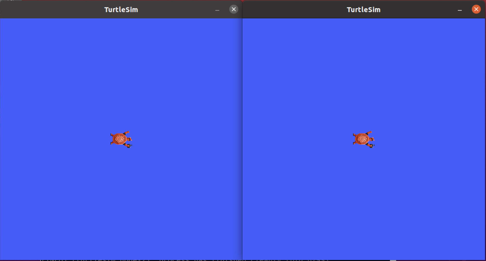
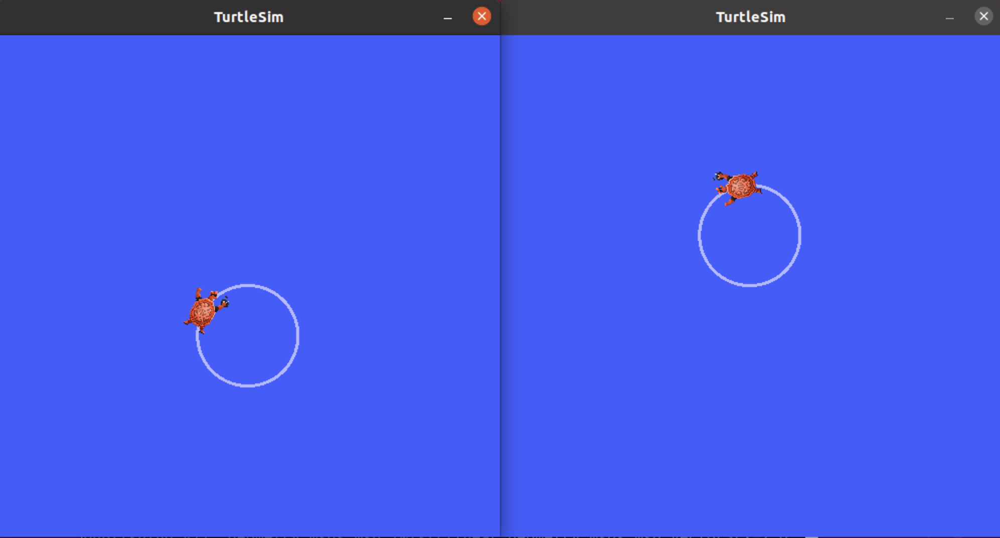

.. redirect-from::

    Tutorials/Launch/CLI-Intro

.. _ROS2Launch:

启动节点
========

**目标：** 使用命令行工具一次性启动多个节点。

**教程级别：** 初学者

**时长：** 5 分钟

.. contents:: 目录
   :depth: 2
   :local:

背景
----

在大多数入门教程中，你每运行一个新节点都要打开一个新终端。
随着你创建的系统越来越复杂、需要同时运行的节点越来越多，反复打开终端并重新输入配置细节会变得十分繁琐。

启动文件允许你同时启动并配置多个包含 ROS 2 节点的可执行文件。

使用 ``ros2 launch`` 命令运行单个启动文件，就能一次性启动你的整个系统——包括所有节点及其配置。

前提条件
--------

在开始这些教程之前，请按照 ROS 2 :doc:`../../../Installation/` 页面上的说明安装 ROS 2。

本教程中使用的命令假定你按照适用于你操作系统的二进制软件包安装指南进行了安装（Linux 使用 deb 软件包）。
如果你是从源码构建的，仍然可以跟随本教程操作，但你的设置文件路径可能会有所不同。
如果你从源码安装，也无法使用 ``sudo apt install ros-<distro>-<package>`` 命令（该命令在初级教程中经常使用）。

如果你使用 Linux 且还不熟悉 shell，`本教程 <https://www.linux.com/training-tutorials/bash-101-working-cli/>`__ 会有所帮助。

一如既往，别忘了在你打开的 :doc:`每个新终端 <../Configuring-ROS2-Environment>` 中 source ROS 2。

任务
----

运行启动文件
^^^^^^^^^^^^

打开一个新终端并运行：

.. code-block:: console

   $ ros2 launch turtlesim multisim.launch.py

该命令将运行以下启动文件：

.. literalinclude:: launch/multisim.launch.py
   :language: python

.. note::

  上面的启动文件是用 Python 编写的，但你也可以使用 XML 和 YAML 来创建启动文件。
  你可以在 :doc:`../../../How-To-Guides/Launch-file-different-formats` 中查看这些不同 ROS 2 启动格式的对比。

这将运行两个 turtlesim 节点：

目前不必担心这个启动文件的内容。
你可以在 :doc:`ROS 2 启动教程 <../../Intermediate/Launch/Launch-Main>` 中了解关于 ROS 2 启动的更多信息。

（可选）控制 turtlesim 节点
^^^^^^^^^^^^^^^^^^^^^^^^^^^

既然这些节点已在运行，你就可以像控制任何其他 ROS 2 节点一样控制它们。
例如，你可以再打开两个终端并运行以下命令，让两只海龟朝相反方向移动：

在第二个终端中：

.. code-block:: console

   $ ros2 topic pub  /turtlesim1/turtle1/cmd_vel geometry_msgs/msg/Twist "{linear: {x: 2.0, y: 0.0, z: 0.0}, angular: {x: 0.0, y: 0.0, z: 1.8}}"

在第三个终端中：

.. code-block:: console

   $ ros2 topic pub  /turtlesim2/turtle1/cmd_vel geometry_msgs/msg/Twist "{linear: {x: 2.0, y: 0.0, z: 0.0}, angular: {x: 0.0, y: 0.0, z: -1.8}}"

运行这些命令后，你应该会看到类似以下的内容：

概述
----

到目前为止你所做事情的意义在于：你只用一条命令就运行了两个 turtlesim 节点。
一旦你学会编写自己的启动文件，就能以类似的方式使用 ``ros2 launch`` 命令运行多个节点并设置它们的配置。

有关 ROS 2 启动文件的更多教程，请参阅 :doc:`启动文件教程主页<../../Intermediate/Launch/Launch-Main>`。

后续步骤
--------

在下一个教程 :doc:`../Recording-And-Playing-Back-Data/Recording-And-Playing-Back-Data` 中，你将了解另一个很有用的工具 ``ros2 bag``。
