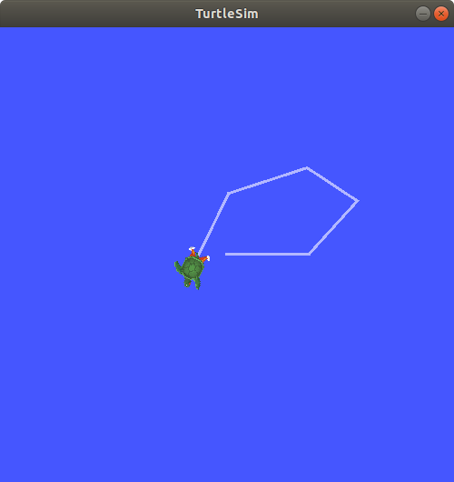
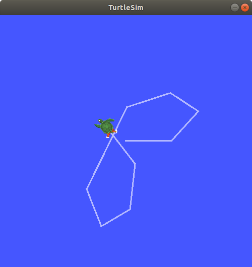

.. redirect-from::

    Tutorials/Ros2bag/Recording-And-Playing-Back-Data

.. _ROS2Bag:

录制与回放数据
==============

**目标：** 录制发布在话题和服务上的数据，以便随时回放和检查。

**教程级别：** 入门

**用时：** 15 分钟

.. contents:: 目录
   :depth: 2
   :local:

背景
----

``ros2 bag`` 是一个命令行工具，用于录制 ROS 2 系统中发布在话题和服务上的数据。
它会累积任意数量的话题和服务上传递的数据，然后保存到数据库中。
之后你可以回放数据，重现测试和实验的结果。
录制话题和服务也是分享你的工作、让他人复现的好方法。

前置条件
--------

你的常规 ROS 2 环境安装中应该已经包含 ``ros2 bag``。

如果你需要安装 ROS 2，请参阅 :doc:`安装说明 <../../../Installation>`。

本教程讨论了先前教程中介绍的概念，如 :doc:`节点 <../Understanding-ROS2-Nodes/Understanding-ROS2-Nodes>`、:doc:`话题 <../Understanding-ROS2-Topics/Understanding-ROS2-Topics>` 和 :doc:`服务 <../Understanding-ROS2-Services/Understanding-ROS2-Services>`。
它还会用到 :doc:`turtlesim 包 <../Introducing-Turtlesim/Introducing-Turtlesim>` 和 :doc:`服务内省演示 <../../Demos/Service-Introspection>`。

和往常一样，别忘了在 :doc:`每一个你新打开的终端 <../Configuring-ROS2-Environment>` 中 source ROS 2。

管理话题数据
------------

1 准备
^^^^^^

你将录制 ``turtlesim`` 系统中的键盘输入，以便稍后保存和回放，所以首先启动 ``/turtlesim`` 和 ``/teleop_turtle`` 节点。

打开一个新终端并运行：

.. code-block:: console

    $ ros2 run turtlesim turtlesim_node

打开另一个终端并运行：

.. code-block:: console

    $ ros2 run turtlesim turtle_teleop_key

作为良好的习惯，让我们再创建一个新目录来存放我们的录制文件：

.. tabs::

    .. group-tab:: Linux

        .. code-block:: console

            $ mkdir bag_files
            $ cd bag_files

    .. group-tab:: macOS

        .. code-block:: console

            $ mkdir bag_files
            $ cd bag_files

    .. group-tab:: Windows

        .. code-block:: console

            $ md bag_files
            $ cd bag_files

2 选择一个话题
^^^^^^^^^^^^^^

``ros2 bag`` 可以从发布到话题的消息中录制数据。
要查看系统的话题列表，请打开一个新终端并运行命令：

.. code-block:: console

  $ ros2 topic list
  /parameter_events
  /rosout
  /turtle1/cmd_vel
  /turtle1/color_sensor
  /turtle1/pose

在话题教程中，你了解到 ``/turtle_teleop`` 节点在 ``/turtle1/cmd_vel`` 话题上发布命令，使乌龟在 turtlesim 中移动。

要查看 ``/turtle1/cmd_vel`` 正在发布的数据，请运行命令：

.. code-block:: console

    $ ros2 topic echo /turtle1/cmd_vel

一开始什么都不会显示，因为 teleop 还没有发布任何数据。
返回你运行 teleop 的终端并选中它，使其处于活动状态。
使用方向键移动乌龟，你就会看到数据发布在运行 ``ros2 topic echo`` 的终端上。

.. code-block:: console

  linear:
    x: 2.0
    y: 0.0
    z: 0.0
  angular:
    x: 0.0
    y: 0.0
    z: 0.0
    ---

3 录制话题
^^^^^^^^^^

3.1 录制单个话题
~~~~~~~~~~~~~~~~

要录制发布到某个话题的数据，请使用以下命令语法：

.. code-block:: console

    $ ros2 bag record <topic_name>

在你选定的话题上运行此命令之前，请打开一个新终端并进入你之前创建的 ``bag_files`` 目录，因为 rosbag 文件会保存在你运行它的目录中。

运行命令：

.. code-block:: console

    $ ros2 bag record /turtle1/cmd_vel
    [INFO] [rosbag2_storage]: Opened database 'rosbag2_2019_10_11-05_18_45'.
    [INFO] [rosbag2_transport]: Listening for topics...
    [INFO] [rosbag2_transport]: Subscribed to topic '/turtle1/cmd_vel'
    [INFO] [rosbag2_transport]: All requested topics are subscribed. Stopping discovery...

现在 ``ros2 bag`` 正在录制发布在 ``/turtle1/cmd_vel`` 话题上的数据。
返回 teleop 终端，再次移动乌龟。
移动方式并不重要，但尽量做出一个可识别的图案，以便稍后回放数据时能看到。

按 ``Ctrl+C`` 停止录制。

数据将累积到一个新的 bag 目录中，目录名的格式为 ``rosbag2_年_月_日-时_分_秒``。
该目录将包含一个 ``metadata.yaml`` 以及按录制格式保存的 bag 文件。

3.2 录制多个话题
~~~~~~~~~~~~~~~~

你也可以录制多个话题，并更改 ``ros2 bag`` 保存文件的名称。

运行以下命令：

.. code-block:: console

  $ ros2 bag record -o subset /turtle1/cmd_vel /turtle1/pose
  [INFO] [rosbag2_storage]: Opened database 'subset'.
  [INFO] [rosbag2_transport]: Listening for topics...
  [INFO] [rosbag2_transport]: Subscribed to topic '/turtle1/cmd_vel'
  [INFO] [rosbag2_transport]: Subscribed to topic '/turtle1/pose'
  [INFO] [rosbag2_transport]: All requested topics are subscribed. Stopping discovery...

``-o`` 选项允许你为 bag 文件选择一个唯一的名称。
后面的字符串，在本例中是 ``subset``，就是文件名。

要同时录制多个话题，只需用空格分隔每个话题。
在本例中，上面的命令输出确认了两个话题都在被录制。

你可以移动乌龟，完成后按 ``Ctrl+C``。

.. note::

    你还可以给命令添加另一个选项 ``-a``，它会录制系统中的所有话题。

4 检查话题数据
^^^^^^^^^^^^^^

你可以通过运行以下命令查看录制的详细信息：

.. code-block:: console

    $ ros2 bag info <bag_file_name>

对 ``subset`` bag 文件运行此命令，将返回该文件的信息列表：

.. code-block:: console

    $ ros2 bag info subset
    Files:             subset.mcap
    Bag size:          228.5 KiB
    Storage id:        mcap
    Duration:          48.47s
    Start:             Oct 11 2019 06:09:09.12 (1570799349.12)
    End                Oct 11 2019 06:09:57.60 (1570799397.60)
    Messages:          3013
    Topic information: Topic: /turtle1/cmd_vel | Type: geometry_msgs/msg/Twist | Count: 9 | Serialization Format: cdr
                       Topic: /turtle1/pose | Type: turtlesim/msg/Pose | Count: 3004 | Serialization Format: cdr

5 回放话题数据
^^^^^^^^^^^^^^

在回放 bag 文件之前，在运行 teleop 的终端中输入 ``Ctrl+C``。
然后确保 turtlesim 窗口可见，这样你就能看到 bag 文件的回放效果。

输入命令：

.. code-block:: console

    $ ros2 bag play subset
    [INFO] [rosbag2_storage]: Opened database 'subset'.

你的乌龟将沿着你录制时输入的相同路径移动（虽然不是 100% 完全一致；turtlesim 对系统时序的微小变化很敏感）。

由于 ``subset`` 文件录制了 ``/turtle1/pose`` 话题，只要 turtlesim 还在运行，``ros2 bag play`` 命令就不会退出，即使你当时没有移动。

这是因为只要 ``/turtlesim`` 节点处于活动状态，它就会定期在 ``/turtle1/pose`` 话题上发布数据。
你可能已经注意到，在上面的 ``ros2 bag info`` 示例结果中，``/turtle1/cmd_vel`` 话题的 ``Count`` 信息只有 9；这就是我们在录制时按下方向键的次数。

注意，``/turtle1/pose`` 的 ``Count`` 值超过了 3000；在我们录制期间，数据在该话题上发布了 3000 次。

要了解位置数据的发布频率，你可以运行命令：

.. code-block:: console

    $ ros2 topic hz /turtle1/pose

管理服务数据
------------

1 准备
^^^^^^

你将录制 ``introspection_client`` 和 ``introspection_service`` 之间的服务数据，然后再显示和回放相同的数据。
要在服务客户端和服务器之间录制服务数据，节点上必须启用 ``Service Introspection``。

让我们启动 ``introspection_client`` 和 ``introspection_service`` 节点，并启用 ``Service Introspection``。
你可以在 :doc:`服务内省演示 <../../Demos/Service-Introspection>` 中查看更多细节。

打开一个新终端并运行 ``introspection_service``，启用 ``Service Introspection``：

.. code-block:: console

    $ ros2 run demo_nodes_cpp introspection_service --ros-args -p service_configure_introspection:=contents

打开另一个终端并运行 ``introspection_client``，启用 ``Service Introspection``：

.. code-block:: console

    $ ros2 run demo_nodes_cpp introspection_client --ros-args -p client_configure_introspection:=contents

2 检查服务可用性
^^^^^^^^^^^^^^^^

``ros2 bag`` 只能从可用的服务录制数据。
要查看系统的服务列表，请打开一个新终端并运行命令：

.. code-block:: console

  $ ros2 service list
  /add_two_ints
  /introspection_client/describe_parameters
  /introspection_client/get_parameter_types
  /introspection_client/get_parameters
  /introspection_client/get_type_description
  /introspection_client/list_parameters
  /introspection_client/set_parameters
  /introspection_client/set_parameters_atomically
  /introspection_service/describe_parameters
  /introspection_service/get_parameter_types
  /introspection_service/get_parameters
  /introspection_service/get_type_description
  /introspection_service/list_parameters
  /introspection_service/set_parameters
  /introspection_service/set_parameters_atomically

要检查客户端和服务上是否启用了 ``Service Introspection``，请运行命令：

.. code-block:: console

  $ ros2 service echo --flow-style /add_two_ints
  info:
    event_type: REQUEST_SENT
    stamp:
      sec: 1713995389
      nanosec: 386809259
    client_gid: [1, 15, 96, 219, 162, 1, 108, 201, 0, 0, 0, 0, 0, 0, 21, 3]
    sequence_number: 133
  request: [{a: 2, b: 3}]
  response: []
  ---

你应该会看到服务通信。

3 录制服务
^^^^^^^^^^

要录制服务数据，支持以下选项。
服务数据可以与话题数据同时录制。

要录制特定服务：

.. code-block:: console

  $ ros2 bag record --service <service_names>

要录制所有服务：

.. code-block:: console

  $ ros2 bag record --all-services

运行命令：

.. code-block:: console

  $ ros2 bag record --service /add_two_ints
  [INFO] [1713995957.643573503] [rosbag2_recorder]: Press SPACE for pausing/resuming
  [INFO] [1713995957.662067587] [rosbag2_recorder]: Event publisher thread: Starting
  [INFO] [1713995957.662067614] [rosbag2_recorder]: Listening for topics...
  [INFO] [1713995957.666048323] [rosbag2_recorder]: Subscribed to topic '/add_two_ints/_service_event'
  [INFO] [1713995957.666092458] [rosbag2_recorder]: Recording...

现在 ``ros2 bag`` 正在录制发布在 ``/add_two_ints`` 服务上的服务数据。
要停止录制，请在终端中输入 ``Ctrl+C``。

数据将累积到一个新的 bag 目录中，目录名的格式为 ``rosbag2_年_月_日-时_分_秒``。
该目录将包含一个 ``metadata.yaml`` 以及按录制格式保存的 bag 文件。

4 检查服务数据
^^^^^^^^^^^^^^

你可以通过运行以下命令查看录制的详细信息：

.. code-block:: console

  $ ros2 bag info <bag_file_name>
  Files:             rosbag2_2024_04_24-14_59_17_0.mcap
  Bag size:          15.1 KiB
  Storage id:        mcap
  ROS Distro:        rolling
  Duration:          9.211s
  Start:             Apr 24 2024 14:59:17.676 (1713995957.676)
  End:               Apr 24 2024 14:59:26.888 (1713995966.888)
  Messages:          0
  Topic information:
  Service:           1
  Service information: Service: /add_two_ints | Type: example_interfaces/srv/AddTwoInts | Event Count: 78 | Serialization Format: cdr

5 回放服务数据
^^^^^^^^^^^^^^

在回放 bag 文件之前，在运行 ``introspection_client`` 的终端中输入 ``Ctrl+C``。
当 ``introspection_client`` 停止运行时，``introspection_service`` 也会因为没有传入请求而停止打印结果。

回放 bag 文件中的服务数据将开始向 ``introspection_service`` 发送请求。

输入命令：

.. code-block:: console

  $ ros2 bag play --publish-service-requests <bag_file_name>
  [INFO] [1713997477.870856190] [rosbag2_player]: Set rate to 1
  [INFO] [1713997477.877417477] [rosbag2_player]: Adding keyboard callbacks.
  [INFO] [1713997477.877442404] [rosbag2_player]: Press SPACE for Pause/Resume
  [INFO] [1713997477.877447855] [rosbag2_player]: Press CURSOR_RIGHT for Play Next Message
  [INFO] [1713997477.877452655] [rosbag2_player]: Press CURSOR_UP for Increase Rate 10%
  [INFO] [1713997477.877456954] [rosbag2_player]: Press CURSOR_DOWN for Decrease Rate 10%
  [INFO] [1713997477.877573647] [rosbag2_player]: Playback until timestamp: -1

你的 ``introspection_service`` 终端将再次开始打印以下服务消息：

.. code-block:: console

  [INFO] [1713997478.090466075] [introspection_service]: Incoming request
  a: 2 b: 3

这是因为 ``ros2 bag play`` 将 bag 文件中的服务请求数据发送到了 ``/add_two_ints`` 服务。

我们还可以在 ``ros2 bag play`` 回放时内省服务通信，以验证 ``introspection_service``。

在 ``ros2 bag play`` 之前运行此命令以查看 ``introspection_service``：

.. code-block:: console

  $ ros2 service echo --flow-style /add_two_ints

你可以看到来自 bag 文件的服务请求和来自 ``introspection_service`` 的服务响应。

.. code-block:: console

  info:
    event_type: REQUEST_RECEIVED
    stamp:
      sec: 1713998176
      nanosec: 372700698
    client_gid: [1, 15, 96, 219, 80, 2, 158, 123, 0, 0, 0, 0, 0, 0, 20, 4]
    sequence_number: 1
  request: [{a: 2, b: 3}]
  response: []
  ---
  info:
    event_type: RESPONSE_SENT
    stamp:
      sec: 1713998176
      nanosec: 373016882
    client_gid: [1, 15, 96, 219, 80, 2, 158, 123, 0, 0, 0, 0, 0, 0, 20, 4]
    sequence_number: 1
  request: []
  response: [{sum: 5}]

小结
----

你可以使用 ``ros2 bag`` 命令录制 ROS 2 系统中在话题和服务上传递的数据。
无论你是要与他人分享工作，还是内省自己的实验，它都是一个值得了解的好工具。

下一步
------

你已经完成了“入门：CLI 工具”教程！
下一步是“入门：客户端库”教程，从 :doc:`../../Beginner-Client-Libraries/Creating-A-Workspace/Creating-A-Workspace` 开始。

相关内容
--------

关于 ``ros2 bag`` 的更详细说明可以在 README `这里 <https://github.com/ros2/rosbag2>`__ 找到。
关于服务录制与回放的更多信息，可以在设计文档 `这里 <https://github.com/ros2/rosbag2/blob/{DISTRO}/docs/design/rosbag2_record_replay_service.md>`__ 找到。
关于 QoS 兼容性与 ``ros2 bag`` 的更多信息，请参阅 :doc:`../../../How-To-Guides/Overriding-QoS-Policies-For-Recording-And-Playback`。
