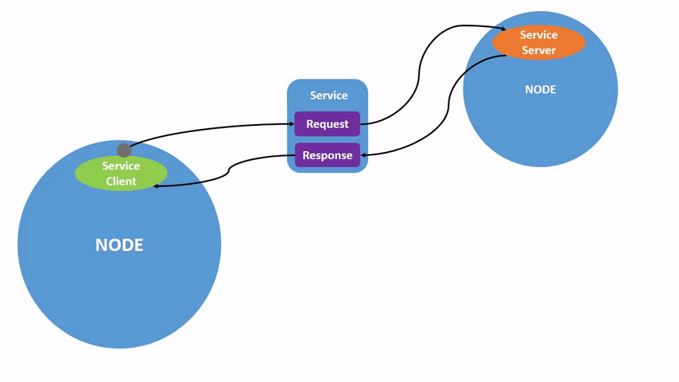

.. redirect-from::

    Tutorials/Services/Understanding-ROS2-Services

.. _ROS2Services:

理解服务
========

**目标：** 使用命令行工具了解 ROS 2 中的服务。

**教程级别：** 入门

**用时：** 10 分钟

.. contents:: 目录
   :depth: 2
   :local:

背景
----

服务是 ROS 图中节点之间通信的另一种方式。
服务基于“调用-响应”模型，而话题基于发布者-订阅者模型。
话题允许节点订阅数据流并持续获得更新，而服务只有在被客户端明确调用时才提供数据。

.. image:: images/Service-MultipleServiceClient.gif

前置条件
--------

本教程中提到的一些概念，如 :doc:`节点 <../Understanding-ROS2-Nodes/Understanding-ROS2-Nodes>` 和 :doc:`话题 <../Understanding-ROS2-Topics/Understanding-ROS2-Topics>`，已在本系列的先前教程中介绍过。

你需要 :doc:`turtlesim 包 <../Introducing-Turtlesim/Introducing-Turtlesim>`。

和往常一样，别忘了在 :doc:`每一个你新打开的终端 <../Configuring-ROS2-Environment>` 中 source ROS 2。

任务
----

1 准备
^^^^^^
启动两个 turtlesim 节点：``/turtlesim`` 和 ``/teleop_turtle``。

打开一个新终端并运行：

.. code-block:: console

  $ ros2 run turtlesim turtlesim_node

打开另一个终端并运行：

.. code-block:: console

  $ ros2 run turtlesim turtle_teleop_key

2 ros2 service list
^^^^^^^^^^^^^^^^^^^

在一个新终端中运行 ``ros2 service list`` 命令，将返回系统中当前所有活动服务的列表：

.. code-block:: console

  $ ros2 service list
  /clear
  /kill
  /reset
  /spawn
  /teleop_turtle/describe_parameters
  /teleop_turtle/get_parameter_types
  /teleop_turtle/get_parameters
  /teleop_turtle/list_parameters
  /teleop_turtle/set_parameters
  /teleop_turtle/set_parameters_atomically
  /turtle1/set_pen
  /turtle1/teleport_absolute
  /turtle1/teleport_relative
  /turtlesim/describe_parameters
  /turtlesim/get_parameter_types
  /turtlesim/get_parameters
  /turtlesim/list_parameters
  /turtlesim/set_parameters
  /turtlesim/set_parameters_atomically

你会看到两个节点都有六个名称中包含 ``parameters`` 的相同服务。
ROS 2 中几乎每个节点都有这些参数所依赖的基础设施服务。
关于参数的更多内容将在下一篇教程中介绍。
在本教程中，将省略对这些参数服务的讨论。

现在，让我们专注于 turtlesim 特有的服务：``/clear``、``/kill``、``/reset``、``/spawn``、``/turtle1/set_pen``、``/turtle1/teleport_absolute`` 和 ``/turtle1/teleport_relative``。
你可能还记得在 :doc:`使用 turtlesim、ros2 和 rqt <../Introducing-Turtlesim/Introducing-Turtlesim>` 教程中使用 rqt 与其中一些服务进行过交互。

3 ros2 service type
^^^^^^^^^^^^^^^^^^^

服务有类型，用于描述服务的请求和响应数据是如何构成的。
服务类型的定义方式与话题类型类似，只不过服务类型有两个部分：一个用于请求的消息和一个用于响应的消息。

要找出服务的类型，请使用命令：

.. code-block:: console

  $ ros2 service type <service_name>

让我们看看 turtlesim 的 ``/clear`` 服务。
在一个新终端中，输入命令：

.. code-block:: console

  $ ros2 service type /clear
  std_srvs/srv/Empty

``Empty`` 类型意味着该服务调用在发起请求时不发送任何数据，在接收响应时也不接收任何数据。

3.1 ros2 service list -t
~~~~~~~~~~~~~~~~~~~~~~~~

要同时查看所有活动服务的类型，你可以在 ``list`` 命令后追加 ``--show-types`` 选项（缩写为 ``-t``）：

.. code-block:: console

  $ ros2 service list -t
  /clear [std_srvs/srv/Empty]
  /kill [turtlesim/srv/Kill]
  /reset [std_srvs/srv/Empty]
  /spawn [turtlesim/srv/Spawn]
  ...
  /turtle1/set_pen [turtlesim/srv/SetPen]
  /turtle1/teleport_absolute [turtlesim/srv/TeleportAbsolute]
  /turtle1/teleport_relative [turtlesim/srv/TeleportRelative]
  ...

4 ros2 service info
^^^^^^^^^^^^^^^^^^^

要查看某个特定服务的信息，请使用命令：

.. code-block:: console

  $ ros2 service info <service_name>

这会返回服务类型以及服务客户端和服务器的数量。

例如，你可以查看 ``/clear`` 服务的客户端和服务器数量：

.. code-block:: console

   $ ros2 service info /clear
   Type: std_srvs/srv/Empty
   Clients count: 0
   Services count: 1

5 ros2 service find
^^^^^^^^^^^^^^^^^^^

如果你想查找某个特定类型的所有服务，可以使用命令：

.. code-block:: console

  $ ros2 service find <type_name>

例如，你可以这样查找所有 ``Empty`` 类型的服务：

.. code-block:: console

  $ ros2 service find std_srvs/srv/Empty
  /clear
  /reset

6 ros2 interface show
^^^^^^^^^^^^^^^^^^^^^

你可以从命令行调用服务，但首先需要知道输入参数的结构。

.. code-block:: console

  $ ros2 interface show <type_name>

试试对 ``/clear`` 服务的类型 ``Empty`` 执行此命令：

.. code-block:: console

  $ ros2 interface show std_srvs/srv/Empty
  ---

``---`` 将请求结构（上方）与响应结构（下方）分隔开。
但是，正如你之前了解到的，``Empty`` 类型不发送或接收任何数据。
因此，它的结构自然是空白的。

让我们内省一个类型会发送和接收数据的服务，比如 ``/spawn``。
从 ``ros2 service list -t`` 的结果中，我们知道 ``/spawn`` 的类型是 ``turtlesim/srv/Spawn``。

要查看 ``/spawn`` 服务的请求和响应参数，请运行命令：

.. code-block:: console

  $ ros2 interface show turtlesim/srv/Spawn
  float32 x
  float32 y
  float32 theta
  string name # Optional.  A unique name will be created and returned if this is empty
  ---
  string name

``---`` 行上方的信息告诉了我们调用 ``/spawn`` 所需的参数。
``x``、``y`` 和 ``theta`` 决定了所生成乌龟的二维位姿，而 ``name`` 显然是可选的。

行下方的信息在本例中不是你需要了解的，但它可以帮助你理解从调用中获得的响应的数据类型。

7 ros2 service call
^^^^^^^^^^^^^^^^^^^

既然你已经知道什么是服务类型、如何查找服务的类型，以及如何找到该类型参数的结构，你就可以使用以下命令调用服务了：

.. code-block:: console

  $ ros2 service call <service_name> <service_type> <arguments>

``<arguments>`` 部分是可选的。
例如，你知道 ``Empty`` 类型的服务没有任何参数：

.. code-block:: console

  $ ros2 service call /clear std_srvs/srv/Empty

这条命令将清除 turtlesim 窗口中乌龟已绘制的所有线条。

.. image:: images/clear.png

现在让我们通过调用 ``/spawn`` 并设置参数来生成一只新乌龟。
在命令行中调用服务时输入的 ``<arguments>`` 需要采用 YAML 语法。

输入命令：

.. code-block:: console

  $ ros2 service call /spawn turtlesim/srv/Spawn "{x: 2, y: 2, theta: 0.2, name: ''}"
  requester: making request: turtlesim.srv.Spawn_Request(x=2.0, y=2.0, theta=0.2, name='')

  response:
  turtlesim.srv.Spawn_Response(name='turtle2')

你将看到这种关于所发生事情的方法式视图，然后是服务响应。

你的 turtlesim 窗口会立即更新，显示新生成的乌龟：

.. image:: images/spawn.png

8 ros2 service echo
^^^^^^^^^^^^^^^^^^^

要查看服务客户端和服务服务器之间的数据通信，你可以使用以下命令 ``echo`` 该服务：

.. code-block:: console

  $ ros2 service echo <service_name | service_type> <arguments>

``ros2 service echo`` 依赖服务客户端和服务器的服务内省，该功能默认是禁用的。
要启用它，用户必须在创建服务客户端或服务器后调用 ``configure_introspection``。

启动 ``introspection_client`` 和 ``introspection_service`` 服务内省演示。

.. code-block:: console

  $ ros2 launch demo_nodes_cpp introspect_services_launch.py

打开另一个终端并运行以下命令，为 ``introspection_client`` 和 ``introspection_service`` 启用服务内省。

.. code-block:: console

  $ ros2 param set /introspection_service service_configure_introspection contents
  $ ros2 param set /introspection_client client_configure_introspection contents

现在我们可以通过 ``ros2 service echo`` 查看 ``introspection_client`` 和 ``introspection_service`` 之间的服务通信了。

.. code-block:: console

  $ ros2 service echo --flow-style /add_two_ints
   info:
     event_type: REQUEST_SENT
     stamp:
       sec: 1709408301
       nanosec: 423227292
     client_gid: [1, 15, 0, 18, 250, 205, 12, 100, 0, 0, 0, 0, 0, 0, 21, 3]
     sequence_number: 618
   request: [{a: 2, b: 3}]
   response: []
   ---
   info:
     event_type: REQUEST_RECEIVED
     stamp:
       sec: 1709408301
       nanosec: 423601471
     client_gid: [1, 15, 0, 18, 250, 205, 12, 100, 0, 0, 0, 0, 0, 0, 20, 4]
     sequence_number: 618
   request: [{a: 2, b: 3}]
   response: []
   ---
   info:
     event_type: RESPONSE_SENT
     stamp:
       sec: 1709408301
       nanosec: 423900744
     client_gid: [1, 15, 0, 18, 250, 205, 12, 100, 0, 0, 0, 0, 0, 0, 20, 4]
     sequence_number: 618
   request: []
   response: [{sum: 5}]
   ---
   info:
     event_type: RESPONSE_RECEIVED
     stamp:
       sec: 1709408301
       nanosec: 424153133
     client_gid: [1, 15, 0, 18, 250, 205, 12, 100, 0, 0, 0, 0, 0, 0, 21, 3]
     sequence_number: 618
   request: []
   response: [{sum: 5}]
   ---

小结
----

节点可以在 ROS 2 中使用服务进行通信。
与话题（一种单向通信模式，节点发布可被一个或多个订阅者消费的信息）不同，服务是一种请求/响应模式，客户端向提供服务器的节点发起请求，服务处理请求并生成响应。

你通常不会想用服务来进行连续调用；话题甚至动作会更合适。

在本教程中，你使用命令行工具来识别、内省和调用服务。

下一步
------

在下一篇教程 :doc:`../Understanding-ROS2-Parameters/Understanding-ROS2-Parameters` 中，你将学习如何配置节点设置。

相关内容
--------

看看 `这个教程 <https://discourse.ubuntu.com/t/call-services-in-ros-2/15261>`_；它是一个使用 Robotis 机械臂的 ROS 服务的优秀实际应用。
