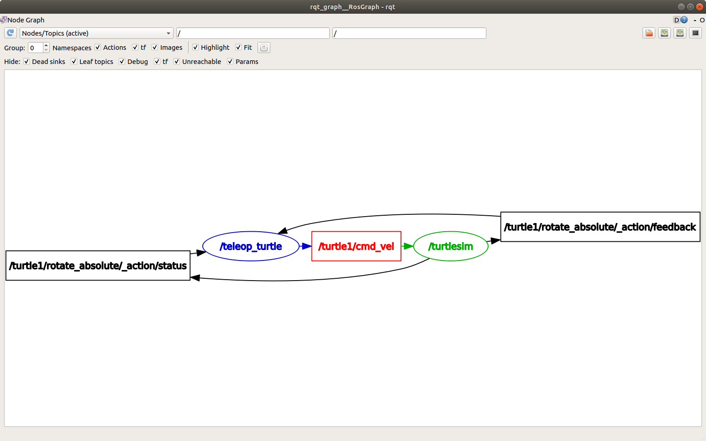

.. redirect-from::

    Tutorials/Topics/Understanding-ROS2-Topics

.. _ROS2Topics:

理解话题
========

**目标：** 使用 rqt_graph 和命令行工具内省 ROS 2 话题。

**教程级别：** 入门

**时间：** 20 分钟

.. contents:: 目录
   :depth: 2
   :local:

背景
----

ROS 2 将复杂系统分解为许多模块化节点。
话题是 ROS 图的重要组成部分，它充当节点之间交换消息的总线。

.. image:: images/Topic-SinglePublisherandSingleSubscriber.gif

一个节点可以向任意数量的话题发布数据，同时订阅任意数量的话题。

.. image:: images/Topic-MultiplePublisherandMultipleSubscriber.gif

话题是数据在节点之间、进而在系统不同部分之间流动的主要方式之一。

前置条件
--------

:doc:`上一篇教程 <../Understanding-ROS2-Nodes/Understanding-ROS2-Nodes>` 提供了一些关于节点的有用背景信息，本教程在此基础上继续。

和往常一样，别忘了在 :doc:`你打开的每一个新终端 <../Configuring-ROS2-Environment>` 中 source ROS 2。

任务
----

1 准备
^^^^^^

到目前为止，你应该已经能够熟练地启动 turtlesim 了。

打开一个新终端并运行：

.. code-block:: console

    $ ros2 run turtlesim turtlesim_node

打开另一个终端并运行：

.. code-block:: console

    $ ros2 run turtlesim turtle_teleop_key

回顾一下 :doc:`上一篇教程 <../Understanding-ROS2-Nodes/Understanding-ROS2-Nodes>`，这两个节点的默认名称分别是 ``/turtlesim`` 和 ``/teleop_turtle``。

2 rqt_graph
^^^^^^^^^^^

在本教程的整个过程中，我们将使用 ``rqt_graph`` 来可视化不断变化的节点和话题，以及它们之间的连接。

:doc:`turtlesim 教程 <../Introducing-Turtlesim/Introducing-Turtlesim>` 告诉你如何安装 rqt 及其所有插件，包括 ``rqt_graph``。

要运行 rqt_graph，请打开一个新终端并输入命令：

.. code-block:: console

    $ ros2 run rqt_graph rqt_graph

你也可以通过打开 ``rqt`` 并选择 **Plugins** > **Introspection** > **Node Graph** 来打开 rqt_graph。

你应该会看到上面提到的节点和话题，以及图外围的两个动作（我们现在先忽略它们）。
如果你将鼠标悬停在中间的话题上，你会看到如上图所示的颜色高亮。

该图描绘了 ``/turtlesim`` 节点和 ``/teleop_turtle`` 节点如何通过一个话题相互通信。
``/teleop_turtle`` 节点正在向 ``/turtle1/cmd_vel`` 话题发布数据（你输入的用于移动乌龟的按键），而 ``/turtlesim`` 节点订阅了该话题以接收数据。

在检查具有许多以各种不同方式连接的节点和话题的复杂系统时，rqt_graph 的高亮功能非常有用。

rqt_graph 是一个图形化内省工具。
现在我们来看看一些用于内省话题的命令行工具。

3 ros2 topic list
^^^^^^^^^^^^^^^^^

在一个新终端中运行 ``ros2 topic list`` 命令，会返回系统中当前所有活动话题的列表：

.. code-block:: console

  $ ros2 topic list
  /parameter_events
  /rosout
  /turtle1/cmd_vel
  /turtle1/color_sensor
  /turtle1/pose

``ros2 topic list -t`` 会返回相同的话题列表，只不过这次在方括号中附加了话题类型：

.. code-block:: console

  $ ros2 topic list -t
  /parameter_events [rcl_interfaces/msg/ParameterEvent]
  /rosout [rcl_interfaces/msg/Log]
  /turtle1/cmd_vel [geometry_msgs/msg/Twist]
  /turtle1/color_sensor [turtlesim/msg/Color]
  /turtle1/pose [turtlesim/msg/Pose]

这些属性，尤其是类型，正是节点在话题上传递数据时判断自己讨论的是同一份信息的方式。

如果你想知道这些话题在 rqt_graph 中的位置，可以取消勾选 **Hide:** 下面的所有复选框：

.. image:: images/unhide.png

不过现在，请保持这些选项处于勾选状态，以免混淆。

4 ros2 topic echo
^^^^^^^^^^^^^^^^^

要查看正在发布到某个话题上的数据，请使用：

.. code-block:: console

    $ ros2 topic echo <topic_name>

既然我们知道 ``/teleop_turtle`` 通过 ``/turtle1/cmd_vel`` 话题向 ``/turtlesim`` 发布数据，那就让我们用 ``echo`` 来内省该话题：

.. code-block:: console

    $ ros2 topic echo /turtle1/cmd_vel

一开始，这个命令不会返回任何数据。
这是因为它正在等待 ``/teleop_turtle`` 发布内容。

回到运行 ``turtle_teleop_key`` 的那个终端，用方向键来移动乌龟。
同时观察运行 ``echo`` 的终端，你会看到你每移动一次都会发布位置数据：

.. code-block:: console

  linear:
    x: 2.0
    y: 0.0
    z: 0.0
  angular:
    x: 0.0
    y: 0.0
    z: 0.0
    ---

现在回到 rqt_graph，取消勾选 **Debug** 复选框。

.. image:: images/debug.png

``/_ros2cli_26646`` 是我们刚运行的 ``echo`` 命令创建的节点（数字可能不同）。
现在你可以看到发布者正在通过 ``cmd_vel`` 话题发布数据，并且有两个订阅者订阅了它。

5 ros2 topic info
^^^^^^^^^^^^^^^^^

话题不一定只能是一对一的通信；它们可以是一对多、多对一或多对多。

另一种查看方式是运行：

.. code-block:: console

  $ ros2 topic info /turtle1/cmd_vel
  Type: geometry_msgs/msg/Twist
  Publisher count: 1
  Subscription count: 2

5.1 ros2 topic info --verbose
~~~~~~~~~~~~~~~~~~~~~~~~~~~~~

要获取关于某个话题的更详细信息，你可以使用 ``--verbose`` （或 ``-v``）标志：

.. code-block:: console

  $ ros2 topic info /turtle1/cmd_vel --verbose

这会返回额外的详细信息，包括：

- 发布者和订阅者的节点名称和命名空间
- 话题类型
- QoS 配置

.. code-block:: console

  Type: geometry_msgs/msg/Twist

  Publisher count: 1

  Node name: teleop_turtle
  Node namespace: /
  Topic type: geometry_msgs/msg/Twist
  Topic type hash: RIHS01_9c45bf16fe0983d80e3cfe750d6835843d265a9a6c46bd2e609fcddde6fb8d2a
  Endpoint type: PUBLISHER
  GID: 24.ba.3e.e7.c1.51.bb.46.21.41.de.36.1b.14.73.5e
  QoS profile:
    Reliability: RELIABLE
    History (Depth): KEEP_LAST (7)
    Durability: VOLATILE
    Lifespan: Infinite
    Deadline: Infinite
    Liveliness: AUTOMATIC
    Liveliness lease duration: Infinite

  Subscription count: 2

  Node name: _ros2cli_300492
  Node namespace: /
  Topic type: geometry_msgs/msg/Twist
  Topic type hash: RIHS01_9c45bf16fe0983d80e3cfe750d6835843d265a9a6c46bd2e609fcddde6fb8d2a
  Endpoint type: SUBSCRIPTION
  GID: cc.4d.98.79.29.91.fe.25.8a.0a.c9.03.db.1a.ec.81
  QoS profile:
    Reliability: RELIABLE
    History (Depth): KEEP_LAST (5)
    Durability: VOLATILE
    Lifespan: Infinite
    Deadline: Infinite
    Liveliness: AUTOMATIC
    Liveliness lease duration: Infinite

  Node name: turtlesim
  Node namespace: /
  Topic type: geometry_msgs/msg/Twist
  Topic type hash: RIHS01_9c45bf16fe0983d80e3cfe750d6835843d265a9a6c46bd2e609fcddde6fb8d2a
  Endpoint type: SUBSCRIPTION
  GID: 9c.33.59.38.b2.f2.42.47.69.1b.7f.0e.5e.1d.86.f5
  QoS profile:
    Reliability: RELIABLE
    History (Depth): KEEP_LAST (7)
    Durability: VOLATILE
    Lifespan: Infinite
    Deadline: Infinite
    Liveliness: AUTOMATIC
    Liveliness lease duration: Infinite

6 ros2 interface show
^^^^^^^^^^^^^^^^^^^^^

节点通过消息在话题上发送数据。
发布者和订阅者必须发送和接收相同类型的消息才能通信。

我们之前运行 ``ros2 topic list -t`` 后看到的话题类型让我们知道每个话题上使用的是什么消息类型。
回顾一下，``cmd_vel`` 话题的类型是：

.. code-block:: console

    geometry_msgs/msg/Twist

这意味着在软件包 ``geometry_msgs`` 中有一个名为 ``Twist`` 的 ``msg``。

现在我们可以对这个类型运行 ``ros2 interface show <msg_type>`` 来了解它的详细信息。
具体来说，就是该消息期望的数据结构。

.. code-block:: console

    $ ros2 interface show geometry_msgs/msg/Twist

它将返回：

.. code-block:: text

    # This expresses velocity in free space broken into its linear and angular parts.
        Vector3  linear
                float64 x
                float64 y
                float64 z
        Vector3  angular
                float64 x
                float64 y
                float64 z

这告诉你 ``/turtlesim`` 节点期望的消息包含两个向量 ``linear`` 和 ``angular``，每个向量有三个元素。
如果你回想一下我们用 ``echo`` 命令看到的 ``/teleop_turtle`` 传给 ``/turtlesim`` 的数据，会发现它的结构是一样的：

.. code-block:: console

  linear:
    x: 2.0
    y: 0.0
    z: 0.0
  angular:
    x: 0.0
    y: 0.0
    z: 0.0
    ---

7 ros2 topic pub
^^^^^^^^^^^^^^^^

现在你已经有了消息结构，就可以使用以下命令直接从命令行向话题发布数据：

.. code-block:: console

    $ ros2 topic pub <topic_name> <msg_type> '<args>'

``'<args>'`` 参数是你要传给话题的实际数据，其结构就是你在上一节刚刚发现的。

乌龟（以及它通常要模拟的真实机器人）需要连续不断的命令流才能持续运行。
所以，要让乌龟动起来并保持运动，你可以使用下面的命令。
需要注意的是，这个参数必须以 YAML 语法输入。
按如下方式输入完整命令：

.. code-block:: console

  $ ros2 topic pub /turtle1/cmd_vel geometry_msgs/msg/Twist "{linear: {x: 2.0, y: 0.0, z: 0.0}, angular: {x: 0.0, y: 0.0, z: 1.8}}"

在不带任何命令行选项的情况下，``ros2 topic pub`` 会以 1 Hz 的频率稳定地发布该命令。

.. image:: images/pub_stream.png

有时你可能只想向话题发布一次数据（而不是连续发布）。
要只发布一次命令，请添加 ``--once`` 选项。

.. code-block:: console

  $ ros2 topic pub --once -w 2 /turtle1/cmd_vel geometry_msgs/msg/Twist "{linear: {x: 2.0, y: 0.0, z: 0.0}, angular: {x: 0.0, y: 0.0, z: 1.8}}"

``--once`` 是一个可选参数，意思是“发布一条消息后退出”。

``-w 2`` 是一个可选参数，意思是“等待两个匹配的订阅”。
这是必需的，因为 turtlesim 和话题 echo 都订阅了。

你会在终端中看到以下输出：

.. code-block:: console

  Waiting for at least 2 matching subscription(s)...
  publisher: beginning loop
  publishing #1: geometry_msgs.msg.Twist(linear=geometry_msgs.msg.Vector3(x=2.0, y=0.0, z=0.0), angular=geometry_msgs.msg.Vector3(x=0.0, y=0.0, z=1.8))

你会看到你的乌龟像这样移动：

.. image:: images/pub_once.png

你可以刷新 rqt_graph 来查看图形化的变化。
你会看到 ``ros2 topic pub ...`` 节点（``/_ros2cli_30358``）正在通过 ``/turtle1/cmd_vel`` 话题发布数据，而现在 ``ros2 topic echo ...`` 节点（``/_ros2cli_26646``）和 ``/turtlesim`` 节点都在接收它。

.. image:: images/rqt_graph2.png

最后，你可以对 ``pose`` 话题运行 ``echo`` 并再次检查 rqt_graph：

.. code-block:: console

  $ ros2 topic echo /turtle1/pose

.. image:: images/rqt_graph3.png

你可以看到 ``/turtlesim`` 节点也在向 ``pose`` 话题发布数据，而新的 ``echo`` 节点订阅了它。

在发布带时间戳的消息时，``pub`` 有两种方法可以用当前时间自动填充它们。
对于带有 ``std_msgs/msg/Header`` 的消息，可以把 header 字段设置为 ``auto`` 以填充 ``stamp`` 字段。

.. code-block:: console

  $ ros2 topic pub /pose geometry_msgs/msg/PoseStamped '{header: "auto", pose: {position: {x: 1.0, y: 2.0, z: 3.0}}}'

如果消息不使用完整的 header，而只是有一个类型为 ``builtin_interfaces/msg/Time`` 的字段，那么可以把它设置为值 ``now``。

.. code-block:: console

  $ ros2 topic pub /reference sensor_msgs/msg/TimeReference '{header: "auto", time_ref: "now", source: "dumy"}'

8 ros2 topic hz
^^^^^^^^^^^^^^^

你也可以使用以下命令查看数据发布的速率：

.. code-block:: console

    $ ros2 topic hz /turtle1/pose
    average rate: 59.354
      min: 0.005s max: 0.027s std dev: 0.00284s window: 58

它会返回 ``/turtlesim`` 节点向 ``pose`` 话题发布数据的速率信息。

回顾一下，你使用 ``ros2 topic pub --rate 1`` 把 ``turtle1/cmd_vel`` 设置为以稳定的 1 Hz 发布。
如果你用 ``turtle1/cmd_vel`` 代替 ``turtle1/pose`` 运行上面的命令，你会看到一个反映该速率的平均值。

.. Note:: 该速率反映的是 ``ros2 topic hz`` 命令所创建的订阅上的接收速率，它可能受平台资源和 QoS 配置的影响，不一定与发布者速率完全一致。

9 ros2 topic bw
^^^^^^^^^^^^^^^

可以使用以下命令查看某个话题使用的带宽：

.. code-block:: console

    $ ros2 topic bw /turtle1/pose
    Subscribed to [/turtle1/pose]
    1.51 KB/s from 62 messages
        Message size mean: 0.02 KB min: 0.02 KB max: 0.02 KB

它返回发布到 ``/turtle1/pose`` 话题的带宽利用率和消息数量。

.. Note:: 该带宽反映的是 ``ros2 topic bw`` 命令所创建的订阅上的接收速率，它可能受平台资源和 QoS 配置的影响，不一定与发布者的带宽完全一致。

10 ros2 topic find
^^^^^^^^^^^^^^^^^^

要列出给定类型的可用话题列表，请使用：

.. code-block:: console

    $ ros2 topic find <topic_type>

回顾一下，``cmd_vel`` 话题的类型是：

.. code-block:: console

    geometry_msgs/msg/Twist

在给定消息类型的情况下，使用 ``find`` 命令会输出可用的话题：

.. code-block:: console

    $ ros2 topic find geometry_msgs/msg/Twist
    /turtle1/cmd_vel

11 清理
^^^^^^^

此时你会有很多节点在运行。
别忘了在每个终端中输入 ``Ctrl+C`` 来停止它们。

小结
----

节点通过话题发布信息，这使得任意数量的其他节点都能订阅并访问这些信息。
在本教程中，你使用 rqt_graph 和命令行工具检查了多个节点之间通过话题的连接。
现在你应该对数据如何在 ROS 2 系统中流动有了很好的理解。

下一步
------

接下来，你将通过教程 :doc:`../Understanding-ROS2-Services/Understanding-ROS2-Services` 了解 ROS 图中的另一种通信类型。
