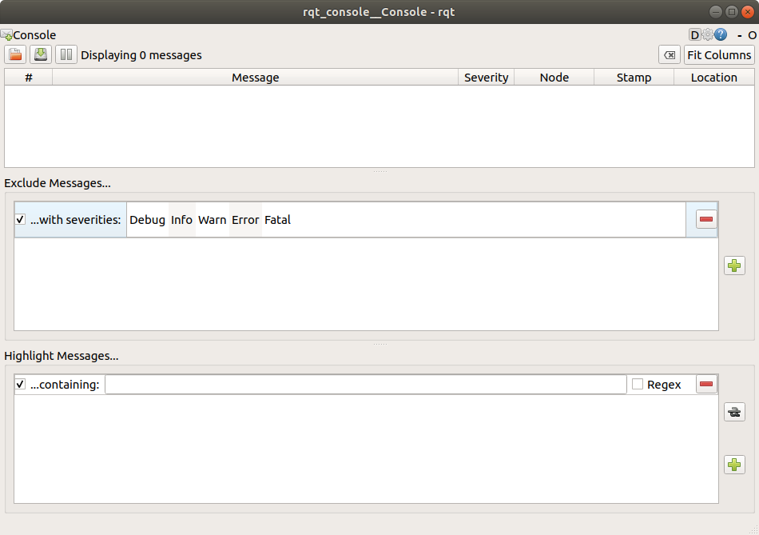
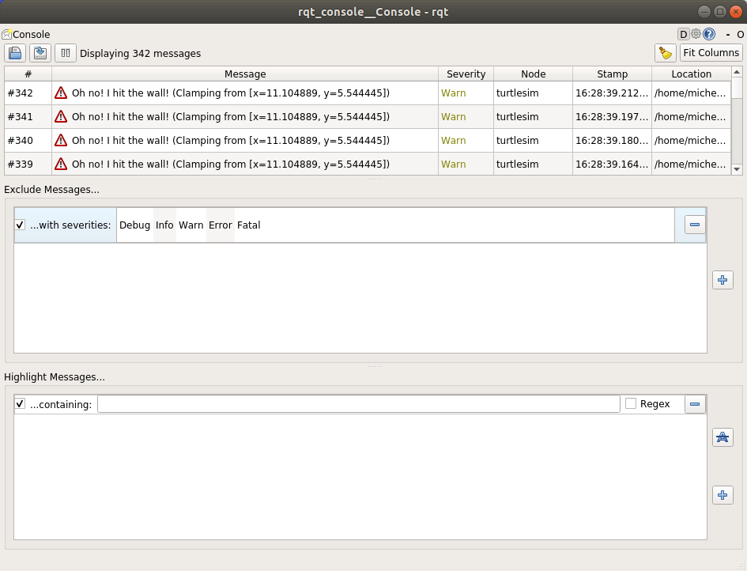

.. redirect-from::

    Tutorials/Rqt-Console/Using-Rqt-Console

.. _rqt_console:

使用 ``rqt_console`` 查看日志
=============================

**目标：** 了解 ``rqt_console``——一个用于内省日志消息的工具。

**教程级别：** 入门

**用时：** 5 分钟

.. contents:: 目录
   :depth: 2
   :local:

背景
----

``rqt_console`` 是一个用于内省 ROS 2 日志消息的 GUI 工具。
通常，日志消息会显示在你的终端中。
借助 ``rqt_console``，你可以随着时间推移收集这些消息、更仔细且更有条理地查看它们、过滤它们、保存它们，甚至可以重新加载已保存的文件以便在不同时间进行内省。

节点使用日志以多种方式输出与事件和状态有关的消息。
这些内容通常是为用户提供的信息。

前置条件
--------

你需要安装 :doc:`rqt_console 和 turtlesim <../Introducing-Turtlesim/Introducing-Turtlesim>`。

和往常一样，别忘了在 :doc:`每一个你新打开的终端 <../Configuring-ROS2-Environment>` 中 source ROS 2。

任务
----

1 安装
^^^^^^

在一个新终端中使用以下命令启动 ``rqt_console``：

.. code-block:: console

    $ ros2 run rqt_console rqt_console

``rqt_console`` 窗口将会打开：

控制台的第一部分是显示来自你系统的日志消息的区域。

在中间部分，你可以通过排除严重级别来过滤消息。
你也可以使用右侧的加号按钮添加更多的排除过滤器。

底部部分用于高亮显示包含你输入字符串的消息。
你也可以向这一部分添加更多过滤器。

现在在一个新终端中使用以下命令启动 ``turtlesim``：

.. code-block:: console

    $ ros2 run turtlesim turtlesim_node

2 rqt_console 上的消息
^^^^^^^^^^^^^^^^^^^^^^

为了生成供 ``rqt_console`` 显示的日志消息，我们让乌龟撞到墙上。
在一个新终端中，输入下面的 ``ros2 topic pub`` 命令（在 :doc:`话题教程 <../Understanding-ROS2-Topics/Understanding-ROS2-Topics>` 中有详细讨论）：

.. code-block:: console

    $ ros2 topic pub -r 1 /turtle1/cmd_vel geometry_msgs/msg/Twist "{linear: {x: 2.0, y: 0.0, z: 0.0}, angular: {x: 0.0,y: 0.0,z: 0.0}}"

由于上面的命令以固定速率发布话题，乌龟会不停地撞墙。
在 ``rqt_console`` 中，你会看到同一条带有 ``Warn`` 严重级别的消息反复显示，就像这样：

在你运行 ``ros2 topic pub`` 命令的终端中按 ``Ctrl+C``，让乌龟停止撞墙。

3 日志级别
^^^^^^^^^^

ROS 2 的日志级别按严重程度排序：

 1. Fatal
 2. Error
 3. Warn
 4. Info
 5. Debug

对于每个级别表示什么，并没有确切的标准，但可以放心地认为：

* ``Fatal`` 消息表示系统即将终止，以试图保护自身免受损害。
* ``Error`` 消息表示严重问题，这些问题不一定会损害系统，但会阻止系统正常工作。
* ``Warn`` 消息表示意外活动或不理想的结果，它们可能代表更深层的问题，但不会直接损害功能。
* ``Info`` 消息表示事件和状态更新，可作为系统按预期运行的可视化验证。
* ``Debug`` 消息详细记录了系统执行的整个逐步过程。

默认级别是 ``Info``。
你只会看到默认严重级别以及更严重级别的消息。

通常，只有 ``Debug`` 消息会被隐藏，因为它们是唯一比 ``Info`` 严重级别更低的级别。
例如，如果你将默认级别设置为 ``Warn``，你将只会看到严重级别为 ``Warn``、``Error`` 和 ``Fatal`` 的消息。

3.1 设置默认日志级别
~~~~~~~~~~~~~~~~~~~~

你可以在首次运行 ``/turtlesim`` 节点时通过重映射（remapping）设置默认日志级别。
在你的终端中输入以下命令：

.. code-block:: console

    $ ros2 run turtlesim turtlesim_node --ros-args --log-level WARN

现在你将不会再看到上次启动 ``turtlesim`` 时控制台中出现的初始 ``Info`` 级别消息。
这是因为 ``Info`` 消息的优先级低于新的默认严重级别 ``Warn``。

小结
----

如果你需要仔细检查来自系统的日志消息，``rqt_console`` 会非常有用。
你可能出于各种原因需要检查日志消息，通常是找出哪里出了问题以及导致问题发生的一系列事件。

下一步
------

下一篇教程将教你使用 :doc:`ROS 2 Launch <../Launching-Multiple-Nodes/Launching-Multiple-Nodes>` 一次性启动多个节点。
