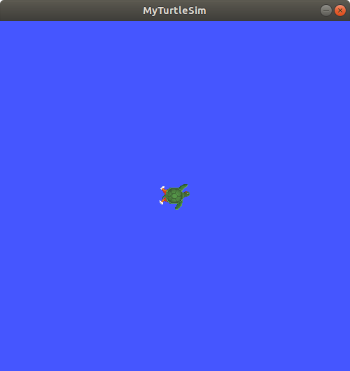
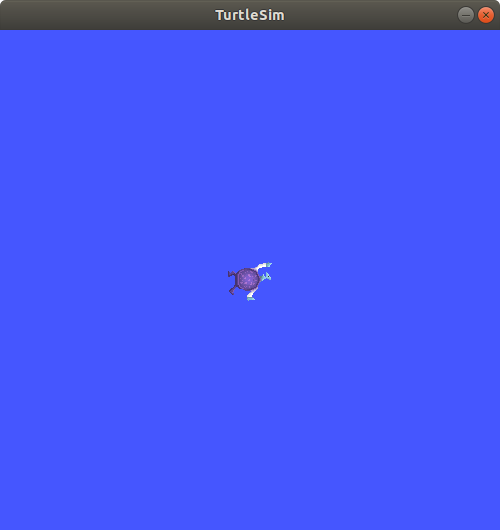

.. redirect-from::

    Tutorials/Workspace/Creating-A-Workspace

.. _ROS2Workspace:

创建工作空间
============

**目标：** 创建一个工作空间，并学习如何为开发和测试设置一个 overlay。

**教程级别：** 入门

**时间：** 20 分钟

.. contents:: 目录
   :depth: 2
   :local:

背景
----

工作空间是包含 ROS 2 包的目录。
在使用 ROS 2 之前，你需要在计划工作的终端中导入你的 ROS 2 安装工作空间。
这使得 ROS 2 的包可以在该终端中供你使用。

你也可以选择导入一个“overlay”——一个次级工作空间，你可以在其中添加新包，而不会干扰你所扩展的现有 ROS 2 工作空间，即“underlay”。
你的 underlay 必须包含 overlay 中所有包的依赖项。
overlay 中的包会覆盖 underlay 中的包。
也可以有多层 underlay 和 overlay，每一层后续的 overlay 都使用其父 underlay 的包。

前置条件
--------

* :doc:`ROS 2 安装 <../../../Installation>`
* :doc:`colcon 安装 <../Colcon-Tutorial>`
* `git 安装 <https://git-scm.com/book/en/v2/Getting-Started-Installing-Git>`__
* :doc:`turtlesim 安装 <../../Beginner-CLI-Tools/Introducing-Turtlesim/Introducing-Turtlesim>`
* 已安装 :doc:`rosdep <../../Intermediate/Rosdep>`
* 了解基本的终端命令（`这里有一份 Linux 指南 <https://www2.cs.sfu.ca/~ggbaker/reference/unix/>`__）
* 你选择的文本编辑器

任务
----

1 导入 ROS 2 环境
^^^^^^^^^^^^^^^^^

在本教程中，你的主要 ROS 2 安装将是你的 underlay。
（请记住，underlay 不一定是主要的 ROS 2 安装。）

根据你安装 ROS 2 的方式（从源码还是二进制）以及你所在的平台，你的具体 source 命令会有所不同：

.. tabs::

   .. group-tab:: Linux

      .. code-block:: console

        $ source /opt/ros/{DISTRO}/setup.bash

   .. group-tab:: macOS

      .. code-block:: console

        $ . ~/ros2_install/ros2-osx/setup.bash

   .. group-tab:: Windows

      请记住，执行以下命令时需要使用 ``x64 Native Tools Command Prompt for VS 2019``，因为我们要构建一个工作空间。

      .. code-block:: console

        $ call C:\dev\ros2\local_setup.bat

如果这些命令对你不适用，请查阅你遵循的 :doc:`安装指南 <../../../Installation>`。

.. _new-directory:

2 创建一个新目录
^^^^^^^^^^^^^^^^

最佳实践是为每个新工作空间创建一个新目录。
名称不重要，但让它指示工作空间的用途会很有帮助。
让我们选择目录名 ``ros2_ws``，表示“开发工作空间”：

.. tabs::

   .. group-tab:: Linux

      .. code-block:: console

        $ mkdir -p ~/ros2_ws/src
        $ cd ~/ros2_ws/src

   .. group-tab:: macOS

      .. code-block:: console

        $ mkdir -p ~/ros2_ws/src
        $ cd ~/ros2_ws/src

   .. group-tab:: Windows

     .. code-block:: console

       $ md \ros2_ws\src
       $ cd \ros2_ws\src

另一个最佳实践是将工作空间中的任何包都放入 ``src`` 目录。
上面的代码在 ``ros2_ws`` 中创建了一个 ``src`` 目录，然后进入该目录。

3 克隆一个示例仓库
^^^^^^^^^^^^^^^^^^

在克隆之前，请确保你仍处于 ``ros2_ws/src`` 目录中。

在其余的入门开发者教程中，你将创建自己的包，但现在你将使用现有包来练习搭建工作空间。

如果你学过 :doc:`入门：CLI 工具 <../../Beginner-CLI-Tools>` 教程，你会熟悉 ``turtlesim``，它是 `ros_tutorials <https://github.com/ros/ros_tutorials/>`__ 仓库中的包之一。

一个仓库可以有多个分支。
你需要检出与已安装的 ROS 2 发行版对应的那个分支。
克隆此仓库时，请添加 ``-b`` 参数，后跟该分支名。

在 ``ros2_ws/src`` 目录中，运行以下命令：

.. code-block:: console

  $ git clone https://github.com/ros/ros_tutorials.git -b {DISTRO}

现在 ``ros_tutorials`` 已克隆到你的工作空间中。
``ros_tutorials`` 仓库包含 ``turtlesim`` 包，我们将在本教程的其余部分使用它。
该仓库中的其他包不会被构建，因为它们包含 ``COLCON_IGNORE`` 文件。

到目前为止，你已经用一个示例包填充了工作空间，但它还不是一个功能完整的工作空间。
你需要先解析依赖项，然后构建工作空间。

4 解析依赖项
^^^^^^^^^^^^

在构建工作空间之前，你需要解析包依赖项。
你可能已经拥有所有依赖项，但最佳实践是每次克隆时都检查依赖项。
你不会希望构建在长时间等待后失败，才发现自己缺少依赖项。

从工作空间根目录（``ros2_ws``）运行以下命令：

.. tabs::

   .. group-tab:: Linux

      如果你仍在包含 ``ros_tutorials`` 克隆的 ``src`` 目录中，请务必运行 ``cd ..`` 返回到工作空间（``ros2_ws``）。

      .. code-block:: console

        $ cd ..
        $ rosdep install -i --from-path src --rosdistro {DISTRO} -y

   .. group-tab:: macOS

      rosdep 只能在 Linux 上运行，所以你可以直接跳到“5 使用 colcon 构建工作空间”一节。

   .. group-tab:: Windows

      rosdep 只能在 Linux 上运行，所以你可以直接跳到“5 使用 colcon 构建工作空间”一节。

如果你在 Linux 上从源码或二进制存档安装 ROS 2，你需要使用其安装说明中的 rosdep 命令。
这里是 :ref:`从源码安装的 rosdep 一节 <linux-development-setup-install-dependencies-using-rosdep>` 和 :ref:`二进制存档的 rosdep 一节 <linux-install-binary-install-missing-dependencies>`。

如果你已经拥有所有依赖项，控制台将返回：

.. code-block:: text

  #All required rosdeps installed successfully

包在 package.xml 文件中声明其依赖项（你将在下一个教程中了解更多关于包的内容）。
此命令会遍历这些声明并安装缺失的依赖项。
你可以在另一个教程（即将发布）中了解更多关于 ``rosdep`` 的信息。

5 使用 colcon 构建工作空间
^^^^^^^^^^^^^^^^^^^^^^^^^^

从工作空间根目录（``ros2_ws``），你现在可以使用以下命令构建你的包：

.. tabs::

  .. group-tab:: Linux

    .. code-block:: console

      $ colcon build
      Starting >>> turtlesim
      Finished <<< turtlesim [5.49s]

      Summary: 1 package finished [5.58s]

  .. group-tab:: macOS

    .. code-block:: console

      $ colcon build
      Starting >>> turtlesim
      Finished <<< turtlesim [5.49s]

      Summary: 1 package finished [5.58s]

  .. group-tab:: Windows

    .. code-block:: console

      $ colcon build --merge-install
      Starting >>> turtlesim
      Finished <<< turtlesim [5.49s]

      Summary: 1 package finished [5.58s]

    Windows 不允许长路径，因此 ``merge-install`` 会将所有路径合并到 ``install`` 目录中。

.. note::

  ``colcon build`` 的其他有用参数：

  * ``--packages-up-to`` 构建你想要的包以及它的所有依赖项，而不是整个工作空间（节省时间）
  * ``--symlink-install`` 让你无需在每次调整 python 脚本时都重新构建
  * ``--event-handlers console_direct+`` 在构建时显示控制台输出（否则可以在 ``log`` 目录中找到）
  * ``--executor sequential`` 逐个处理包，而不是使用并行

构建完成后，在工作空间根目录（``~/ros2_ws``）中输入命令。
你将看到 colcon 创建了新目录：

.. tabs::

   .. group-tab:: Linux

      .. code-block:: console

        $ ls
        build  install  log  src

   .. group-tab:: macOS

      .. code-block:: console

        $ ls
        build  install  log  src

   .. group-tab:: Windows

      .. code-block:: console

        $ dir
        build  install  log  src

``install`` 目录是你的工作空间 setup 文件所在的位置，你可以用它来导入你的 overlay。

6 导入 overlay
^^^^^^^^^^^^^^

在导入 overlay 之前，非常重要的一点是打开一个新终端，与构建工作空间的终端分开。
在你构建的同一终端中导入 overlay，或者反过来在已导入 overlay 的地方构建，都可能产生复杂的问题。

在新终端中，导入你的主要 ROS 2 环境作为“underlay”，这样你就可以在其“之上”构建 overlay：

.. tabs::

   .. group-tab:: Linux

      .. code-block:: console

        $ source /opt/ros/{DISTRO}/setup.bash

   .. group-tab:: macOS

      .. code-block:: console

        $ . ~/ros2_install/ros2-osx/setup.bash

   .. group-tab:: Windows

      在这种情况下，你可以使用普通的命令提示符，因为我们不会在此终端中构建任何工作空间。

      .. code-block:: console

        $ call C:\dev\ros2\local_setup.bat

进入工作空间的根目录：

.. tabs::

   .. group-tab:: Linux

      .. code-block:: console

        $ cd ~/ros2_ws

   .. group-tab:: macOS

      .. code-block:: console

        $ cd ~/ros2_ws

   .. group-tab:: Windows

     .. code-block:: console

       $ cd \ros2_ws

在根目录中，导入你的 overlay：

.. tabs::

  .. group-tab:: Linux

    .. code-block:: console

      $ source install/local_setup.bash

  .. group-tab:: macOS

    .. code-block:: console

      $ . install/local_setup.bash

  .. group-tab:: Windows

    .. code-block:: console

      $ call install\setup.bat

.. note::

  导入 overlay 的 ``local_setup`` 只会将 overlay 中可用的包添加到你的环境中。
  ``setup`` 会同时导入 overlay 以及创建它时所用的 underlay，使你能够使用两个工作空间。

  所以，像你刚才那样，先导入你的主要 ROS 2 安装的 ``setup``，再导入 ``ros2_ws`` overlay 的 ``local_setup``，
  与只导入 ``ros2_ws`` 的 ``setup`` 是等价的，因为后者已经包含了其 underlay 的环境。

现在你可以从 overlay 运行 ``turtlesim`` 包：

.. code-block:: console

  $ ros2 run turtlesim turtlesim_node

但你怎么能判断正在运行的是 overlay 的 turtlesim，而不是主要安装中的 turtlesim 呢？

让我们修改 overlay 中的 turtlesim，这样你就能看到效果：

* 你可以在 overlay 中单独修改和重新构建包，而不影响 underlay。
* overlay 优先于 underlay。

7 修改 overlay
^^^^^^^^^^^^^^

你可以通过编辑 turtlesim 窗口的标题栏来修改 overlay 中的 ``turtlesim``。
为此，在 ``~/ros2_ws/src/ros_tutorials/turtlesim/src`` 中找到 ``turtle_frame.cpp`` 文件。
用你喜欢的文本编辑器打开 ``turtle_frame.cpp``。

找到函数 ``setWindowTitle("TurtleSim");``，将值 ``"TurtleSim"`` 改为 ``"MyTurtleSim"``，然后保存文件。

回到之前运行 ``colcon build`` 的第一个终端，再次运行它。

回到第二个终端（已导入 overlay 的终端），再次运行 turtlesim：

.. code-block:: console

  $ ros2 run turtlesim turtlesim_node

你会看到 turtlesim 窗口的标题栏现在显示“MyTurtleSim”。

尽管此终端之前导入过你的主要 ROS 2 环境，但 ``ros2_ws`` 环境的 overlay 优先于 underlay 的内容。

要验证你的 underlay 仍然完好，打开一个全新的终端并只导入你的 ROS 2 安装。
再次运行 turtlesim：

.. code-block:: console

  $ ros2 run turtlesim turtlesim_node

你可以看到，overlay 中的修改实际上并没有影响 underlay 中的任何内容。

小结
----
在本教程中，你导入你的主要 ROS 2 发行版安装作为 underlay，并通过在新工作空间中克隆和构建包创建了一个 overlay。
overlay 被添加到路径的前面，并优先于 underlay，正如你通过修改后的 turtlesim 所看到的那样。

建议对少量包的工作使用 overlay，这样你就不必把所有东西都放在同一个工作空间中，也不必在每次迭代时都重新构建一个庞大的工作空间。

下一步
------

现在你已经理解了创建、构建和导入自己工作空间背后的细节，你可以学习如何 :doc:`创建自己的包 <../Creating-Your-First-ROS2-Package>`。
