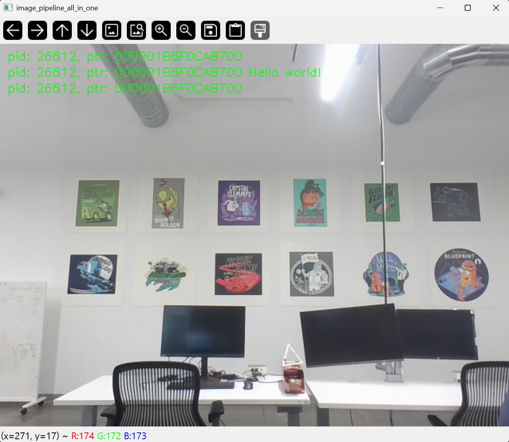
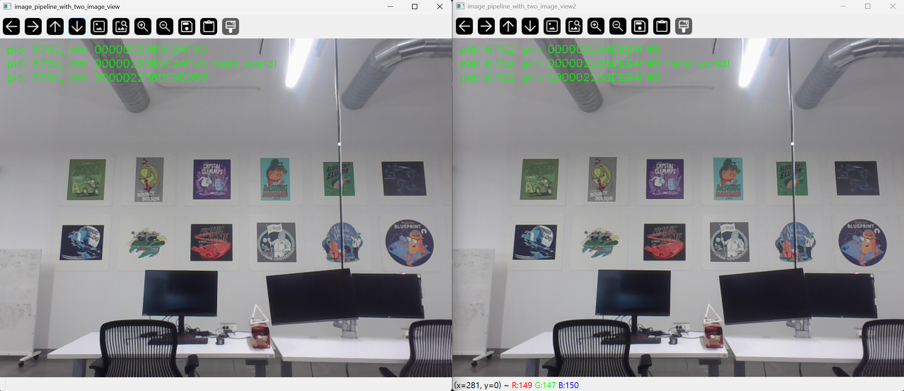
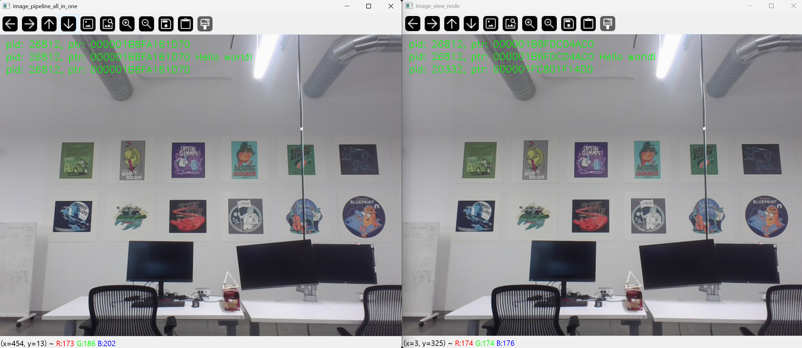

.. redirect-from::

    Intra-Process-Communication
    Tutorials/Intra-Process-Communication

设置高效的进程内通信
====================

.. contents:: 目录
   :depth: 2
   :local:

背景
----

ROS 应用通常由多个单独的“节点”组合而成，这些节点执行狭窄的任务，并与系统的其他部分解耦。
这促进了故障隔离、更快的开发、模块化和代码复用，但往往以性能为代价。
在 ROS 1 最初开发之后，对节点高效组合的需求变得显而易见，于是开发了 Nodelets。
在 ROS 2 中，我们旨在通过解决一些需要重构节点的根本问题来改进 Nodelets 的设计。

在本演示中，我们将重点介绍如何通过分别定义节点、但在不更改节点代码或限制其能力的情况下，将它们组合到不同的进程布局中，从而手动组合节点。

安装演示
--------

有关安装 ROS 2 的详细信息，请参阅 :doc:`安装说明 <../../Installation>`。

如果你是通过软件包安装 ROS 2 的，请确保已安装 ``ros-{DISTRO}-intra-process-demo``。
如果你下载了归档文件或从源代码构建了 ROS 2，它将已经是安装的一部分。

运行和理解演示
--------------

有几个不同的演示：一些是旨在突出进程内通信功能特性的玩具问题，另一些是端到端的示例，它们使用 OpenCV 并展示了将节点重组为不同配置的能力。

双节点管道演示
^^^^^^^^^^^^^^

本演示旨在展示，当使用 ``std::unique_ptr``\ s 进行发布和订阅时，进程内的发布/订阅连接可以实现消息的零拷贝传输。

首先让我们看一下源代码：

https://github.com/ros2/demos/blob/{REPOS_FILE_BRANCH}/intra_process_demo/src/two_node_pipeline/two_node_pipeline.cpp

.. code-block:: c++

   #include <chrono>
   #include <cinttypes>
   #include <cstdio>
   #include <memory>
   #include <string>
   #include <utility>

   #include "rclcpp/rclcpp.hpp"
   #include "std_msgs/msg/int32.hpp"

   using namespace std::chrono_literals;

   // Node that produces messages.
   struct Producer : public rclcpp::Node
   {
     Producer(const std::string & name, const std::string & output)
     : Node(name, rclcpp::NodeOptions().use_intra_process_comms(true))
     {
       // Create a publisher on the output topic.
       pub_ = this->create_publisher<std_msgs::msg::Int32>(output, 10);
       std::weak_ptr<std::remove_pointer<decltype(pub_.get())>::type> captured_pub = pub_;
       // Create a timer which publishes on the output topic at ~1Hz.
       auto callback = [captured_pub]() -> void {
           auto pub_ptr = captured_pub.lock();
           if (!pub_ptr) {
             return;
           }
           static int32_t count = 0;
           std_msgs::msg::Int32::UniquePtr msg(new std_msgs::msg::Int32());
           msg->data = count++;
           printf(
             "Published message with value: %d, and address: 0x%" PRIXPTR "\n", msg->data,
             reinterpret_cast<std::uintptr_t>(msg.get()));
           pub_ptr->publish(std::move(msg));
         };
       timer_ = this->create_wall_timer(1s, callback);
     }

     rclcpp::Publisher<std_msgs::msg::Int32>::SharedPtr pub_;
     rclcpp::TimerBase::SharedPtr timer_;
   };

   // Node that consumes messages.
   struct Consumer : public rclcpp::Node
   {
     Consumer(const std::string & name, const std::string & input)
     : Node(name, rclcpp::NodeOptions().use_intra_process_comms(true))
     {
       // Create a subscription on the input topic which prints on receipt of new messages.
       sub_ = this->create_subscription<std_msgs::msg::Int32>(
         input,
         10,
          {
           printf(
             " Received message with value: %d, and address: 0x%" PRIXPTR "\n", msg->data,
             reinterpret_cast<std::uintptr_t>(msg.get()));
         });
     }

     rclcpp::Subscription<std_msgs::msg::Int32>::SharedPtr sub_;
   };

   int main(int argc, char * argv[])
   {
     setvbuf(stdout, NULL, _IONBF, BUFSIZ);
     rclcpp::init(argc, argv);
     rclcpp::executors::SingleThreadedExecutor executor;

     auto producer = std::make_shared<Producer>("producer", "number");
     auto consumer = std::make_shared<Consumer>("consumer", "number");

     executor.add_node(producer);
     executor.add_node(consumer);
     executor.spin();

     rclcpp::shutdown();

     return 0;
   }

通过查看 ``main`` 函数你可以看到，我们有一个 producer（生产者）和一个 consumer（消费者）节点，我们将它们添加到一个单线程执行器中，然后调用 spin。

如果你查看 ``Producer`` 结构体中“producer”节点的实现，你会看到我们创建了一个在“number”话题上发布的发布者，以及一个定时器，它定期创建新消息，打印其在内存中的地址和内容值，然后发布它。

“consumer”节点则简单一些，你可以在 ``Consumer`` 结构体中看到它的实现，它只订阅“number”话题并打印它收到的消息的地址和值。

预期是 producer 会打印出一个地址和值，而 consumer 会打印出匹配的地址和值。
这表明进程内通信确实在工作，并且避免了不必要的拷贝，至少对于简单的图来说是如此。

让我们通过执行 ``ros2 run intra_process_demo two_node_pipeline`` 可执行文件来运行演示（别忘了先 source 安装文件）：

.. code-block:: console

   $ ros2 run intra_process_demo two_node_pipeline
   Published message with value: 0, and address: 0x7fb02303faf0
   Published message with value: 1, and address: 0x7fb020cf0520
    Received message with value: 1, and address: 0x7fb020cf0520
   Published message with value: 2, and address: 0x7fb020e12900
    Received message with value: 2, and address: 0x7fb020e12900
   Published message with value: 3, and address: 0x7fb020cf0520
    Received message with value: 3, and address: 0x7fb020cf0520
   Published message with value: 4, and address: 0x7fb020e12900
    Received message with value: 4, and address: 0x7fb020e12900
   Published message with value: 5, and address: 0x7fb02303cea0
    Received message with value: 5, and address: 0x7fb02303cea0
   [...]

你会注意到的一点是，消息大约每秒到达一次。
这是因为我们让定时器大约每秒触发一次。

你可能还注意到，第一条消息（值为 ``0``）没有对应的“Received message ...”行。
这是因为发布/订阅是“尽力而为”的，我们没有启用任何类似“锁存”（latching）的行为。
这意味着如果发布者在订阅建立之前发布了消息，订阅将不会收到该消息。
这种竞争条件可能导致前几条消息丢失。
在本例中，由于它们每秒只来一次，通常只有第一条消息会丢失。

最后，你可以看到具有相同值的“Published message...”和“Received message ...”行也具有相同的地址。
这表明收到的消息的地址与发布的消息的地址相同，它不是一份拷贝。
这是因为我们使用 ``std::unique_ptr``\ s 进行发布和订阅，它们允许消息的所有权在系统中安全地移动。
你也可以使用 ``const &`` 和 ``std::shared_ptr`` 进行发布和订阅，但在这种情况下不会发生零拷贝。

循环管道演示
^^^^^^^^^^^^

本演示与前一个类似，但不同之处在于，本演示中 producer 不会在每次迭代时创建新消息，而是始终只使用一个消息实例。
这是通过在图中创建一个循环，并在旋转执行器之前由外部让其中一个节点发布消息来“启动”通信实现的：

https://github.com/ros2/demos/blob/{REPOS_FILE_BRANCH}/intra_process_demo/src/cyclic_pipeline/cyclic_pipeline.cpp

.. code-block:: c++

   #include <chrono>
   #include <cinttypes>
   #include <cstdio>
   #include <memory>
   #include <string>
   #include <utility>

   #include "rclcpp/rclcpp.hpp"
   #include "std_msgs/msg/int32.hpp"

   using namespace std::chrono_literals;

   // This node receives an Int32, waits 1 second, then increments and sends it.
   struct IncrementerPipe : public rclcpp::Node
   {
     IncrementerPipe(const std::string & name, const std::string & in, const std::string & out)
     : Node(name, rclcpp::NodeOptions().use_intra_process_comms(true))
     {
       // Create a publisher on the output topic.
       pub = this->create_publisher<std_msgs::msg::Int32>(out, 10);
       std::weak_ptr<std::remove_pointer<decltype(pub.get())>::type> captured_pub = pub;
       // Create a subscription on the input topic.
       sub = this->create_subscription<std_msgs::msg::Int32>(
         in,
         10,
         [captured_pub](std_msgs::msg::Int32::UniquePtr msg) {
           auto pub_ptr = captured_pub.lock();
           if (!pub_ptr) {
             return;
           }
           printf(
             "Received message with value:         %d, and address: 0x%" PRIXPTR "\n", msg->data,
             reinterpret_cast<std::uintptr_t>(msg.get()));
           printf("  sleeping for 1 second...\n");
           if (!rclcpp::sleep_for(1s)) {
             return;    // Return if the sleep failed (e.g. on :kbd:`ctrl-c`).
           }
           printf("  done.\n");
           msg->data++;    // Increment the message's data.
           printf(
             "Incrementing and sending with value: %d, and address: 0x%" PRIXPTR "\n", msg->data,
             reinterpret_cast<std::uintptr_t>(msg.get()));
           pub_ptr->publish(std::move(msg));    // Send the message along to the output topic.
         });
     }

     rclcpp::Publisher<std_msgs::msg::Int32>::SharedPtr pub;
     rclcpp::Subscription<std_msgs::msg::Int32>::SharedPtr sub;
   };

   int main(int argc, char * argv[])
   {
     setvbuf(stdout, NULL, _IONBF, BUFSIZ);
     rclcpp::init(argc, argv);
     rclcpp::executors::SingleThreadedExecutor executor;

     // Create a simple loop by connecting the in and out topics of two IncrementerPipe's.
     // The expectation is that the address of the message being passed between them never changes.
     auto pipe1 = std::make_shared<IncrementerPipe>("pipe1", "topic1", "topic2");
     auto pipe2 = std::make_shared<IncrementerPipe>("pipe2", "topic2", "topic1");
     rclcpp::sleep_for(1s);  // Wait for subscriptions to be established to avoid race conditions.
     // Publish the first message (kicking off the cycle).
     std::unique_ptr<std_msgs::msg::Int32> msg(new std_msgs::msg::Int32());
     msg->data = 42;
     printf(
       "Published first message with value:  %d, and address: 0x%" PRIXPTR "\n", msg->data,
       reinterpret_cast<std::uintptr_t>(msg.get()));
     pipe1->pub->publish(std::move(msg));

     executor.add_node(pipe1);
     executor.add_node(pipe2);
     executor.spin();

     rclcpp::shutdown();

     return 0;
   }

与前一个演示不同，本演示只使用一个 Node，以不同的名称和配置实例化两次。
最终的图是 ``pipe1`` -> ``pipe2`` -> ``pipe1`` ... 这样的循环。

``pipe1->pub->publish(std::move(msg));`` 这一行启动了整个过程，但从那时起，消息由每个节点在自己的订阅回调中调用 publish 而在节点之间来回传递。

这里的预期是，节点每秒一次来回传递消息，每次都递增消息的值。
由于消息是作为 ``unique_ptr`` 发布和订阅的，因此最初创建的同一条消息被持续使用。

为了测试这些预期，让我们运行它：

.. code-block:: console

   $ ros2 run intra_process_demo cyclic_pipeline
   Published first message with value:  42, and address: 0x7fd2ce0a2bc0
   Received message with value:         42, and address: 0x7fd2ce0a2bc0
     sleeping for 1 second...
     done.
   Incrementing and sending with value: 43, and address: 0x7fd2ce0a2bc0
   Received message with value:         43, and address: 0x7fd2ce0a2bc0
     sleeping for 1 second...
     done.
   Incrementing and sending with value: 44, and address: 0x7fd2ce0a2bc0
   Received message with value:         44, and address: 0x7fd2ce0a2bc0
     sleeping for 1 second...
     done.
   Incrementing and sending with value: 45, and address: 0x7fd2ce0a2bc0
   Received message with value:         45, and address: 0x7fd2ce0a2bc0
     sleeping for 1 second...
     done.
   Incrementing and sending with value: 46, and address: 0x7fd2ce0a2bc0
   Received message with value:         46, and address: 0x7fd2ce0a2bc0
     sleeping for 1 second...
     done.
   Incrementing and sending with value: 47, and address: 0x7fd2ce0a2bc0
   Received message with value:         47, and address: 0x7fd2ce0a2bc0
     sleeping for 1 second...
   [...]

你应该会看到每次迭代中不断增加的数字，从 42 开始……因为就是 42，而且整个过程一直在复用同一条消息，这一点由不变的指针地址所证明，从而避免了不必要的拷贝。

图像管道演示
^^^^^^^^^^^^

在本演示中，我们将使用 OpenCV 来捕获、注释，然后查看图像。

.. note::

  如果你使用的是 macOS 且这些示例无法运行，或者你收到类似 ``ddsi_conn_write failed -1`` 的错误，那么你需要增大系统范围的 UDP 数据包大小：

  .. code-block:: console

    $ sudo sysctl -w net.inet.udp.recvspace=209715
    $ sudo sysctl -w net.inet.udp.maxdgram=65500

  这些更改在重启后不会保留。

简单管道
~~~~~~~~

首先，我们将有一个由三个节点组成的管道，排列如下：``camera_node`` -> ``watermark_node`` -> ``image_view_node``

``camera_node`` 从你计算机上的摄像头设备 ``0`` 读取，在图像上写入一些信息并发布它。
``watermark_node`` 订阅 ``camera_node`` 的输出，在发布之前添加更多文本。
最后，``image_view_node`` 订阅 ``watermark_node`` 的输出，在图像上写入更多文本，然后用 ``cv::imshow`` 将其可视化。

在每个节点中，进程 ID 和 ROS 消息的指针地址都会用 ``cv::putText`` 写到图像上。
watermark 和 image view 节点的设计目标是修改图像而不拷贝它，因此只要节点在同一个进程中，且图保持上面描述的管道组织方式，图像上印出的地址应该全部相同。

.. note::

  在某些系统上（我们在 Linux 上见到过），打印到屏幕上的地址可能不会改变。
  这是因为同一个唯一指针被复用了。
  在这种情况下，管道仍在运行。

让我们通过执行以下可执行文件来运行演示：

.. code-block:: console

   $ ros2 run intra_process_demo image_pipeline_all_in_one

你应该会看到类似这样的画面：

你可以按空格键暂停图像的渲染，再次按空格键可以继续。
你也可以按 ``q`` 或 ``ESC`` 退出。

如果你暂停图像查看器，你应该能够比较写在图像上的地址，并看到它们是相同的。

带两个图像查看器的管道
~~~~~~~~~~~~~~~~~~~~~~

现在让我们看一个与上面类似的例子，只是它有两个 image view 节点。
所有节点仍然在同一个进程中，但现在会有两个 ``image_view_node`` 实例，因此应该会出现两个图像查看窗口。
（macOS 用户注意：你的图像查看窗口可能会重叠在一起）。
让我们用以下命令运行它：

.. code-block:: console

   $ ros2 run intra_process_demo image_pipeline_with_two_image_view

就像上一个例子一样，你可以用空格键暂停渲染，再次按空格键继续。
你可以停止更新以检查写入屏幕的指针。

正如你在上面的示例图像中看到的，我们有一张图像，其中所有指针都相同；然后另一张图像的前两项指针与第一张图像相同，但第二张图像上的最后一个指针不同。
要理解为什么会这样，请考虑图的拓扑结构：

.. code-block:: bash

   camera_node -> watermark_node -> image_view_node
                                 -> image_view_node2

``camera_node`` 和 ``watermark_node`` 之间的连接可以使用相同的指针而无需拷贝，因为只有一个进程内订阅需要投递消息。
但对于 ``watermark_node`` 和两个 image view 节点之间的连接，关系是一对多的，因此如果 image view 节点使用 ``unique_ptr`` 回调，就不可能把同一个指针的所有权投递给两者。
不过，它可以投递给其中一个。
哪个会得到原始指针是不确定的，实际上只是最后被投递的那个。
因此，正在被查看的图像中，一张是原始图像，所有指针都相同；另一张是原始图像的副本，在 ``watermark_node`` 和其中一个 ``image_view_node`` 实例之间生成，其第三行文本的指针会不同。

带进程间查看器的管道
~~~~~~~~~~~~~~~~~~~~

另一件需要做对的重要事情是，在进行进程间订阅时避免中断进程内的零拷贝行为。
为了测试这一点，我们可以先运行第一个图像管道演示 ``image_pipeline_all_in_one``，然后再运行一个独立的 ``image_view_node`` 实例（别忘了在终端中给它们加上 ``ros2 run intra_process_demo`` 前缀）。
看起来会像这样：

很难同时暂停两幅图像，所以图像可能对不齐，但需要注意的重要一点是，``image_pipeline_all_in_one`` 的图像视图在每个步骤都显示相同的地址。
这意味着即使同时订阅了外部视图，进程内的零拷贝也被保留了。
你还可以看到，进程间图像视图的前两行文本有不同的进程 ID，而第三行文本是独立图像查看器的进程 ID。
