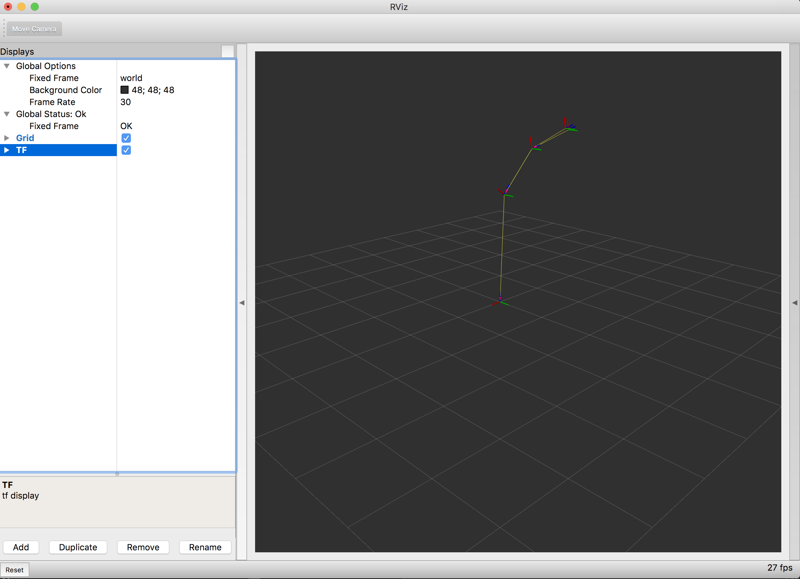

.. redirect-from::

    dummy-robot-demo
    Tutorials/dummy-robot-demo

体验一个 dummy 机器人
=====================

在本演示中，我们展示一个简单的演示机器人，它包含从发布关节状态、发布模拟激光数据，到在 RViz 中可视化地图上的机器人模型的全部组件。

启动演示
--------

我们假设你的 ROS 2 安装目录是 ``~/ros2_ws``。
请根据你的平台更改目录。

要启动演示，我们执行演示 bringup 启动文件，我们将在下一节更详细地解释它。

.. tabs::

  .. group-tab:: Source Build

    .. code-block:: console

       $ mkdir -p ~/ros2_ws/src
       $ cd ~/ros2_ws/src
       $ git clone -b ${ROS_DISTRO} https://github.com/ros2/demos
       $ cd .. && colcon build --packages-up-to dummy_robot_bringup
       $ source ~/ros2_ws/install/setup.bash
       $ ros2 launch dummy_robot_bringup dummy_robot_bringup_launch.py
       [INFO] [launch]: Default logging verbosity is set to INFO
       [INFO] [dummy_map_server-1]: process started with pid [2922]
       [INFO] [robot_state_publisher-2]: process started with pid [2923]
       [INFO] [dummy_joint_states-3]: process started with pid [2924]
       [INFO] [dummy_laser-4]: process started with pid [2925]
       [dummy_laser-4] [INFO] [1714837459.645517297] [dummy_laser]: angle inc:    0.004363
       [dummy_laser-4] [INFO] [1714837459.645613393] [dummy_laser]: scan size:    1081
       [dummy_laser-4] [INFO] [1714837459.645626640] [dummy_laser]: scan time increment:     0.000000
       [robot_state_publisher-2] [INFO] [1714837459.652977937] [robot_state_publisher]: Robot initialized

  .. group-tab:: deb Package

    .. code-block:: console

       $ sudo apt install ros-${ROS_DISTRO}-dummy-robot-bringup
       $ ros2 launch dummy_robot_bringup dummy_robot_bringup_launch.py
       [INFO] [launch]: Default logging verbosity is set to INFO
       [INFO] [dummy_map_server-1]: process started with pid [2922]
       [INFO] [robot_state_publisher-2]: process started with pid [2923]
       [INFO] [dummy_joint_states-3]: process started with pid [2924]
       [INFO] [dummy_laser-4]: process started with pid [2925]
       [dummy_laser-4] [INFO] [1714837459.645517297] [dummy_laser]: angle inc:    0.004363
       [dummy_laser-4] [INFO] [1714837459.645613393] [dummy_laser]: scan size:    1081
       [dummy_laser-4] [INFO] [1714837459.645626640] [dummy_laser]: scan time increment:     0.000000
       [robot_state_publisher-2] [INFO] [1714837459.652977937] [robot_state_publisher]: Robot initialized

如果你现在在一个新终端中打开 RViz2，你会看到你的机器人。
🎉

.. code-block:: console

   $ source ~/ros2_ws/install/setup.bash
   $ rviz2

这会打开 RViz2。
假设你的 dummy_robot_bringup 仍在运行，你现在可以添加 TF 显示插件，并将全局坐标系配置为 ``world``。
完成后，你应该会看到类似的画面：

发生了什么？
^^^^^^^^^^^^

如果你仔细看看启动文件，我们会同时启动几个节点。

* dummy_map_server
* dummy_laser
* dummy_joint_states
* robot_state_publisher

前两个包相对简单。
``dummy_map_server`` 不断地发布一个空地图并定期更新。
``dummy_laser`` 基本上做同样的事；发布模拟的假激光扫描。

``dummy_joint_states`` 节点发布模拟的关节状态数据。
由于我们发布的是一个只有两个关节的简单 RRbot，该节点为这两个关节发布关节状态值。

``robot_state_publisher`` 才是真正做有趣工作的部分。
它解析给定的 URDF 文件，提取机器人模型，并监听传入的关节状态。
根据这些信息，它为我们的机器人发布 TF 值，我们在 RViz 中将其可视化。

太棒了！
