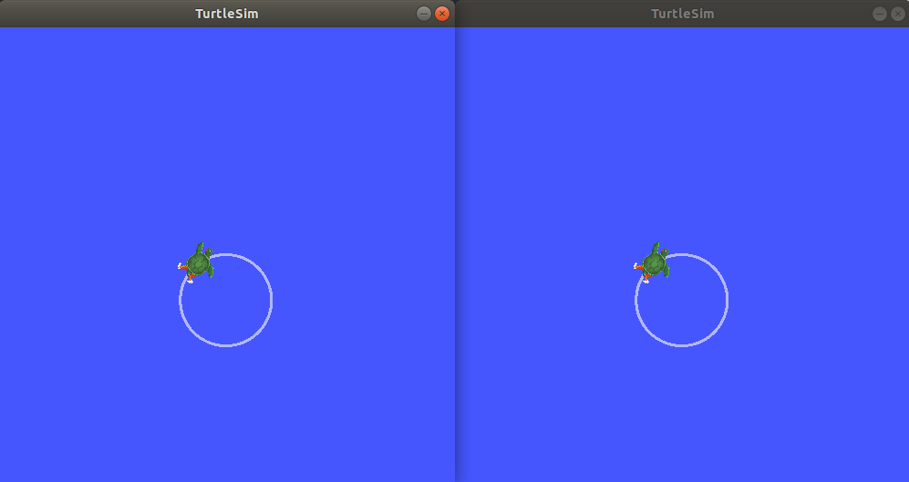
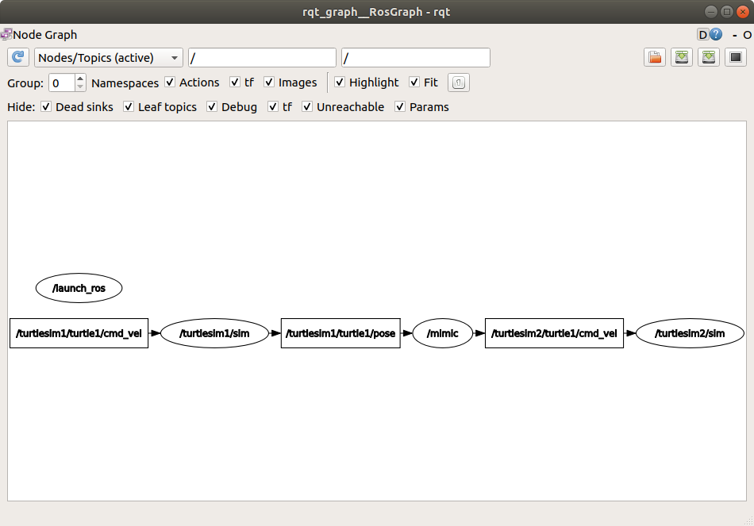

.. redirect-from::

  Tutorials/Launch-Files/Creating-Launch-Files
  Tutorials/Launch/Creating-Launch-Files

创建一个 launch 文件
====================

**目标：** 创建一个 launch 文件来运行一个复杂的 ROS 2 系统。

**教程级别：** 中级

**时间：** 10 分钟

.. contents:: 目录
   :depth: 2
   :local:

先决条件
--------

本教程使用 :doc:`rqt_graph 和 turtlesim <../../Beginner-CLI-Tools/Introducing-Turtlesim/Introducing-Turtlesim>` 包。

你还需要使用一个自己喜欢的文本编辑器。

和往常一样，别忘了在 :doc:`你打开的每个新终端 <../../Beginner-CLI-Tools/Configuring-ROS2-Environment>` 中 source ROS 2。

背景
----

ROS 2 中的 launch 系统负责帮助用户描述他们系统的配置，然后按照描述执行它。
系统的配置包括要运行哪些程序、在哪里运行它们、给它们传递什么参数，以及 ROS 特有的约定，这些约定通过给每个组件不同的配置，使得在整个系统中重用组件变得容易。
它还负责监控已启动进程的状态，并报告和/或响应这些进程状态的变化。

用 XML、YAML 或 Python 编写的 launch 文件可以启动和停止不同的节点，也可以触发并响应各种事件。
参见 :doc:`../../../How-To-Guides/Launch-file-different-formats` 了解不同格式的说明。
提供此框架的包是 ``launch_ros``，它在底层使用了非 ROS 特定的 ``launch`` 框架。

`设计文档 <https://design.ros2.org/articles/roslaunch.html>`__ 详细说明了 ROS 2 launch 系统的设计目标（并非所有功能目前都可用）。

任务
----

1 设置
^^^^^^

创建一个新目录来存放你的 launch 文件：

.. code-block:: console

  $ mkdir launch

2 编写 launch 文件
^^^^^^^^^^^^^^^^^^

让我们使用 ``turtlesim`` 包及其可执行文件来组合一个 ROS 2 launch 文件。
如上所述，它可以是 XML、YAML 或 Python 格式。

.. tabs::

  .. group-tab:: XML

    将完整代码复制并粘贴到 ``launch/turtlesim_mimic_launch.xml`` 文件中：

    .. literalinclude:: launch/turtlesim_mimic_launch.xml
      :language: xml

  .. group-tab:: YAML

    将完整代码复制并粘贴到 ``launch/turtlesim_mimic_launch.yaml`` 文件中：

    .. literalinclude:: launch/turtlesim_mimic_launch.yaml
      :language: yaml

  .. group-tab:: Python

    将完整代码复制并粘贴到 ``launch/turtlesim_mimic_launch.py`` 文件中：

    .. literalinclude:: launch/turtlesim_mimic_launch.py
      :language: python

2.1 检查 launch 文件
~~~~~~~~~~~~~~~~~~~~

上面所有 launch 文件都启动一个由三个节点组成的系统，它们都来自 ``turtlesim`` 包。
该系统的目标是启动两个 turtlesim 窗口，并让一只海龟模仿另一只海龟的运动。

在启动两个 turtlesim 节点时，它们之间的主要区别在于 namespace 值。
唯一的命名空间允许系统启动两个节点而不会发生节点名或话题名冲突。
该系统中的两只海龟通过同一个话题接收命令，并通过同一个话题发布它们的位姿。
有了唯一的命名空间，就可以区分发给不同海龟的消息。

这两个 turtlesim 节点还展示了向节点传递参数的不同方式。
第一个节点使用 ``args`` 将参数直接传递给可执行文件，对于 ROS 特定参数需要 ``--ros-args`` 标志。
第二个节点使用 ``ros_args``（Python 中是 ``ros_arguments``），专门用于 ROS 参数。
在混合使用 ROS 和非 ROS 参数时使用 ``args``（例如 ``my_custom_arg --ros-args --log-level info``），或者使用 ``ros_args`` 以获得更简洁的语法，只包含 remapping、参数或日志级别等 ROS 参数。

最后一个节点也来自 ``turtlesim`` 包，但是一个不同的可执行文件：``mimic``。
这个节点以 remapping 的形式添加了配置细节。
``mimic`` 的 ``/input/pose`` 话题被重映射到 ``/turtlesim1/turtle1/pose``，它的 ``/output/cmd_vel`` 话题被重映射到 ``/turtlesim2/turtle1/cmd_vel``。
这意味着 ``mimic`` 将订阅 ``/turtlesim1/sim`` 的位姿话题，并将其重新发布给 ``/turtlesim2/sim`` 的速度命令话题来订阅。
换句话说，``turtlesim2`` 将模仿 ``turtlesim1`` 的运动。

.. tabs::

  .. group-tab:: XML

    前两个 action 使用不同的参数传递方式启动两个 turtlesim 窗口：

    .. literalinclude:: launch/turtlesim_mimic_launch.xml
      :language: xml
      :lines: 3-4

    最后一个 action 使用 remap 启动 mimic 节点：

    .. literalinclude:: launch/turtlesim_mimic_launch.xml
      :language: xml
      :lines: 5-8

  .. group-tab:: YAML

    前两个 action 使用不同的参数传递方式启动两个 turtlesim 窗口：

    .. literalinclude:: launch/turtlesim_mimic_launch.yaml
      :language: yaml
      :lines: 4-16

    最后一个 action 使用 remap 启动 mimic 节点：

    .. literalinclude:: launch/turtlesim_mimic_launch.yaml
      :language: yaml
      :lines: 18-26

  .. group-tab:: Python

    这些 import 语句引入了一些 Python ``launch`` 模块。

    .. literalinclude:: launch/turtlesim_mimic_launch.py
      :language: python
      :lines: 1-2

    接下来，launch 描述本身开始：

    .. literalinclude:: launch/turtlesim_mimic_launch.py
      :language: python
      :lines: 5-6,30

    launch 描述中的前两个 action 使用不同的参数传递方式启动两个 turtlesim 窗口：

    .. literalinclude:: launch/turtlesim_mimic_launch.py
      :language: python
      :lines: 7-20

    最后一个 action 使用 remap 启动 mimic 节点：

    .. literalinclude:: launch/turtlesim_mimic_launch.py
      :language: python
      :lines: 21-29

3 ros2 launch
^^^^^^^^^^^^^

要运行上面创建的 launch 文件，进入你之前创建的目录并运行以下命令：

.. tabs::

  .. group-tab:: XML

    .. code-block:: console

      $ cd launch
      $ ros2 launch turtlesim_mimic_launch.xml

  .. group-tab:: YAML

    .. code-block:: console

      $ cd launch
      $ ros2 launch turtlesim_mimic_launch.yaml

  .. group-tab:: Python

    .. code-block:: console

      $ cd launch
      $ ros2 launch turtlesim_mimic_launch.py

.. note::

  可以直接启动一个 launch 文件（像我们上面那样），也可以由包提供。
  当它由包提供时，语法是：

  .. code-block:: console

      $ ros2 launch <package_name> <launch_file_name>

  你在 :doc:`../../Beginner-Client-Libraries/Creating-Your-First-ROS2-Package` 中学习了创建包。

.. note::

  对于包含 launch 文件的包，在你的包的 ``package.xml`` 中添加一个对 ``ros2launch`` 包的 ``exec_depend`` 依赖是个好主意：

  .. code-block:: xml

    <exec_depend>ros2launch</exec_depend>

  这有助于确保在构建你的包之后 ``ros2 launch`` 命令可用。
  它还确保所有 :doc:`launch 文件格式 <../../../How-To-Guides/Launch-file-different-formats>` 都被识别。

两个 turtlesim 窗口将会打开，你将看到以下 ``[INFO]`` 消息，告诉你 launch 文件启动了哪些节点：

.. code-block:: console

  [INFO] [launch]: Default logging verbosity is set to INFO
  [INFO] [turtlesim_node-1]: process started with pid [11714]
  [INFO] [turtlesim_node-2]: process started with pid [11715]
  [INFO] [mimic-3]: process started with pid [11716]

要查看系统运行情况，打开一个新终端并在 ``/turtlesim1/turtle1/cmd_vel`` 话题上运行 ``ros2 topic pub`` 命令，让第一只海龟动起来：

.. code-block:: console

  $ ros2 topic pub -r 1 /turtlesim1/turtle1/cmd_vel geometry_msgs/msg/Twist "{linear: {x: 2.0, y: 0.0, z: 0.0}, angular: {x: 0.0, y: 0.0, z: -1.8}}"

你会看到两只海龟沿着相同的路径前进。

4 用 rqt_graph 检查系统
^^^^^^^^^^^^^^^^^^^^^^^

在系统仍在运行时，打开一个新终端并运行 ``rqt_graph``，以更好地了解 launch 文件中节点之间的关系。

运行以下命令：

.. code-block:: console

  $ ros2 run rqt_graph rqt_graph

一个隐藏的节点（你运行的 ``ros2 topic pub`` 命令）正在向左侧的 ``/turtlesim1/turtle1/cmd_vel`` 话题发布数据，``/turtlesim1/sim`` 节点订阅了该话题。
图的其余部分展示了前面描述的内容：``mimic`` 订阅 ``/turtlesim1/sim`` 的位姿话题，并向 ``/turtlesim2/sim`` 的速度命令话题发布。

总结
----

launch 文件简化了运行包含许多节点和特定配置细节的复杂系统。
你可以使用 XML、YAML 或 Python 创建 launch 文件，并使用 ``ros2 launch`` 命令运行它们。
