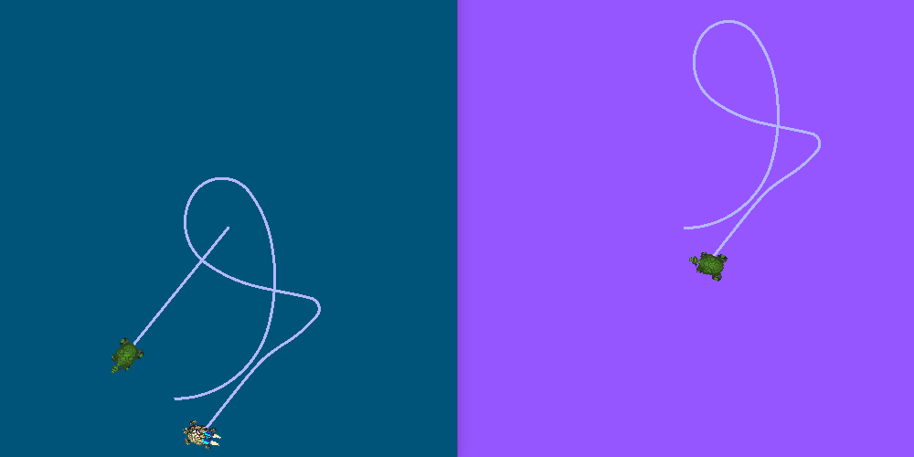
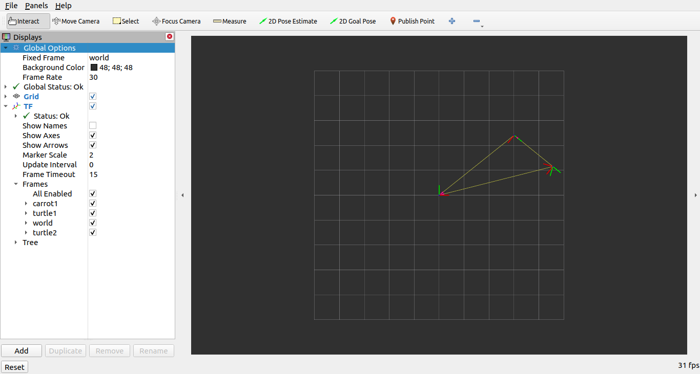

.. redirect-from::

    Tutorials/Launch-Files/Using-ROS2-Launch-for-Large-Projects
    Tutorials/Launch/Using-ROS2-Launch-for-Large-Projects

.. _UsingROS2LaunchForLargeProjects:

管理大型项目
============

**目标：** 学习使用 ROS 2 launch 文件管理大型项目的最佳实践。

**教程级别：** 中级

**时间：** 20 分钟

.. contents:: 目录
   :depth: 3
   :local:

背景
----

本教程描述了一些为大型项目编写 launch 文件的技巧。
重点是构建 launch 文件的方式，使它们能够在不同情况下尽可能复用。
此外，它还涵盖了不同 ROS 2 launch 工具的用法示例，例如参数、YAML 文件、remapping、命名空间、默认参数和 RViz 配置。

先决条件
--------

本教程使用 :doc:`turtlesim <../../Beginner-CLI-Tools/Introducing-Turtlesim/Introducing-Turtlesim>` 和 :doc:`turtle_tf2_py <../Tf2/Introduction-To-Tf2>` 包。
本教程还假设你已经 :doc:`创建了一个新包 <../../Beginner-Client-Libraries/Creating-Your-First-ROS2-Package>`，构建类型为 ``ament_python``，名为 ``launch_tutorial``。

引言
----

机器人上的大型应用通常涉及多个相互连接的节点，每个节点都可以有很多参数。
在乌龟模拟器中模拟多只海龟是一个很好的例子。
乌龟模拟由多个海龟节点、世界配置以及 TF 广播器和监听器节点组成。
在所有节点之间，有大量 ROS 参数影响这些节点的行为和外观。
ROS 2 launch 文件允许我们在一个地方启动所有节点并设置相应的参数。
到本教程结束时，你将在 ``launch_tutorial`` 包中构建 ``launch_turtlesim_launch`` launch 文件。
这个 launch 文件将启动负责两个 turtlesim 模拟的不同节点，启动 TF 广播器和监听器，加载参数，并启动 RViz 配置。
在本教程中，我们将逐步介绍这个 launch 文件以及使用的所有相关特性。

.. attention:: launch 文件可以用 XML、YAML 或 Python 格式编写。
  在本教程中，launch 文件使用标签页以全部三种格式展示。
  你可以选择你喜欢的任何格式——它们在功能上是等价的。
  无论你在哪里看到文件名 ``launch_turtlesim_launch``，请确保为你的 launch 文件类型使用正确的文件扩展名（即 Python 用 ``launch_turtlesim_launch.py``，XML 用 ``launch_turtlesim_launch.xml``，YAML 用 ``launch_turtlesim_launch.yaml``）。

编写 launch 文件
----------------

1 顶层组织
^^^^^^^^^^

编写 launch 文件过程的目标之一应该是使它们尽可能可复用。
这可以通过将相关节点和配置聚类到单独的 launch 文件中来实现。
之后，可以编写一个专用于特定配置的顶层 launch 文件。
这将允许在完全相同的机器人之间切换而无需更改 launch 文件。
甚至像从真实机器人切换到模拟机器人这样的更改也只需少量改动即可完成。

我们现在将逐步介绍使这成为可能的顶层 launch 文件结构。
首先，我们将创建一个调用单独 launch 文件的 launch 文件。
为此，让我们在我们的 ``launch_tutorial`` 包的 ``/launch`` 文件夹中创建一个 ``launch_turtlesim_launch`` 文件。

.. attention::

  较早的 launch 系统版本可能不支持在 ``include`` 语句中使用 ``let``，而需要使用 ``arg``。
  语法相同：``name`` 和 ``value`` 属性保持不变（例如，``<arg name="target_frame" value="carrot1" />``）。

.. tabs::

  .. group-tab:: XML

    将完整代码复制并粘贴到 ``launch/launch_turtlesim_launch.xml`` 文件中：

    .. literalinclude:: launch/launch_turtlesim_launch.xml
      :language: xml

  .. group-tab:: YAML

    将完整代码复制并粘贴到 ``launch/launch_turtlesim_launch.yaml`` 文件中：

    .. literalinclude:: launch/launch_turtlesim_launch.yaml
      :language: yaml

  .. group-tab:: Python

    将完整代码复制并粘贴到 ``launch/launch_turtlesim_launch.py`` 文件中：

    .. literalinclude:: launch/launch_turtlesim_launch.py
      :language: python

这个 launch 文件包含一组其他 launch 文件。
这些被包含的 launch 文件中的每一个都包含节点、参数，以及可能的嵌套 include，它们属于系统的一个部分。
确切地说，我们启动两个 turtlesim 模拟世界、TF 广播器、TF 监听器、mimic、固定坐标系广播器和 RViz 节点。

.. note:: 设计提示：顶层 launch 文件应该简短，包含对其他文件的 include（对应应用的子组件）和经常更改的参数。

以以下方式编写 launch 文件可以轻松替换系统的一部分，我们稍后会看到。
然而，在某些情况下，由于性能和使用原因，某些节点或 launch 文件必须单独启动。

.. note:: 设计提示：在决定应用需要多少个顶层 launch 文件时，请注意权衡。

2 参数
^^^^^^

2.1 在 launch 文件中设置参数
~~~~~~~~~~~~~~~~~~~~~~~~~~~~

我们将从编写一个启动我们第一个 turtlesim 模拟的 launch 文件开始。
首先，创建一个名为 ``turtlesim_world_1_launch`` 的新文件。

.. tabs::

  .. group-tab:: XML

    将完整代码复制并粘贴到 ``launch/turtlesim_world_1_launch.xml`` 文件中：

    .. literalinclude:: launch/turtlesim_world_1_launch.xml
      :language: xml

  .. group-tab:: YAML

    将完整代码复制并粘贴到 ``launch/turtlesim_world_1_launch.yaml`` 文件中：

    .. literalinclude:: launch/turtlesim_world_1_launch.yaml
      :language: yaml

  .. group-tab:: Python

    将完整代码复制并粘贴到 ``launch/turtlesim_world_1_launch.py`` 文件中：

    .. literalinclude:: launch/turtlesim_world_1_launch.py
      :language: python

这个 launch 文件启动 ``turtlesim_node`` 节点（它启动 turtlesim 模拟），并带有定义并传递给节点的模拟配置参数。

2.2 从 YAML 文件加载参数
~~~~~~~~~~~~~~~~~~~~~~~~

在第二个 launch 中，我们将以不同的配置启动第二个 turtlesim 模拟。
现在创建一个 ``turtlesim_world_2_launch`` 文件。

.. tabs::

  .. group-tab:: XML

    将完整代码复制并粘贴到 ``launch/turtlesim_world_2_launch.xml`` 文件中：

    .. literalinclude:: launch/turtlesim_world_2_launch.xml
      :language: xml

  .. group-tab:: YAML

    将完整代码复制并粘贴到 ``launch/turtlesim_world_2_launch.yaml`` 文件中：

    .. literalinclude:: launch/turtlesim_world_2_launch.yaml
      :language: yaml

  .. group-tab:: Python

    将完整代码复制并粘贴到 ``launch/turtlesim_world_2_launch.py`` 文件中：

    .. literalinclude:: launch/turtlesim_world_2_launch.py
      :language: python

这个 launch 文件将使用直接从 YAML 配置文件加载的参数值启动相同的 ``turtlesim_node``。
在 YAML 文件中定义参数和参数值可以轻松存储和加载大量变量。
还值得注意的是，这个 YAML 文件不是另一个 launch 文件，它是 ``turtlesim_node`` 的配置文件，用于设置节点的参数。
此外，YAML 文件可以从当前的 ``ros2 param`` 列表中轻松导出。
要了解如何操作，请参阅 :doc:`理解参数 <../../Beginner-CLI-Tools/Understanding-ROS2-Parameters/Understanding-ROS2-Parameters>` 教程。

现在让我们在我们的包的 ``/config`` 文件夹中创建一个配置文件 ``turtlesim.yaml``，它将由我们的 launch 文件加载。

.. code-block:: YAML

   /turtlesim2/sim:
      ros__parameters:
         background_b: 255
         background_g: 86
         background_r: 150

要了解更多关于使用参数和使用 YAML 文件的信息，请查看 :doc:`理解参数 <../../Beginner-CLI-Tools/Understanding-ROS2-Parameters/Understanding-ROS2-Parameters>` 教程。

2.3 在 YAML 文件中使用通配符
~~~~~~~~~~~~~~~~~~~~~~~~~~~~

在某些情况下，我们希望在多个节点中设置相同的参数。
这些节点可能有不同的命名空间或名称，但仍有相同的参数。
定义单独的 YAML 文件来显式定义命名空间和节点名效率不高。
一个解决方案是使用通配符字符，它作为文本值中未知字符的替代，将参数应用于多个不同的节点。

现在让我们创建一个新的 ``turtlesim_world_3_launch`` 文件，类似于 ``turtlesim_world_2_launch``，在命名空间 ``turtlesim3`` 中加入一个额外的 ``turtlesim_node`` 节点：

.. tabs::

  .. group-tab:: XML

    将完整代码复制并粘贴到 ``launch/turtlesim_world_3_launch.xml`` 文件中：

    .. literalinclude:: launch/turtlesim_world_3_launch.xml
      :language: xml
      :emphasize-lines: 3

  .. group-tab:: YAML

    将完整代码复制并粘贴到 ``launch/turtlesim_world_3_launch.yaml`` 文件中：

    .. literalinclude:: launch/turtlesim_world_3_launch.yaml
      :language: yaml
      :emphasize-lines: 7

  .. group-tab:: Python

    将完整代码复制并粘贴到 ``launch/turtlesim_world_3_launch.py`` 文件中：

    .. literalinclude:: launch/turtlesim_world_3_launch.py
      :language: python
      :emphasize-lines: 12

但是，加载相同的 YAML 文件不会影响第三个 turtlesim 世界的外观。
原因是它的参数存储在另一个命名空间下，如下所示：

.. code-block:: console

   /turtlesim3/sim:
      background_b
      background_g
      background_r

因此，与其为使用相同参数的同一个节点创建新配置，我们可以使用通配符语法。
``/**`` 将为每个节点分配所有参数，尽管节点名称和命名空间不同。

我们现在将按以下方式更新 ``/config`` 文件夹中的 ``turtlesim.yaml``：

.. code-block:: YAML

   /**:
      ros__parameters:
         background_b: 255
         background_g: 86
         background_r: 150

现在将 ``turtlesim_world_3_launch`` launch 描述包含在我们的主 launch 文件中。
在我们的 launch 描述中使用该配置文件将为 ``turtlesim3/sim`` 和 ``turtlesim2/sim`` 节点中的 ``background_b``、``background_g`` 和 ``background_r`` 参数分配指定值。

3 命名空间
^^^^^^^^^^

你可能已经注意到，我们在 ``turtlesim_world_2_launch`` 文件中为 turtlesim 世界定义了命名空间。
唯一的命名空间允许系统启动两个相似的节点而不会发生节点名或话题名冲突。

.. code-block:: Python

   namespace='turtlesim2',

但是，如果 launch 文件包含大量节点，为每个节点定义命名空间可能会变得繁琐。
为了解决这个问题，可以使用 ``PushROSNamespace`` action 为每个 launch 文件描述定义全局命名空间。
每个嵌套节点将自动继承该命名空间。

.. attention:: ``PushROSNamespace`` 必须是列表中的第一个 action，后续 action 才会应用该命名空间。

为此，首先，我们需要从 ``turtlesim_world_2_launch`` 文件中移除 ``namespace='turtlesim2'`` 行。
之后，我们需要更新 ``launch_turtlesim_launch``，将 include 语句改为以下内容：

.. tabs::

  .. group-tab:: XML

    .. code-block:: xml

       <group>
         <push_ros_namespace namespace="turtlesim2" />
         <include file="$(find-pkg-share launch_tutorial)/launch/turtlesim_world_2_launch.xml" />
       </group>

  .. group-tab:: YAML

    .. code-block:: yaml

       - group:
           - push_ros_namespace:
               namespace: "turtlesim2"
           - include:
               file: "$(find-pkg-share launch_tutorial)/launch/turtlesim_world_2_launch.yaml"

  .. group-tab:: Python

    .. code-block:: python

       from launch.actions import GroupAction
       from launch_ros.actions import PushROSNamespace

          ...
          GroupAction(
            actions=[
                PushROSNamespace('turtlesim2'),
                IncludeLaunchDescription(PathJoinSubstitution([launch_dir, 'turtlesim_world_2_launch.py'])),
             ]
          ),

结果，``turtlesim_world_2_launch`` launch 描述中的每个节点都将具有 ``turtlesim2`` 命名空间。

4 复用节点
^^^^^^^^^^

现在创建一个 ``broadcaster_listener_launch`` 文件。

.. tabs::

  .. group-tab:: XML

    将完整代码复制并粘贴到 ``launch/broadcaster_listener_launch.xml`` 文件中：

    .. literalinclude:: launch/broadcaster_listener_launch.xml
      :language: xml

  .. group-tab:: YAML

    将完整代码复制并粘贴到 ``launch/broadcaster_listener_launch.yaml`` 文件中：

    .. literalinclude:: launch/broadcaster_listener_launch.yaml
      :language: yaml

  .. group-tab:: Python

    将完整代码复制并粘贴到 ``launch/broadcaster_listener_launch.py`` 文件中：

    .. literalinclude:: launch/broadcaster_listener_launch.py
      :language: python

在这个文件中，我们声明了默认值为 ``turtle1`` 的 ``target_frame`` launch 参数。
默认值意味着 launch 文件可以接收一个参数并将其转发给它的节点，或者在未提供参数的情况下，将默认值传递给它的节点。

之后，我们在启动期间使用不同的名称和参数两次使用 ``turtle_tf2_broadcaster`` 节点。
这允许我们在不发生冲突的情况下复制同一个节点。

我们还启动一个 ``turtle_tf2_listener`` 节点，并设置我们上面声明和获取的 ``target_frame`` 参数。

5 参数覆盖
^^^^^^^^^^

回想一下，我们在顶层 launch 文件中调用了 ``broadcaster_listener_launch`` 文件。
除此之外，我们还向其传递了 ``target_frame`` launch 参数，如下所示：

.. tabs::

  .. group-tab:: XML

    .. literalinclude:: launch/launch_turtlesim_launch.xml
      :language: xml
      :lines: 5-7

  .. group-tab:: YAML

    .. literalinclude:: launch/launch_turtlesim_launch.yaml
      :language: yaml
      :lines: 8-12

  .. group-tab:: Python

    .. literalinclude:: launch/launch_turtlesim_launch.py
      :language: python
      :lines: 16-19

这种语法允许我们将默认目标坐标系改为 ``carrot1``。
如果你希望 ``turtle2`` 跟随 ``turtle1`` 而不是 ``carrot1``，只需删除传递 ``target_frame`` 参数的那行即可。
这将为 ``target_frame`` 赋默认值，即 ``turtle1``。

6 Remapping
^^^^^^^^^^^

现在创建一个 ``mimic_launch`` 文件。

.. tabs::

  .. group-tab:: XML

    将完整代码复制并粘贴到 ``launch/mimic_launch.xml`` 文件中：

    .. literalinclude:: launch/mimic_launch.xml
      :language: xml

  .. group-tab:: YAML

    将完整代码复制并粘贴到 ``launch/mimic_launch.yaml`` 文件中：

    .. literalinclude:: launch/mimic_launch.yaml
      :language: yaml

  .. group-tab:: Python

    将完整代码复制并粘贴到 ``launch/mimic_launch.py`` 文件中：

    .. literalinclude:: launch/mimic_launch.py
      :language: python

这个 launch 文件将启动 ``mimic`` 节点，它会向一只 turtlesim 发出跟随另一只 turtlesim 的命令。
该节点设计为在 ``/input/pose`` 话题上接收目标位姿。
在我们的例子中，我们想从 ``/turtle2/pose`` 话题重映射目标位姿。
最后，我们将 ``/output/cmd_vel`` 话题重映射到 ``/turtlesim2/turtle1/cmd_vel``。
这样，我们 ``turtlesim2`` 模拟世界中的 ``turtle1`` 将跟随我们初始 turtlesim 世界中的 ``turtle2``。

7 配置文件
^^^^^^^^^^

现在让我们创建一个名为 ``turtlesim_rviz_launch`` 的文件。

.. tabs::

  .. group-tab:: XML

    将完整代码复制并粘贴到 ``launch/turtlesim_rviz_launch.xml`` 文件中：

    .. literalinclude:: launch/turtlesim_rviz_launch.xml
      :language: xml

  .. group-tab:: YAML

    将完整代码复制并粘贴到 ``launch/turtlesim_rviz_launch.yaml`` 文件中：

    .. literalinclude:: launch/turtlesim_rviz_launch.yaml
      :language: yaml

  .. group-tab:: Python

    将完整代码复制并粘贴到 ``launch/turtlesim_rviz_launch.py`` 文件中：

    .. literalinclude:: launch/turtlesim_rviz_launch.py
      :language: python

这个 launch 文件将使用 ``turtle_tf2_py`` 包中定义的配置文件启动 RViz。
这个 RViz 配置将设置世界坐标系，启用 TF 可视化，并以俯视图启动 RViz。

8 环境变量
^^^^^^^^^^

现在让我们在我们的包中创建最后一个名为 ``fixed_broadcaster_launch`` 的 launch 文件。

.. tabs::

  .. group-tab:: XML

    将完整代码复制并粘贴到 ``launch/fixed_broadcaster_launch.xml`` 文件中：

    .. literalinclude:: launch/fixed_broadcaster_launch.xml
      :language: xml

  .. group-tab:: YAML

    将完整代码复制并粘贴到 ``launch/fixed_broadcaster_launch.yaml`` 文件中：

    .. literalinclude:: launch/fixed_broadcaster_launch.yaml
      :language: yaml

  .. group-tab:: Python

    将完整代码复制并粘贴到 ``launch/fixed_broadcaster_launch.py`` 文件中：

    .. literalinclude:: launch/fixed_broadcaster_launch.py
      :language: python

这个 launch 文件展示了在 launch 文件中调用环境变量的方式。
环境变量可以用于定义或推送命名空间，以区分不同计算机或机器人上的节点。

.. note:: 如果你运行的 launch 文件中 ``USER`` 环境变量未定义（例如在 ROS docker 文件中），那么你可以用任何你喜欢的词替换上面的环境变量引用。

运行 launch 文件
----------------

1 更新 setup.py
^^^^^^^^^^^^^^^

打开 ``setup.py`` 并添加以下行，以便安装 ``launch/`` 文件夹中的 launch 文件和 ``config/`` 中的配置文件。
``data_files`` 字段现在应该如下所示：

.. code-block:: Python

   import os
   from glob import glob
   from setuptools import setup
   ...

   data_files=[
         ...
         (os.path.join('share', package_name, 'launch'),
            glob('launch/*')),
         (os.path.join('share', package_name, 'config'),
            glob('config/*.yaml')),
         (os.path.join('share', package_name, 'rviz'),
            glob('config/*.rviz')),
      ],

2 构建和运行
^^^^^^^^^^^^

要最终看到我们代码的结果，构建包并使用以下命令启动顶层 launch 文件：

.. tabs::

  .. group-tab:: XML

    .. code-block:: console

       $ ros2 launch launch_tutorial launch_turtlesim_launch.xml

  .. group-tab:: YAML

    .. code-block:: console

       $ ros2 launch launch_tutorial launch_turtlesim_launch.yaml

  .. group-tab:: Python

    .. code-block:: console

       $ ros2 launch launch_tutorial launch_turtlesim_launch.py

你现在会看到两个 turtlesim 模拟已启动。
第一个模拟中有两只海龟，第二个模拟中有一只。
在第一个模拟中，``turtle2`` 生成在世界左下角。
它的目标是到达 ``carrot1`` 坐标系，该坐标系相对于 ``turtle1`` 坐标系在 x 轴上五米远。

第二个模拟中的 ``turtlesim2/turtle1`` 设计为模仿 ``turtle2`` 的行为。

如果你想控制 ``turtle1``，请运行 teleop 节点。

.. code-block:: console

   $ ros2 run turtlesim turtle_teleop_key

结果，你将看到类似的画面：

此外，RViz 应该已经启动。
它将显示所有相对于 ``world`` 坐标系的海龟坐标系，其原点在左下角。

总结
----

在本教程中，你了解了使用 ROS 2 launch 文件管理大型项目的各种技巧和实践。
