Marker：显示类型
================

**目标：** 本教程解释基本的 Marker 类型以及如何使用它们。

**教程级别：** 中级

**时间：** 15 分钟

.. contents:: 目录
   :depth: 2
   :local:

背景
----
Markers 显示项允许通过发送
`visualization_msgs/msg/Marker <https://github.com/ros2/common_interfaces/blob/{DISTRO}/visualization_msgs/msg/Marker.msg>`_ 或
`visualization_msgs/msg/MarkerArray <https://github.com/ros2/common_interfaces/blob/{DISTRO}/visualization_msgs/msg/MarkerArray.msg>`_ 消息，以编程方式向 3D 视图添加各种基本形状。

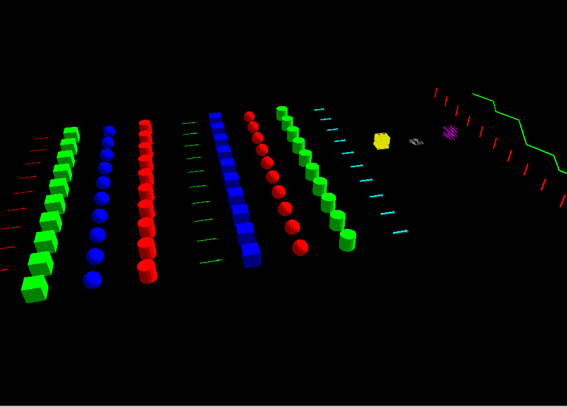

从 :doc:`Marker：发送基本形状 <../Marker-Sending-Basic-Shapes/Marker-Sending-Basic-Shapes>` 开始，了解一个引入本页全程使用的标记消息的最小发布者示例。

Marker 消息
-----------
1 示例用法（C++）
^^^^^^^^^^^^^^^^^
首先，我们将创建一个简单的发布者节点，将 ``visualization_messages`` 包中的 ``Marker`` 消息发布到 ``visualization_marker`` 话题：

.. code-block:: C++

    auto marker_pub = node->create_publisher<visualization_msgs::msg::Marker>("visualization_marker", 1);

之后，就只是填充一个 `visualization_msgs/msg/Marker <https://github.com/ros2/common_interfaces/blob/{DISTRO}/visualization_msgs/msg/Marker.msg>`_
消息并发布它这么简单了：

.. code-block:: C++

    visualization_msgs::msg::Marker marker;

    marker.header.frame_id = "/my_frame";
    marker.header.stamp = rclcpp::Clock().now();

    marker.ns = "basic_shapes";
    marker.id = 0;

    marker.type = visualization_msgs::msg::Marker::SPHERE;

    marker.action = visualization_msgs::msg::Marker::ADD;

    marker.pose.position.x = 0;
    marker.pose.position.y = 0;
    marker.pose.position.z = 0;
    marker.pose.orientation.x = 0.0;
    marker.pose.orientation.y = 0.0;
    marker.pose.orientation.z = 0.0;
    marker.pose.orientation.w = 1.0;

    marker.scale.x = 1.0;
    marker.scale.y = 1.0;
    marker.scale.z = 1.0;

    marker.color.r = 0.0f;
    marker.color.g = 1.0f;
    marker.color.b = 0.0f;
    marker.color.a = 1.0;   // Don't forget to set the alpha!

    // only if using a MESH_RESOURCE marker type:
    marker.mesh_resource = "package://pr2_description/meshes/base_v0/base.dae";

    marker.lifetime = rclcpp::Duration::from_nanoseconds(0);

    marker_pub->publish(marker);

还有一条 `visualization_msgs/msg/MarkerArray <https://github.com/ros2/common_interfaces/blob/{DISTRO}/visualization_msgs/msg/MarkerArray.msg>`_ 消息，它可以让你一次发布多个标记。

2 消息参数
^^^^^^^^^^

Marker 消息类型定义在 `ROS 2 Common Interfaces <https://github.com/ros2/common_interfaces/tree/{DISTRO}/visualization_msgs/msg>`_ 包中。
该包中的消息包含有助于理解消息中每个字段的注释。

* ``ns``：

    这些标记的 namespace。
    它加上 id 构成唯一标识符。

* ``id``：

    分配给此标记的唯一 id。
    你有责任在你的 namespace 内保持它们唯一。

* ``type``：

    标记的类型（Arrow、Sphere、...）。
    可用类型在消息定义中指定。

* ``action``：

    0 = 添加/修改，1 =（已弃用），2 = 删除，3 = 全部删除

* ``pose``：

    标记的位姿，指定为 x/y/z 位置和 x/y/z/w 四元数方向。

* ``scale``：

    标记的缩放。
    在位置/方向之前应用。
    缩放为 [1, 1, 1] 意味着对象将是 1m × 1m × 1m。

* ``color``：

    对象的颜色，指定为 r/g/b/a，值在 [0, 1] 范围内。
    ``a`` 或 Alpha 值表示标记的不透明度，1 表示不透明，0 表示完全透明。
    默认值为 0，即完全透明。
    **你必须将标记的 a 值设置为非零值，否则默认情况下它将是透明的！**

* ``points``：

    仅用于 ``Points``、``Line strips`` 和 ``Line`` / ``Cube`` / ``Sphere`` -list 类型的标记。
    如果你想要指定箭头的起点和终点，它也用于 Arrow 类型。
    此项表示你想要渲染的每个标记对象中心或每个点的 ``geometry_msgs/Point`` 类型列表。

* ``colors``：

    此字段仅用于使用 points 成员的标记。
    此字段为 ``points`` 中的每个条目指定每个顶点的 r/g/b 颜色（尚无 Alpha）。

* ``lifetime``：

    一个 `duration 消息值 <{interface_link(builtin_interfaces/msg/Duration)}>`_，用于在此时间段后自动删除标记。
    如果收到具有相同 ``namespace`` / ``id`` 的另一个标记，倒计时会重置。

* ``frame_locked``：

    没有 ``frame_locked`` 参数时，标记将基于当前变换放置，即使给定的变换后来改变，它也会保持在那里。
    设置此参数告诉 RViz 在每个更新周期将标记重新变换到指定坐标系的新当前位置。

* ``text``：

    用于 ``TEXT_VIEW_FACING`` 标记类型的文本字符串

* ``mesh_resource``：

    ``MESH_RESOURCE`` 标记类型的资源位置。
    可以是 RViz 支持的任何网格类型（1.0 中为二进制 ``.stl`` 或 Ogre ``.mesh``，1.1 中增加了 COLLADA）。
    格式是 `resource_retriever <https://github.com/ros/resource_retriever/tree/{DISTRO}>`_ 使用的 URI 形式，包括 package:// 语法。

3 对象类型
^^^^^^^^^^

.. _RVizMarkerObjectTypes:

3.1 箭头（ARROW=0）
~~~~~~~~~~~~~~~~~~~

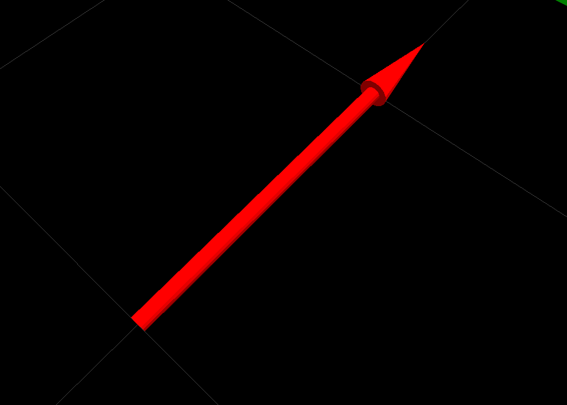

箭头类型提供了两种指定箭头起止位置的不同方式：

* ``位置/方向``：

    枢轴点在其尾尖周围。
    单位方向使它沿 +X 轴指向。
    ``scale.x`` 是箭头长度，``scale.y`` 是箭头宽度，``scale.z`` 是箭头高度。

* ``起点/终点``：

    你还可以使用 points 成员为箭头指定起点/终点。
    如果你将点放入 points 成员，它会假设你想这样做。

    * 索引 0 处的点被假设为起点，索引 1 处的点被假设为终点。
    * ``scale.x`` 是杆直径，``scale.y`` 是头部直径。
      如果 ``scale.z`` 不为零，它指定头部长度。

3.2 立方体（CUBE=1）
~~~~~~~~~~~~~~~~~~~~

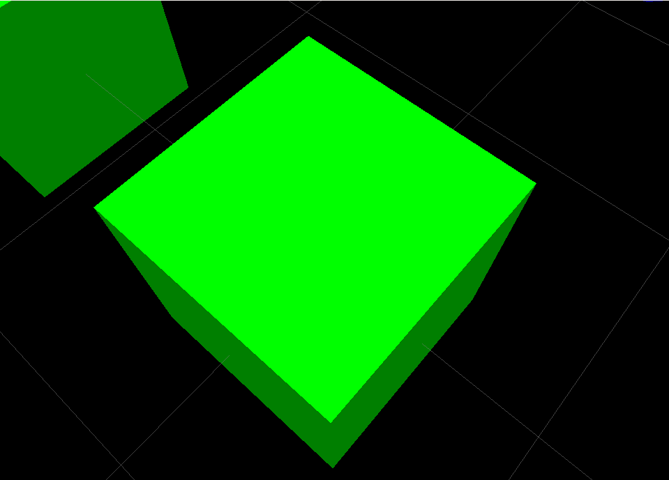

枢轴点在立方体的中心。

3.3 球体（SPHERE=2）
~~~~~~~~~~~~~~~~~~~~

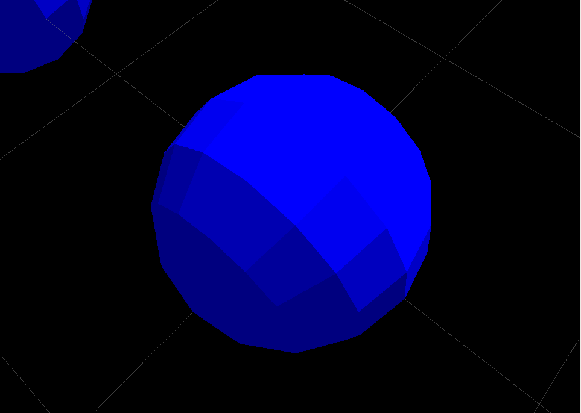

枢轴点在球体的中心。

``scale.x`` 是 x 方向的直径，``scale.y`` 是 y 方向的直径，``scale.z`` 是 z 方向的直径。
通过将它们设置为不同的值，你会得到椭球体而不是球体。

3.4 圆柱体（CYLINDER=3）
~~~~~~~~~~~~~~~~~~~~~~~~

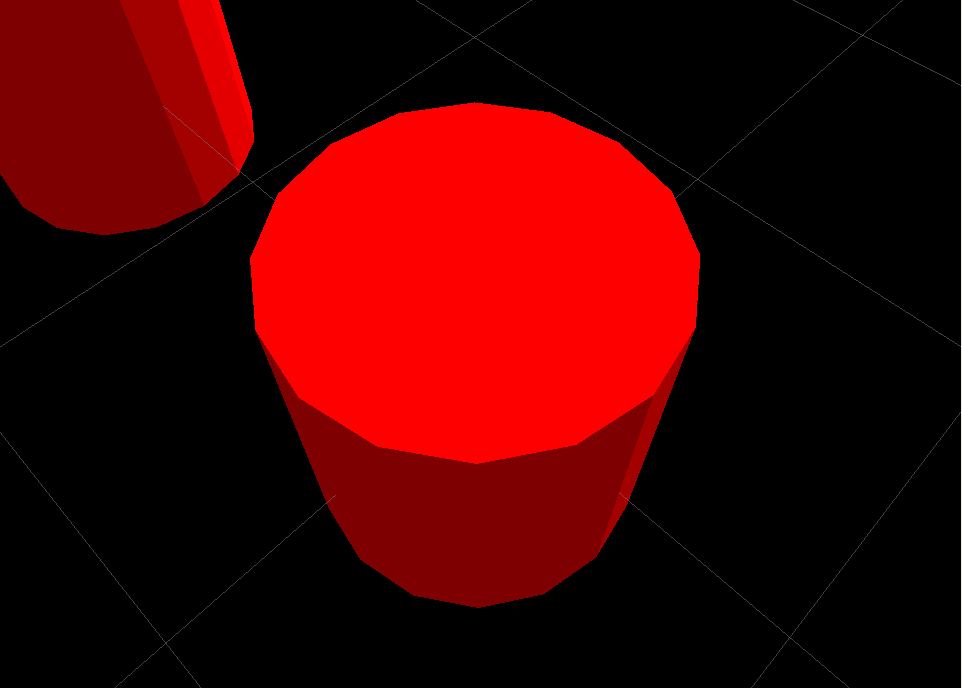

枢轴点在圆柱体的中心。

``scale.x`` 是 x 方向的直径，``scale.y`` 是 y 方向的直径，通过将它们设置为不同的值，你会得到椭圆而不是圆。
使用 ``scale.z`` 指定高度。

3.5 线带（LINE_STRIP=4）
~~~~~~~~~~~~~~~~~~~~~~~~

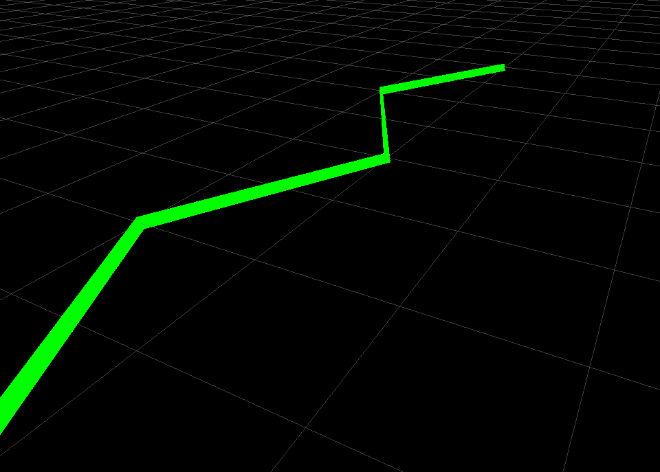

线带使用 `visualization_msgs/msg/Marker <https://github.com/ros2/common_interfaces/blob/{DISTRO}/visualization_msgs/msg/Marker.msg>`_ 消息的 points 成员。
它会在每两个连续点之间绘制一条线，即 0-1、1-2、2-3、3-4、4-5...

线带对缩放也有一些特殊处理：只使用 ``scale.x``，它控制线段的宽度。

注意，``pose`` 仍然会被使用（线中的点会被它们变换），并且线相对于 header 中指定的 ``frame id`` 会是正确的。

3.6 线列表（LINE_LIST=5）
~~~~~~~~~~~~~~~~~~~~~~~~~

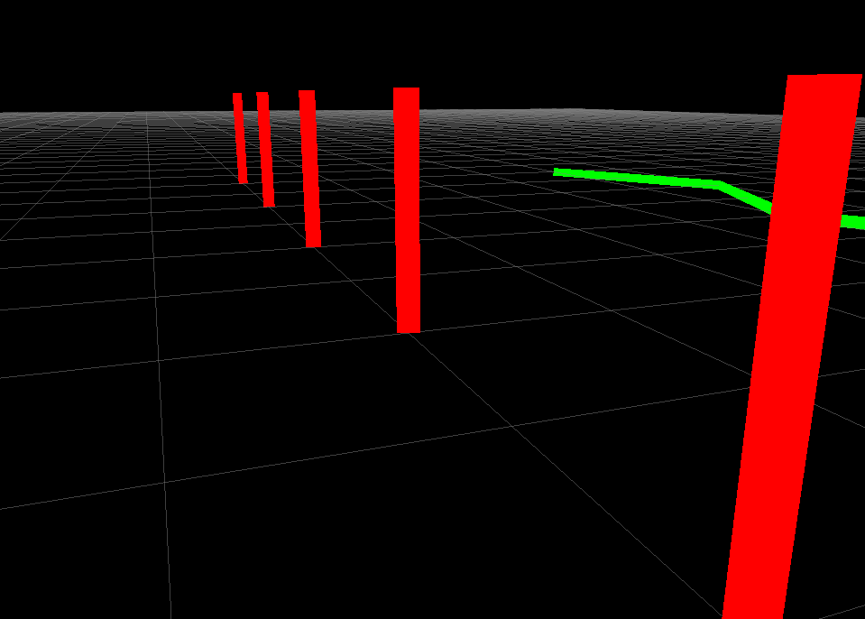

线列表使用 `visualization_msgs/msg/Marker <https://github.com/ros2/common_interfaces/blob/{DISTRO}/visualization_msgs/msg/Marker.msg>`_ 消息的 points 成员。
它会在每对点之间绘制一条线，即 0-1、2-3、4-5、...

线列表对缩放也有一些特殊处理：只使用 ``scale.x``，它控制线段的宽度。

注意，``pose`` 仍然会被使用（线中的点会被它们变换），并且线相对于 header 中指定的 ``frame id`` 会是正确的。

3.7 立方体列表（CUBE_LIST=6）
~~~~~~~~~~~~~~~~~~~~~~~~~~~~~

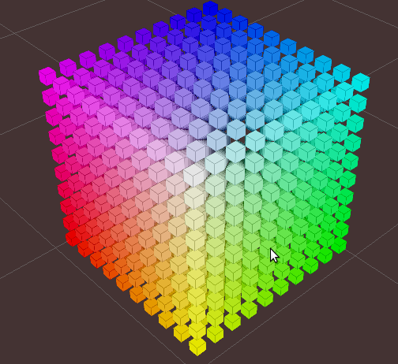

立方体列表是一系列除位置外所有属性都相同的立方体。
使用此对象类型而不是 `visualization_msgs/msg/MarkerArray <https://github.com/ros2/common_interfaces/blob/{DISTRO}/visualization_msgs/msg/MarkerArray.msg>`_ 可以让 RViz 批量渲染，
这会使它们渲染得快得多。
代价是它们都必须具有相同的缩放。

`visualization_msgs/msg/Marker <https://github.com/ros2/common_interfaces/blob/{DISTRO}/visualization_msgs/msg/Marker.msg>`_ 消息的 ``points`` 成员用于每个立方体的位置。

3.8 球体列表（SPHERE_LIST=7）
~~~~~~~~~~~~~~~~~~~~~~~~~~~~~

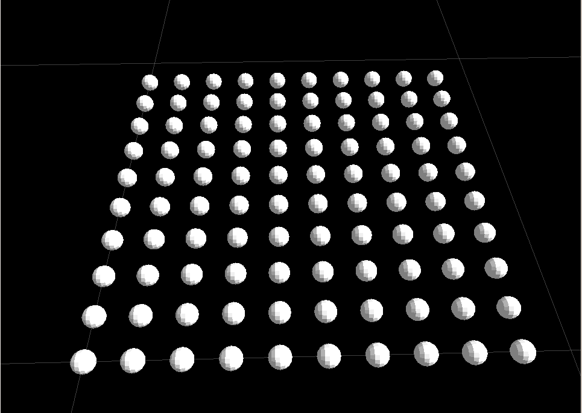

球体列表是一系列除位置外所有属性都相同的球体。
使用此对象类型而不是 `visualization_msgs/msg/MarkerArray <https://github.com/ros2/common_interfaces/blob/{DISTRO}/visualization_msgs/msg/MarkerArray.msg>`_ 可以让 RViz 批量渲染，
这会使它们渲染得快得多。
代价是它们都必须具有相同的缩放。

`visualization_msgs/msg/Marker <https://github.com/ros2/common_interfaces/blob/{DISTRO}/visualization_msgs/msg/Marker.msg>`_ 消息的 ``points`` 成员用于每个球体的位置。

注意，``pose`` 仍然会被使用（线中的 ``points`` 会被它们变换），并且线相对于 header 中指定的 ``frame id`` 会是正确的。

3.9 点（POINTS=8）
~~~~~~~~~~~~~~~~~~

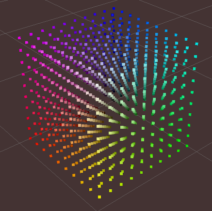

使用 `visualization_msgs/msg/Marker <https://github.com/ros2/common_interfaces/blob/{DISTRO}/visualization_msgs/msg/Marker.msg>`_ 消息的 ``points`` 成员。

``Points`` 对缩放有一些特殊处理：``scale.x`` 是点宽，``scale.y`` 是点高

注意，``pose`` 仍然会被使用（线中的 ``points`` 会被它们变换），并且线相对于 header 中指定的 ``frame id`` 会是正确的。

3.10 面向视图的文本（TEXT_VIEW_FACING=9）
~~~~~~~~~~~~~~~~~~~~~~~~~~~~~~~~~~~~~~~~~

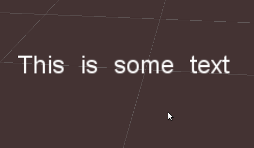

此标记在世界中的一个 3D 位置显示文本。
文本总是以正确的方向出现，以便 RViZ 用户看到包含的文本。
使用标记中的 ``text`` 字段。

只使用 ``scale.z``。
``scale.z`` 指定大写字母 "A" 的高度。

3.11 网格资源（MESH_RESOURCE=10）
~~~~~~~~~~~~~~~~~~~~~~~~~~~~~~~~~

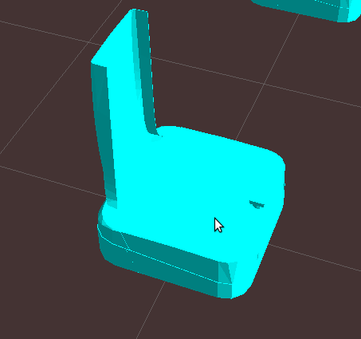

使用标记中的 ``mesh_resource`` 字段。
可以是 RViz 支持的任何网格类型（1.0 中为二进制 ``.stl`` 或 Ogre ``.mesh``，1.1 中增加了 COLLADA（``.dae``））。
格式是 `resource_retriever <https://github.com/ros/resource_retriever/tree/{DISTRO}>`_ 使用的 URI 形式，包括 ``package://`` 语法。

网格及其用法的一个示例是：

.. code-block:: C++

    marker.type = visualization_msgs::Marker::MESH_RESOURCE;
    marker.mesh_resource = "package://pr2_description/meshes/base_v0/base.dae";

网格上的缩放是相对的。
缩放 (1.0, 1.0, 1.0) 意味着网格将按网格文件中指定的确切大小显示。
缩放 (1.0, 1.0, 2.0) 意味着网格将显示为两倍高，但宽度/深度相同。

如果 ``mesh_use_embedded_materials`` 标志设置为 true，并且网格是支持嵌入材质（如 COLLADA）的类型，
那么该文件中定义的材质将被使用，而不是标记中定义的颜色。

自版本 [1.8] 起，即使 ``mesh_use_embedded_materials`` 为 true，
如果标记 ``color`` 设置为除 ``r=0``、``g=0``、``b=0``、``a=0`` 之外的任何值，标记 ``color`` 和 ``alpha`` 将用于给带嵌入材质的网格着色。

3.12 三角形列表（TRIANGLE_LIST=11）
~~~~~~~~~~~~~~~~~~~~~~~~~~~~~~~~~~~

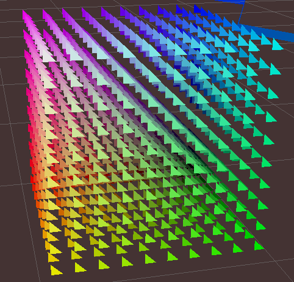

使用 points 成员，可选地使用 colors 成员。
每 3 个点被当作一个三角形，即索引 0-1-2、3-4-5 等。

注意，``pose`` 和 ``scale`` 仍然会被使用（线中的点会被它们变换），
并且线相对于 header 中指定的 ``frame id`` 会是正确的。

4 渲染复杂度说明
^^^^^^^^^^^^^^^^
单个标记总是比许多标记渲染成本更低。
例如，单个立方体列表可以处理数千个立方体，而我们无法渲染数千个单独的立方体标记。
