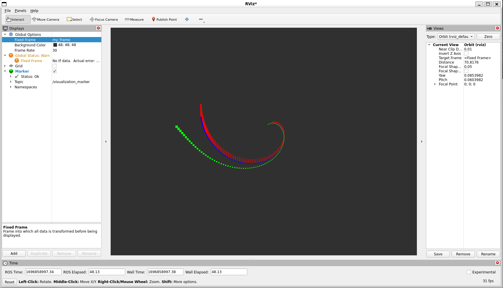

Marker：点和线（C++）
=====================

**目标：** 展示如何使用 ``visualization_msgs/msg/Marker`` 消息将点和线发送到 RViz。

**教程级别：** 中级

**时间：** 15 分钟

.. contents:: 目录
   :depth: 3
   :local:

.. note::

   本教程假设你已经完成了 :doc:`Marker：发送基本形状 <../Marker-Sending-Basic-Shapes/Marker-Sending-Basic-Shapes>`。

引言
----
在 :doc:`Marker：发送基本形状 <../Marker-Sending-Basic-Shapes/Marker-Sending-Basic-Shapes>` 中，你学习了如何使用可视化标记向 RViz 发送简单形状。
你可以发送的不仅仅是简单形状，本教程介绍 ``POINTS``、``LINE_STRIP`` 和 ``LINE_LIST`` 标记类型。
有关类型的完整列表，请参见 :doc:`Marker：显示类型 <../Marker-Display-types/Marker-Display-types>`。

使用点、线带和线列表
--------------------
``POINTS``、``LINE_STRIP`` 和 ``LINE_LIST`` 标记都使用 ``visualization_msgs/msg/Marker`` 消息的 ``points`` 成员。
``POINTS`` 类型在每个添加的点处放置一个点。
``LINE_STRIP`` 类型将每个点作为一组连接线的顶点，其中点 0 连接到点 1，1 连接到 2，2 连接到 3，依此类推。
``LINE_LIST`` 类型由每对点创建不相连的线，例如点 0 到 1，2 到 3，依此类推。

代码
^^^^
从 `visualization_tutorials 仓库 <https://github.com/ros-visualization/visualization_tutorials>`_ 获取包。
本教程的代码位于 ``visualization_marker_tutorials`` 包中。
你可以在 `points_and_lines.cpp <https://github.com/ros-visualization/visualization_tutorials/blob/ros2/visualization_marker_tutorials/src/points_and_lines.cpp>`_ 中阅读它。

代码解析
^^^^^^^^
现在让我们分解代码，跳过上一个教程中已经解释过的部分。
创建的整体效果是一个旋转的螺旋线，每个顶点处有向上延伸的线。

我们从节点使用的头文件开始，包括用于螺旋线的 ``cmath`` 以及用于标记和点的消息。

.. code-block:: c++

   #define _USE_MATH_DEFINES

   #include <chrono>
   #include <cmath>
   #include <memory>

   #include "rclcpp/rclcpp.hpp"
   #include "geometry_msgs/msg/point.hpp"
   #include "visualization_msgs/msg/marker.hpp"

这应该看起来很熟悉。
我们初始化 ROS 2，创建一个节点，在 ``visualization_marker`` 话题上创建一个发布者，并设置循环速率。

.. code-block:: c++

   rclcpp::init(argc, argv);
   auto node = rclcpp::Node::make_shared("points_and_lines");
   auto marker_pub = node->create_publisher<visualization_msgs::msg::Marker>(
     "visualization_marker", 10);
   rclcpp::Rate loop_rate(30);

我们还创建一个浮点变量，用于随时间对螺旋线进行动画。

.. code-block:: c++

   float f = 0.0f;

在主循环内部，我们创建三个 ``visualization_msgs/msg/Marker`` 消息并初始化它们所有的共享数据。
默认情况下，标记消息包含一个位姿，其四元数初始化为单位方向，因此我们只需要设置对本教程重要的字段。

.. code-block:: c++

   visualization_msgs::msg::Marker points, line_strip, line_list;
   points.header.frame_id = line_strip.header.frame_id = line_list.header.frame_id = "my_frame";
   points.header.stamp = line_strip.header.stamp = line_list.header.stamp = rclcpp::Clock().now();
   points.ns = line_strip.ns = line_list.ns = "points_and_lines";
   points.action = line_strip.action = line_list.action = visualization_msgs::msg::Marker::ADD;

这里我们为三个标记分配三个不同的 ID。
使用 ``points_and_lines`` namespace 确保它们不会与其他标记发布者冲突。

.. code-block:: c++

   points.id = 0;
   line_strip.id = 1;
   line_list.id = 2;

这里我们将标记类型设置为 ``POINTS``、``LINE_STRIP`` 和 ``LINE_LIST``。

.. code-block:: c++

   points.type = visualization_msgs::msg::Marker::POINTS;
   line_strip.type = visualization_msgs::msg::Marker::LINE_STRIP;
   line_list.type = visualization_msgs::msg::Marker::LINE_LIST;

``scale`` 成员对这些标记类型意味着不同的东西。
``POINTS`` 标记分别使用 ``x`` 和 ``y`` 成员表示宽度和高度，而 ``LINE_STRIP`` 和 ``LINE_LIST`` 标记只使用 ``x`` 分量，它定义线宽。
缩放值以米为单位。

.. code-block:: c++

   points.scale.x = 0.2;
   points.scale.y = 0.2;

   line_strip.scale.x = 0.1;
   line_list.scale.x = 0.1;

这里我们将点设置为绿色，线带设置为蓝色，线列表设置为红色。
与其他标记一样，Alpha 通道必须为非零。

.. code-block:: c++

   points.color.g = 1.0f;
   points.color.a = 1.0;

   line_strip.color.b = 1.0;
   line_strip.color.a = 1.0;

   line_list.color.r = 1.0;
   line_list.color.a = 1.0;

现在我们创建点和线的顶点。
我们使用正弦和余弦生成螺旋线。
``POINTS`` 和 ``LINE_STRIP`` 标记每个顶点只需要一个点，而 ``LINE_LIST`` 标记每个线段需要两个点。

.. code-block:: c++

   for (uint32_t i = 0; i < 100; ++i) {
     float y = 5 * sin(f + i / 100.0f * 2 * M_PI);
     float z = 5 * cos(f + i / 100.0f * 2 * M_PI);

     geometry_msgs::msg::Point p;
     p.x = static_cast<int32_t>(i) - 50;
     p.y = y;
     p.z = z;

     points.points.push_back(p);
     line_strip.points.push_back(p);

     // The line list needs two points for each line
     line_list.points.push_back(p);
     p.z += 1.0;
     line_list.points.push_back(p);
   }

一旦标记消息填充完成，我们发布所有三个消息。

.. code-block:: c++

   marker_pub->publish(points);
   marker_pub->publish(line_strip);
   marker_pub->publish(line_list);

然后我们睡眠，推进动画相位，并循环回顶部。

.. code-block:: c++

   loop_rate.sleep();
   f += 0.04f;

查看标记
^^^^^^^^
在你的工作空间中构建包：

.. code-block:: console

   $ colcon build --packages-select visualization_marker_tutorials

然后 source 你的工作空间并运行节点：

.. code-block:: console

   $ source install/setup.bash
   $ ros2 run visualization_marker_tutorials points_and_lines

现在运行 RViz：

.. code-block:: console

   $ source install/setup.bash
   $ ros2 run rviz2 rviz2

如果你以前从未使用过 RViz，请从 :doc:`RViz 用户指南 <../RViz-User-Guide/RViz-User-Guide>` 开始。

按照与上一个教程相同的方式设置 RViz。
因为我们没有设置任何变换，请将 ``Fixed Frame`` 设置为 ``my_frame``。
然后添加一个 ``Marker`` 显示项。
默认话题 ``visualization_marker`` 与节点发布的话题相同。

你应该能看到一个旋转的螺旋线，看起来像这样：

下一步
------
有关 RViz 支持的标记和选项的更多信息，继续学习 :doc:`Marker：显示类型 <../Marker-Display-types/Marker-Display-types>`。
试试其他一些标记类型。
