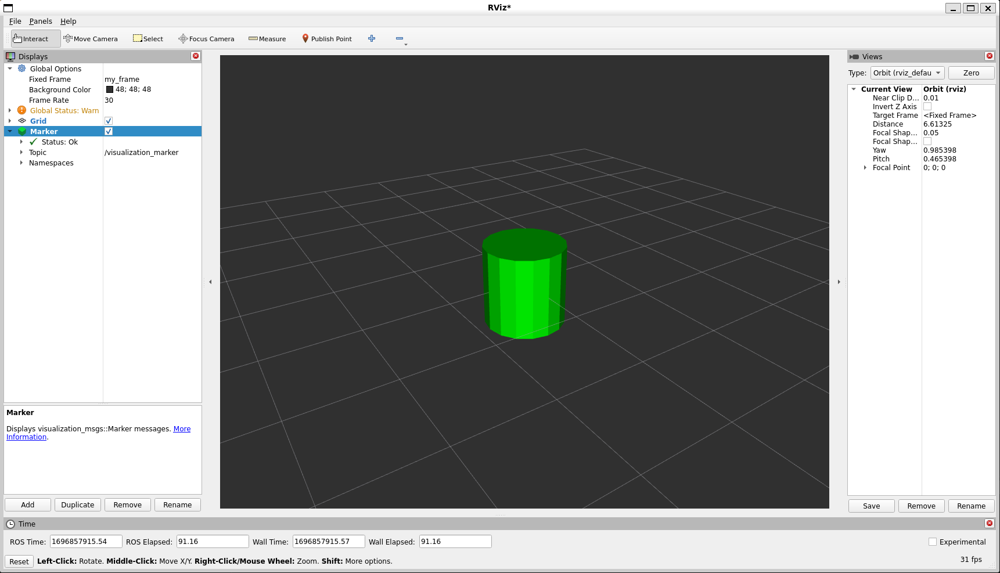

Marker：发送基本形状（C++）
===========================

**目标：** 展示如何使用 ``visualization_msgs/msg/Marker`` 消息将基本形状发送到 RViz。

**教程级别：** 中级

**时间：** 15 分钟

.. contents:: 目录
   :depth: 3
   :local:

.. note::

   本教程假设你已经熟悉编写 ROS 2 C++ 节点和使用 ``colcon`` 构建包。

引言
----
与许多其他 RViz 显示项不同，``Marker`` 显示项让你在 RViz 不需要事先知道数据含义的情况下可视化数据。
相反，你的节点通过 ``visualization_msgs/msg/Marker`` 消息发送基本对象，RViz 将它们渲染为箭头、盒子、球体、圆柱体和其他标记类型。

本教程展示如何发送四种基本形状：立方体、球体、圆柱体和箭头。
我们将创建一个每秒发送一个新标记的程序，用不同形状替换前一个标记。

如果你想在本演示之后获得关于标记字段和对象类型的更广泛参考，请参见 :doc:`Marker：显示类型 <../Marker-Display-types/Marker-Display-types>`。

创建包
------
从 `visualization_tutorials 仓库 <https://github.com/ros-visualization/visualization_tutorials>`_ 获取包，并在你的工作空间中构建它。

.. code-block:: console

   $ colcon build --packages-select visualization_marker_tutorials

发送标记
--------

代码
^^^^
本教程的代码位于 ``visualization_marker_tutorials`` 包中。
你可以在 `basic_shapes.cpp <https://github.com/ros-visualization/visualization_tutorials/blob/ros2/visualization_marker_tutorials/src/basic_shapes.cpp>`_ 中阅读它。

代码解析
^^^^^^^^
好的，让我们逐段分解代码。
我们首先包含节点使用的头文件，包括 ``rclcpp`` 和 ``visualization_msgs/msg/Marker`` 消息定义。

.. code-block:: c++

   #include <memory>

   #include "rclcpp/logging.hpp"
   #include "rclcpp/rclcpp.hpp"
   #include "visualization_msgs/msg/marker.hpp"

这应该看起来很熟悉。
我们初始化 ROS 2，创建一个节点，并在 ``visualization_marker`` 话题上创建一个发布者。

.. code-block:: c++

   rclcpp::init(argc, argv);
   auto node = rclcpp::Node::make_shared("basic_shapes");
   auto marker_pub = node->create_publisher<visualization_msgs::msg::Marker>(
     "visualization_marker", 1);
   rclcpp::Rate loop_rate(1);

到目前为止，你应该已经见过 ROS 2 的包含和节点设置。
对 RViz 来说，重要的是发布者，因为 ``Marker`` 显示项订阅同一个话题。

这里我们创建一个整数来跟踪我们要发布的形状。
我们在这里使用的四种类型都以相同的方式使用 ``visualization_msgs/msg/Marker`` 消息，因此我们可以简单地切换形状类型来演示四种不同的形状。

.. code-block:: c++

   uint32_t shape = visualization_msgs::msg::Marker::CUBE;

这开始了程序的核心部分。
首先我们创建一个新的 ``visualization_msgs/msg/Marker`` 并开始填充它。
header 设置标记的坐标系 ID 和时间戳。

.. code-block:: c++

   visualization_msgs::msg::Marker marker;
   marker.header.frame_id = "my_frame";
   marker.header.stamp = rclcpp::Clock().now();

作为示例，我们将 ``frame_id`` 设置为 ``my_frame``。
在运行系统中，这应该是你想要解释标记位姿所相对于的坐标系。
因为本教程不发布变换，所以 RViz 之后需要使用相同的固定坐标系。

namespace 和 ID 字段一起使用来为标记创建唯一名称。
如果另一个具有相同 namespace 和 ID 的消息到达，新标记会替换旧标记。

.. code-block:: c++

   marker.ns = "basic_shapes";
   marker.id = 0;

这个 ``type`` 字段指定了我们发送的标记类型。
可用类型列在 ``visualization_msgs/msg/Marker`` 消息中。
这里我们将类型设置为 ``shape`` 变量，它在每次循环中都会改变。

.. code-block:: c++

   marker.type = shape;

``action`` 字段指定对标记做什么。
ROS 2 中使用的值是 ``ADD``、``DELETE`` 和 ``DELETEALL``。
``ADD`` 有点名不副实，因为它实际上意味着“创建或修改”。

.. code-block:: c++

   marker.action = visualization_msgs::msg::Marker::ADD;

这里我们设置标记的位姿。
这是一个相对于 header 中指定的坐标系和时间的完整 6 自由度位姿。
这里我们将它放在原点并使用单位方向。

.. code-block:: c++

   marker.pose.position.x = 0;
   marker.pose.position.y = 0;
   marker.pose.position.z = 0;
   marker.pose.orientation.x = 0.0;
   marker.pose.orientation.y = 0.0;
   marker.pose.orientation.z = 0.0;
   marker.pose.orientation.w = 1.0;

现在我们指定标记的缩放。
对于基本形状，所有方向上的缩放为 ``1.0`` 意味着边长为 1 米。

.. code-block:: c++

   marker.scale.x = 1.0;
   marker.scale.y = 1.0;
   marker.scale.z = 1.0;

颜色以范围 ``[0, 1]`` 内的 RGBA 值指定。
这里我们使用不透明的绿色。
Alpha 通道尤其重要，因为如果 ``a`` 保持为 ``0``，标记默认是透明的。

.. code-block:: c++

   marker.color.r = 0.0f;
   marker.color.g = 1.0f;
   marker.color.b = 0.0f;
   marker.color.a = 1.0;

``lifetime`` 字段控制标记在被自动删除之前应保留多长时间。
零持续时间意味着它不应被自动删除。

.. code-block:: c++

   marker.lifetime = rclcpp::Duration::from_nanoseconds(0);

现在我们发布标记消息。

.. code-block:: c++

   marker_pub->publish(marker);

这段代码让我们在只发布一个标记消息的同时展示所有四种形状。
基于当前形状，我们设置下一个要发布的形状。

.. code-block:: c++

   switch (shape) {
     case visualization_msgs::msg::Marker::CUBE:
       shape = visualization_msgs::msg::Marker::SPHERE;
       break;
     case visualization_msgs::msg::Marker::SPHERE:
       shape = visualization_msgs::msg::Marker::ARROW;
       break;
     case visualization_msgs::msg::Marker::ARROW:
       shape = visualization_msgs::msg::Marker::CYLINDER;
       break;
     case visualization_msgs::msg::Marker::CYLINDER:
       shape = visualization_msgs::msg::Marker::CUBE;
       break;
   }

睡眠一秒并循环回顶部。

.. code-block:: c++

   loop_rate.sleep();

构建代码
^^^^^^^^
使用以下命令在你的工作空间中构建 ``visualization_marker_tutorials``：

.. code-block:: console

   $ colcon build --packages-select visualization_marker_tutorials

运行代码
^^^^^^^^
Source 你的工作空间并运行节点。

.. code-block:: console

   $ source install/setup.bash
   $ ros2 run visualization_marker_tutorials basic_shapes

查看标记
--------
现在节点正在发布标记，启动 RViz 以便查看它们。

.. code-block:: console

   $ source install/setup.bash
   $ ros2 run rviz2 rviz2

如果你以前从未使用过 RViz，请从 :doc:`RViz 用户指南 <../RViz-User-Guide/RViz-User-Guide>` 开始。

因为我们没有设置任何变换，所以首先要做的是将 ``Fixed Frame`` 设置为标记消息中使用的坐标系 ``my_frame``。
然后添加一个 ``Marker`` 显示项。
注意，默认话题 ``visualization_marker`` 与节点发布的话题相同。

你现在应该能在原点看到一个每秒改变形状的标记。

更多信息
--------
对于下一个标记教程，继续学习 :doc:`Marker：点和线 <../Marker-Points-and-Lines/Marker-Points-and-Lines>`。
有关标记消息字段以及此处展示的四种类型之外的标记类型的更多信息，继续学习 :doc:`Marker：显示类型 <../Marker-Display-types/Marker-Display-types>`。
有关完整源码树，请参见 `visualization_tutorials 仓库 <https://github.com/ros-visualization/visualization_tutorials>`_。
