构建自定义 RViz 显示
====================

背景
----
有许多类型的数据在 RViz 中已有可视化。
但是，如果有一种消息类型还没有插件来显示它，在 RViz 中看到它有两种选择。

 1. 将消息转换为另一种类型，例如 ``visualization_msgs/Marker``。
 2. 编写一个自定义 RViz 显示。

使用第一种选择，会有更多的网络流量，并且数据的表示方式也有局限。
但它也快速且灵活。
后一种选择在本教程中解释。
它需要一些工作，但可以带来更丰富的可视化。

本教程的所有代码都可以在 `此仓库 <https://github.com/MetroRobots/rviz_plugin_tutorial>`__ 中找到。
为了看到本教程中编写的插件的渐进式进展，
该仓库有不同的分支（``step2``、``step3``...），每个分支都可以在你进行时编译和运行。

Point2D 消息
------------

我们将使用 ``rviz_plugin_tutorial_msgs`` 包中定义的一个玩具消息：``Point2D.msg``：

.. code-block::

   std_msgs/Header header
   float64 x
   float64 y

基础插件的模板
--------------

系好安全带，有很多代码。
你可以在分支名称为 ``step1`` 下查看此代码的完整版本。

头文件
^^^^^^

这是 ``point_display.hpp`` 的内容

.. code-block:: c++

   #ifndef RVIZ_PLUGIN_TUTORIAL__POINT_DISPLAY_HPP_
   #define RVIZ_PLUGIN_TUTORIAL__POINT_DISPLAY_HPP_

   #include <rviz_common/message_filter_display.hpp>
   #include <rviz_plugin_tutorial_msgs/msg/point2_d.hpp>

   namespace rviz_plugin_tutorial
   {
   class PointDisplay
     : public rviz_common::MessageFilterDisplay<rviz_plugin_tutorial_msgs::msg::Point2D>
   {
     Q_OBJECT

   protected:
     void processMessage(const rviz_plugin_tutorial_msgs::msg::Point2D::ConstSharedPtr msg) override;
   };
   }  // namespace rviz_plugin_tutorial

   #endif  // RVIZ_PLUGIN_TUTORIAL__POINT_DISPLAY_HPP_

* 我们正在实现 `MessageFilterDisplay <https://github.com/ros2/rviz/blob/0ef2b56373b98b5536f0f817c11dc2b5549f391d/rviz_common/include/rviz_common/message_filter_display.hpp#L43>`__ 类，它可以用于任何带有 ``std_msgs/Header`` 的消息。
* 该类使用我们的 ``Point2D`` 消息类型作为模板参数。
* `由于超出本教程范围的原因 <https://doc.qt.io/qt-5/moc.html>`__，你需要其中包含 ``Q_OBJECT`` 宏才能让 GUI 的 QT 部分工作。
* ``processMessage`` 是唯一需要实现的方法，我们将在 cpp 文件中实现它。

源文件
^^^^^^

``point_display.cpp``

.. code-block:: c++

   #include <rviz_plugin_tutorial/point_display.hpp>
   #include <rviz_common/logging.hpp>

   namespace rviz_plugin_tutorial
   {
   void PointDisplay::processMessage(const rviz_plugin_tutorial_msgs::msg::Point2D::ConstSharedPtr msg)
   {
     RVIZ_COMMON_LOG_INFO_STREAM("We got a message with frame " << msg->header.frame_id);
   }
   }  // namespace rviz_plugin_tutorial

   #include <pluginlib/class_list_macros.hpp>
   PLUGINLIB_EXPORT_CLASS(rviz_plugin_tutorial::PointDisplay, rviz_common::Display)

* 日志记录并不是严格必要的，但有助于调试。
* 为了让 RViz 找到我们的插件，我们需要在代码中使用这个 ``PLUGINLIB`` 调用（以及下面的其他东西）。

package.xml
^^^^^^^^^^^

我们的 package.xml 中需要以下三个依赖：

.. code-block:: xml

     <depend>pluginlib</depend>
     <depend>rviz_common</depend>
     <depend>rviz_plugin_tutorial_msgs</depend>

rviz_common_plugins.xml
^^^^^^^^^^^^^^^^^^^^^^^

.. code-block:: xml

   <library path="point_display">
     <class type="rviz_plugin_tutorial::PointDisplay" base_class_type="rviz_common::Display">
       <description></description>
     </class>
   </library>

* 这是标准的 ``pluginlib`` 代码。

  * 库 ``path`` 是我们在 CMake 中分配的库的名称。
  * 类应与上面的 ``PLUGINLIB`` 调用匹配。

* 我们稍后会回到描述，我保证。

CMakeLists.txt
^^^^^^^^^^^^^^

将以下行添加到标准模板的顶部。

.. code-block:: cmake

   find_package(ament_cmake_ros REQUIRED)
   find_package(pluginlib REQUIRED)
   find_package(rviz_common REQUIRED)
   find_package(rviz_plugin_tutorial_msgs REQUIRED)

   set(CMAKE_AUTOMOC ON)
   qt5_wrap_cpp(MOC_FILES
     include/rviz_plugin_tutorial/point_display.hpp
   )

   add_library(point_display src/point_display.cpp ${MOC_FILES})
   target_include_directories(point_display PUBLIC
     $<BUILD_INTERFACE:${CMAKE_CURRENT_SOURCE_DIR}/include>
     $<INSTALL_INTERFACE:include>
   )
   ament_target_dependencies(point_display
     pluginlib
     rviz_common
     rviz_plugin_tutorial_msgs
   )
   install(TARGETS point_display
           EXPORT export_rviz_plugin_tutorial
           ARCHIVE DESTINATION lib
           LIBRARY DESTINATION lib
           RUNTIME DESTINATION bin
   )
   install(DIRECTORY include/
           DESTINATION include
   )
   install(FILES rviz_common_plugins.xml
           DESTINATION share/${PROJECT_NAME}
   )
   ament_export_include_directories(include)
   ament_export_targets(export_rviz_plugin_tutorial)
   pluginlib_export_plugin_description_file(rviz_common rviz_common_plugins.xml)

* 为了生成正确的 Qt 文件，我们需要

  * 打开 ``CMAKE_AUTOMOC``。
  * 通过对每个包含 ``Q_OBJECT`` 的头文件调用 ``qt5_wrap_cpp`` 来包装头文件。
  * 将 ``MOC_FILES`` 与我们其他 cpp 文件一起包含在库中。

* 注意，如果你不包装你的头文件，你可能会在运行时尝试加载插件时收到一条错误消息，大致如下：

  .. code-block::

     [rviz2]: PluginlibFactory: The plugin for class 'rviz_plugin_tutorial::PointDisplay' failed to load. Error: Failed to load library /home/ros/ros2_ws/install/rviz_plugin_tutorial/lib/libpoint_display.so. Make sure that you are calling the PLUGINLIB_EXPORT_CLASS macro in the library code, and that names are consistent between this macro and your XML. Error string: Could not load library LoadLibrary error: /home/ros/ros2_ws/install/rviz_plugin_tutorial/lib/libpoint_display.so: undefined symbol: _ZTVN20rviz_plugin_tutorial12PointDisplayE, at /tmp/binarydeb/ros-foxy-rcutils-1.1.4/src/shared_library.c:84

* 许多其他代码确保插件部分工作。
  也就是说，调用 ``pluginlib_export_plugin_description_file`` 对于让 RViz 找到你的新插件至关重要。

测试一下
^^^^^^^^

编译你的代码并运行 ``rviz2``。
你应该能够通过点击左下角的 ``Add``，然后选择你的包/插件来添加你的新插件。

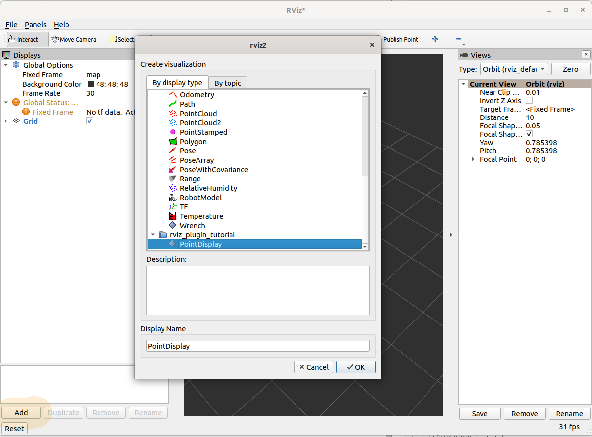

最初，显示将处于错误状态，因为你还没有分配话题。

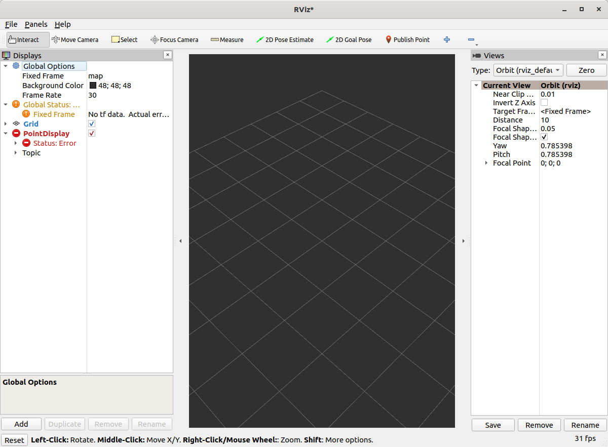

如果我们输入话题 ``/point``，它应该能正常加载，但不会显示任何东西。

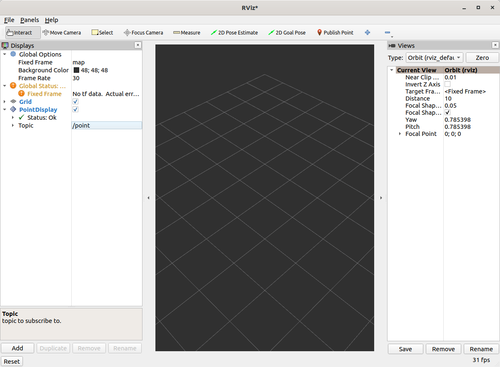

你可以使用以下命令发布消息：

.. code-block:: console

   $ ros2 topic pub /point rviz_plugin_tutorial_msgs/msg/Point2D "{header: {frame_id: map}, x: 1, y: 2}" -r 0.5

那应该会导致 "We got a message" 日志出现在 RViz 的 ``stdout`` 中。

实际可视化
----------

你可以在分支名称为 ``step2`` 下查看此步骤的完整版本。

首先，你需要在 ``CMakeLists.txt`` 和 ``package.xml`` 中添加对 ``rviz_rendering`` 包的依赖。

我们需要在头文件中添加三行：

* ``#include <rviz_rendering/objects/shape.hpp>`` - `rviz_rendering 包中有很多对象 <https://github.com/ros2/rviz/tree/ros2/rviz_rendering/include/rviz_rendering/objects>`_ 可以用于构建你的可视化。
  这里我们使用一个简单的形状。
* 在类中，我们将添加一个新的 ``protected`` 虚方法：``void onInitialize() override;``
* 我们还为我们的形状对象添加一个指针：``std::unique_ptr<rviz_rendering::Shape> point_shape_;``

然后在 cpp 文件中，我们定义 ``onInitialize`` 方法：

.. code-block:: c++

   void PointDisplay::onInitialize()
   {
     MFDClass::onInitialize();
     point_shape_ =
       std::make_unique<rviz_rendering::Shape>(rviz_rendering::Shape::Type::Cube, scene_manager_,
         scene_node_);
   }

* 为了方便，``MFDClass`` 被 `别名化 <https://github.com/ros2/rviz/blob/0ef2b56373b98b5536f0f817c11dc2b5549f391d/rviz_common/include/rviz_common/message_filter_display.hpp#L57>`_ 为模板化的父类。
* 形状对象必须在这里的 ``onInitialize`` 方法中构造，而不是在构造函数中，因为否则 ``scene_manager_`` 和 ``scene_node_`` 还没有准备好。

我们还更新我们的 ``processMessage`` 方法：

.. code-block:: c++

   void PointDisplay::processMessage(const rviz_plugin_tutorial_msgs::msg::Point2D::ConstSharedPtr msg)
   {
     RVIZ_COMMON_LOG_INFO_STREAM("We got a message with frame " << msg->header.frame_id);

     Ogre::Vector3 position;
     Ogre::Quaternion orientation;
     if (!context_->getFrameManager()->getTransform(msg->header, position, orientation)) {
       RVIZ_COMMON_LOG_DEBUG_STREAM("Error transforming from frame '" << msg->header.frame_id <<
           "' to frame '" << qPrintable(fixed_frame_) << "'");
     }

     scene_node_->setPosition(position);
     scene_node_->setOrientation(orientation);

     Ogre::Vector3 point_pos;
     point_pos.x = msg->x;
     point_pos.y = msg->y;
     point_shape_->setPosition(point_pos);
   }

* 我们需要为我们的消息获取正确的坐标系，并相应地变换 ``scene_node_``。
  这确保可视化不会总是相对于固定坐标系出现。
* 我们一直在构建的实际可视化在最后四行中：我们将可视化的位置设置为与消息的位置匹配。

结果应该看起来像这样：

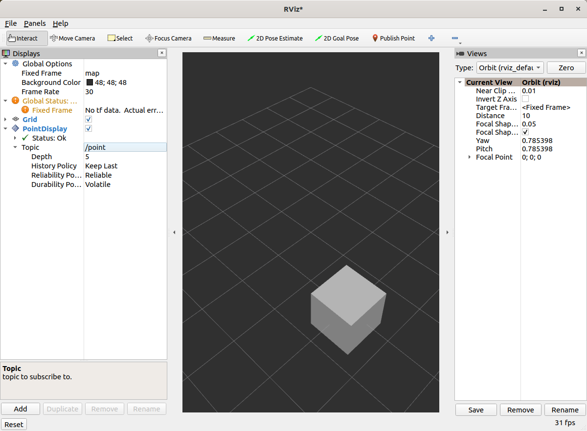

如果方框没有出现在那个位置，可能是因为：

* 你此时没有发布该话题
* 消息在过去 2 秒内没有被发布。
* 你没有在 RViz 中正确设置话题。

有选项是很好的。
----------------

如果你想让用户自定义可视化的不同属性，你需要添加 `rviz_common::Property 对象 <https://github.com/ros2/rviz/tree/ros2/rviz_common/include/rviz_common/properties>`_。

你可以在分支名称为 ``step3`` 下查看此步骤的完整版本。

头文件更新
^^^^^^^^^^

包含颜色属性的头文件：``#include <rviz_common/properties/color_property.hpp>``。
颜色只是你可以设置的众多属性之一。

添加 ``updateStyle`` 的原型，每当 GUI 通过 Qt 的 SIGNAL/SLOT 框架更改时都会调用它：

.. code-block:: c++

  private Q_SLOTS:
    void updateStyle();

添加一个新属性来存储属性本身：``std::unique_ptr<rviz_common::properties::ColorProperty> color_property_;``

Cpp 更新
^^^^^^^^

* ``#include <rviz_common/properties/parse_color.hpp>`` - 包含将属性转换为 OGRE 颜色的辅助函数。
* 在我们的 ``onInitialize`` 中，我们添加

.. code-block:: c++

    color_property_ = std::make_unique<rviz_common::properties::ColorProperty>(
        "Point Color", QColor(36, 64, 142), "Color to draw the point.", this, SLOT(updateStyle()));
    updateStyle();

* 这使用其名称、默认值、描述和回调来构造对象。
* 我们直接调用 ``updateStyle``，这样即使属性尚未更改，颜色也会在开始时被设置。

* 然后我们定义回调。

.. code-block:: c++

    void PointDisplay::updateStyle()
    {
      Ogre::ColourValue color = rviz_common::properties::qtToOgre(color_property_->getColor());
      point_shape_->setColor(color);
    }

结果应该看起来像这样：

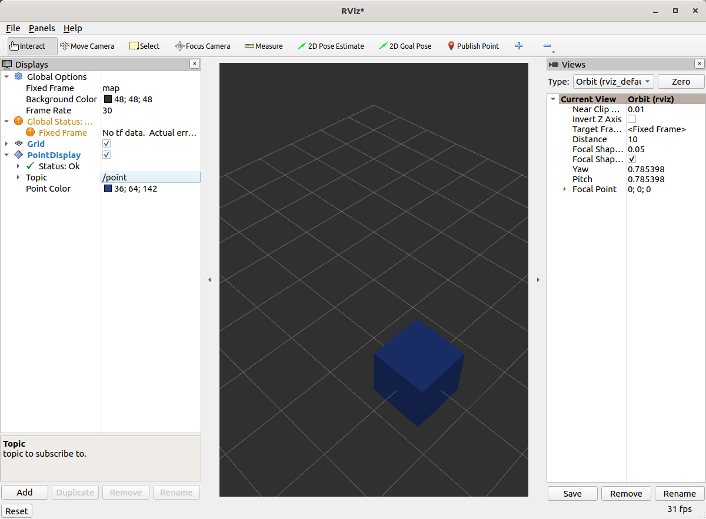

哦，粉色！

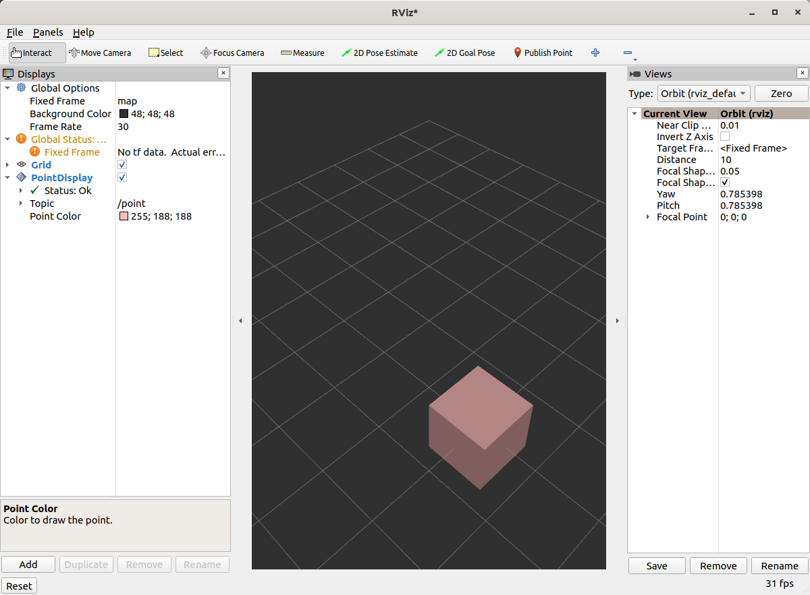

状态报告
--------

你可以在分支名称为 ``step4`` 下查看此步骤的完整版本。

你还可以设置显示的状态。
作为一个任意的例子，让我们让我们的显示在 x 坐标为负时显示一个警告，因为为什么不呢？
在 ``processMessage`` 中：

.. code-block:: c++

     if (msg->x < 0) {
       setStatus(StatusProperty::Warn, "Message",
           "I will complain about points with negative x values.");
     } else {
       setStatus(StatusProperty::Ok, "Message", "OK");
     }

* 我们假设之前有一个 ``using rviz_common::properties::StatusProperty;`` 声明。
* 将状态想象为键/值对，键是某个字符串（这里我们使用 ``"Message"``\ ），值是状态级别（error/warn/ok）和描述（其他字符串）。

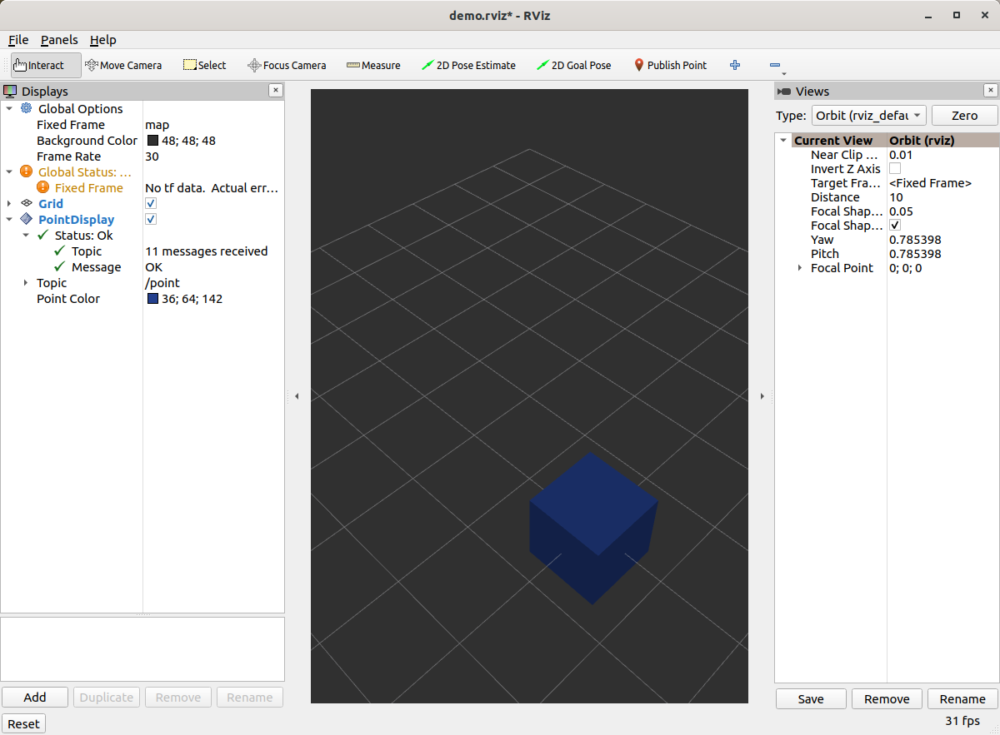

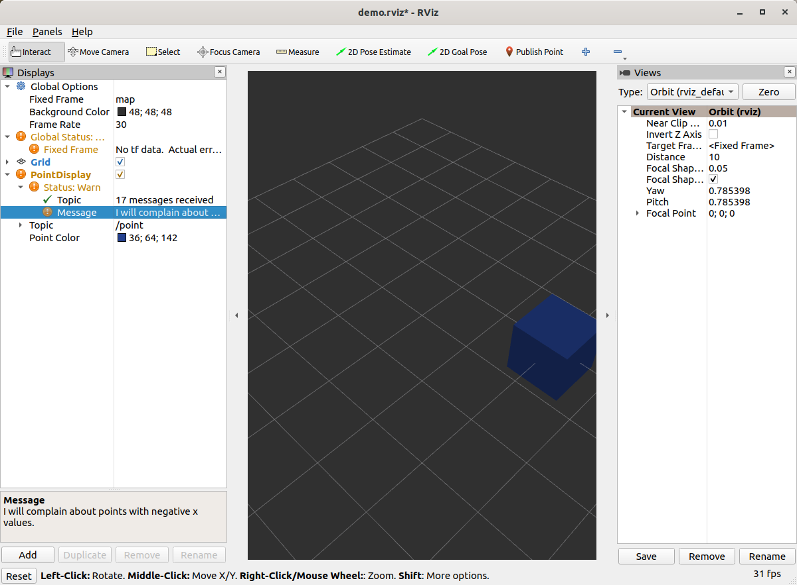

清理
----

现在是时候把它清理一下了。
这让事情看起来更漂亮，也更容易使用，但不是严格必需的。
你可以在分支名称为 ``step5`` 下查看此步骤的完整版本。

首先，我们更新插件声明。

.. code-block:: xml

   <library path="point_display">
     <class name="Point2D" type="rviz_plugin_tutorial::PointDisplay" base_class_type="rviz_common::Display">
       <description>Tutorial to display a point</description>
       <message_type>rviz_plugin_tutorial_msgs/msg/Point2D</message_type>
     </class>
   </library>

* 我们在 ``class`` 标签中添加 ``name`` 字段。
  这会更改在 RViz 中显示的名称。
  在代码中，把它叫做 ``PointDisplay`` 是有意义的，但在 RViz 中，我们想简化它。
* 我们在描述中放入实际文本。
  不要偷懒。
* 通过在这里声明特定的消息类型，当你尝试按话题添加显示时，它会为那种类型的话题建议此插件。

我们还在 ``icons/classes/Point2D.png`` 为插件添加一个图标。
文件夹是硬编码的，文件名应与插件声明中的名称匹配（如果未指定，则为类的名称）。
`[图标来源] <https://commons.wikimedia.org/wiki/File:Free_software_icon.svg>`_

我们需要在 CMake 中安装图像文件。

.. code-block:: cmake

   install(FILES icons/classes/Point2D.png
           DESTINATION share/${PROJECT_NAME}/icons/classes
   )

现在当你添加显示时，它应该带有一个图标和描述显示出来。

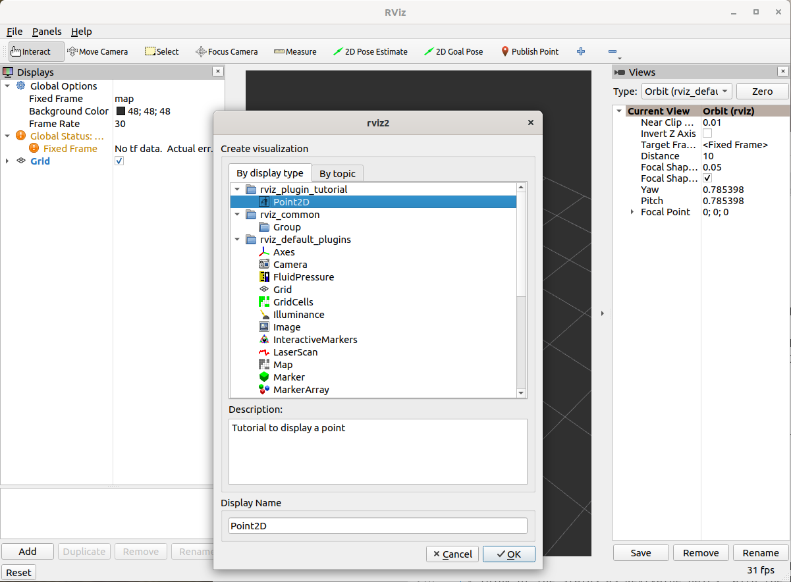

这是尝试按话题添加时的显示：

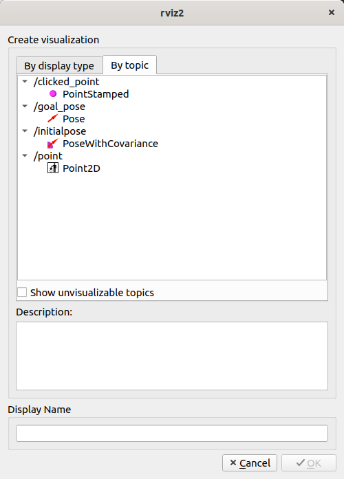

最后，这是标准界面中的图标：

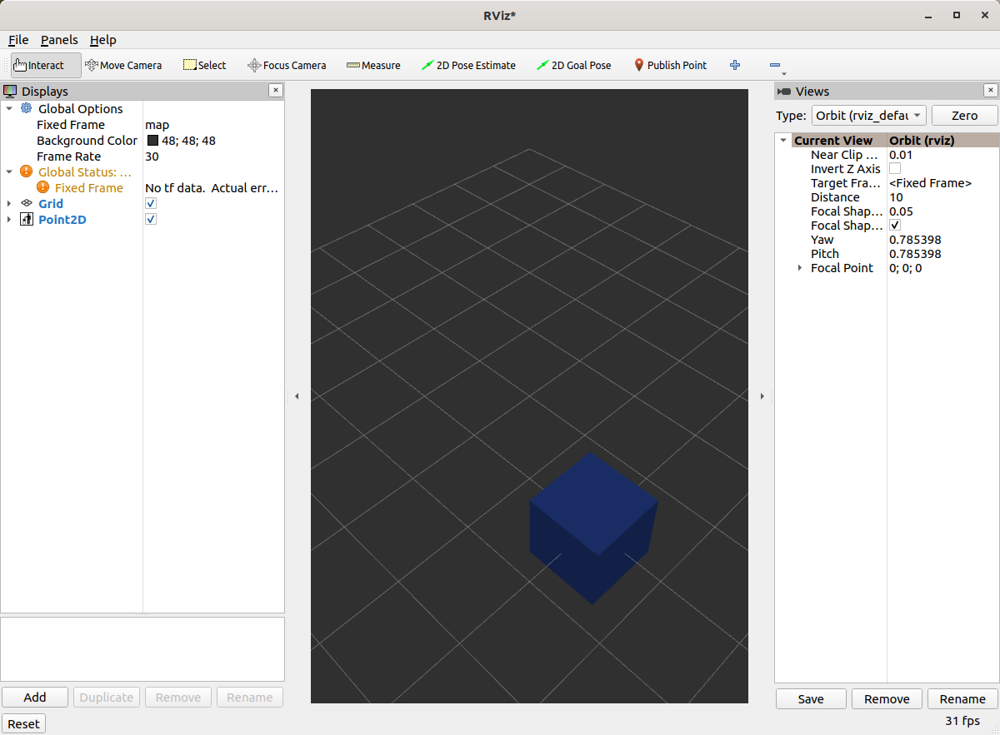

注意，如果你更改插件的名称，之前的 RViz 配置将不再起作用。
