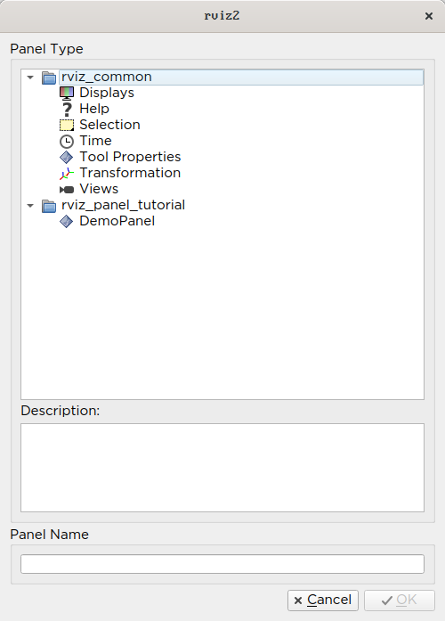
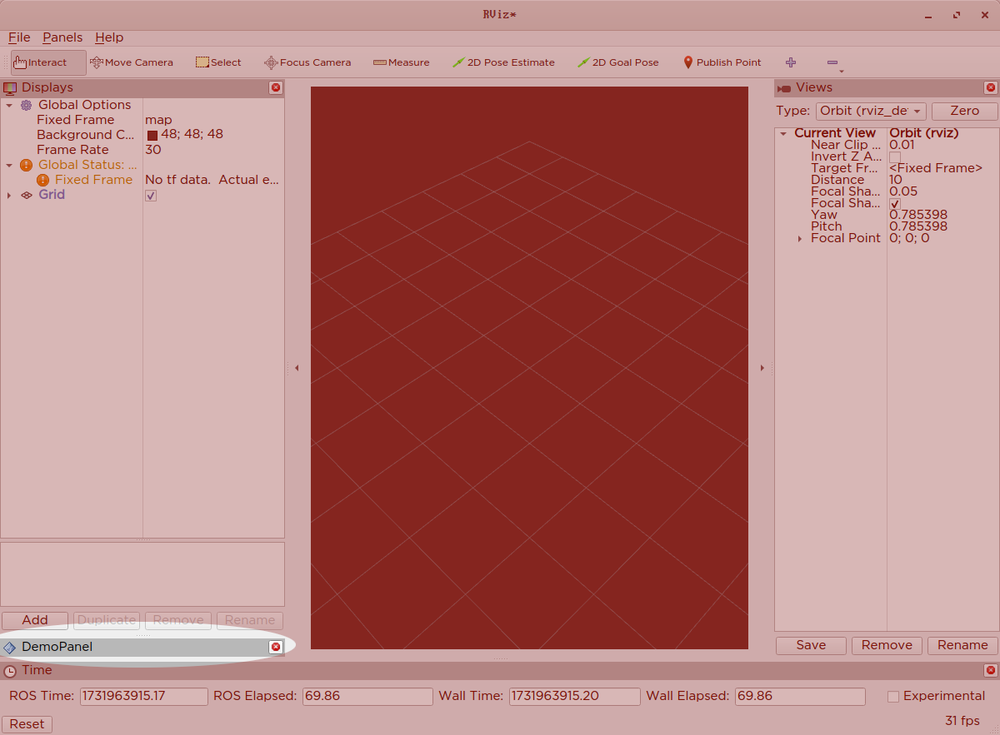
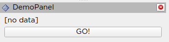
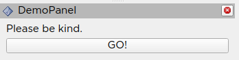
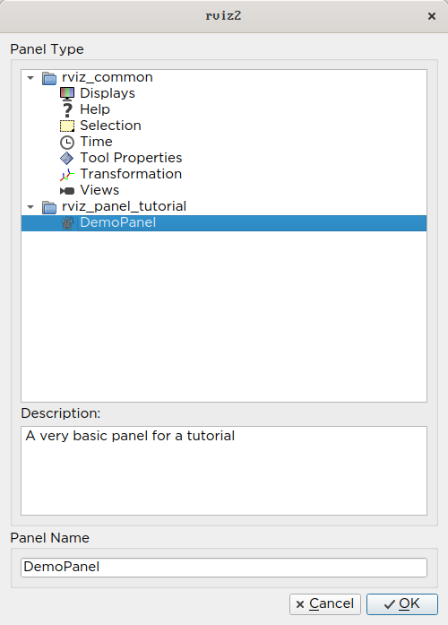
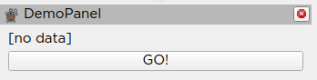

构建自定义 RViz 面板
====================

本教程面向希望在 RViz 环境中工作，以在二维环境中显示或交互某些数据的人。

在本教程中，你将学习如何在 RViz 中做三件事：

* 在 RViz 中创建一个新的 QT 面板。
* 在 RViz 中创建一个话题订阅者，它可以监视该话题上发布的消息并在 RViz 面板中显示它们。
* 创建一个话题发布者，例如 RViz 中的按钮按下会发布到 ROS 中的输出话题。

本教程的所有代码都可以在 `此仓库 <https://github.com/MetroRobots/rviz_panel_tutorial>`__ 中找到。

模板代码
--------

头文件
^^^^^^

这是 ``demo_panel.hpp`` 的内容

.. code-block:: c++

   #ifndef RVIZ_PANEL_TUTORIAL__DEMO_PANEL_HPP_
   #define RVIZ_PANEL_TUTORIAL__DEMO_PANEL_HPP_

   #include <rviz_common/panel.hpp>

   namespace rviz_panel_tutorial
   {
   class DemoPanel
     : public rviz_common::Panel
   {
     Q_OBJECT
   public:
     explicit DemoPanel(QWidget * parent = 0);
     ~DemoPanel() override;
   };
   }  // namespace rviz_panel_tutorial

   #endif  // RVIZ_PANEL_TUTORIAL__DEMO_PANEL_HPP_

* 我们扩展 `rviz_common::Panel <https://github.com/ros2/rviz/blob/9a94bdf2f5f92ccdac4037c9268b95940845d609/rviz_common/include/rviz_common/panel.hpp#L46>`__ 类。
* `由于超出本教程范围的原因 <https://doc.qt.io/qt-5/moc.html>`__，你需要其中包含 ``Q_OBJECT`` 宏才能让 GUI 的 QT 部分工作。
* 我们首先只声明一个构造函数和析构函数，在 cpp 文件中实现。

源文件
^^^^^^

``demo_panel.cpp``

.. code-block:: c++

   #include <rviz_panel_tutorial/demo_panel.hpp>

   namespace rviz_panel_tutorial
   {
   DemoPanel::DemoPanel(QWidget* parent) : Panel(parent)
   {
   }

   DemoPanel::~DemoPanel() = default;
   }  // namespace rviz_panel_tutorial

   #include <pluginlib/class_list_macros.hpp>
   PLUGINLIB_EXPORT_CLASS(rviz_panel_tutorial::DemoPanel, rviz_common::Panel)

* 重写构造函数和析构函数并不是严格必要的，但我们稍后可以用它们做更多事情。
* 为了让 RViz 找到我们的插件，我们需要在代码中使用这个 ``PLUGINLIB`` 调用（以及下面的其他东西）。

package.xml
^^^^^^^^^^^

我们的 package.xml 中需要以下依赖：

.. code-block:: xml

     <depend>pluginlib</depend>
     <depend>rviz_common</depend>

rviz_common_plugins.xml
^^^^^^^^^^^^^^^^^^^^^^^

.. code-block:: xml

   <library path="demo_panel">
     <class type="rviz_panel_tutorial::DemoPanel" base_class_type="rviz_common::Panel">
       <description></description>
     </class>
   </library>

* 这是标准的 ``pluginlib`` 代码。

  * 库 ``path`` 是我们在 CMake 中分配的库的名称。
  * 类应与上面的 ``PLUGINLIB`` 调用匹配。

* 我们稍后会回到描述，我保证。

CMakeLists.txt
^^^^^^^^^^^^^^

将以下行添加到标准模板的顶部。

.. code-block:: cmake

   find_package(ament_cmake_ros REQUIRED)
   find_package(pluginlib REQUIRED)
   find_package(rviz_common REQUIRED)

   set(CMAKE_AUTOMOC ON)
   qt5_wrap_cpp(MOC_FILES
     include/rviz_panel_tutorial/demo_panel.hpp
   )

   add_library(demo_panel src/demo_panel.cpp ${MOC_FILES})
   target_include_directories(demo_panel PUBLIC
     $<BUILD_INTERFACE:${CMAKE_CURRENT_SOURCE_DIR}/include>
     $<INSTALL_INTERFACE:include>
   )
   ament_target_dependencies(demo_panel
     pluginlib
     rviz_common
   )
   install(TARGETS demo_panel
           EXPORT export_rviz_panel_tutorial
           ARCHIVE DESTINATION lib
           LIBRARY DESTINATION lib
           RUNTIME DESTINATION bin
   )
   install(DIRECTORY include/
           DESTINATION include
   )
   install(FILES rviz_common_plugins.xml
           DESTINATION share/${PROJECT_NAME}
   )
   ament_export_include_directories(include)
   ament_export_targets(export_rviz_panel_tutorial)
   pluginlib_export_plugin_description_file(rviz_common rviz_common_plugins.xml)

* 为了生成正确的 Qt 文件，我们需要

  * 打开 ``CMAKE_AUTOMOC``。
  * 通过对每个包含 ``Q_OBJECT`` 的头文件调用 ``qt5_wrap_cpp`` 来包装头文件。
  * 将 ``MOC_FILES`` 与我们其他 cpp 文件一起包含在库中。

* 许多其他代码确保插件部分工作。
  也就是说，调用 ``pluginlib_export_plugin_description_file`` 对于让 RViz 找到你的新插件至关重要。

测试一下
^^^^^^^^

编译你的代码，source 你的工作空间并运行 ``rviz2``。

在顶部菜单栏中，应该有一个 "Panels" 菜单。
从该菜单中选择 "Add New Panel"。

将弹出一个对话框，显示你的 ROS 环境中所有可访问的面板，根据它们的 ROS 包分组到文件夹中。
通过双击面板名称，或选择它并点击 OK，来创建面板的新实例。

这将在你的 RViz 窗口中创建一个新面板，尽管只有一个带有面板名称的标题栏。

填充面板
--------
我们将用一些非常基本的 ROS/QT 交互来更新我们的面板。
粗略地说，我们将做的是从 RViz 内部访问 ROS 节点，它既可以订阅也可以发布 ROS 话题。
我们将使用我们的订阅者监视 ROS 内的 ``/input`` 话题，并在控件中显示发布的 ``String`` 值。
我们使用我们的发布者将 RViz 内的按钮按下映射到发布在名为 ``/output`` 的 ROS 话题上的消息。

更新后的头文件
^^^^^^^^^^^^^^

更新 ``demo_panel.hpp`` 以包含以下包含项和类主体。

.. code-block:: c++

   #include <rviz_common/panel.hpp>
   #include <rviz_common/ros_integration/ros_node_abstraction_iface.hpp>
   #include <std_msgs/msg/string.hpp>
   #include <QLabel>
   #include <QPushButton>

   namespace rviz_panel_tutorial
   {
   class DemoPanel : public rviz_common::Panel
   {
     Q_OBJECT
   public:
     explicit DemoPanel(QWidget * parent = 0);
     ~DemoPanel() override;

     void onInitialize() override;

   protected:
     std::shared_ptr<rviz_common::ros_integration::RosNodeAbstractionIface> node_ptr_;
     rclcpp::Publisher<std_msgs::msg::String>::SharedPtr publisher_;
     rclcpp::Subscription<std_msgs::msg::String>::SharedPtr subscription_;

     void topicCallback(const std_msgs::msg::String & msg);

     QLabel* label_;
     QPushButton* button_;

   private Q_SLOTS:
     void buttonActivated();
   };
   }  // namespace rviz_panel_tutorial

* 在 ROS 侧，我们声明一个抽象节点指针，我们将使用它来创建与更广泛 ROS 生态系统的接口。
  我们有一个订阅者，它将允许我们从 ROS 获取信息并在 RViz 中使用它。
  发布者允许我们从 RViz 内发布信息/事件，并使它们在 ROS 中可用。
  我们还有用于设置 ROS 组件的初始化方法（``onInitialize``）和订阅者的回调（``topicCallback``）。
* 在 QT 侧，我们声明一个标签和一个按钮，以及按钮的回调（``buttonActivated``）。

更新后的源文件
^^^^^^^^^^^^^^

更新 ``demo_panel.cpp`` 使其具有以下内容：

.. code-block:: c++

   #include <rviz_panel_tutorial/demo_panel.hpp>
   #include <QVBoxLayout>
   #include <rviz_common/display_context.hpp>

   namespace rviz_panel_tutorial
   {

   DemoPanel::DemoPanel(QWidget* parent) : Panel(parent)
   {
     // Create a label and a button, displayed vertically (the V in VBox means vertical)
     const auto layout = new QVBoxLayout(this);
     // Create a button and a label for the button
     label_ = new QLabel("[no data]");
     button_ = new QPushButton("GO!");
     // Add those elements to the GUI layout
     layout->addWidget(label_);
     layout->addWidget(button_);

     // Connect the event of when the button is released to our callback,
     // so pressing the button results in the buttonActivated callback being called.
     QObject::connect(button_, &QPushButton::released, this, &DemoPanel::buttonActivated);
   }

   DemoPanel::~DemoPanel() = default;

   void DemoPanel::onInitialize()
   {
     // Access the abstract ROS Node and
     // in the process lock it for exclusive use until the method is done.
     node_ptr_ = getDisplayContext()->getRosNodeAbstraction().lock();

     // Get a pointer to the familiar rclcpp::Node for making subscriptions/publishers
     // (as per normal rclcpp code)
     rclcpp::Node::SharedPtr node = node_ptr_->get_raw_node();

     // Create a String publisher for the output
     publisher_ = node->create_publisher<std_msgs::msg::String>("/output", 10);

     // Create a String subscription and bind it to the topicCallback inside this class.
     subscription_ = node->create_subscription<std_msgs::msg::String>("/input", 10, std::bind(&DemoPanel::topicCallback, this, std::placeholders::_1));
   }

   // When the subscriber gets a message, this callback is triggered,
   // and then we copy its data into the widget's label
   void DemoPanel::topicCallback(const std_msgs::msg::String & msg)
   {
     label_->setText(QString(msg.data.c_str()));
   }

   // When the widget's button is pressed, this callback is triggered,
   // and then we publish a new message on our topic.
   void DemoPanel::buttonActivated()
   {
     auto message = std_msgs::msg::String();
     message.data = "Button clicked!";
     publisher_->publish(message);
   }

   }  // namespace rviz_panel_tutorial

   #include <pluginlib/class_list_macros.hpp>

   PLUGINLIB_EXPORT_CLASS(rviz_panel_tutorial::DemoPanel, rviz_common::Panel)

使用 ROS 测试
^^^^^^^^^^^^^
再次编译并用你的面板启动 RViz2。
你现在应该能在面板中看到你的标签和按钮。

要更改标签，我们只需在 ``/input`` 话题上发布一条消息，你可以使用此命令来做到：

.. code-block:: console

   $ ros2 topic pub /input std_msgs/msg/String "{data: 'Please be kind.'}"

由于控件订阅了此话题，它将触发回调并更改标签的文本。

按下按钮将发布一条消息，你可以通过回显 ``/output`` 话题看到它，就像这个命令一样。

.. code-block:: console

   $ ros2 topic echo /output

清理
----

现在是时候把它清理一下了。
这让事情看起来更漂亮，也更容易使用，但不是严格必需的。

首先，你应该更新 ``rviz_common_plugins.xml`` 中插件的描述。

我们还在 ``icons/classes/DemoPanel.png`` 为插件添加一个图标。
文件夹是硬编码的，文件名应与插件声明中的名称匹配（如果未指定，则为类的名称）。

我们需要在 CMake 中安装图像文件。

.. code-block:: cmake

   install(FILES icons/classes/DemoPanel.png
           DESTINATION share/${PROJECT_NAME}/icons/classes
   )

现在当你添加面板时，它应该带有一个图标和描述显示出来。

面板也将有一个更新后的图标。

