RViz 用户指南
=============

**目标：** 理解 RViz

**教程级别：** 中级

**时间：** 25 分钟

.. contents:: 目录
   :depth: 2
   :local:

背景
----
RViz 是用于 Robot Operating System (ROS) 框架的 3D 可视化工具。

安装或构建 rviz
---------------
请按照适用于你操作系统的 :doc:`安装说明 <../../../../Installation>` 来安装 RViz。

启动
----
不要忘记 source setup 文件。

.. code-block:: console

   $ source /opt/ros/{DISTRO}/setup.bash

然后启动可视化工具

.. code-block:: console

   $ ros2 run rviz2 rviz2

当 RViz 首次启动时，你会看到这个窗口：

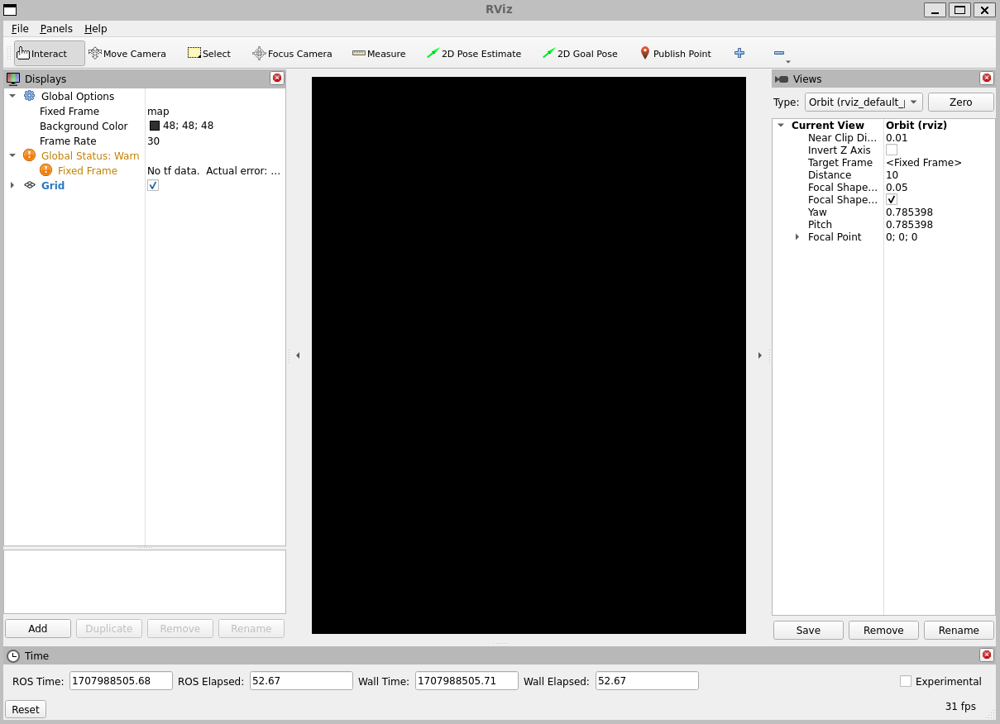

中间的大黑色窗口是 3D 视图（因为没有任何可看的东西而为空）。
左侧是 Displays 列表，它会显示你已加载的任何显示项。
目前它只包含全局选项和一个 Grid，我们稍后会讲到。
右侧是一些其他面板，如下所述。

显示项
------
显示项是在 3D 世界中绘制某些东西的东西，并且可能在显示项列表中具有一些可用选项。
例如点云、机器人状态等。

添加新显示项
^^^^^^^^^^^^
要添加显示项，请点击底部的 Add 按钮：

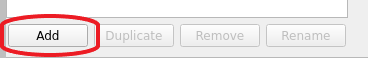

这将弹出新的显示项对话框：

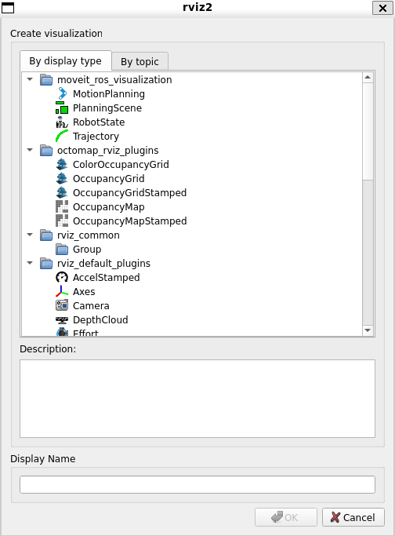

顶部的列表包含显示项类型。
该类型详细说明了此显示项将可视化哪种数据。
中间的文本框给出了所选显示项类型的描述。
最后，你必须给显示项取一个唯一的名称。
例如，如果你的机器人上有两个激光扫描仪，你可以创建两个名为 "Laser Base" 和 "Laser Head" 的 ``Laser Scan`` 显示项。

显示项属性
^^^^^^^^^^
每个显示项都有自己的属性列表。
例如：

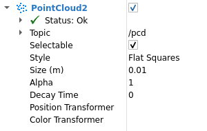

显示项状态
^^^^^^^^^^
每个显示项都有自己的状态，帮助你了解一切是否正常。
状态可以是以下之一：``OK``、``Warning``、``Error`` 或 ``Disabled``。
状态通过显示项标题的背景颜色来表示，
如果你展开显示项，还可以在 Status 类别中看到：

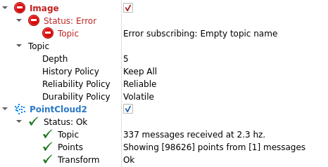

``Status`` 类别还可以展开以显示具体的状态信息。
这些信息对于不同的显示项是不同的，消息本身应该是不言自明的。

内置显示项类型
^^^^^^^^^^^^^^
.. list-table::
   :header-rows: 1
   :widths: 10 10 10

   * - 名称
     - 描述
     - 使用的消息
   * - Axes
     - 显示一组坐标轴
     -
   * - Effort
     - 显示作用在机器人每个旋转关节上的力
     - `sensor_msgs/msg/JointStates <https://github.com/ros2/common_interfaces/blob/{DISTRO}/sensor_msgs/msg/JointState.msg>`__
   * - Camera
     - 从相机的视角创建一个新的渲染窗口，并将图像叠加在其上。
     - `sensor_msgs/msg/Image <https://github.com/ros2/common_interfaces/blob/{DISTRO}/sensor_msgs/msg/Image.msg>`__, `sensor_msgs/msg/CameraInfo <https://github.com/ros2/common_interfaces/blob/{DISTRO}/sensor_msgs/msg/CameraInfo.msg>`__
   * - Grid
     - 沿一个平面显示 2D 或 3D 网格
     -
   * - Grid Cells
     - 绘制网格中的单元，通常是来自 `navigation <https://github.com/ros-planning/navigation2>`__ 栈的 costmap 中的障碍物。
     - `nav_msgs/msg/GridCells <https://github.com/ros2/common_interfaces/blob/{DISTRO}/nav_msgs/msg/GridCells.msg>`__
   * - Image
     - 创建一个带有图像的新渲染窗口。
       与 Camera 显示项不同，此显示项不使用 CameraInfo
     - `sensor_msgs/msg/Image <https://github.com/ros2/common_interfaces/blob/{DISTRO}/sensor_msgs/msg/Image.msg>`__
   * - InteractiveMarker
     - 显示来自一个或多个 Interactive Marker 服务器的 3D 对象，并允许用鼠标与之交互
     - `visualization_msgs/msg/InteractiveMarker <https://github.com/ros2/common_interfaces/blob/{DISTRO}/visualization_msgs/msg/InteractiveMarker.msg>`__
   * - Laser Scan
     - 显示激光扫描的数据，具有不同的渲染模式、累积等选项。
     - `sensor_msgs/msg/LaserScan <https://github.com/ros2/common_interfaces/blob/{DISTRO}/sensor_msgs/msg/LaserScan.msg>`__
   * - Map
     - 在地面平面上显示地图。
     - `nav_msgs/msg/OccupancyGrid <https://github.com/ros2/common_interfaces/blob/{DISTRO}/nav_msgs/msg/OccupancyGrid.msg>`__
   * - Markers
     - 允许程序员通过话题显示任意基本形状
     - `visualization_msgs/msg/Marker <https://github.com/ros2/common_interfaces/blob/{DISTRO}/visualization_msgs/msg/Marker.msg>`__, `visualization_msgs/msg/MarkerArray <https://github.com/ros2/common_interfaces/blob/{DISTRO}/visualization_msgs/msg/MarkerArray.msg>`__
   * - Path
     - 显示来自 `navigation <https://github.com/ros-planning/navigation2>`__ 栈的路径。
     - `nav_msgs/msg/Path <https://github.com/ros2/common_interfaces/blob/{DISTRO}/nav_msgs/msg/Path.msg>`__
   * - Point
     - 将点绘制为小球体。
     - `geometry_msgs/msg/PointStamped <https://github.com/ros2/common_interfaces/blob/{DISTRO}/geometry_msgs/msg/PointStamped.msg>`__
   * - Pose
     - 将位姿绘制为箭头或坐标轴。
     - `geometry_msgs/msg/PoseStamped <https://github.com/ros2/common_interfaces/blob/{DISTRO}/geometry_msgs/msg/PoseStamped.msg>`__
   * - Pose Array
     - 绘制箭头"云"，每个位姿一个箭头
     - `geometry_msgs/msg/PoseArray <https://github.com/ros2/common_interfaces/blob/{DISTRO}/geometry_msgs/msg/PoseArray.msg>`__
   * - Point Cloud(2)
     - 显示点云的数据，具有不同的渲染模式、累积等选项。
     - `sensor_msgs/msg/PointCloud <https://github.com/ros2/common_interfaces/blob/{DISTRO}/sensor_msgs/msg/PointCloud.msg>`__, `sensor_msgs/msg/PointCloud2 <https://github.com/ros2/common_interfaces/blob/{DISTRO}/sensor_msgs/msg/PointCloud2.msg>`__
   * - Polygon
     - 将多边形的轮廓绘制为线条。
     - `geometry_msgs/msg/Polygon <https://github.com/ros2/common_interfaces/blob/{DISTRO}/geometry_msgs/msg/Polygon.msg>`__
   * - Odometry
     - 随时间累积里程计位姿。
     - `nav_msgs/msg/Odometry <https://github.com/ros2/common_interfaces/blob/{DISTRO}/nav_msgs/msg/Odometry.msg>`__
   * - Range
     - 显示表示来自声呐或红外测距传感器的距离测量的锥体。
       版本：Electric+
     - `sensor_msgs/msg/Range <https://github.com/ros2/common_interfaces/blob/{DISTRO}/sensor_msgs/msg/Range.msg>`__
   * - RobotModel
     - 以正确的位姿显示机器人的视觉表示（由当前 TF 变换定义）。
     -
   * - TF
     - 显示 `tf2 <https://github.com/ros2/geometry2>`__ 变换层级。
     -
   * - Wrench
     - 将力螺旋绘制为箭头（力）以及箭头 + 圆（力矩）
     - `geometry_msgs/msg/WrenchStamped <https://github.com/ros2/common_interfaces/blob/{DISTRO}/geometry_msgs/msg/WrenchStamped.msg>`__
   * - Twist
     - 将速度螺旋绘制为箭头（线速度）以及箭头 + 圆（角速度）
     - `geometry_msgs/msg/TwistStamped <https://github.com/ros2/common_interfaces/blob/{DISTRO}/geometry_msgs/msg/TwistStamped.msg>`__

配置
----
显示项的不同配置通常对可视化工具的不同用途有用。
例如，对完整 PR2 有用的配置未必对测试小车有用。
为此，可视化工具允许你加载和保存不同的配置。

配置包含：

* 显示项及其属性
* 工具属性
* 3D 可视化的视角和设置

视图面板
--------
可视化工具中提供了多种不同的相机类型。

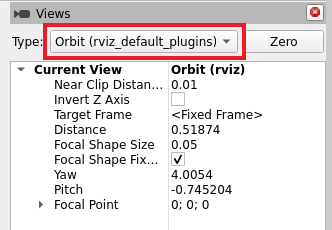

相机类型既包括控制相机的不同方式，也包括不同类型的投影（正交与透视）。

轨道相机（默认）
^^^^^^^^^^^^^^^^
轨道相机只是围绕焦点旋转，同时始终注视该点。
在你移动相机时，焦点会被可视化为一个小圆盘：

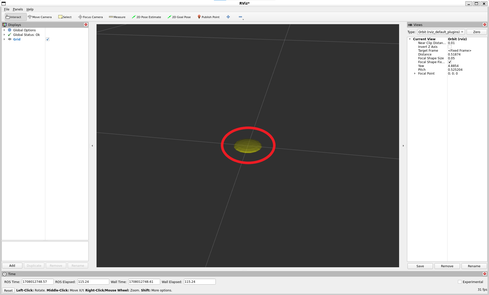

控制：

* **鼠标左键**：点击并拖动以围绕焦点旋转。
* **鼠标中键**：点击并拖动以在相机上方向和右方向向量构成的平面中移动焦点。
  移动的距离取决于焦点——如果焦点上有一个对象，并且你点击它的顶部，它会保持在你的鼠标下方。
* **鼠标右键**：点击并拖动以拉近/拉远焦点。
  向上拖动拉近，向下拉远。
* **滚轮**：拉近/拉远焦点

FPS（第一人称）相机
^^^^^^^^^^^^^^^^^^^
FPS 相机是第一人称相机，因此它会像你用头观看一样旋转。

控制：

* **鼠标左键**：点击并拖动以旋转。
  Control-点击以选中鼠标下的对象并直接注视它。
* **鼠标中键**：点击并拖动以沿相机上方向和右方向向量构成的平面移动。
* **鼠标右键**：点击并拖动以沿相机的前方向向量移动。
  向上拖动前进，向下后退。
* **滚轮**：前进/后退。

俯视正交
^^^^^^^^
俯视正交相机始终沿 Z 轴（在机器人坐标系中）向下看，
并且是正交视图，这意味着物体不会随着距离变远而变小。

控制：

* **鼠标左键**：点击并拖动以绕 Z 轴旋转。
* **鼠标中键**：点击并拖动以沿 XY 平面移动相机。
* **鼠标右键**：点击并拖动以缩放图像。
* **滚轮**：缩放图像。

XY 轨道
^^^^^^^
与轨道相机相同，但焦点限制在 XY 平面内。

控制：

参见轨道相机。

第三人称跟随
^^^^^^^^^^^^
相机保持朝向目标坐标系恒定的视角。
与 XY 轨道相反，如果目标坐标系偏航，相机会转向。
例如，如果你正在对带有拐角的走廊进行 3D 建图，这会很方便。

控制：

参见轨道相机。

自定义视图
^^^^^^^^^^
视图面板还允许你创建不同的命名视图，这些视图会被保存并可以在它们之间切换。
视图由目标坐标系、相机类型和相机位姿组成。
你可以通过点击视图面板的 Save 按钮来保存视图。

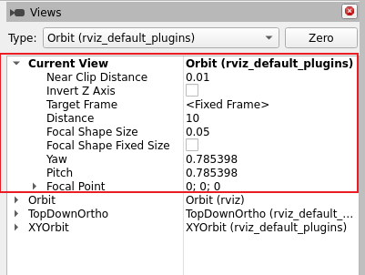

视图由以下组成：

* 视图控制器类型
* 视图配置（位置、方向等；对于每种视图控制器类型可能不同。）
* 目标坐标系

视图按用户保存，而不是保存在配置文件中。

坐标系
------
RViz 使用 tf 变换系统将数据从其到达时的坐标系变换到全局参考坐标系。
可视化工具中有两个重要的坐标系需要了解：目标坐标系和固定坐标系。

固定坐标系
^^^^^^^^^^
两个坐标系中更重要的是固定坐标系。
固定坐标系是用于表示 ``world`` 坐标系的参考坐标系。
这通常是 ``map``、``world`` 或类似的东西，但也可以是例如你的里程计坐标系。

如果固定坐标系被错误地设置为比如机器人的基座，那么机器人曾经见过的所有对象都会出现在机器人前方，位于它们被检测时相对于机器人的位置。
为了获得正确的结果，固定坐标系不应相对于世界移动。

如果你更改固定坐标系，当前显示的所有数据都会被清除，而不是重新变换。

目标坐标系
^^^^^^^^^^
目标坐标系是相机视图的参考坐标系。
例如，如果你的目标坐标系是 map，你会看到机器人在地图上四处行驶。
如果你的目标坐标系是机器人的基座，机器人会保持在同一个位置，而其他一切相对于它移动。

工具
----
可视化工具在工具栏上有许多你可以使用的工具。
以下部分将简要介绍这些工具。
你可以在 Help -> Show Help panel 下找到更多信息。

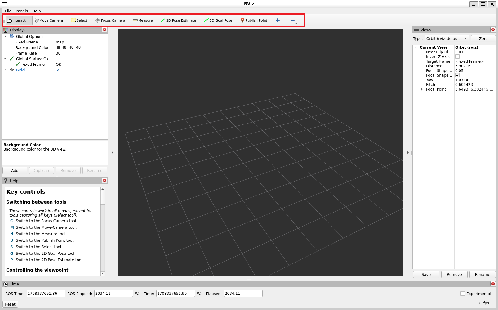

交互
^^^^
此工具让你与可视化环境进行交互。
你可以点击对象，并根据它们的属性简单地选择它们、移动它们等等。

键盘快捷键：``i``

移动相机
^^^^^^^^
移动相机工具是默认工具。
当选中它并且在 3D 视图中点击时，视角会根据你在 ``Views`` 面板中选择的选项和相机类型而变化。
更多信息请参见上一节 ``Views Panel``。

键盘快捷键：``m``

选择
^^^^
选择工具允许你选择 3D 视图中显示的项。
它支持单点选择以及点击/拖拽框选。
你可以用 Shift 键添加到选择，用 Ctrl 键从选择中移除。
如果你想在选择时移动相机而不切换回移动相机工具，可以按住 Alt 键。
``f`` 键会让相机聚焦在当前选择上。

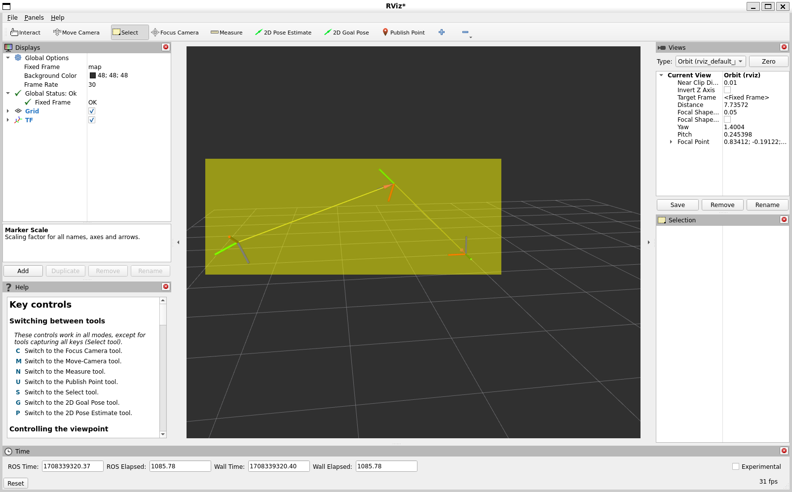

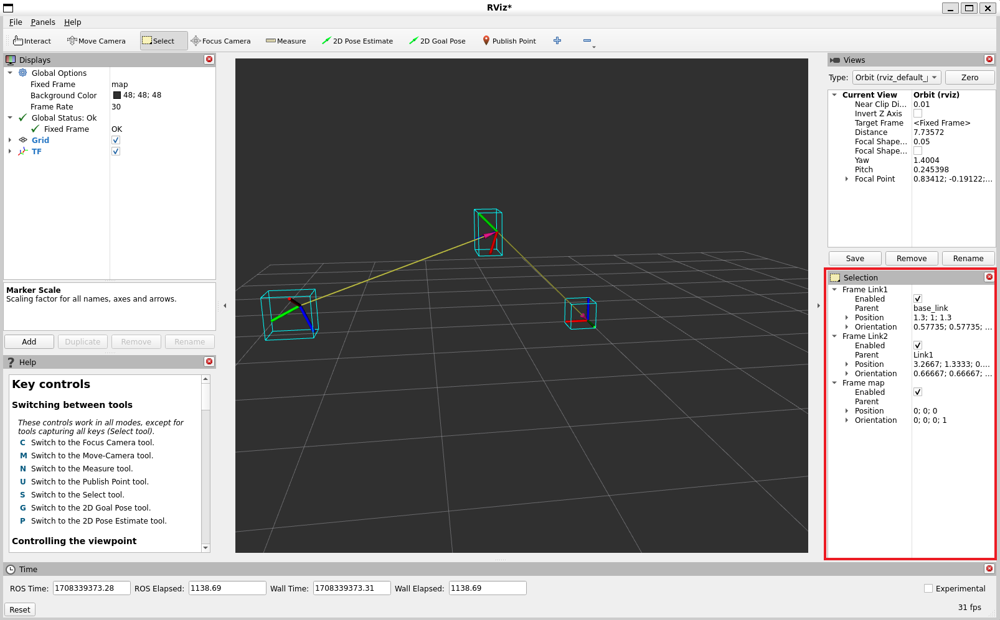

键盘快捷键：``s``

聚焦相机
^^^^^^^^
聚焦相机让你在可视化工具中选择一个位置。
然后相机会通过改变其方向（但不改变位置）来聚焦该点。

键盘快捷键：``c``

测量
^^^^
使用测量工具，你可以测量可视化工具中两个点之间的距离。
激活工具后的第一次点击将设置测量的起点，第二次点击设置终点。
结果距离将显示在 RViz 窗口的底部。
但请注意，测量工具只适用于可视化工具中实际渲染的对象，你不能在空白空间中使用它。

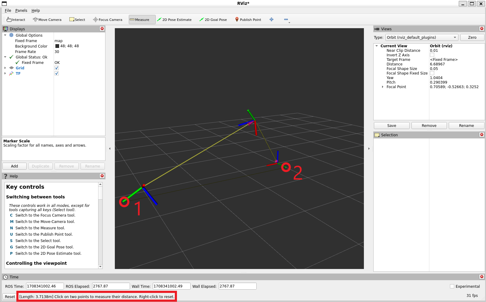

键盘快捷键：``n``

2D 位姿估计
^^^^^^^^^^^
此工具让你设置一个初始位姿来为定位系统提供种子（发布在 ``initialpose`` ROS 话题上）。
点击地面平面上的一个位置并拖动以选择方向。
输出话题可以在 ``Tool Properties`` 面板中更改。

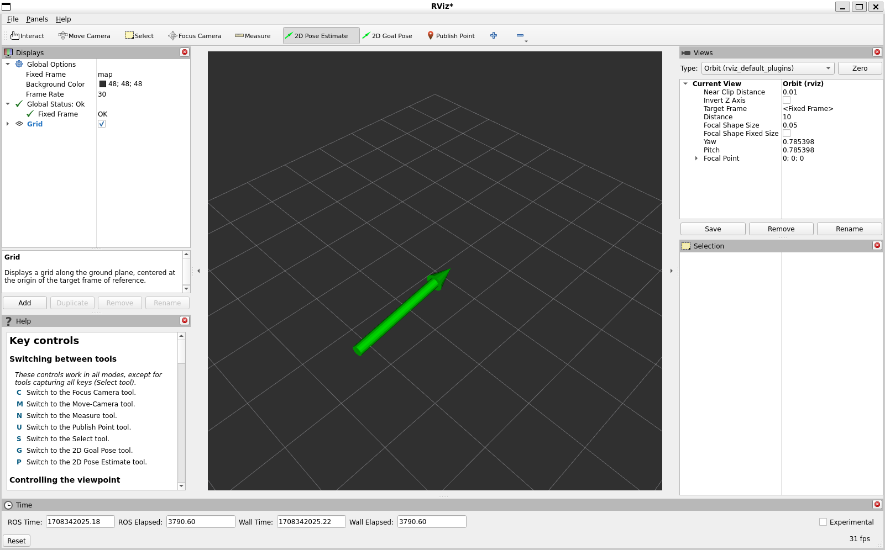

此工具与 `navigation <https://github.com/ros-planning/navigation2>`__ 栈配合使用。

键盘快捷键：``p``

2D 导航目标
^^^^^^^^^^^
此工具让你设置一个发布在 ``goal_pose`` ROS 话题上的目标。
点击地面平面上的一个位置并拖动以选择方向。
输出话题可以在 ``Tool Properties`` 面板中更改。

此工具与 `navigation <https://github.com/ros-planning/navigation2>`__ 栈配合使用。

键盘快捷键：``g``

发布点
^^^^^^
发布点工具让你选择可视化工具中的一个对象，
该工具会基于坐标系发布该点的坐标。
结果像测量工具一样显示在底部，但也会发布在 ``clicked_point`` 话题上。

键盘快捷键：``u``

时间
----
时间面板在仿真中运行时最有用，因为它允许你看到已经过去了多少 ROS 时间，以及多少 ``Wall Clock`` （也就是真实）时间。
时间面板还允许你重置可视化工具的内部时间状态，这会重置所有显示项以及 tf 的内部数据缓存。

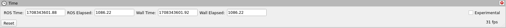

如果你不在仿真中运行，时间面板基本上没什么用。
在大多数情况下，它可以被关闭，你甚至可能不会注意到（除了给 rviz 的其余部分留出更多屏幕空间）。
