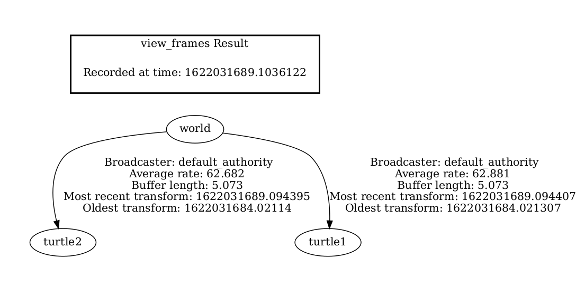
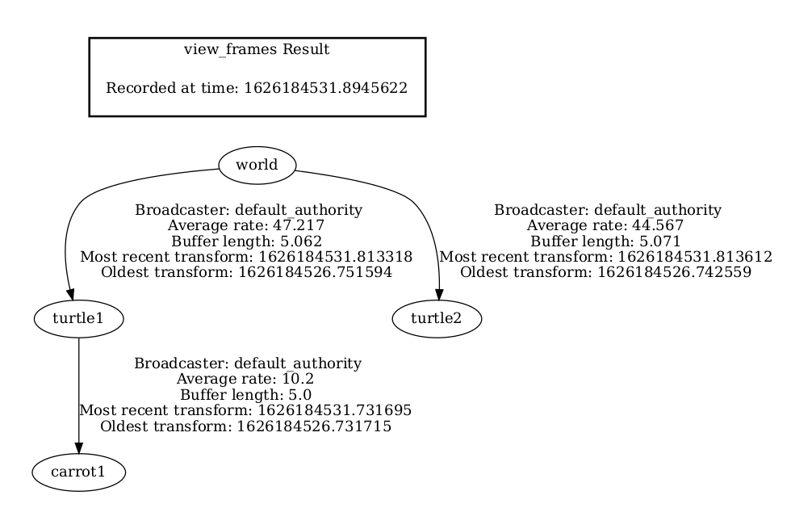
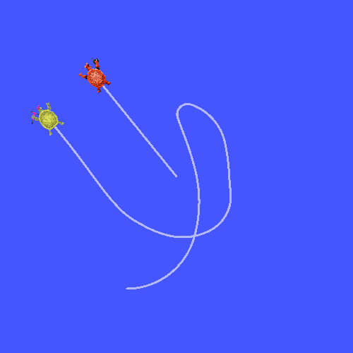
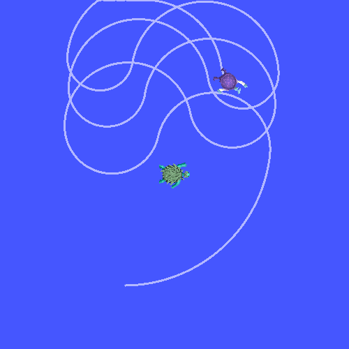

.. redirect-from::

    Tutorials/Tf2/Adding-A-Frame-Cpp

添加帧（C++）
=============

**目标：** 学习如何向 tf2 添加额外的帧。

**教程级别：** 中级

**时间：** 15 分钟

.. contents:: 目录
   :depth: 3
   :local:

背景
----

在之前的教程中，我们通过编写 :doc:`tf2 广播器 <./Writing-A-Tf2-Broadcaster-Cpp>` 和 :doc:`tf2 监听器 <Writing-A-Tf2-Listener-Cpp>` 重建了 turtle 演示。
本教程将教你如何向变换树添加额外的固定帧和动态帧。
实际上，在 tf2 中添加帧与创建 tf2 广播器非常相似，但本例将向你展示 tf2 的一些额外功能。

对于许多与变换相关的任务，在局部帧中思考会更容易。
例如，在位于激光扫描仪中心的帧中推理激光扫描测量值是最容易的。
tf2 允许你为系统中的每个传感器、链接或关节定义局部帧。
当从一个帧变换到另一个帧时，tf2 会负责处理所有引入的隐藏中间帧变换。

tf2 树
------

tf2 构建帧的树状结构，因此不允许帧结构中出现闭环。
这意味着一个帧只有一个父帧，但可以有多个子帧。
目前，我们的 tf2 树包含三个帧：``world``、``turtle1`` 和 ``turtle2``。
两个 turtle 帧是 ``world`` 帧的子帧。
如果我们想向 tf2 添加一个新帧，三个现有帧中的一个需要成为父帧，新帧将成为其子帧。

任务
----

1 编写固定帧广播器
^^^^^^^^^^^^^^^^^^

在我们的 turtle 示例中，我们将添加一个新帧 ``carrot1``，它将是 ``turtle1`` 的子帧。
这个帧将作为第二只 turtle 的目标。

让我们先创建源文件。
转到我们在前面教程中创建的 ``learning_tf2_cpp`` 包。
在 ``src`` 目录中，通过输入以下命令下载固定帧广播器代码：

.. tabs::

   .. group-tab:: Linux

      .. code-block:: console

          $ wget https://raw.githubusercontent.com/ros/geometry_tutorials/{DISTRO}/turtle_tf2_cpp/src/fixed_frame_tf2_broadcaster.cpp

   .. group-tab:: macOS

      .. code-block:: console

          $ wget https://raw.githubusercontent.com/ros/geometry_tutorials/{DISTRO}/turtle_tf2_cpp/src/fixed_frame_tf2_broadcaster.cpp

   .. group-tab:: Windows

      在 Windows 命令行提示符中：

      .. code-block:: console

          $ curl -sk https://raw.githubusercontent.com/ros/geometry_tutorials/{DISTRO}/turtle_tf2_cpp/src/fixed_frame_tf2_broadcaster.cpp -o fixed_frame_tf2_broadcaster.cpp

      或者在 powershell 中：

      .. code-block:: console

          $ curl https://raw.githubusercontent.com/ros/geometry_tutorials/{DISTRO}/turtle_tf2_cpp/src/fixed_frame_tf2_broadcaster.cpp -o fixed_frame_tf2_broadcaster.cpp

现在打开名为 ``fixed_frame_tf2_broadcaster.cpp`` 的文件。

.. code-block:: C++

    #include <chrono>
    #include <functional>
    #include <memory>

    #include "geometry_msgs/msg/transform_stamped.hpp"
    #include "rclcpp/rclcpp.hpp"
    #include "tf2_ros/transform_broadcaster.hpp"

    using namespace std::chrono_literals;

    class FixedFrameBroadcaster : public rclcpp::Node
    {
    public:
      FixedFrameBroadcaster()
      : Node("fixed_frame_tf2_broadcaster")
      {
        tf_broadcaster_ = std::make_shared<tf2_ros::TransformBroadcaster>(this);

        auto broadcast_timer_callback = [this](){
            geometry_msgs::msg::TransformStamped t;

            t.header.stamp = this->get_clock()->now();
            t.header.frame_id = "turtle1";
            t.child_frame_id = "carrot1";
            t.transform.translation.x = 0.0;
            t.transform.translation.y = 2.0;
            t.transform.translation.z = 0.0;
            t.transform.rotation.x = 0.0;
            t.transform.rotation.y = 0.0;
            t.transform.rotation.z = 0.0;
            t.transform.rotation.w = 1.0;

            tf_broadcaster_->sendTransform(t);
        };
        timer_ = this->create_wall_timer(100ms, broadcast_timer_callback);
      }

    private:
      rclcpp::TimerBase::SharedPtr timer_;
      std::shared_ptr<tf2_ros::TransformBroadcaster> tf_broadcaster_;
    };

    int main(int argc, char * argv[])
    {
      rclcpp::init(argc, argv);
      rclcpp::spin(std::make_shared<FixedFrameBroadcaster>());
      rclcpp::shutdown();
      return 0;
    }

这段代码与 tf2 广播器教程中的示例非常相似，唯一的区别是这里的变换不随时间变化。

1.1 检查代码
~~~~~~~~~~~~

让我们看看这段代码中的关键行。
这里我们创建一个新变换，从父帧 ``turtle1`` 到新子帧 ``carrot1``。
``carrot1`` 帧在 ``turtle1`` 帧的坐标系中沿 y 轴偏移 2 米。

.. code-block:: C++

    geometry_msgs::msg::TransformStamped t;

    t.header.stamp = this->get_clock()->now();
    t.header.frame_id = "turtle1";
    t.child_frame_id = "carrot1";
    t.transform.translation.x = 0.0;
    t.transform.translation.y = 2.0;
    t.transform.translation.z = 0.0;

1.2 CMakeLists.txt
~~~~~~~~~~~~~~~~~~

返回上一级目录 ``learning_tf2_cpp``，那里有 ``CMakeLists.txt`` 和 ``package.xml`` 文件。

现在打开 ``CMakeLists.txt``，添加可执行文件并将其命名为 ``fixed_frame_tf2_broadcaster``。

.. code-block:: console

    add_executable(fixed_frame_tf2_broadcaster src/fixed_frame_tf2_broadcaster.cpp)
    ament_target_dependencies(
        fixed_frame_tf2_broadcaster
        geometry_msgs
        rclcpp
        tf2_ros
    )

最后，添加 ``install(TARGETS…)`` 部分，以便 ``ros2 run`` 能找到你的可执行文件：

.. code-block:: console

    install(TARGETS
        fixed_frame_tf2_broadcaster
        DESTINATION lib/${PROJECT_NAME})

1.3 编写启动文件
~~~~~~~~~~~~~~~~

现在让我们为这个示例创建一个启动文件。
用你的文本编辑器，在 ``src/learning_tf2_cpp/launch`` 目录中创建一个名为 ``turtle_tf2_fixed_frame_demo_launch``、扩展名为 ``.py``、``.xml`` 或 ``.yaml`` 的新文件，并添加以下行：

.. tabs::

  .. group-tab:: Python

    .. literalinclude:: launch/turtle_tf2_fixed_frame_demo_launch.py
        :language: python

  .. group-tab:: XML

    .. literalinclude:: launch/turtle_tf2_fixed_frame_demo_launch.xml
        :language: xml

  .. group-tab:: YAML

    .. literalinclude:: launch/turtle_tf2_fixed_frame_demo_launch.yaml
        :language: yaml

这个启动文件导入了所需的包，然后创建一个 ``demo_nodes`` 变量，用来存储我们在上一个教程的启动文件中创建的节点。

代码的最后一部分将使用我们的 ``fixed_frame_tf2_broadcaster`` 节点，把我们固定的 ``carrot1`` 帧添加到 turtlesim 世界中。

.. tabs::

  .. group-tab:: Python

    .. literalinclude:: launch/turtle_tf2_fixed_frame_demo_launch.py
        :language: python
        :lines: 14-18

  .. group-tab:: XML

    .. literalinclude:: launch/turtle_tf2_fixed_frame_demo_launch.xml
        :language: xml
        :lines: 3-4

  .. group-tab:: YAML

    .. literalinclude:: launch/turtle_tf2_fixed_frame_demo_launch.yaml
        :language: yaml
        :lines: 6-9

1.4 构建
~~~~~~~~

在工作区根目录运行 ``rosdep`` 以检查缺少的依赖。

.. tabs::

   .. group-tab:: Linux

      .. code-block:: console

          $ rosdep install -i --from-path src --rosdistro {DISTRO} -y

   .. group-tab:: macOS

        rosdep 仅在 Linux 上运行，因此你需要自己安装 ``geometry_msgs`` 和 ``turtlesim`` 依赖

   .. group-tab:: Windows

        rosdep 仅在 Linux 上运行，因此你需要自己安装 ``geometry_msgs`` 和 ``turtlesim`` 依赖

仍然在工作区根目录，构建你的包：

.. tabs::

   .. group-tab:: Linux

      .. code-block:: console

          $ colcon build --packages-select learning_tf2_cpp

   .. group-tab:: macOS

      .. code-block:: console

          $ colcon build --packages-select learning_tf2_cpp

   .. group-tab:: Windows

      .. code-block:: console

          $ colcon build --merge-install --packages-select learning_tf2_cpp

打开一个新终端，导航到工作区根目录，并 source 设置文件：

.. tabs::

   .. group-tab:: Linux

      .. code-block:: console

          $ . install/setup.bash

   .. group-tab:: macOS

      .. code-block:: console

          $ . install/setup.bash

   .. group-tab:: Windows

        在 Windows 命令行提示符中：

        .. code-block:: console

            $ call install\setup.bat

        或者在 powershell 中：

        .. code-block:: console

            $ .\install\setup.ps1

1.5 运行
~~~~~~~~

现在你可以启动 turtle 广播器演示：

.. code-block:: console

    $ ros2 launch learning_tf2_cpp turtle_tf2_fixed_frame_demo_launch.xml # .py or .yaml are also acceptable

你应该会注意到新的 ``carrot1`` 帧出现在变换树中。

如果你驾驶第一只 turtle 四处移动，你应该会注意到行为与上一个教程相比没有变化，即使我们添加了一个新帧。
这是因为添加额外帧不会影响其他帧，而且我们的监听器仍然使用之前定义的帧。

因此，如果我们希望第二只 turtle 跟随胡萝卜而不是第一只 turtle，我们需要改变 ``target_frame`` 的值。
有两种方法可以做到。
一种方法是直接从控制台将 ``target_frame`` 参数传递给启动文件：

.. code-block:: console

    $ ros2 launch learning_tf2_cpp turtle_tf2_fixed_frame_demo_launch.xml target_frame:=carrot1 # .py or .yaml are also acceptable

第二种方法是更新启动文件。
为此，打开 ``turtle_tf2_fixed_frame_demo_launch.py`` 文件，并通过 ``launch_arguments`` 参数添加 ``'target_frame': 'carrot1'`` 参数。

.. code-block:: python

    def generate_launch_description():
        demo_nodes = IncludeLaunchDescription(
            ...,
            launch_arguments={'target_frame': 'carrot1'}.items(),
            )

现在重新构建包，重新启动 ``turtle_tf2_fixed_frame_demo_launch.py``，你会看到第二只 turtle 跟随胡萝卜而不是第一只 turtle！

2 编写动态帧广播器
^^^^^^^^^^^^^^^^^^

我们在本教程中发布的额外帧是一个固定帧，它相对于父帧不随时间变化。
但是，如果你想发布一个移动帧，你可以编写广播器使帧随时间变化。
让我们改变我们的 ``carrot1`` 帧，使其随时间相对于 ``turtle1`` 帧变化。
转到我们在上一个教程中创建的 ``learning_tf2_cpp`` 包。
在 ``src`` 目录中，通过输入以下命令下载动态帧广播器代码：

.. tabs::

   .. group-tab:: Linux

      .. code-block:: console

          $ wget https://raw.githubusercontent.com/ros/geometry_tutorials/{DISTRO}/turtle_tf2_cpp/src/dynamic_frame_tf2_broadcaster.cpp

   .. group-tab:: macOS

      .. code-block:: console

          $ wget https://raw.githubusercontent.com/ros/geometry_tutorials/{DISTRO}/turtle_tf2_cpp/src/dynamic_frame_tf2_broadcaster.cpp

   .. group-tab:: Windows

      In a Windows command line prompt:

      .. code-block:: console

          $ curl -sk https://raw.githubusercontent.com/ros/geometry_tutorials/{DISTRO}/turtle_tf2_cpp/src/dynamic_frame_tf2_broadcaster.cpp -o dynamic_frame_tf2_broadcaster.cpp

      Or in powershell:

      .. code-block:: console

          $ curl https://raw.githubusercontent.com/ros/geometry_tutorials/{DISTRO}/turtle_tf2_cpp/src/dynamic_frame_tf2_broadcaster.cpp -o dynamic_frame_tf2_broadcaster.cpp

现在打开名为 ``dynamic_frame_tf2_broadcaster.cpp`` 的文件：

.. code-block:: C++

    #include <chrono>
    #include <functional>
    #include <memory>

    #include "geometry_msgs/msg/transform_stamped.hpp"
    #include "rclcpp/rclcpp.hpp"
    #include "tf2_ros/transform_broadcaster.hpp"

    using namespace std::chrono_literals;

    const double PI = 3.141592653589793238463;

    class DynamicFrameBroadcaster : public rclcpp::Node
    {
    public:
      DynamicFrameBroadcaster()
      : Node("dynamic_frame_tf2_broadcaster")
      {
        tf_broadcaster_ = std::make_shared<tf2_ros::TransformBroadcaster>(this);

        auto broadcast_timer_callback = [this](){
            rclcpp::Time now = this->get_clock()->now();
            double x = now.seconds() * PI;

            geometry_msgs::msg::TransformStamped t;
            t.header.stamp = now;
            t.header.frame_id = "turtle1";
            t.child_frame_id = "carrot1";
            t.transform.translation.x = 10 * sin(x);
            t.transform.translation.y = 10 * cos(x);
            t.transform.translation.z = 0.0;
            t.transform.rotation.x = 0.0;
            t.transform.rotation.y = 0.0;
            t.transform.rotation.z = 0.0;
            t.transform.rotation.w = 1.0;

            tf_broadcaster_->sendTransform(t);
        };
        timer_ = this->create_wall_timer(100ms, broadcast_timer_callback);
      }

    private:
      rclcpp::TimerBase::SharedPtr timer_;
      std::shared_ptr<tf2_ros::TransformBroadcaster> tf_broadcaster_;
    };

    int main(int argc, char * argv[])
    {
      rclcpp::init(argc, argv);
      rclcpp::spin(std::make_shared<DynamicFrameBroadcaster>());
      rclcpp::shutdown();
      return 0;
    }

2.1 检查代码
~~~~~~~~~~~~

我们不是固定定义 x 和 y 偏移量，而是对当前时间使用 ``sin()`` 和 ``cos()`` 函数，这样 ``carrot1`` 的偏移量就会不断变化。

.. code-block:: C++

    double x = now.seconds() * PI;
    ...
    t.transform.translation.x = 10 * sin(x);
    t.transform.translation.y = 10 * cos(x);

2.2 CMakeLists.txt
~~~~~~~~~~~~~~~~~~

返回上一级目录 ``learning_tf2_cpp``，那里有 ``CMakeLists.txt`` 和 ``package.xml`` 文件。

现在打开 ``CMakeLists.txt``，添加可执行文件并将其命名为 ``dynamic_frame_tf2_broadcaster``。

.. code-block:: console

    add_executable(dynamic_frame_tf2_broadcaster src/dynamic_frame_tf2_broadcaster.cpp)
    ament_target_dependencies(
        dynamic_frame_tf2_broadcaster
        geometry_msgs
        rclcpp
        tf2_ros
    )

最后，添加 ``install(TARGETS…)`` 部分，以便 ``ros2 run`` 能找到你的可执行文件：

.. code-block:: console

    install(TARGETS
        dynamic_frame_tf2_broadcaster
        DESTINATION lib/${PROJECT_NAME})

2.3 编写启动文件
~~~~~~~~~~~~~~~~

为了测试这段代码，在 ``src/learning_tf2_cpp/launch`` 目录中创建一个名为 ``turtle_tf2_dynamic_frame_demo_launch``、扩展名为 ``.py``、``.xml`` 或 ``.yaml`` 的新启动文件，并粘贴以下代码：

.. tabs::

  .. group-tab:: Python

    .. literalinclude:: launch/turtle_tf2_dynamic_frame_demo_launch.py
        :language: python

  .. group-tab:: XML

    .. literalinclude:: launch/turtle_tf2_dynamic_frame_demo_launch.xml
        :language: xml

  .. group-tab:: YAML

    .. literalinclude:: launch/turtle_tf2_dynamic_frame_demo_launch.yaml
        :language: yaml

2.4 构建
~~~~~~~~

在工作区根目录运行 ``rosdep`` 以检查缺少的依赖。

.. tabs::

   .. group-tab:: Linux

      .. code-block:: console

          $ rosdep install -i --from-path src --rosdistro {DISTRO} -y

   .. group-tab:: macOS

        rosdep 仅在 Linux 上运行，因此你需要自己安装 ``geometry_msgs`` 和 ``turtlesim`` 依赖

   .. group-tab:: Windows

        rosdep 仅在 Linux 上运行，因此你需要自己安装 ``geometry_msgs`` 和 ``turtlesim`` 依赖

仍然在工作区根目录，构建你的包：

.. tabs::

   .. group-tab:: Linux

      .. code-block:: console

          $ colcon build --packages-select learning_tf2_cpp

   .. group-tab:: macOS

      .. code-block:: console

          $ colcon build --packages-select learning_tf2_cpp

   .. group-tab:: Windows

      .. code-block:: console

          $ colcon build --merge-install --packages-select learning_tf2_cpp

打开一个新终端，导航到工作区根目录，并 source 设置文件：

.. tabs::

   .. group-tab:: Linux

      .. code-block:: console

          $ . install/setup.bash

   .. group-tab:: macOS

      .. code-block:: console

          $ . install/setup.bash

   .. group-tab:: Windows

      在 Windows 命令行提示符中：

      .. code-block:: console

          $ call install\setup.bat

      或者在 powershell 中：

      .. code-block:: console

          $ .\install\setup.ps1

2.5 运行
~~~~~~~~

现在你可以启动动态帧演示：

.. code-block:: console

    $ ros2 launch learning_tf2_cpp turtle_tf2_dynamic_frame_demo_launch.xml # .py or .yaml are also acceptable

你应该会看到第二只 turtle 在不断变化的胡萝卜位置后跟随。

总结
----

在本教程中，你学习了 tf2 变换树、它的结构及其特性。
你还学习了在局部帧中思考是最容易的，并学会了为该局部帧添加额外的固定帧和动态帧。
