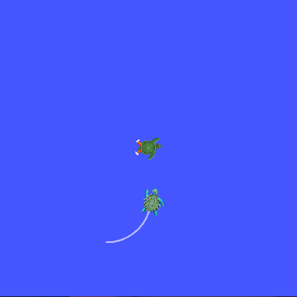
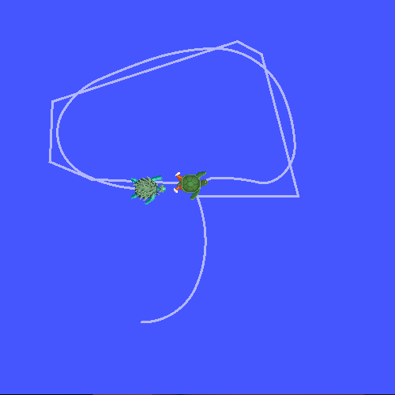
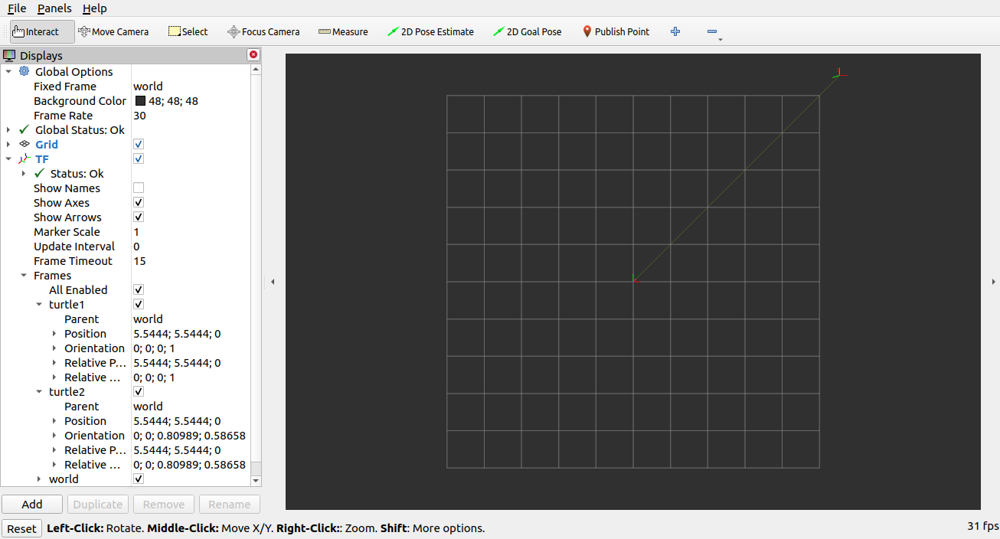

.. redirect-from::

    Tutorials/Tf2/Introduction-To-Tf2

.. _IntroToTf2:

介绍 ``tf2``
============

**目标：** 运行一个 turtlesim 演示，并通过使用 turtlesim 的多机器人示例了解 tf2 的一些强大功能。

**教程级别：** 中级

**时间：** 10 分钟

.. contents:: 目录
   :depth: 2
   :local:

安装演示
--------

让我们先安装演示包及其依赖。

.. tabs::

   .. group-tab:: Ubuntu Packages

      .. code-block:: console

         $ sudo apt-get install ros-{DISTRO}-rviz2 ros-{DISTRO}-turtle-tf2-py ros-{DISTRO}-tf2-ros ros-{DISTRO}-tf2-tools ros-{DISTRO}-turtlesim

   .. group-tab:: RHEL Packages

      .. code-block:: console

         $ sudo dnf install ros-{DISTRO}-rviz2 ros-{DISTRO}-turtle-tf2-py ros-{DISTRO}-tf2-ros ros-{DISTRO}-tf2-tools ros-{DISTRO}-turtlesim

   .. group-tab:: From Source

      .. code-block:: console

         $ git clone https://github.com/ros/geometry_tutorials.git -b ros2

运行演示
--------

现在我们已经安装了 ``turtle_tf2_py`` 教程包，让我们运行演示。
首先，打开一个新终端并 :doc:`source 你的 ROS 2 安装 <../../Beginner-CLI-Tools/Configuring-ROS2-Environment>`，以便 ``ros2`` 命令可以正常工作。
然后运行以下命令：

.. code-block:: console

   $ ros2 launch turtle_tf2_py turtle_tf2_demo.launch.py

你将看到 turtlesim 启动并出现两只 turtle。

在第二个终端窗口中输入以下命令：

.. code-block:: console

   $ ros2 run turtlesim turtle_teleop_key

一旦 turtlesim 启动，你就可以在 turtlesim 中使用键盘方向键驾驶中央的 turtle 四处移动，
选择第二个终端窗口，这样你的按键就会被捕获来驾驶 turtle。

你可以看到一只 turtle 不断移动，跟随你驾驶的那只 turtle。

发生了什么？
------------

这个演示使用 tf2 库创建了三个坐标帧：一个 ``world`` 帧、一个 ``turtle1`` 帧和一个 ``turtle2`` 帧。
本教程使用一个 *tf2 广播器* 发布 turtle 坐标帧，并使用一个 *tf2 监听器* 计算 turtle 帧之间的差异，并让一只 turtle 移动以跟随另一只。

tf2 工具
--------

现在让我们看看 tf2 是如何被用来创建这个演示的。
我们可以使用 ``tf2_tools`` 来查看 tf2 在幕后做了什么。

1 使用 view_frames
^^^^^^^^^^^^^^^^^^

``view_frames`` 创建一个 tf2 通过 ROS 广播的帧的图表。
注意，这个实用程序仅在 Linux 上有效；如果你在 Windows 上，请跳到下面的“使用 tf2_echo”。

.. code-block:: console

   $ ros2 run tf2_tools view_frames
   Listening to tf data during 5 seconds...
   Generating graph in frames.pdf file...

这里一个 tf2 监听器正在监听通过 ROS 广播的帧，并绘制一棵帧如何连接的树。
要查看这棵树，用你喜欢的 PDF 查看器打开生成的 ``frames.pdf``。

.. image:: images/turtlesim_frames.png

这里我们可以看到 tf2 广播的三个帧：``world``、``turtle1`` 和 ``turtle2``。
``world`` 帧是 ``turtle1`` 和 ``turtle2`` 帧的父帧。
``view_frames`` 还会报告一些诊断信息，说明最旧和
最新的帧变换何时收到，以及 tf2 帧以多快的速度发布到 tf2，用于调试。

2 使用 tf2_echo
^^^^^^^^^^^^^^^

``tf2_echo`` 报告通过 ROS 广播的任意两个帧之间的变换。

用法：

.. code-block:: console

   $ ros2 run tf2_ros tf2_echo [source_frame] [target_frame]

让我们看一下 ``turtle2`` 帧相对于 ``turtle1`` 帧的变换，这等同于：

.. code-block:: console

   $ ros2 run tf2_ros tf2_echo turtle2 turtle1
   At time 1683385337.850619099
   - Translation: [2.157, 0.901, 0.000]
   - Rotation: in Quaternion [0.000, 0.000, 0.172, 0.985]
   - Rotation: in RPY (radian) [0.000, -0.000, 0.345]
   - Rotation: in RPY (degree) [0.000, -0.000, 19.760]
   - Matrix:
     0.941 -0.338  0.000  2.157
     0.338  0.941  0.000  0.901
     0.000  0.000  1.000  0.000
     0.000  0.000  0.000  1.000
   At time 1683385338.841997774
   - Translation: [1.256, 0.216, 0.000]
   - Rotation: in Quaternion [0.000, 0.000, -0.016, 1.000]
   - Rotation: in RPY (radian) [0.000, 0.000, -0.032]
   - Rotation: in RPY (degree) [0.000, 0.000, -1.839]
   - Matrix:
     0.999  0.032  0.000  1.256
    -0.032  0.999 -0.000  0.216
    -0.000  0.000  1.000  0.000
     0.000  0.000  0.000  1.000

当 ``tf2_echo`` 监听器接收到通过 ROS 2 广播的帧时，你将看到变换显示出来。

当你驾驶 turtle 四处移动时，你会看到变换随着两只 turtle 相对移动而变化。

rviz2 与 tf2
------------

``rviz2`` 是一个可视化工具，对于检查 tf2 帧很有用。
让我们使用 ``rviz2`` 查看我们的 turtle 帧，通过使用 ``-d`` 选项用一个配置文件启动它：

.. tabs::

  .. group-tab:: Linux

    .. code-block:: console

      $ ros2 run rviz2 rviz2 -d $(ros2 pkg prefix --share turtle_tf2_py)/rviz/turtle_rviz.rviz

  .. group-tab:: Windows

    .. code-block:: console

      $ for /f "usebackq tokens=*" %a in (`ros2 pkg prefix --share turtle_tf2_py`) do rviz2 -d %a/rviz/turtle_rviz.rviz

在侧边栏中，你将看到 tf2 广播的帧。
当你驾驶 turtle 四处移动时，你会看到帧在 rviz 中移动。
