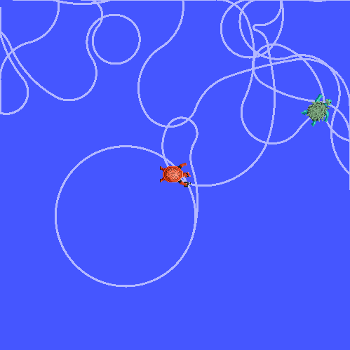
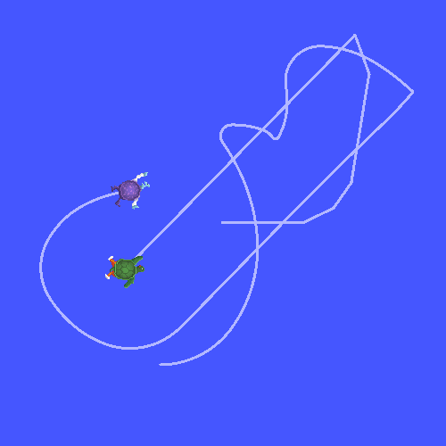

.. redirect-from::

    Tutorials/Tf2/Time-Travel-With-Tf2-Cpp

.. _TimeTravelWithTf2Cpp:

时间旅行（C++）
===============

**目标：** 学习 tf2 的高级时间旅行特性。

**教程级别：** 中级

**时间：** 10 分钟

.. contents:: 目录
   :depth: 2
   :local:

背景
----

在上一教程中，我们讨论了 :doc:`tf2 和时间的基础 <./Learning-About-Tf2-And-Time-Cpp>`。
本教程将带我们更进一步，展示一个强大的 tf2 技巧：时间旅行。
简而言之，tf2 库的关键特性之一是它能够在时间和空间上变换数据。

这个 tf2 时间旅行特性可用于各种任务，例如长时间监控机器人的位姿，或者构建一个跟随机器人，让它跟随“领航者”的“脚步”。
我们将使用时间旅行特性来查找过去的变换，并编程让 ``turtle2`` 跟在 ``carrot1`` 后面 5 秒。

时间旅行
--------

首先，让我们回到上一教程 :doc:`使用时间 <./Learning-About-Tf2-And-Time-Cpp>` 结束的地方。
转到你的 ``learning_tf2_cpp`` 包。

现在，我们不让第二只 turtle 去胡萝卜现在所在的位置，而是让第二只 turtle 去第一个胡萝卜 5 秒前所在的位置。
编辑 ``turtle_tf2_listener.cpp`` 文件中的 ``lookupTransform()`` 调用，改为：

.. code-block:: C++

    rclcpp::Time when = this->get_clock()->now() - rclcpp::Duration(5, 0);
    try {
        t = tf_buffer_->lookupTransform(
            toFrameRel,
            fromFrameRel,
            when,
            50ms);
    } catch (const tf2::TransformException & ex) {

现在如果你运行它，在前 5 秒内，第二只 turtle 不知道该去哪里，因为我们还没有胡萝卜位姿的 5 秒历史。
但这 5 秒之后会发生什么？
构建包，然后让我们试试：

.. tabs::

  .. group-tab:: XML

    .. code-block:: console

        $ ros2 launch learning_tf2_cpp turtle_tf2_fixed_frame_demo_launch.xml

  .. group-tab:: YAML

    .. code-block:: console

        $ ros2 launch learning_tf2_cpp turtle_tf2_fixed_frame_demo_launch.yaml

  .. group-tab:: Python

    .. code-block:: console

        $ ros2 launch learning_tf2_cpp turtle_tf2_fixed_frame_demo_launch.py

你现在应该会注意到，你的 turtle 像截图中那样不受控制地四处乱开。
让我们尝试理解这种行为背后的原因。

#. 在我们的代码中，我们向 tf2 提出了以下问题：“相对于 5 秒前的 ``turtle2``，5 秒前 ``carrot1`` 的位姿是什么？”。
   这意味着我们同时基于第二只 turtle 5 秒前的位置以及第一个胡萝卜 5 秒前的位置来控制第二只 turtle。

#. 然而，我们真正想问的是：“相对于 ``turtle2`` 的当前位置，5 秒前 ``carrot1`` 的位姿是什么？”。

``lookupTransform()`` 的高级 API
--------------------------------

要向 tf2 提出这个特定的问题，我们将使用一个高级 API，它让我们能够明确地说出何时获取指定的变换。
这是通过使用额外参数调用 ``lookupTransform()`` 方法来实现的。
你的代码现在会像这样：

.. code-block:: C++

    rclcpp::Time now = this->get_clock()->now();
    rclcpp::Time when = now - rclcpp::Duration(5, 0);
    try {
        t = tf_buffer_->lookupTransform(
            toFrameRel,
            now,
            fromFrameRel,
            when,
            "world",
            50ms);
    } catch (const tf2::TransformException & ex) {

``lookupTransform()`` 的高级 API 接受六个参数：

#. 目标帧

#. 要变换到的时间

#. 源帧

#. 源帧将被求值的时间

#. 不随时间变化的帧，本例中是 ``world`` 帧

#. 等待目标帧变为可用的时间

总而言之，tf2 在后台执行以下操作。
在过去，它计算从 ``carrot1`` 到 ``world`` 的变换。
在 ``world`` 帧中，tf2 从过去时间旅行到现在。
而在当前时间，tf2 计算从 ``world`` 到 ``turtle2`` 的变换。

检查结果
--------

构建包，然后让我们再次运行仿真，这次使用高级时间旅行 API：

.. tabs::

  .. group-tab:: XML

    .. code-block:: console

        $ ros2 launch learning_tf2_cpp turtle_tf2_fixed_frame_demo_launch.xml

  .. group-tab:: YAML

    .. code-block:: console

        $ ros2 launch learning_tf2_cpp turtle_tf2_fixed_frame_demo_launch.yaml

  .. group-tab:: Python

    .. code-block:: console

        $ ros2 launch learning_tf2_cpp turtle_tf2_fixed_frame_demo_launch.py

是的，第二只 turtle 被引导到第一个胡萝卜 5 秒前所在的位置！

总结
----

在本教程中，你看到了 tf2 的高级特性之一。
你学习了 tf2 可以在时间上变换数据，并学会了如何用 turtlesim 示例来实现。
tf2 允许你回到过去，并通过使用高级 ``lookupTransform()`` API，在 turtle 的旧位姿和当前位姿之间进行帧变换。
