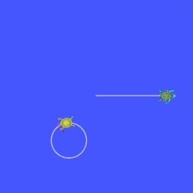

.. redirect-from::

    Tutorials/Tf2/Using-Stamped-Datatypes-With-Tf2-Ros-MessageFilter

.. _UsingStampedDatatypesWithTf2RosMessageFilter:

使用带时间戳的数据类型与 ``tf2_ros::MessageFilter``
===================================================

**目标：** 学习如何使用 ``tf2_ros::MessageFilter`` 来处理带时间戳的数据类型。

**教程级别：** 中级

**时间：** 10 分钟

.. contents:: 目录
   :depth: 3
   :local:

背景
----

本教程解释了如何将传感器数据与 tf2 一起使用。
传感器数据的一些真实世界示例有：

    * 相机，无论是单目还是双目

    * 激光扫描

假设创建了一只名为 ``turtle3`` 的新 turtle，它没有良好的里程计，但有一个顶部相机追踪它的位置，并将该位置作为 ``PointStamped`` 消息相对于 ``world`` 坐标系发布。

``turtle1`` 想知道 ``turtle3`` 相对于它自己在什么位置。

为此，``turtle1`` 必须监听 ``turtle3`` 位姿发布的话题，等待到目标坐标系的变换准备好，然后再执行它的操作。
为了让这更容易，``tf2_ros::MessageFilter`` 非常有用。
``tf2_ros::MessageFilter`` 会订阅任何带消息头的 ROS 2 消息并将其缓存，直到可以将它变换到目标坐标系。

先决条件
--------

本教程希望你已安装 ``turtle_tf2_py`` 包。

.. tabs::

  .. group-tab:: Ubuntu

    .. code-block:: console

        $ sudo apt install ros-{DISTRO}-turtle-tf2-py

  .. group-tab:: RHEL

    .. code-block:: console

        $ sudo dnf install ros-{DISTRO}-turtle-tf2-py

  .. group-tab:: From Source

    .. code-block:: console

        # Clone the required package repository inside src directory of the ros2_ws
        $ git clone https://github.com/ros/geometry_tutorials.git -b ros2
        # Build the required package
        $ colcon build --packages-select turtle_tf2_py

任务
----

1 编写 PointStamped 消息的广播器节点
^^^^^^^^^^^^^^^^^^^^^^^^^^^^^^^^^^^^

在本教程中，我们将搭建一个演示应用程序，其中有一个节点（用 Python 编写）来广播 ``turtle3`` 的 ``PointStamped`` 位置消息。

首先，让我们创建源文件。

进入我们在上一个教程中创建的 ``learning_tf2_py`` :doc:`包 <./Writing-A-Tf2-Static-Broadcaster-Py>`。
在 ``src/learning_tf2_py/learning_tf2_py`` 目录中，通过输入以下命令下载示例传感器消息广播器代码：

.. tabs::

  .. group-tab:: Linux

    .. code-block:: console

        $ wget https://raw.githubusercontent.com/ros/geometry_tutorials/{DISTRO}/turtle_tf2_py/turtle_tf2_py/turtle_tf2_message_broadcaster.py

  .. group-tab:: macOS

    .. code-block:: console

        $ wget https://raw.githubusercontent.com/ros/geometry_tutorials/{DISTRO}/turtle_tf2_py/turtle_tf2_py/turtle_tf2_message_broadcaster.py

  .. group-tab:: Windows

    在 Windows 命令行提示符中：

    .. code-block:: console

        $ curl -sk https://raw.githubusercontent.com/ros/geometry_tutorials/{DISTRO}/turtle_tf2_py/turtle_tf2_py/turtle_tf2_message_broadcaster.py -o turtle_tf2_message_broadcaster.py

    或在 powershell 中：

    .. code-block:: console

        $ curl https://raw.githubusercontent.com/ros/geometry_tutorials/{DISTRO}/turtle_tf2_py/turtle_tf2_py/turtle_tf2_message_broadcaster.py -o turtle_tf2_message_broadcaster.py

使用你喜欢的文本编辑器打开该文件。

.. code-block:: python

    from geometry_msgs.msg import PointStamped
    from geometry_msgs.msg import Twist

    import rclpy
    from rclpy.node import Node

    from turtlesim.msg import Pose
    from turtlesim.srv import Spawn

    class PointPublisher(Node):

        def __init__(self):
            super().__init__('turtle_tf2_message_broadcaster')

            # Create a client to spawn a turtle
            self.spawner = self.create_client(Spawn, 'spawn')
            # Boolean values to store the information
            # if the service for spawning turtle is available
            self.turtle_spawning_service_ready = False
            # if the turtle was successfully spawned
            self.turtle_spawned = False
            # if the topics of turtle3 can be subscribed
            self.turtle_pose_cansubscribe = False

            self.timer = self.create_timer(1.0, self.on_timer)

        def on_timer(self):
            if self.turtle_spawning_service_ready:
                if self.turtle_spawned:
                    self.turtle_pose_cansubscribe = True
                else:
                    if self.result.done():
                        self.get_logger().info(
                            f'Successfully spawned {self.result.result().name}')
                        self.turtle_spawned = True
                    else:
                        self.get_logger().info('Spawn is not finished')
            else:
                if self.spawner.service_is_ready():
                    # Initialize request with turtle name and coordinates
                    # Note that x, y and theta are defined as floats in turtlesim/srv/Spawn
                    request = Spawn.Request()
                    request.name = 'turtle3'
                    request.x = 4.0
                    request.y = 2.0
                    request.theta = 0.0
                    # Call request
                    self.result = self.spawner.call_async(request)
                    self.turtle_spawning_service_ready = True
                else:
                    # Check if the service is ready
                    self.get_logger().info('Service is not ready')

            if self.turtle_pose_cansubscribe:
                self.vel_pub = self.create_publisher(Twist, 'turtle3/cmd_vel', 10)
                self.sub = self.create_subscription(Pose, 'turtle3/pose', self.handle_turtle_pose, 10)
                self.pub = self.create_publisher(PointStamped, 'turtle3/turtle_point_stamped', 10)

        def handle_turtle_pose(self, msg):
            vel_msg = Twist()
            vel_msg.linear.x = 1.0
            vel_msg.angular.z = 1.0
            self.vel_pub.publish(vel_msg)

            ps = PointStamped()
            ps.header.stamp = self.get_clock().now().to_msg()
            ps.header.frame_id = 'world'
            ps.point.x = msg.x
            ps.point.y = msg.y
            ps.point.z = 0.0
            self.pub.publish(ps)

    def main():
        rclpy.init()
        node = PointPublisher()
        try:
            rclpy.spin(node)
        except KeyboardInterrupt:
            pass

        rclpy.shutdown()

1.1 检查代码
~~~~~~~~~~~~

现在让我们看看代码。
首先，在 ``on_timer`` 回调函数中，当 turtle 生成服务就绪时，我们通过异步调用 ``turtlesim`` 的 ``Spawn`` 服务来生成 ``turtle3``，并将其位置初始化为 (4, 2, 0)。

.. code-block:: python

    # Initialize request with turtle name and coordinates
    # Note that x, y and theta are defined as floats in turtlesim/srv/Spawn
    request = Spawn.Request()
    request.name = 'turtle3'
    request.x = 4.0
    request.y = 2.0
    request.theta = 0.0
    # Call request
    self.result = self.spawner.call_async(request)

之后，节点发布话题 ``turtle3/cmd_vel``、话题 ``turtle3/turtle_point_stamped``，并订阅话题 ``turtle3/pose``，在每一条传入的消息上运行回调函数 ``handle_turtle_pose``。

.. code-block:: python

    self.vel_pub = self.create_publisher(Twist, '/turtle3/cmd_vel', 10)
    self.sub = self.create_subscription(Pose, '/turtle3/pose', self.handle_turtle_pose, 10)
    self.pub = self.create_publisher(PointStamped, '/turtle3/turtle_point_stamped', 10)

最后，在回调函数 ``handle_turtle_pose`` 中，我们初始化 ``turtle3`` 的 ``Twist`` 消息并发布它们，这将使 ``turtle3`` 沿圆形移动。
然后我们用传入的 ``Pose`` 消息填充 ``turtle3`` 的 ``PointStamped`` 消息并发布它们。

.. code-block:: python

    vel_msg = Twist()
    vel_msg.linear.x = 1.0
    vel_msg.angular.z = 1.0
    self.vel_pub.publish(vel_msg)

    ps = PointStamped()
    ps.header.stamp = self.get_clock().now().to_msg()
    ps.header.frame_id = 'world'
    ps.point.x = msg.x
    ps.point.y = msg.y
    ps.point.z = 0.0
    self.pub.publish(ps)

1.2 编写启动文件
~~~~~~~~~~~~~~~~

为了运行这个演示，我们需要在 ``learning_tf2_py`` 包的 ``launch`` 子目录中创建一个名为 ``turtle_tf2_sensor_message_launch``、扩展名为 ``.py``、``.xml`` 或 ``.yaml`` 的启动文件：

.. tabs::

  .. group-tab:: Python

    .. literalinclude:: launch/turtle_tf2_sensor_message_launch.py
        :language: python

  .. group-tab:: XML

    .. literalinclude:: launch/turtle_tf2_sensor_message_launch.xml
        :language: xml

  .. group-tab:: YAML

    .. literalinclude:: launch/turtle_tf2_sensor_message_launch.yaml
        :language: yaml

1.3 添加入口点
~~~~~~~~~~~~~~

要让 ``ros2 run`` 命令能够运行你的节点，你必须将入口点添加到 ``setup.py``（位于 ``src/learning_tf2_py`` 目录中）。

在 ``'console_scripts':`` 括号之间添加以下行：

.. code-block:: python

    'turtle_tf2_message_broadcaster = learning_tf2_py.turtle_tf2_message_broadcaster:main',

1.4 添加数据文件
~~~~~~~~~~~~~~~~

要让 ``ros2 launch`` 命令能够启动你的启动文件，你必须将数据文件添加到 ``setup.py``（位于 ``src/learning_tf2_py`` 目录中）。

在 ``setup.py`` 顶部导入以下库：

.. code-block:: python

    ...
    import os
    from glob import glob

在 ``'data_files':`` 括号之间添加以下行：

.. code-block:: python

    data_files=[
        ...
        (os.path.join('share', package_name, 'launch'), glob('launch/*')),
    ],

1.5 构建
~~~~~~~~

在你的工作区根目录运行 ``rosdep`` 来检查缺失的依赖。

.. tabs::

   .. group-tab:: Linux

      .. code-block:: console

          $ rosdep install -i --from-path src --rosdistro {DISTRO} -y

   .. group-tab:: macOS

        rosdep 只在 Linux 上运行，因此你需要自己安装 ``geometry_msgs`` 和 ``turtlesim`` 依赖

   .. group-tab:: Windows

        rosdep 只在 Linux 上运行，因此你需要自己安装 ``geometry_msgs`` 和 ``turtlesim`` 依赖

然后我们可以构建该包：

.. tabs::

  .. group-tab:: Linux

    .. code-block:: console

        $ colcon build --packages-select learning_tf2_py

  .. group-tab:: macOS

    .. code-block:: console

        $ colcon build --packages-select learning_tf2_py

  .. group-tab:: Windows

    .. code-block:: console

        $ colcon build --merge-install --packages-select learning_tf2_py

2 编写消息过滤器/监听器节点
^^^^^^^^^^^^^^^^^^^^^^^^^^^

现在，为了可靠地获取 ``turtle1`` 坐标系中 ``turtle3`` 的流式 ``PointStamped`` 数据，我们将创建消息过滤器/监听器节点的源文件。

进入我们在上一个教程中创建的 ``learning_tf2_cpp`` :doc:`包 <./Writing-A-Tf2-Static-Broadcaster-Cpp>`。
在 ``src/learning_tf2_cpp/src`` 目录中，通过输入以下命令下载文件 ``turtle_tf2_message_filter.cpp``：

.. tabs::

  .. group-tab:: Linux

    .. code-block:: console

        $ wget https://raw.githubusercontent.com/ros/geometry_tutorials/{DISTRO}/turtle_tf2_cpp/src/turtle_tf2_message_filter.cpp

  .. group-tab:: macOS

    .. code-block:: console

        $ wget https://raw.githubusercontent.com/ros/geometry_tutorials/{DISTRO}/turtle_tf2_cpp/src/turtle_tf2_message_filter.cpp

  .. group-tab:: Windows

    在 Windows 命令行提示符中：

    .. code-block:: console

        $ curl -sk https://raw.githubusercontent.com/ros/geometry_tutorials/{DISTRO}/turtle_tf2_cpp/src/turtle_tf2_message_filter.cpp -o turtle_tf2_message_filter.cpp

    或在 powershell 中：

    .. code-block:: console

        $ curl https://raw.githubusercontent.com/ros/geometry_tutorials/{DISTRO}/turtle_tf2_cpp/src/turtle_tf2_message_filter.cpp -o turtle_tf2_message_filter.cpp

使用你喜欢的文本编辑器打开该文件。

.. code-block:: C++

    #include <chrono>
    #include <memory>
    #include <string>

    #include "geometry_msgs/msg/point_stamped.hpp"
    #include "message_filters/subscriber.hpp"
    #include "rclcpp/rclcpp.hpp"
    #include "tf2_ros/buffer.hpp"
    #include "tf2_ros/create_timer_ros.hpp"
    #include "tf2_ros/message_filter.hpp"
    #include "tf2_ros/transform_listener.hpp"
    #include "tf2_geometry_msgs/tf2_geometry_msgs.hpp"

    using namespace std::chrono_literals;

    class PoseDrawer : public rclcpp::Node
    {
    public:
      PoseDrawer()
      : Node("turtle_tf2_pose_drawer")
      {
        // Declare and acquire `target_frame` parameter
        target_frame_ = this->declare_parameter<std::string>("target_frame", "turtle1");

        std::chrono::duration<int> buffer_timeout(1);

        tf2_buffer_ = std::make_shared<tf2_ros::Buffer>(this->get_clock());
        // Create the timer interface before call to waitForTransform,
        // to avoid a tf2_ros::CreateTimerInterfaceException exception
        auto timer_interface = std::make_shared<tf2_ros::CreateTimerROS>(
          this->get_node_base_interface(),
          this->get_node_timers_interface());
        tf2_buffer_->setCreateTimerInterface(timer_interface);
        tf2_listener_ =
          std::make_shared<tf2_ros::TransformListener>(*tf2_buffer_);

        point_sub_.subscribe(this, "/turtle3/turtle_point_stamped");
        tf2_filter_ = std::make_shared<tf2_ros::MessageFilter<geometry_msgs::msg::PointStamped>>(
          point_sub_, *tf2_buffer_, target_frame_, 100, this->get_node_logging_interface(),
          this->get_node_clock_interface(), buffer_timeout);
        // Register a callback with tf2_ros::MessageFilter to be called when transforms are available
        tf2_filter_->registerCallback(&PoseDrawer::msgCallback, this);
      }

    private:
      void msgCallback(const geometry_msgs::msg::PointStamped::SharedPtr point_ptr)
      {
        geometry_msgs::msg::PointStamped point_out;
        try {
          tf2_buffer_->transform(*point_ptr, point_out, target_frame_);
          RCLCPP_INFO(
            this->get_logger(), "Point of turtle3 in frame of turtle1: x:%f y:%f z:%f\n",
            point_out.point.x,
            point_out.point.y,
            point_out.point.z);
        } catch (const tf2::TransformException & ex) {
          RCLCPP_WARN(
            // Print exception which was caught
            this->get_logger(), "Failure %s\n", ex.what());
        }
      }

      std::string target_frame_;
      std::shared_ptr<tf2_ros::Buffer> tf2_buffer_;
      std::shared_ptr<tf2_ros::TransformListener> tf2_listener_;
      message_filters::Subscriber<geometry_msgs::msg::PointStamped> point_sub_;
      std::shared_ptr<tf2_ros::MessageFilter<geometry_msgs::msg::PointStamped>> tf2_filter_;
    };

    int main(int argc, char * argv[])
    {
      rclcpp::init(argc, argv);
      rclcpp::spin(std::make_shared<PoseDrawer>());
      rclcpp::shutdown();
      return 0;
    }

2.1 检查代码
~~~~~~~~~~~~

首先，你必须包含来自 ``tf2_ros`` 包的 ``tf2_ros::MessageFilter`` 头文件，以及之前使用过的 ``tf2`` 和 ``ros2`` 相关头文件。

.. code-block:: C++

    #include "geometry_msgs/msg/point_stamped.hpp"
    #include "message_filters/subscriber.hpp"
    #include "rclcpp/rclcpp.hpp"
    #include "tf2_ros/buffer.hpp"
    #include "tf2_ros/create_timer_ros.hpp"
    #include "tf2_ros/message_filter.hpp"
    #include "tf2_ros/transform_listener.hpp"
    #include "tf2_geometry_msgs/tf2_geometry_msgs.hpp"

其次，需要有 ``tf2_ros::Buffer``、``tf2_ros::TransformListener`` 和 ``tf2_ros::MessageFilter`` 的持久实例。

.. code-block:: C++

    std::string target_frame_;
    std::shared_ptr<tf2_ros::Buffer> tf2_buffer_;
    std::shared_ptr<tf2_ros::TransformListener> tf2_listener_;
    message_filters::Subscriber<geometry_msgs::msg::PointStamped> point_sub_;
    std::shared_ptr<tf2_ros::MessageFilter<geometry_msgs::msg::PointStamped>> tf2_filter_;

第三，必须用话题初始化 ROS 2 的 ``message_filters::Subscriber``。
而 ``tf2_ros::MessageFilter`` 必须用那个 ``Subscriber`` 对象初始化。
``MessageFilter`` 构造函数中值得注意的其他参数是 ``target_frame`` 和回调函数。
目标坐标系是它将确保 ``canTransform`` 能够成功的坐标系。
而回调函数是数据准备好时将被调用的函数。

.. code-block:: C++

    PoseDrawer()
    : Node("turtle_tf2_pose_drawer")
    {
      // Declare and acquire `target_frame` parameter
      target_frame_ = this->declare_parameter<std::string>("target_frame", "turtle1");

      std::chrono::duration<int> buffer_timeout(1);

      tf2_buffer_ = std::make_shared<tf2_ros::Buffer>(this->get_clock());
      // Create the timer interface before call to waitForTransform,
      // to avoid a tf2_ros::CreateTimerInterfaceException exception
      auto timer_interface = std::make_shared<tf2_ros::CreateTimerROS>(
        this->get_node_base_interface(),
        this->get_node_timers_interface());
      tf2_buffer_->setCreateTimerInterface(timer_interface);
      tf2_listener_ =
        std::make_shared<tf2_ros::TransformListener>(*tf2_buffer_);

      point_sub_.subscribe(this, "/turtle3/turtle_point_stamped");
      tf2_filter_ = std::make_shared<tf2_ros::MessageFilter<geometry_msgs::msg::PointStamped>>(
        point_sub_, *tf2_buffer_, target_frame_, 100, this->get_node_logging_interface(),
        this->get_node_clock_interface(), buffer_timeout);
      // Register a callback with tf2_ros::MessageFilter to be called when transforms are available
      tf2_filter_->registerCallback(&PoseDrawer::msgCallback, this);
    }

最后，回调方法会在数据准备好时调用 ``tf2_buffer_->transform`` 并将输出打印到控制台。

.. code-block:: C++

    private:
      void msgCallback(const geometry_msgs::msg::PointStamped::SharedPtr point_ptr)
      {
        geometry_msgs::msg::PointStamped point_out;
        try {
          tf2_buffer_->transform(*point_ptr, point_out, target_frame_);
          RCLCPP_INFO(
            this->get_logger(), "Point of turtle3 in frame of turtle1: x:%f y:%f z:%f\n",
            point_out.point.x,
            point_out.point.y,
            point_out.point.z);
        } catch (const tf2::TransformException & ex) {
          RCLCPP_WARN(
            // Print exception which was caught
            this->get_logger(), "Failure %s\n", ex.what());
        }
      }

2.2 添加依赖
~~~~~~~~~~~~

在构建包 ``learning_tf2_cpp`` 之前，请在该包的 ``package.xml`` 文件中添加另外两个依赖：

.. code-block:: xml

    <depend>message_filters</depend>
    <depend>tf2_geometry_msgs</depend>

2.3 CMakeLists.txt
~~~~~~~~~~~~~~~~~~

而在 ``CMakeLists.txt`` 文件中，在现有依赖下方添加两行：

.. code-block:: console

    find_package(message_filters REQUIRED)
    find_package(tf2_geometry_msgs REQUIRED)

下面这些行将处理 ROS 发行版之间的差异：

.. code-block:: console

    if(TARGET tf2_geometry_msgs::tf2_geometry_msgs)
      get_target_property(_include_dirs tf2_geometry_msgs::tf2_geometry_msgs INTERFACE_INCLUDE_DIRECTORIES)
    else()
      set(_include_dirs ${tf2_geometry_msgs_INCLUDE_DIRS})
    endif()

    find_file(TF2_CPP_HEADERS
      NAMES tf2_geometry_msgs.hpp
      PATHS ${_include_dirs}
      NO_CACHE
      PATH_SUFFIXES tf2_geometry_msgs
    )

之后，添加可执行文件并将其命名为 ``turtle_tf2_message_filter``，你稍后会配合 ``ros2 run`` 使用它。

.. code-block:: console

    add_executable(turtle_tf2_message_filter src/turtle_tf2_message_filter.cpp)
    ament_target_dependencies(
      turtle_tf2_message_filter
      geometry_msgs
      message_filters
      rclcpp
      tf2
      tf2_geometry_msgs
      tf2_ros
    )

    if(EXISTS ${TF2_CPP_HEADERS})
      target_compile_definitions(turtle_tf2_message_filter PUBLIC -DTF2_CPP_HEADERS)
    endif()

最后，添加 ``install(TARGETS…)`` 部分（在其他现有节点下方），以便 ``ros2 run`` 能找到你的可执行文件：

.. code-block:: console

    install(TARGETS
      turtle_tf2_message_filter
      DESTINATION lib/${PROJECT_NAME})

2.4 构建
~~~~~~~~

在你的工作区根目录运行 ``rosdep`` 来检查缺失的依赖。

.. tabs::

   .. group-tab:: Linux

      .. code-block:: console

          $ rosdep install -i --from-path src --rosdistro {DISTRO} -y

   .. group-tab:: macOS

        rosdep 只在 Linux 上运行，因此你需要自己安装 ``geometry_msgs`` 和 ``turtlesim`` 依赖

   .. group-tab:: Windows

        rosdep 只在 Linux 上运行，因此你需要自己安装 ``geometry_msgs`` 和 ``turtlesim`` 依赖

现在打开一个新终端，导航到你的工作区根目录，并用以下命令重建该包：

.. tabs::

  .. group-tab:: Linux

    .. code-block:: console

        $ colcon build --packages-select learning_tf2_cpp

  .. group-tab:: macOS

    .. code-block:: console

        $ colcon build --packages-select learning_tf2_cpp

  .. group-tab:: Windows

    .. code-block:: console

        $ colcon build --merge-install --packages-select learning_tf2_cpp

打开一个新终端，导航到你的工作区根目录，并 source 安装文件：

.. tabs::

   .. group-tab:: Linux

      .. code-block:: console

          $ . install/setup.bash

   .. group-tab:: macOS

      .. code-block:: console

          $ . install/setup.bash

   .. group-tab:: Windows

      在 Windows 命令行提示符中：

      .. code-block:: console

          $ call install\setup.bat

      或在 powershell 中：

      .. code-block:: console

          $ .\install\setup.ps1

3 运行
^^^^^^

首先我们需要通过启动启动文件 ``turtle_tf2_sensor_message_launch`` 来运行几个节点（包括 PointStamped 消息的广播器节点）：

.. tabs::

  .. group-tab:: XML

    .. code-block:: console

        $ ros2 launch learning_tf2_py turtle_tf2_sensor_message_launch.xml

  .. group-tab:: YAML

    .. code-block:: console

        $ ros2 launch learning_tf2_py turtle_tf2_sensor_message_launch.yaml

  .. group-tab:: Python

    .. code-block:: console

        $ ros2 launch learning_tf2_py turtle_tf2_sensor_message_launch.py

这将带出带有两只 turtle 的 ``turtlesim`` 窗口，其中 ``turtle3`` 正沿圆形移动，而 ``turtle1`` 起初不动。
但你可以在另一个终端运行 ``turtle_teleop_key`` 节点来驱动 ``turtle1`` 移动：

.. code-block:: console

    $ ros2 run turtlesim turtle_teleop_key

现在如果你回显话题 ``turtle3/turtle_point_stamped``：

.. code-block:: console

    $ ros2 topic echo /turtle3/turtle_point_stamped
    header:
      stamp:
        sec: 1629877510
        nanosec: 902607040
      frame_id: world
    point:
      x: 4.989276885986328
      y: 3.073937177658081
      z: 0.0
    ---
    header:
      stamp:
        sec: 1629877510
        nanosec: 918389395
      frame_id: world
    point:
      x: 4.987966060638428
      y: 3.089883327484131
      z: 0.0
    ---
    header:
      stamp:
        sec: 1629877510
        nanosec: 934186680
      frame_id: world
    point:
      x: 4.986400127410889
      y: 3.105806589126587
      z: 0.0
    ---

当演示运行时，打开另一个终端并运行消息过滤器/监听器节点：

.. code-block:: console

    $ ros2 run learning_tf2_cpp turtle_tf2_message_filter
    [INFO] [1630016162.006173900] [turtle_tf2_pose_drawer]: Point of turtle3 in frame of turtle1: x:-6.493231 y:-2.961614 z:0.000000

    [INFO] [1630016162.006291983] [turtle_tf2_pose_drawer]: Point of turtle3 in frame of turtle1: x:-6.472169 y:-3.004742 z:0.000000

    [INFO] [1630016162.006326234] [turtle_tf2_pose_drawer]: Point of turtle3 in frame of turtle1: x:-6.479420 y:-2.990479 z:0.000000

    [INFO] [1630016162.006355644] [turtle_tf2_pose_drawer]: Point of turtle3 in frame of turtle1: x:-6.486441 y:-2.976102 z:0.000000

总结
----

在本教程中，你学习了如何在 tf2 中使用传感器数据/消息。
具体来说，你学习了如何在一个话题上发布 ``PointStamped`` 消息，以及如何监听该话题并用 ``tf2_ros::MessageFilter`` 变换 ``PointStamped`` 消息的坐标系。
