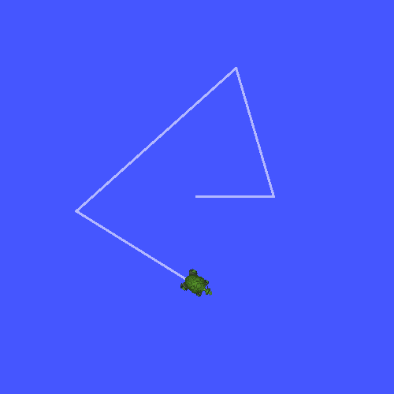

.. redirect-from::

    Tutorials/Tf2/Writing-A-Tf2-Broadcaster-Cpp

编写广播器（C++）
=================

**目标：** 学习如何将机器人的状态广播到 tf2。

**教程级别：** 中级

**时间：** 15 分钟

.. contents:: 目录
   :depth: 2
   :local:

背景
----

在接下来的两个教程中，我们将编写代码来重现 :doc:`tf2 介绍 <./Introduction-To-Tf2>` 教程中的演示。
之后，后续教程将重点用更高级的 tf2 功能扩展演示，包括在变换查找中使用超时和时间旅行。

先决条件
--------

本教程假设你具备 ROS 2 的工作知识，并且已经完成 :doc:`tf2 介绍教程 <./Introduction-To-Tf2>` 和 :doc:`tf2 静态广播器教程（C++） <./Writing-A-Tf2-Static-Broadcaster-Cpp>`。
我们将重用上一个教程中的 ``learning_tf2_cpp`` 包。

在前面的教程中，你学习了如何 :doc:`创建工作区 <../../Beginner-Client-Libraries/Creating-A-Workspace/Creating-A-Workspace>` 和 :doc:`创建包 <../../Beginner-Client-Libraries/Creating-Your-First-ROS2-Package>`。

任务
----

1 编写广播器节点
^^^^^^^^^^^^^^^^

让我们先创建源文件。
转到我们在上一个教程中创建的 ``learning_tf2_cpp`` 包。
在 ``src`` 目录中，通过输入以下命令下载示例广播器代码：

.. tabs::

    .. group-tab:: Linux

        .. code-block:: console

            $ wget https://raw.githubusercontent.com/ros/geometry_tutorials/{DISTRO}/turtle_tf2_cpp/src/turtle_tf2_broadcaster.cpp

    .. group-tab:: macOS

        .. code-block:: console

            $ wget https://raw.githubusercontent.com/ros/geometry_tutorials/{DISTRO}/turtle_tf2_cpp/src/turtle_tf2_broadcaster.cpp

    .. group-tab:: Windows

        在 Windows 命令行提示符中：

        .. code-block:: console

            $ curl -sk https://raw.githubusercontent.com/ros/geometry_tutorials/{DISTRO}/turtle_tf2_cpp/src/turtle_tf2_broadcaster.cpp -o turtle_tf2_broadcaster.cpp

        或者在 powershell 中：

        .. code-block:: console

            $ curl https://raw.githubusercontent.com/ros/geometry_tutorials/{DISTRO}/turtle_tf2_cpp/src/turtle_tf2_broadcaster.cpp -o turtle_tf2_broadcaster.cpp

使用你喜欢的文本编辑器打开该文件。

.. code-block:: C++

    #include <functional>
    #include <memory>
    #include <sstream>
    #include <string>

    #include "geometry_msgs/msg/transform_stamped.hpp"
    #include "rclcpp/rclcpp.hpp"
    #include "tf2/LinearMath/Quaternion.hpp"
    #include "tf2_ros/transform_broadcaster.hpp"
    #include "turtlesim/msg/pose.hpp"

    class FramePublisher : public rclcpp::Node
    {
    public:
      FramePublisher()
      : Node("turtle_tf2_frame_publisher")
      {
        // Declare and acquire `turtlename` parameter
        turtlename_ = this->declare_parameter<std::string>("turtlename", "turtle");

        // Initialize the transform broadcaster
        tf_broadcaster_ =
          std::make_unique<tf2_ros::TransformBroadcaster>(*this);

        // Subscribe to a turtle{1}{2}/pose topic and call handle_turtle_pose
        // callback function on each message
        std::ostringstream stream;
        stream << "/" << turtlename_.c_str() << "/pose";
        std::string topic_name = stream.str();

        auto handle_turtle_pose = [this](const std::shared_ptr<const turtlesim::msg::Pose> msg){
            geometry_msgs::msg::TransformStamped t;

            // Read message content and assign it to
            // corresponding tf variables
            t.header.stamp = this->get_clock()->now();
            t.header.frame_id = "world";
            t.child_frame_id = turtlename_.c_str();

            // Turtle only exists in 2D, thus we get x and y translation
            // coordinates from the message and set the z coordinate to 0
            t.transform.translation.x = msg->x;
            t.transform.translation.y = msg->y;
            t.transform.translation.z = 0.0;

            // For the same reason, turtle can only rotate around one axis
            // and this why we set rotation in x and y to 0 and obtain
            // rotation in z axis from the message
            tf2::Quaternion q;
            q.setRPY(0, 0, msg->theta);
            t.transform.rotation.x = q.x();
            t.transform.rotation.y = q.y();
            t.transform.rotation.z = q.z();
            t.transform.rotation.w = q.w();

            // Send the transformation
            tf_broadcaster_->sendTransform(t);
        };
        subscription_ = this->create_subscription<turtlesim::msg::Pose>(
          topic_name, 10,
          handle_turtle_pose);
      }

    private:
      rclcpp::Subscription<turtlesim::msg::Pose>::SharedPtr subscription_;
      std::unique_ptr<tf2_ros::TransformBroadcaster> tf_broadcaster_;
      std::string turtlename_;
    };

    int main(int argc, char * argv[])
    {
      rclcpp::init(argc, argv);
      rclcpp::spin(std::make_shared<FramePublisher>());
      rclcpp::shutdown();
      return 0;
    }

1.1 检查代码
~~~~~~~~~~~~

现在，让我们看看与将 turtle 位姿发布到 tf2 相关的代码。
首先，我们定义并获取单个参数 ``turtlename``，它指定 turtle 名称，例如 ``turtle1`` 或 ``turtle2``。

.. code-block:: C++

    turtlename_ = this->declare_parameter<std::string>("turtlename", "turtle");

随后，节点订阅话题 ``turtleX/pose``，并在每个传入消息上运行函数 ``handle_turtle_pose``。

.. code-block:: C++

    subscription_ = this->create_subscription<turtlesim::msg::Pose>(
      topic_name, 10,
      handle_turtle_pose);

现在，我们创建一个 ``TransformStamped`` 对象并给它适当的元数据。

#. 我们需要给要发布的变换一个时间戳，我们通过调用 ``this->get_clock()->now()`` 用当前时间来标记它。
   这将返回 ``Node`` 使用的当前时间。

#. 然后我们需要设置我们正在创建的链接的父帧名称，在本例中是 ``world``。

#. 最后，我们需要设置我们正在创建的链接的子节点名称，在本例中这是 turtle 本身的名称。

turtle 位姿消息的处理函数广播这只 turtle 的平移和旋转，并将其作为从帧 ``world`` 到帧 ``turtleX`` 的变换发布。

.. code-block:: C++

    geometry_msgs::msg::TransformStamped t;

    // Read message content and assign it to
    // corresponding tf variables
    t.header.stamp = this->get_clock()->now();
    t.header.frame_id = "world";
    t.child_frame_id = turtlename_.c_str();

这里我们将 3D turtle 位姿中的信息复制到 3D 变换中。

.. code-block:: C++

    // Turtle only exists in 2D, thus we get x and y translation
    // coordinates from the message and set the z coordinate to 0
    t.transform.translation.x = msg->x;
    t.transform.translation.y = msg->y;
    t.transform.translation.z = 0.0;

    // For the same reason, turtle can only rotate around one axis
    // and this why we set rotation in x and y to 0 and obtain
    // rotation in z axis from the message
    tf2::Quaternion q;
    q.setRPY(0, 0, msg->theta);
    t.transform.rotation.x = q.x();
    t.transform.rotation.y = q.y();
    t.transform.rotation.z = q.z();
    t.transform.rotation.w = q.w();

最后，我们取构造好的变换，并将其传递给 ``TransformBroadcaster`` 的 ``sendTransform`` 方法，该方法将负责广播。

.. code-block:: C++

    // Send the transformation
    tf_broadcaster_->sendTransform(t);

1.2 CMakeLists.txt
~~~~~~~~~~~~~~~~~~

返回上一级目录 ``learning_tf2_cpp``，那里有 ``CMakeLists.txt`` 和 ``package.xml`` 文件。

现在打开 ``CMakeLists.txt``，添加可执行文件并将其命名为 ``turtle_tf2_broadcaster``，你稍后将用 ``ros2 run`` 使用它。

.. code-block:: console

    add_executable(turtle_tf2_broadcaster src/turtle_tf2_broadcaster.cpp)
    ament_target_dependencies(
        turtle_tf2_broadcaster
        geometry_msgs
        rclcpp
        tf2
        tf2_ros
        turtlesim
    )

最后，添加 ``install(TARGETS…)`` 部分，以便 ``ros2 run`` 能找到你的可执行文件：

.. code-block:: console

    install(TARGETS
        turtle_tf2_broadcaster
        DESTINATION lib/${PROJECT_NAME})

2 编写启动文件
^^^^^^^^^^^^^^

现在为这个演示创建一个启动文件。
在 ``src/learning_tf2_cpp`` 目录中创建一个 ``launch`` 文件夹。
用文本编辑器在 ``launch`` 文件夹中创建一个名为 ``turtle_tf2_demo_launch`` 的新文件，扩展名为 ``.py``、``.xml`` 或 ``.yaml``，并添加以下行：

.. tabs::

  .. group-tab:: XML

    .. literalinclude:: launch/turtle_tf2_demo_launch.xml
        :language: xml

  .. group-tab:: YAML

    .. literalinclude:: launch/turtle_tf2_demo_launch.yaml
        :language: yaml

  .. group-tab:: Python

    .. literalinclude:: launch/turtle_tf2_demo_launch.py
        :language: python

2.1 检查代码
~~~~~~~~~~~~

让我们检查启动文件的结构。
每种格式都有自己的启动文件设置方式：

.. tabs::

  .. group-tab:: XML

    XML 启动文件以 XML 声明和一个根 ``<launch>`` 元素开头。

    .. literalinclude:: launch/turtle_tf2_demo_launch.xml
        :language: xml
        :lines: 1-2

  .. group-tab:: YAML

    YAML 启动文件以 YAML 版本声明和一个 ``launch:`` 键开头。

    .. literalinclude:: launch/turtle_tf2_demo_launch.yaml
        :language: yaml
        :lines: 1-3

  .. group-tab:: Python

    在 Python 启动文件中，我们首先从 ``launch`` 和 ``launch_ros`` 包导入所需的模块。
    需要注意的是，``launch`` 是一个通用的启动框架（不是 ROS 2 特定的），而 ``launch_ros`` 有 ROS 2 特定的内容，比如我们在这里导入的节点。

    .. literalinclude:: launch/turtle_tf2_demo_launch.py
        :language: python
        :lines: 1-2

现在我们运行节点，启动 turtlesim 仿真，并使用 ``turtle_tf2_broadcaster`` 节点将 ``turtle1`` 状态广播到 tf2。

.. tabs::

  .. group-tab:: XML

    .. literalinclude:: launch/turtle_tf2_demo_launch.xml
        :language: xml
        :lines: 3-6

  .. group-tab:: YAML

    .. literalinclude:: launch/turtle_tf2_demo_launch.yaml
        :language: yaml
        :lines: 4-9

  .. group-tab:: Python

    .. literalinclude:: launch/turtle_tf2_demo_launch.py
        :language: python
        :lines: 5-20

2.2 添加依赖
~~~~~~~~~~~~

返回上一级目录 ``learning_tf2_cpp``，那里有 ``CMakeLists.txt`` 和 ``package.xml`` 文件。

用文本编辑器打开 ``package.xml``。
添加与你的启动文件导入语句对应的以下依赖：

.. code-block:: xml

    <exec_depend>launch</exec_depend>
    <exec_depend>launch_ros</exec_depend>

这声明了代码执行时所需的额外的 ``launch`` 和 ``launch_ros`` 依赖。

确保保存文件。

2.3 CMakeLists.txt
~~~~~~~~~~~~~~~~~~

重新打开 ``CMakeLists.txt`` 并添加这一行，以便 ``launch/`` 文件夹中的启动文件会被安装。

.. code-block:: console

    install(DIRECTORY launch
      DESTINATION share/${PROJECT_NAME})

你可以在 :doc:`本教程 <../Launch/Creating-Launch-Files>` 中了解更多关于创建启动文件的信息。

3 构建
^^^^^^

在工作区根目录运行 ``rosdep`` 以检查缺少的依赖。

.. tabs::

   .. group-tab:: Linux

      .. code-block:: console

          $ rosdep install -i --from-path src --rosdistro {DISTRO} -y

   .. group-tab:: macOS

        rosdep 仅在 Linux 上运行，因此你需要自己安装 ``geometry_msgs`` 和 ``turtlesim`` 依赖

   .. group-tab:: Windows

        rosdep 仅在 Linux 上运行，因此你需要自己安装 ``geometry_msgs`` 和 ``turtlesim`` 依赖

仍然在工作区根目录，构建你的包：

.. tabs::

   .. group-tab:: Linux

      .. code-block:: console

          $ colcon build --packages-select learning_tf2_cpp

   .. group-tab:: macOS

      .. code-block:: console

          $ colcon build --packages-select learning_tf2_cpp

   .. group-tab:: Windows

      .. code-block:: console

          $ colcon build --merge-install --packages-select learning_tf2_cpp

打开一个新终端，导航到工作区根目录，并 source 设置文件：

.. tabs::

   .. group-tab:: Linux

      .. code-block:: console

          $ . install/setup.bash

   .. group-tab:: macOS

      .. code-block:: console

          $ . install/setup.bash

   .. group-tab:: Windows

      在 Windows 命令行提示符中：

      .. code-block:: console

          $ call install\setup.bat

      或者在 powershell 中：

      .. code-block:: console

          $ .\install\setup.ps1

4 运行
^^^^^^

现在运行启动文件，它将启动 turtlesim 仿真节点和 ``turtle_tf2_broadcaster`` 节点：

.. tabs::

  .. group-tab:: XML

    .. code-block:: console

        $ ros2 launch learning_tf2_cpp turtle_tf2_demo_launch.xml

  .. group-tab:: YAML

    .. code-block:: console

        $ ros2 launch learning_tf2_cpp turtle_tf2_demo_launch.yaml

  .. group-tab:: Python

    .. code-block:: console

        $ ros2 launch learning_tf2_cpp turtle_tf2_demo_launch.py

在第二个终端窗口中输入以下命令：

.. code-block:: console

    $ ros2 run turtlesim turtle_teleop_key

现在你会看到 turtlesim 仿真已启动，有一只你可以控制的 turtle。

现在，使用 ``tf2_echo`` 工具检查 turtle 位姿是否真的被广播到 tf2：

.. code-block:: console

    $ ros2 run tf2_ros tf2_echo world turtle1

这应该会显示第一只 turtle 的位姿。
使用方向键驾驶 turtle（确保你的 ``turtle_teleop_key`` 终端窗口是活动的，而不是仿真器窗口）。
在你的控制台输出中，你会看到类似这样的内容：

.. code-block:: console

    At time 1625137663.912474878
    - Translation: [5.276, 7.930, 0.000]
    - Rotation: in Quaternion [0.000, 0.000, 0.934, -0.357]
    At time 1625137664.950813527
    - Translation: [3.750, 6.563, 0.000]
    - Rotation: in Quaternion [0.000, 0.000, 0.934, -0.357]
    At time 1625137665.906280726
    - Translation: [2.320, 5.282, 0.000]
    - Rotation: in Quaternion [0.000, 0.000, 0.934, -0.357]
    At time 1625137666.850775673
    - Translation: [2.153, 5.133, 0.000]
    - Rotation: in Quaternion [0.000, 0.000, -0.365, 0.931]

如果你对 ``world`` 和 ``turtle2`` 之间的变换运行 ``tf2_echo``，你不会看到变换，因为第二只 turtle 还不存在。
然而，一旦我们在下一个教程中添加第二只 turtle，``turtle2`` 的位姿就会被广播到 tf2。

总结
----

在本教程中，你学习了如何将机器人的位姿（turtle 的位置和方向）广播到 tf2，以及如何使用 ``tf2_echo`` 工具。
要真正使用广播到 tf2 的变换，你应该继续学习下一个关于创建 :doc:`tf2 监听器 <./Writing-A-Tf2-Listener-Cpp>` 的教程。
