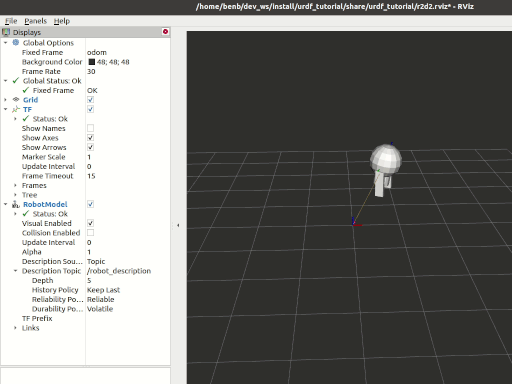

.. Redirect-from::

    Tutorials/Intermediate/URDF/Using-URDF-with-Robot-State-Publisher

.. _URDFPlusRSPCPP:

将 URDF 与 ``robot_state_publisher`` 结合使用（C++）
====================================================

**目标：** 模拟一个在 URDF 中建模的行走机器人，并在 Rviz 中查看它。

**教程级别：** 中级

**时间：** 15 分钟

.. contents:: 目录
   :depth: 2
   :local:

背景
----

本教程将展示如何建模一个行走机器人，将状态发布为 tf2 消息，并在 Rviz 中查看仿真。
首先，我们创建描述机器人装配的 URDF 模型。
接下来，我们编写一个节点来模拟运动并发布 JointState 和变换。
然后我们使用 ``robot_state_publisher`` 将整个机器人状态发布到 ``/tf``。

先决条件
--------

- `rviz2 <https://index.ros.org/p/rviz2/>`__

和往常一样，别忘了在 :doc:`你打开的每个新终端 <../../Beginner-CLI-Tools/Configuring-ROS2-Environment>` 中 source ROS 2。

任务
----

1 创建一个包
^^^^^^^^^^^^

前往你的 ROS 2 工作区，创建一个名为 ``urdf_tutorial_cpp`` 的包：

.. code-block:: console

    $ cd src
    $ ros2 pkg create --build-type ament_cmake --license Apache-2.0 urdf_tutorial_cpp --dependencies rclcpp geometry_msgs sensor_msgs tf2_ros tf2_geometry_msgs
    $ cd urdf_tutorial_cpp

你现在应该看到一个 ``urdf_tutorial_cpp`` 文件夹。
接下来你将对它进行几处修改。

2 创建 URDF 文件
^^^^^^^^^^^^^^^^

创建我们将存放一些资源文件的目录：

.. tabs::

  .. group-tab:: Linux

    .. code-block:: console

      $ mkdir -p urdf

  .. group-tab:: macOS

    .. code-block:: console

      $ mkdir -p urdf

  .. group-tab:: Windows

    .. code-block:: console

      $ md urdf

下载 :download:`URDF 文件 <documents/r2d2.urdf.xml>` 并将其保存为 ``urdf_tutorial_cpp/urdf/r2d2.urdf.xml``。
下载 :download:`Rviz 配置文件 <documents/r2d2.rviz>` 并将其保存为 ``urdf_tutorial_cpp/urdf/r2d2.rviz``。

3 发布状态
^^^^^^^^^^

现在我们需要一种方法来指定机器人处于什么状态。

为此，我们必须指定所有三个关节和整体机器人几何体。

打开你喜欢的编辑器，将以下代码粘贴到

``urdf_tutorial_cpp/src/urdf_tutorial.cpp``

.. code-block:: cpp

  #include <rclcpp/rclcpp.hpp>
  #include <geometry_msgs/msg/quaternion.hpp>
  #include <sensor_msgs/msg/joint_state.hpp>
  #include <tf2_ros/transform_broadcaster.h>
  #include <tf2_geometry_msgs/tf2_geometry_msgs.hpp>
  #include <cmath>
  #include <thread>
  #include <chrono>

  using namespace std::chrono;

  class StatePublisher : public rclcpp::Node {
      public:

      StatePublisher(rclcpp::NodeOptions options=rclcpp::NodeOptions()):
          Node("state_publisher", options){
              joint_pub_ = this->create_publisher<sensor_msgs::msg::JointState>("joint_states",10);
              // create a publisher to tell robot_state_publisher the JointState information.
              // robot_state_publisher will deal with this transformation
              broadcaster = std::make_shared<tf2_ros::TransformBroadcaster>(this);
              // create a broadcaster to tell the tf2 state information
              // this broadcaster will determine the position of coordinate system 'axis' in coordinate system 'odom'
              RCLCPP_INFO(this->get_logger(),"Starting state publisher");

              timer_=this->create_wall_timer(33ms,std::bind(&StatePublisher::publish,this));
          }

      private:
      rclcpp::Publisher<sensor_msgs::msg::JointState>::SharedPtr joint_pub_;
      std::shared_ptr<tf2_ros::TransformBroadcaster> broadcaster;
      rclcpp::TimerBase::SharedPtr timer_;

      // Robot state variables (one degree in radians)
      const double degree = M_PI/180.0;
      double tilt = 0.;
      double tinc = degree;
      double swivel = 0.;
      double angle = 0.;
      double height = 0.;
      double hinc = 0.005;

      void publish();
  };

  void StatePublisher::publish(){
      // create the necessary messages
      geometry_msgs::msg::TransformStamped t;
      sensor_msgs::msg::JointState joint_state;

      const auto ts = this->get_clock()->now();
      joint_state.header.stamp = ts;
      // Specify joints' name which are defined in the r2d2.urdf.xml and their content
      joint_state.name={"swivel","tilt","periscope"};
      joint_state.position={swivel,tilt,height};

      // add time stamp
      t.header.stamp = ts;
      // specify the father and child frame

      // odom is the base coordinate system of tf2
      t.header.frame_id="odom";
      // axis is defined in r2d2.urdf.xml file and it is the base coordinate of model
      t.child_frame_id="axis";

      // add translation change
      t.transform.translation.x=cos(angle)*2;
      t.transform.translation.y=sin(angle)*2;
      t.transform.translation.z=0.7;
      tf2::Quaternion q;
      // euler angle into Quaternion and add rotation change
      q.setRPY(0,0,angle+M_PI/2);
      t.transform.rotation.x=q.x();
      t.transform.rotation.y=q.y();
      t.transform.rotation.z=q.z();
      t.transform.rotation.w=q.w();

      // update state for next time
      tilt+=tinc;
      if (tilt<-0.5 || tilt>0.0){
          tinc*=-1;
      }
      height+=hinc;
      if (height>0.2 || height<0.0){
          hinc*=-1;
      }
      swivel+=degree;  // Increment by 1 degree (in radians)
      angle+=degree;    // Change angle at a slower pace

      // send message
      broadcaster->sendTransform(t);
      joint_pub_->publish(joint_state);

      RCLCPP_INFO_THROTTLE(this->get_logger(), *this->get_clock(), 1000, "Publishing joint state");
  }

  int main(int argc, char * argv[]){
      rclcpp::init(argc,argv);
      rclcpp::spin(std::make_shared<StatePublisher>());
      rclcpp::shutdown();
      return 0;
  }

这个节点做了两件事：
- 将 ``JointState`` 消息发布到 ``/joint_states`` 主题，以便 ``robot_state_publisher`` 可以计算所有逐关节的变换，并通过 ``/tf`` 广播它们。
- 广播一个单一的根变换，将机器人模型（``axis`` 坐标系）放置在世界中（``odom`` 坐标系），使整个机器人走一个圈。

4 创建一个 launch 文件
^^^^^^^^^^^^^^^^^^^^^^

创建一个新的 ``urdf_tutorial_cpp/launch`` 文件夹。
打开你的编辑器，粘贴以下代码，并将其保存为 ``urdf_tutorial_cpp/launch/launch.py``

.. literalinclude:: launch/launch.py
  :language: python

5 编辑 CMakeLists.txt 文件
^^^^^^^^^^^^^^^^^^^^^^^^^^

你必须告诉 **colcon** 构建工具如何安装你的 cpp 包。
如下编辑 ``CMakeLists.txt`` 文件：

.. code-block:: cmake

  cmake_minimum_required(VERSION 3.8)
  project(urdf_tutorial_cpp)

  if(CMAKE_COMPILER_IS_GNUCXX OR CMAKE_CXX_COMPILER_ID MATCHES "Clang")
    add_compile_options(-Wall -Wextra -Wpedantic)
  endif()

  # find dependencies
  find_package(ament_cmake REQUIRED)
  find_package(geometry_msgs REQUIRED)
  find_package(sensor_msgs REQUIRED)
  find_package(tf2_ros REQUIRED)
  find_package(tf2_geometry_msgs REQUIRED)
  find_package(rclcpp REQUIRED)

  add_executable(urdf_tutorial_cpp src/urdf_tutorial.cpp)

  ament_target_dependencies(urdf_tutorial_cpp
    geometry_msgs
    sensor_msgs
    tf2_ros
    tf2_geometry_msgs
    rclcpp
  )

  install(TARGETS
    urdf_tutorial_cpp
    DESTINATION lib/${PROJECT_NAME}
  )

  install(DIRECTORY
    launch
    DESTINATION share/${PROJECT_NAME}
  )

  install(DIRECTORY
    urdf
    DESTINATION share/${PROJECT_NAME}
  )

  ament_package()

``install(DIRECTORY urdf ...)`` 规则会将 ``r2d2.urdf.xml`` 和 ``r2d2.rviz`` 复制到安装树中，以便在运行时可以找到它们。

6 构建包
^^^^^^^^

回到你的工作区根目录并构建：

.. code-block:: console

    $ colcon build --symlink-install --packages-select urdf_tutorial_cpp

Source 安装文件：

.. tabs::

  .. group-tab:: Linux

    .. code-block:: console

      $ source install/setup.bash

  .. group-tab:: macOS

    .. code-block:: console

      $ source install/setup.bash

  .. group-tab:: Windows

    .. code-block:: console

      $ call install/setup.bat

7 查看结果
^^^^^^^^^^

要启动你的新包，运行以下命令：

.. code-block:: console

  $ ros2 launch urdf_tutorial_cpp launch.py

要可视化你的结果，你需要打开一个新终端，并使用你的 rviz 配置文件运行 Rviz。

.. code-block:: console

  $ rviz2 -d install/urdf_tutorial_cpp/share/urdf_tutorial_cpp/urdf/r2d2.rviz

有关如何使用 Rviz 的详细信息，请参阅 `用户指南 <http://wiki.ros.org/rviz/UserGuide>`__。

``install/urdf_tutorial_cpp/share/urdf_tutorial_cpp/urdf/r2d2.rviz`` 是存储 ``r2d2.rviz`` 的目录。

总结
----

恭喜！
你创建了一个 ``JointState`` 发布器节点，并将其与 ``robot_state_publisher`` 结合使用，以模拟一个行走的机器人。
