.. redirect-from::

    Tutorials/Building-ROS2-Package-with-eclipse-2021-06

使用 Eclipse 2021-06 构建软件包
===============================

.. contents:: 目录
   :depth: 2
   :local:

你无法使用 eclipse 创建 ROS 2 软件包，需要使用命令行工具来创建。
请按照 :doc:`创建软件包 <../Beginner-Client-Libraries/Creating-Your-First-ROS2-Package>` 教程操作。

创建好项目后，你就可以编辑源代码并使用 eclipse 构建它。

我们启动 eclipse 并选择一个 eclipse-workspace。

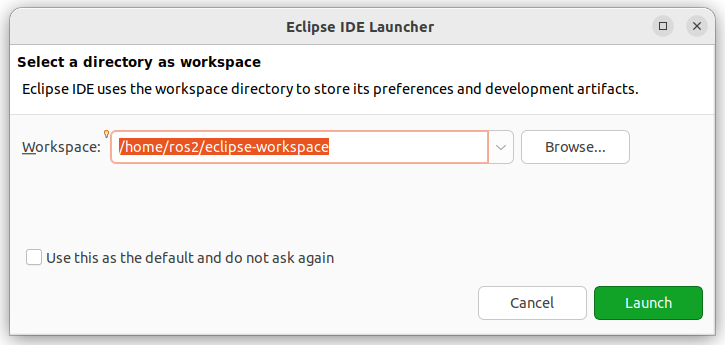

我们创建一个 C++ 项目

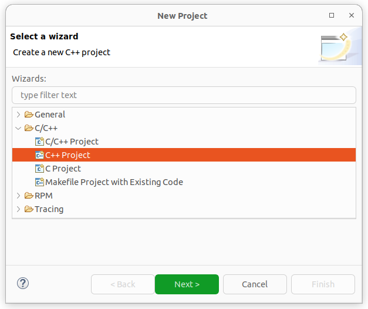

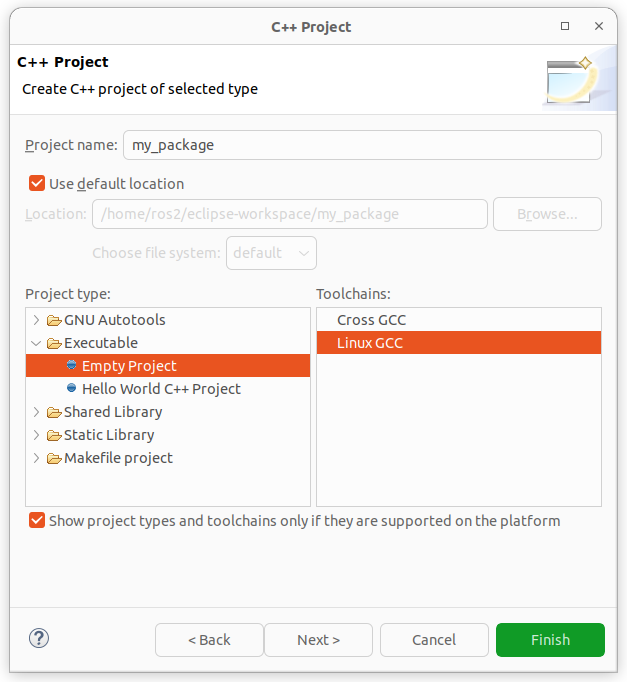

可以看到我们已经有了 C++ 的 include 路径。

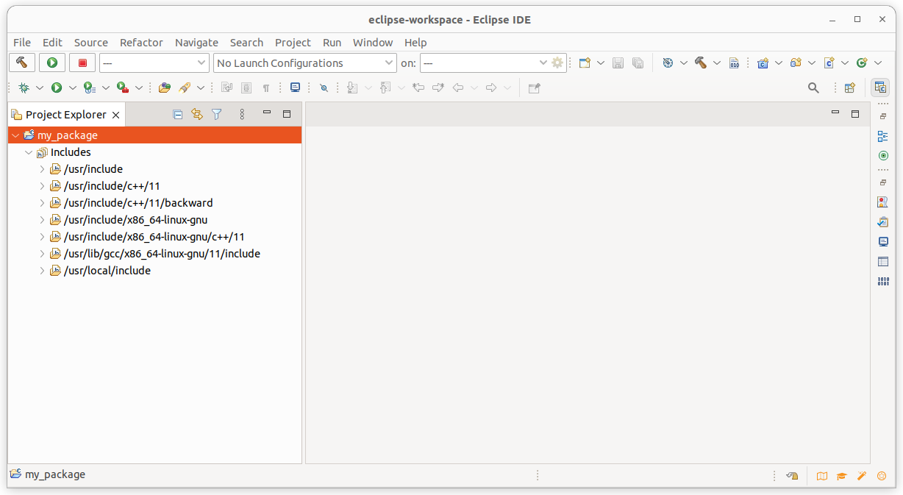

现在我们导入自己的 ROS 2 项目。
代码仍然留在原来的位置。

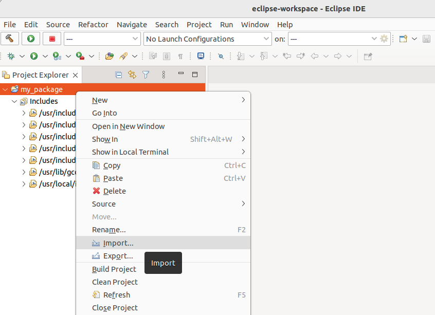

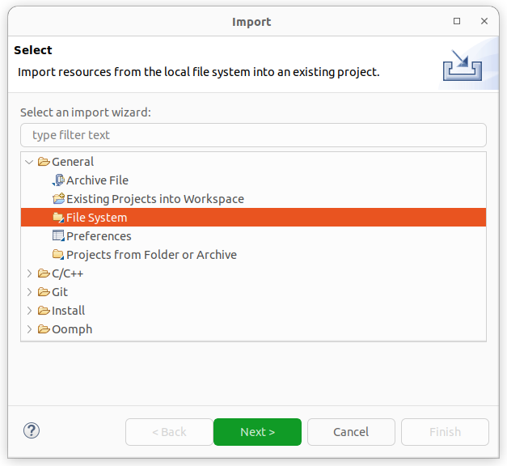

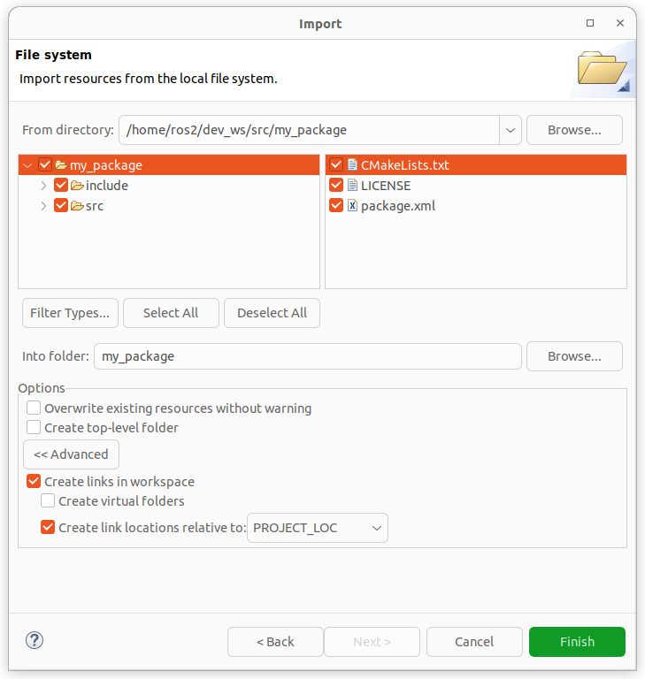

我们在源代码中可以看到，C++ 的 include 已经解析成功，但 ROS 2 的还没有。

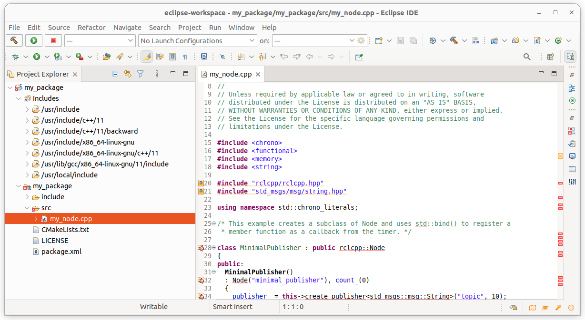

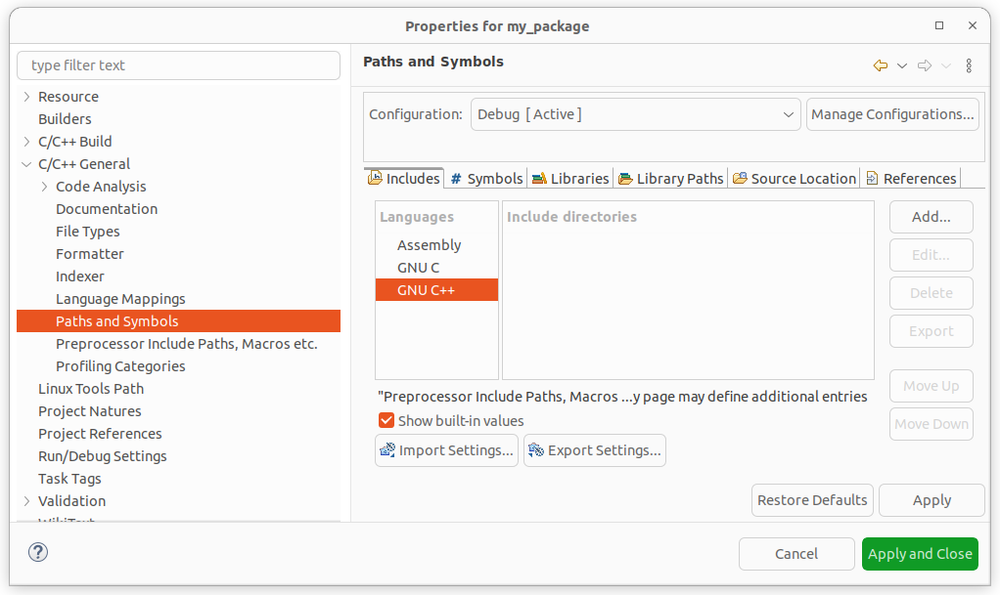

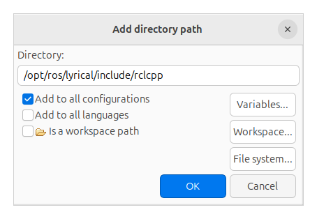

现在我们看到 ROS 2 的 include 也已经解析成功。

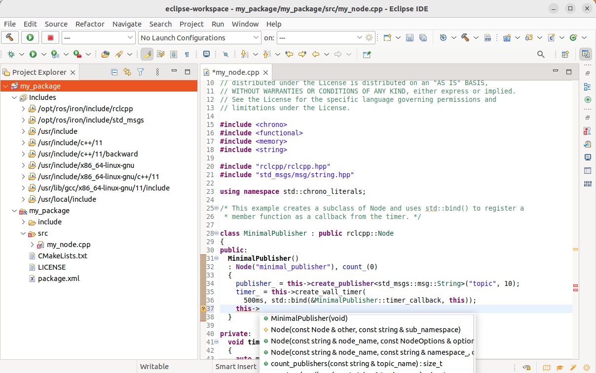

添加 Builder colcon，这样我们就可以通过右键单击项目并选择 "Build project" 来构建。

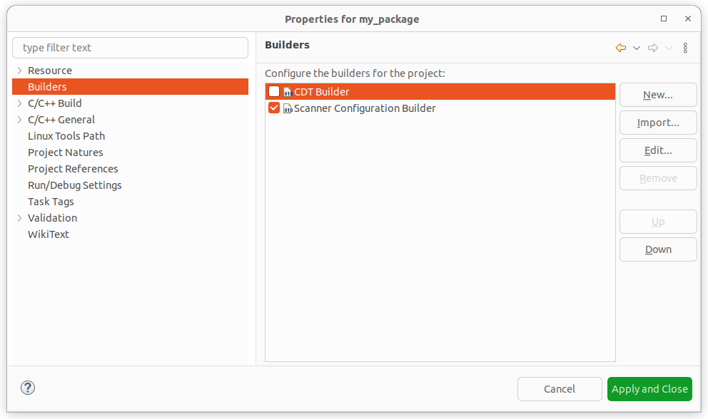

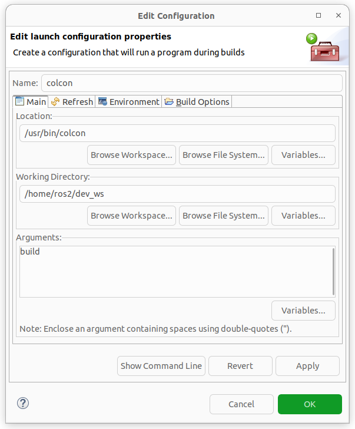

借助 PYTHONPATH，你也可以构建 Python 项目。

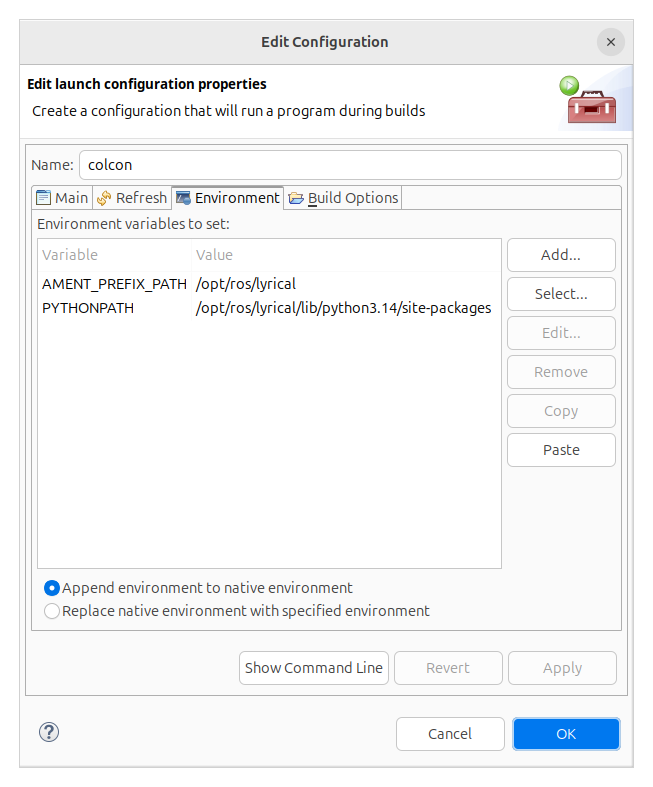

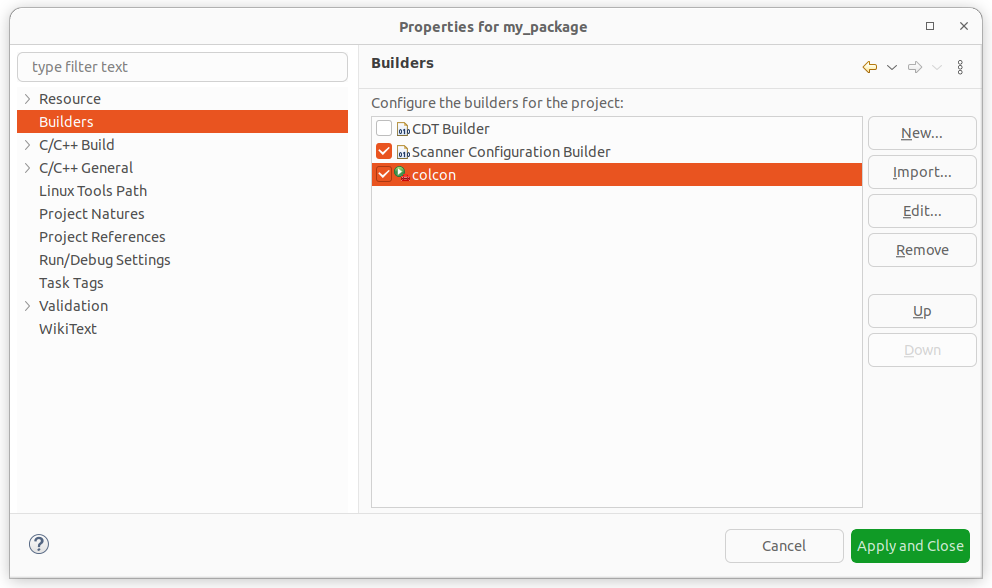

右键单击该项目并选择 "Build Project"。

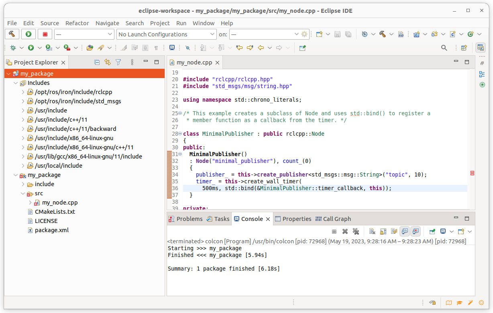
