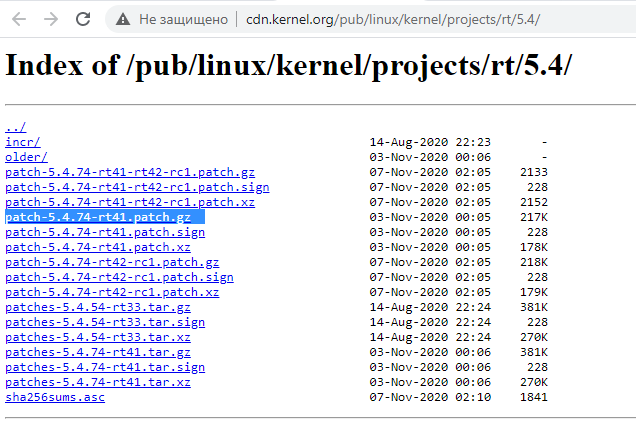

.. redirect-from::

    Building-Realtime-rt_preempt-kernel-for-ROS-2
    Tutorials/Building-Realtime-rt_preempt-kernel-for-ROS-2

构建实时 Linux 内核 [社区贡献]
==============================

本教程从 Intel x86_64 上全新安装的 Ubuntu 20.04.1 开始。
当前内核为 5.4.0-54-generic，但我们将安装最新的稳定 RT_PREEMPT 版本。
要构建内核，你至少需要 30GB 的可用磁盘空间。

查看 `这个 wiki <https://wiki.linuxfoundation.org/realtime/start>`_ 了解最新的稳定版本，在撰写本文时是“Latest Stable Version 5.4-rt”。
如果我们点击 `链接 <http://cdn.kernel.org/pub/linux/kernel/projects/rt/5.4/>`_，就能得到确切版本。
当前是 ``patch-5.4.78-rt44.patch.gz``。

我们在主目录中创建一个目录，使用

.. code-block:: console

   $ mkdir ~/kernel

然后使用以下命令切换到其中

.. code-block:: console

   $ cd ~/kernel

我们可以用浏览器访问 `这个页面 <https://mirrors.edge.kernel.org/pub/linux/kernel/v5.x/>`_ 看看该版本是否在那里。
你可以从该网站下载它，并从 /Downloads 手动移动到 /kernel 文件夹，或者右键链接使用“复制链接地址”后用 wget 下载。
例如：

.. code-block:: console

   $ wget https://mirrors.edge.kernel.org/pub/linux/kernel/v5.x/linux-5.4.78.tar.gz

使用以下命令解压

.. code-block:: console

   $ tar -xzf linux-5.4.78.tar.gz

在 `kernel.org <http://cdn.kernel.org/pub/linux/kernel/projects/rt/5.4/>`_ 下载与我们刚下载的内核版本匹配的 rt_preempt 补丁

.. code-block:: console

   $ wget http://cdn.kernel.org/pub/linux/kernel/projects/rt/5.4/older/patch-5.4.78-rt44.patch.gz

使用以下命令解压

.. code-block:: console

   $ gunzip patch-5.4.78-rt44.patch.gz

然后使用以下命令切换到 linux 目录

.. code-block:: console

   $ cd linux-5.4.78/

并用实时补丁修补内核

.. code-block:: console

   $ patch -p1 < ../patch-5.4.78-rt44.patch

我们只是想使用 Ubuntu 安装的配置，因此使用以下命令获取 Ubuntu 配置

.. code-block:: console

   $ cp /boot/config-5.4.0-54-generic .config

打开“软件和更新”。
在“Ubuntu 软件”菜单中勾选“源代码”复选框

我们需要一些工具来构建内核，使用以下命令安装它们

.. code-block:: console

   $ sudo apt-get build-dep linux
   $ sudo apt-get install libncurses-dev flex bison openssl libssl-dev dkms libelf-dev libudev-dev libpci-dev libiberty-dev autoconf fakeroot

要启用所有 Ubuntu 配置，我们只需使用

.. code-block:: console

   $ yes '' | make oldconfig

然后我们需要在内核中启用 rt_preempt。
我们调用

.. code-block:: console

   $ make menuconfig

并进行如下设置

.. code-block:: bash

  # Enable CONFIG_PREEMPT_RT
   -> General Setup
    -> Preemption Model (Fully Preemptible Kernel (Real-Time))
     (X) Fully Preemptible Kernel (Real-Time)

  # Enable CONFIG_HIGH_RES_TIMERS
   -> General setup
    -> Timers subsystem
     [*] High Resolution Timer Support

  # Enable CONFIG_NO_HZ_FULL
   -> General setup
    -> Timers subsystem
     -> Timer tick handling (Full dynticks system (tickless))
      (X) Full dynticks system (tickless)

  # Set CONFIG_HZ_1000 (note: this is no longer in the General Setup menu, go back twice)
   -> Processor type and features
    -> Timer frequency (1000 HZ)
     (X) 1000 HZ

  # Set CPU_FREQ_DEFAULT_GOV_PERFORMANCE [=y]
   ->  Power management and ACPI options
    -> CPU Frequency scaling
     -> CPU Frequency scaling (CPU_FREQ [=y])
      -> Default CPUFreq governor (<choice> [=y])
       (X) performance

保存并退出 menuconfig。
现在我们将构建内核，这需要相当长的时间。
（在现代 CPU 上需要 10-30 分钟）

.. code-block:: console

   $ make -j `nproc` deb-pkg

构建完成后，检查 deb 软件包

.. code-block:: console

   $ ls ../*deb
   ../linux-headers-5.4.78-rt41_5.4.78-rt44-1_amd64.deb  ../linux-image-5.4.78-rt44-dbg_5.4.78-rt44-1_amd64.deb
   ../linux-image-5.4.78-rt41_5.4.78-rt44-1_amd64.deb    ../linux-libc-dev_5.4.78-rt44-1_amd64.deb

然后安装所有内核 deb 软件包

.. code-block:: console

   $ sudo dpkg -i ../*.deb

现在实时内核应该已安装。
重启系统：

.. code-block:: console

   $ sudo reboot

并检查新的内核版本：

.. code-block:: console

   $ uname -a
   Linux ros2host 5.4.78-rt44 #1 SMP PREEMPT_RT Fri Nov 6 10:37:59 CET 2020 x86_64 xx
